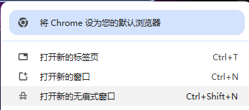
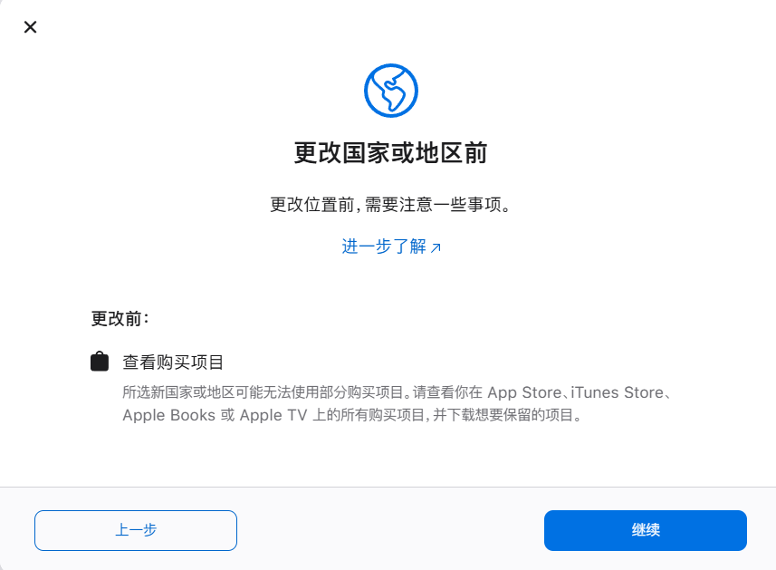

## 注册美区ID准备

推荐使用`chrome`浏览器，并打开新的无痕窗口**Ctrl+Shift+N**。进入[Apple账户官网](https://account.apple.com/)

点击**创建你的Apple账户**，填写 姓氏(英文)，名字(英文)，国家或地区(这里先选择中国大陆)，出生日期，未注册过苹果ID的邮箱，电话号码(能接收验证码的正常号码，注册未超过3次),设置好密码。

勾选**Apple和你的数据隐私**，接着输入图形验证码，输入邮箱，短信验证码，就注册成功了，此时其实注册的是个国区ID。

## 修改国家与地址

开**全局**（解决付款无）小火箭，刷新页面

点击 个人信息，看到 国家或地区，更改地区为美国，付款方式选择 无

进入[美国地址生成器](https://www.meiguodizhi.com/usa-address)，选择美国免税州（俄勒冈州，特拉华州，蒙大拿州，信号布什尔州）随机生成地址，把相应信息填上去。保存即可

**付款与配送**，勾选**从默认付款方式处拷贝账单地址**，**保存更改**，至此美区账户注册完成。

## 礼品卡充值方式

- 苹果官网（需要visa，Paypal）
- 某宝个人卖家（信用参差不齐）
- Pockyt【推荐】

### Pockyt

打开支付宝搜索**支付宝惠出境**，城市名字选择**旧金山**，看到**精选大牌折扣礼品卡100+礼品卡 尽在Pockyt**，点击进入就能看到**App Store & iTunes US**

## IOS端登录

先把地区改成**美国**，重启ipad，登录美区ID