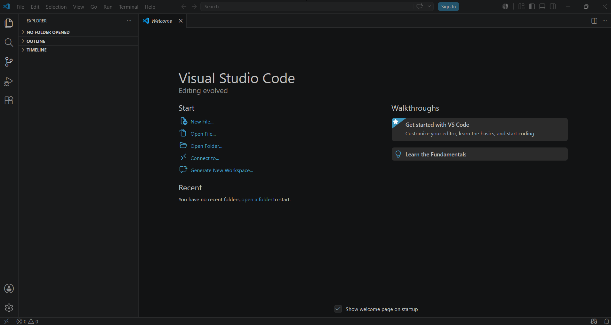
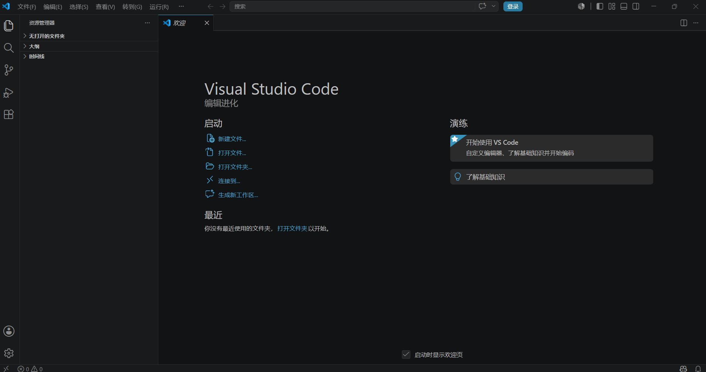
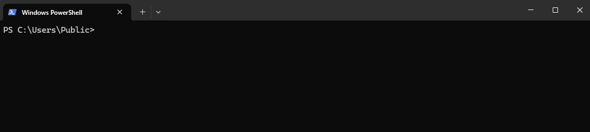
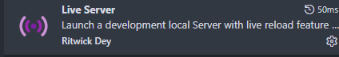
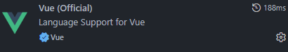
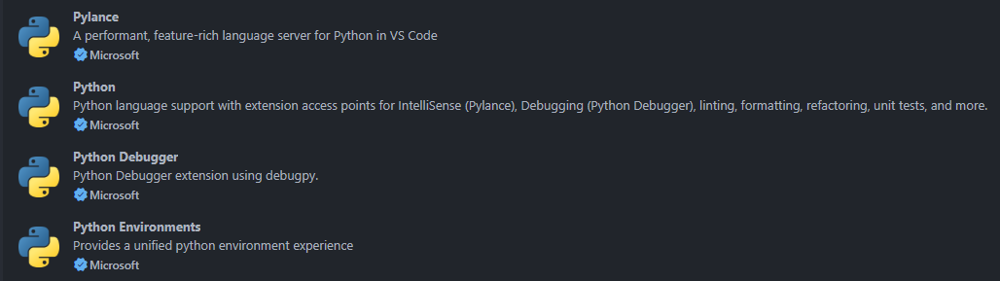
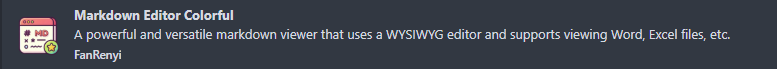

## Chinese (Simplified) (简体中文) Language Pack for Visual Studio Code

本扩展适用于 VS Code 的中文（简体）语言包。

## One Dark Pro

它是**移植自 Atom 编辑器**的免费深色配色扩展，VS Code 下载量千万级，几乎是开发者标配暗色主题，作者 binaryify。

### 内置主题，一键切换

打开命令面板 `Ctrl+Shift+P` → 输入 `Color Theme`即可切换：

1. **One Dark Pro（经典原版）**：均衡通用，绝大多数人首选
2. One Dark Pro Flat：扁平化，去掉渐变阴影，视觉更干净
3. One Dark Pro Darker：背景更深，适合夜间暗光环境
4. One Dark Pro Mix：柔和混合低饱和配色

## Paste Image

本扩展用于直接从剪切版粘贴图片。

快捷键【`Ctrl+Alt+V`】

### 默认设置

| ID                                         | 默认值                                                         |
| ------------------------------------------ | -------------------------------------------------------------- |
| `pasteImage.basePath`                    | `"${currentFileDir}"`                                        |
| `pasteImage.defaultName`                 | `"Y-MM-DD-HH-mm-ss"`                                         |
| `pasteImage.encodePath`                  | `"urlEncodeSpace"`                                           |
| `pasteImage.filePathConfirmInputBoxMode` | `"fullPath"`                                                 |
| `pasteImage.forceUnixStyleSeparator`     | `true`                                                       |
| `pasteImage.insertPattern`               | `"${imageSyntaxPrefix}${imageFilePath}${imageSyntaxSuffix}"` |
| `pasteImage.namePrefix`                  | `""`                                                         |
| `pasteImage.nameSuffix`                  | `""`                                                         |
| `pasteImage.path`                        | `"${currentFileDir}"`                                        |
| `pasteImage.prefix`                      | `""`                                                         |
| `pasteImage.showFilePathConfirmInputBox` | `false`                                                      |
| `pasteImage.suffix`                      | `""`                                                         |

### 设置描述

#### Base Path

The base path of image url.You can use variable `${currentFileDir}` and `${projectRoot}`. `${currentFileDir}` will be replace by the path of directory that contain current editing file. ${projectRoot} will be replace by path of the project opened in vscode. If you set basePath to empty String, it will insert absolute path to file.

图片 URL 的基础路径。

- `${currentFileDir}`：包含当前编辑文件的目录路径，假设当前文件夹为temp，图片路径为 `temp/xxx.png`
- `${projectRoot}`：从项目路径作为起始路径，如项目为project文件夹，下有temp文件夹，图片路径 `project/temp/xxx.png`
- `""`：插入的是图片绝对路径

#### Default Name

The default image file name.

默认的图片文件名。参考格式:`Y-MM-DD-HH-mm-ss`。

#### Encode Path

The string append to the image file name.How to encode image path before insert to editor. Support options: none, urlEncode, urlEncodeSpace

字符串附加到图像文件名。在插入到编辑器之前以何种方式对图像路径进行编码。

- `none`：不编码，原样插入路径。
- `urlEncodeSpace`(Default)：只把空格换成 %20，其他字符不变。
- `urlEncode`：对整个路径做完整 URL 编码（空格→%20，中文 / 特殊符号也编码）。

#### File Path Confirm Input Box Mode

Set the mode of file path confirm inputbox.

配合 `showFilePathConfirmInputBox = true` 时生效：粘贴图片前会弹出输入框让你确认 / 修改保存路径和文件名，这个 Mode 就是控制输入框里默认显示什么。

- `fullPath`(Default)：显示全路径，能改文件夹 + 名字
- `onlyName`：只显示文件名，只能改名字

#### Force Unix Style Separator

Force set the file separator style to unix style. If set false, separator style will follow the system style.

用来强制把路径分隔符统一成 Unix 风格的 `/`，而不是跟着系统走。

\"" />

#### Insert Pattern

The pattern of string that would be pasted to text.

Paste Image 插件最核心的自定义项：控制粘贴图片后，往编辑器里插入什么文本模板（Markdown/HTML/ 自定义格式）。

在**Markdown文件**中，`${imageSyntaxPrefix}`表示为 ``

- `${imageSyntaxPrefix}${imageFilePath}${imageSyntaxSuffix}`(Default)：插入图片样式为 ``
- `${imageSyntaxPrefix}${imageFileName}${imageSyntaxSuffix}`：插入图片样式为 ``【只有图片名字.png】

#### Name Prefix

The string prepend to the image file name.

给图片文件名加**固定前缀**，会真实作用到图片的，影响图片的命名。

#### Name Suffix

The string append to the image file name.

给图片文件名加**固定后缀**，会真实作用到图片的，影响图片的命名。

#### Path

The destination to save image file.You can use variable `${currentFileDir}` and `${projectRoot}`. `${currentFileDir}` will be replace by the path of directory that contain current editing file. `${projectRoot}` will be replace by path of the project opened in vscode.

保存图像文件的目标位置。

- `${currentFileDir}`(Default)：图片保存到当前编辑文件所在目录的路径，同级目录。
- `${projectRoot}`：图片被放在项目根目录
- `${currentFileDir}/${currentFileNameWithoutExt}`：在文件所在目录建立一个和文件同名的文件夹，并把图片放入。

#### Prefix

The string prepend to the resolved image path before paste.

在粘贴之前添加到解析后图像路径之前的字符串，影响路径的写法，不影响图片真实命名。

#### Show File Path Confirm Input Box

Set to true if you want to be able to change the file path or name prior to saving the file to disk.

粘贴图片时，是否弹出一个输入框让你手动改路径 / 文件名，搭配[File Path Confirm Input Box Mode](#File-Path-Confirm-Input-Box-Mode)使用。

#### Suffix

The string append to the resolved image path before paste.

在粘贴之前附加到已解析图像路径之后的字符串，影响路径的写法，不影响图片真实命名。

## Live Server

Live Server 是 VSCode 中由 Ritwick Dey 开发的**轻量级本地开发服务器扩展**，核心解决前端开发中 “file:// 协议限制” 和 “手动刷新浏览器” 的痛点，一键启动带热重载的 HTTP 服务，大幅提升静态页面开发效率。

### 核心作用

- ✅ **告别手动刷新**：修改 HTML/CSS/JS 保存后，浏览器**自动实时刷新**，秒看效果。
- ✅ **模拟真实环境**：启动 `http://127.0.0.1:5500`（默认端口）服务，规避 file:// 协议跨域、路径错误等问题。
- ✅ **极简操作**：无需复杂配置，新手也能 1 分钟上手，替代繁琐的本地服务器搭建。

### 3种启动/停止方式

1. **状态栏一键启动（推荐）**：右下角点击 **Go Live** 启动，显示端口即成功；点击端口可停止服务
2. **右键菜单启动**：资源管理器 / 编辑器内右键 HTML 文件，选择 **Open with Live Server**
3. **快捷键启动**：
   - Windows：`Alt+L, Alt+O` 启动；`Alt+L, Alt+C` 停止
   - Mac：`Cmd+L, Cmd+O` 启动；`Cmd+L, Cmd+C` 停止

### 基础配置

默认端口 5500，可自定义：

1. 打开设置（`Ctrl+,`），搜索 **Live Server**。
2. 常用配置：
   - `liveServer.settings.port`：修改端口（如 8080）。
   - `liveServer.settings.CustomBrowser`：指定默认浏览器（Chrome/Firefox）
   - `liveServer.settings.root`：设置服务器根目录

### 适用场景与注意

- ✅ **适合**：HTML/CSS/JS 静态页面、简单网站、前端新手练习、模板页面开发。
- ❌ **不适合**：替代 Webpack/Vite 等构建工具；不支持 TS/JSX 编译、热模块替换（HMR），仅全页刷新。

## Open in Browser（techer 出品）

轻量前端预览插件，**一键在浏览器打开本地 HTML 文件**，不用手动拖拽文件进浏览器Visual Stu...。

- 操作：右键文件 / 快捷键 `Alt+B`（默认浏览器）、`Shift+Alt+B`（自选 Chrome/Edge/Firefox）
- 原理：用 `file://`本地文件协议打开，**不启动本地服务器**

## Vue

### Vuter

Vue2专用插件，提供模板语法校验、代码提示、格式化。

### Vue(Official)

Vue-Official（原Volar） 是 Vue官方专属编辑器插件，解决 VS Code 对 Vue 单文件组件的语法、类型、提示、格式化全套开发支持，是 Vue3 项目标准开发工具。

## ESLint

在软件开发中，遵循统一的代码规范是保证代码质量和可维护性的重要前提。当代码不符合规范时，ESLint 会抛出相应的错误提示。开发者可以通过逐项手动修改来纠正错误，若不理解错误含义，可查阅 **[ESLint 官方规则表](https://zh-hans.eslint.org/docs/latest/rules/)** 获取具体说明。

对于初学者而言，由于尚未完全掌握代码规范，编写代码时容易出现频繁报错的情况，这会严重阻碍学习进度。为解决此问题，可以借助 **ESLint 插件** 实现以下两个核心功能：

1. **高亮错误提示**：在代码编辑器中直观地标识出不符合规范的代码。
2. **自动修复错误**：通过合理配置，在保存文件时自动修正格式类错误。

## python相关

### Python（ms-python.python，微软官方）

Python 开发基础载体，集成解释器切换、断点调试、单元测试、Jupyter Notebook、虚拟环境识别，自动配套 Pylance、Python Debugger。

### Pylance（官方配套）

高性能 Python 语言服务，提供极速代码补全、类型校验、函数 / 类跳转、导入提示，大型项目不卡顿，是现在唯一推荐的智能提示引擎。

### Python Debugger

专门调试插件，支持断点、变量监视、条件断点、多线程调试，内嵌在官方 Python 扩展里自动安装。

### Python Environments（环境管理（多版本 / 虚拟环境））

统一管理 venv/conda/pyenv/poetry 虚拟环境，一键新建、切换、安装依赖，uv 加速创建环境。

## Markdown相关

### Markdown All in One（全能编辑神器）

最通用、下载量最高的 MD 增强插件，**新手首选**

- 核心功能
  1. 一键生成 / 更新目录 TOC（`#`标题自动提取）
  2. 全套格式化快捷键：`Ctrl+B`加粗、`Ctrl+I`斜体、`Alt+S`删除线、表格自动对齐
  3. 任务列表、注释、折叠代码块、自动补全链接
  4. 文件内标题跳转、大纲优化、批量修改标题层级
- 适合：日常笔记、README、项目文档

### markdownlint（规范校验）

MD 语法规范检查，统一文档格式，消除杂乱排版

- 功能：波浪线提示不规范写法（空行、标题层级、列表空格、链接格式），`Ctrl+.`一键自动修复
- 适合：团队协作、规范知识库、开源项目文档

### Markdown Preview Enhanced（MPE，最强预览）

原生预览功能天花板，写技术文档、博客必备

核心能力：

1. 分屏实时双向预览，所见即所得
2. 完美渲染 Mermaid 流程图、甘特图、时序图、LaTeX 数学公式
3. 代码块一键运行 Python/JS 并展示结果
4. 一键导出 PDF / HTML / PNG / Word，支持自定义样式
5. 支持脚注、目录、侧边大纲、自定义主题

### Markdown Editor Colorful

代码块、标题、表格彩色高亮，长时间阅读更清晰

区分不同层级标题、引用、代码、列表，深色主题搭配 One Dark Pro 效果极佳

