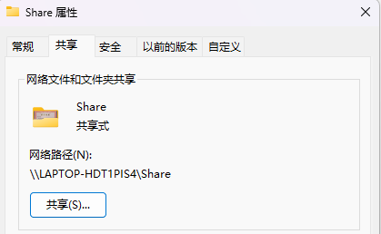
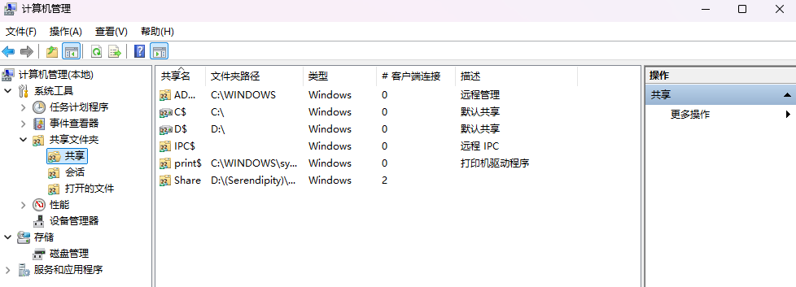
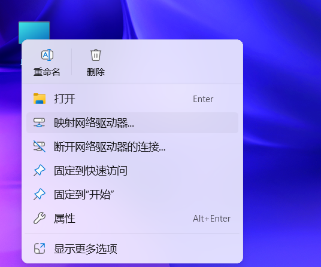
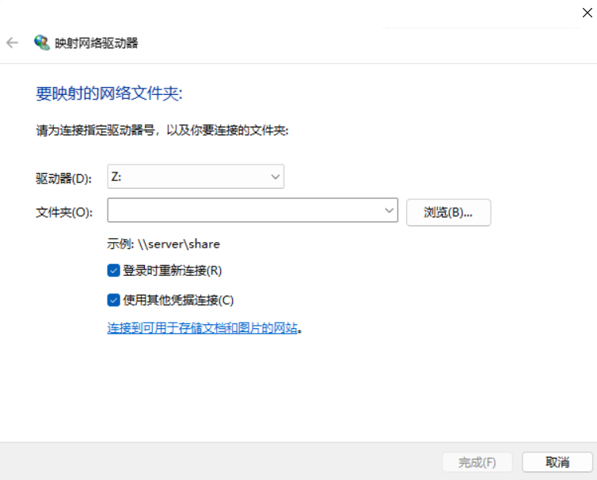
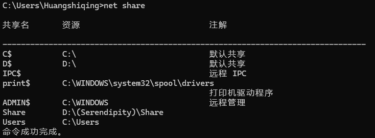
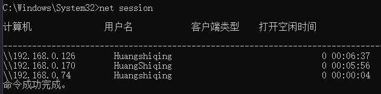

## 基础环境

所有设备位于同一局域网。

打开命令提示(`Win+R`输入`cmd`)执行命令`ipconfig`可以查看电脑的**IPv4地址**。

## 在Windows中建立共享文件夹

给电脑建立好共享文件夹。

新建文件夹，重命名后，**右键属性->共享->共享**，选中共享用户组`everyone`添加，并根据需求更改权限级别，完成共享确定。

选择高级共享，可以更改相关设置。

查看共享文件夹是否创建成功，右键此电脑->显示更多选项->管理->共享文件夹->共享，或者使用快捷键`Win+X` + `G` 就能打开共享文件夹设置界面。

## 在IOS系统连接到服务器

ipad 打开**文件APP**，点击右上角的三个点，选择连接服务器，输入电脑的**IPv4地址**，输入电脑登录时的用户名和密码即可访问共享文件夹了。


smb://192.168.0.9


## 在安卓端连接到共享文件夹

一般手机的自带的文件管理APP都有网络另邻居这种字眼的相关功能，同样的，输入电脑的**IPv4地址**，输入电脑登录时的用户名和密码即可访问共享文件夹了。

实在没用，可以使用ES浏览器，里面有局域网的功能，操作类似。

## 在其他主机连接到共享文件夹

右键此电脑，映射到网络驱动器，勾选上**登录时重新连接，使用其他凭据连接**。


\\192.168.0.9\Share


输入电脑的**IPv4地址**，输入电脑登录时的用户名和密码即可访问共享文件夹了，相当于在这个主机新加了一个盘。

## 问题解决

### 共享用户目录下子文件夹问题

共享用户目录下子文件夹好像会把用户文件夹暴露于局域网，所以一般共享文件夹不建立在用户目录文件夹里面。出现这种情况`Users`文件夹属性并未设置为共享，但是输入用户名，密码后却能访问整个用户目录，不是很安全。

查看所有共享信息。


net share


发现共享条目有`C:\Users` 的原因，把它删除（管理员权限）。


net share Users /delete


### 老旧设备无法连接

开启电脑的`SMB`文件共享支持功能

`Win+R` 输入`control` 打开控制面板，控制面板-> 程序和功能-> 启用或关闭Windows功能。

选中SMB1.0/CIFS 文件共享支持，开启文件文件共享功能。

## 查看哪些IP连接了共享文件夹


net session


