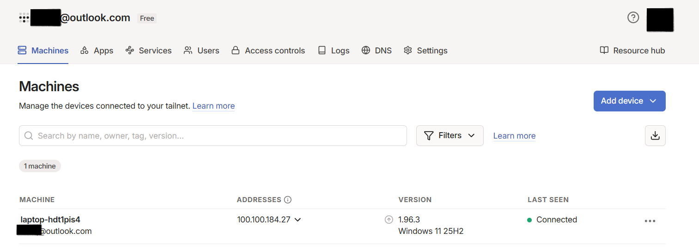
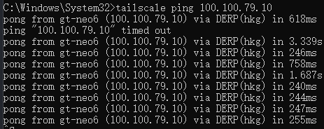
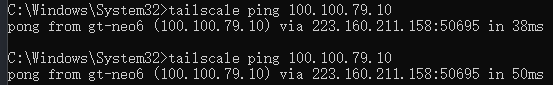

## 概述

[TailScale](https://tailscale.com)（以下简称 TS）是一款基于 P2P 架构的跨平台内网穿透与设备互联工具，支持 Windows、macOS、Linux、Android、iOS、NAS 及 Apple TV 等多种终端。其核心能力包括：**无需公网 IP、零配置实现双向远程控制、低延迟文件传输、在线流媒体访问及多设备统一管理**。

## 软件获取与安装

### 下载与版本选择

访问 TS 官方网站进行[下载](https://tailscale.com/download)，根据目标设备操作系统选择对应安装包。

以**Windows**为例，双击 `.exe` 文件，按向导完成安装；安装完成后自动启动服务。没有路径选择，软件被安装在`C:\Program Files\Tailscale`，如果软件不设置开机自启，就在此处添加桌面快捷方式

### 设置

服务管理器彻底关闭

1. `Win+R` → 输入 `services.msc` 回车打开服务列表
2. 找到名称：**Tailscale**
3. 右键→【属性】
    - 启动类型：改成 **手动**
    - 应用→确定
✅ **改完：开机系统不会自动启动 tailscaled 后台服务，VPN 就需要手动开启了。**

## 账户注册与身份认证

### 登录方式

TS 支持多种身份认证方式，使用 GitHub、Google 或 Microsoft 账户都可以一键登录；登录成功后即可进入管理界面。



> **推荐实践**：首次使用建议选择 GitHub 或 Microsoft 账户登录，起手难度低且账户安全性高。

### 登录验证

- 登录成功后，TS 客户端将分配一个唯一的 **Tailscale IPv4 地址（格式为 `100.x.y.z/32`）** 和一个 **Tailscale IPv6 地址（ULA 格式）**；
- 此地址为 TS 网络内全局唯一标识，**仅在 TS 加密隧道内有效，外部互联网无法直接路由访问**；
- 所有设备必须登录同一 TS 控制平面（Control Plane），方可相互发现与通信。

## TailScale的使用

### 查看组网信息


tailscale status


列出所有加入网络的设备

### 连通性查看


tailscale ping [ip]



看到`DERP`，表示当前通过 TS 中继服务器（中转节点）通信，延迟较高，对此我们可以考虑配置强制 `P2P`直连。

### 强制 P2P 直连配置


tailscale down
tailscale up --force-reauth




>值得注意的是，由于某些原因，这配置不一定生效。

### 配置子网

#### 环境确定

比如：你电脑内网：**192.168.0.0/24**，本机 IP：**192.168.0.9**

家里局域网设备：

1. 路由器后台：**192.168.0.1**（不能装 Tailscale）
2. NAS 存储：**192.168.0.55**（不能装 Tailscale）
3. 打印机：**192.168.0.30**（不能装 Tailscale）
4. 另一台台式机：**192.168.0.22**（装了 Tailscale）

#### 两步开启子网转发

1、**你电脑（网关机）CMD 管理员执行**

```bash
tailscale up --advertise-routes=192.168.0.0/24
```

相当于**我这台电脑可以中转全 192.168.0.x 局域网流量**，上报网段给 Tailscale 后台。

2、**网页后台→你的设备→Edit route settings→勾选 192.168.0.0/24 并保存**

相当于**管理员批准：全组网设备访问 192.168.0.x 全部走你电脑转发**。

#### ✅ 勾选生效后，手机能访问哪些？

##### 所有【没法装 Tailscale 的内网设备】（核心用处）

手机浏览器直接输局域网 IP 就能打开：

- 192.168.0.1 → 路由器管理页
- 192.168.0.55 → NAS 网页、网盘、影音服务
- 192.168.0.30 → 远程打印、打印机设置

> 这类设备装不了 Tailscale，**不靠你的电脑转发，手机在外永远连不上**。

##### 装了 Tailscale 的设备（两种访问方式）

- 方式①：用**100.xx 虚拟 IP**直连（不需要开子网路由，默认就能通）
- 方式②：用**192.168.0.22 内网 IP**访问（必须开启 Edit 路由审批，后台路由勾选界面勾选子网）

##### 不能访问

你虚拟机网段`10.0.2.x`：**没在 advertise-routes 添加 10.0.2.0/24、后台没勾选，就访问不了**。

❌ 后台不勾选 Edit route（不批准网段）

手机**只能通过 100.xxx 访问你这台电脑本身**，**打不开 192.168.0.1、NAS、打印机任何内网设备**。

#### 关键区分

1. `--advertise-routes`：**电脑主动上报我能带哪个内网**
2. `Edit route settings勾选`：**后台放行，允许全网络借你电脑进内网**
3. 手机安卓 / 苹果默认自动`accept-routes`（自动接收路由），Linux 设备才需要手动开`--accept-routes`

#### 重置子网配置


tailscale up --reset


>`--`参数如果要设多个，要一次性设好，不然好像会报错，不然就重置在设置。
>关键配置都要二次验证登录。

## 配合其他工具使用

### Sunshine串流工具

[Sunshine](https://app.lizardbyte.dev/Sunshine/) 是一款专为 `Moonlight` 设计的自托管游戏串流主机。它提供低延迟的云游戏服务器功能，支持 AMD、Intel 和 Nvidia 显卡的硬件编码，同时也提供软件编码选项。您可以通过各类设备上的 `Moonlight` 客户端连接到 `Sunshine`。通过直观的网页界面，您可以使用常用浏览器进行服务器配置和客户端配对操作，既可在本地服务器完成设置，也能通过移动设备远程实现设备绑定。

- [官方完整文档](https://app.lizardbyte.dev/Sunshine/)
- [GitHub 源码主页](https://github.com/LizardByte/Sunshine)
- [官方下载页（最新安装包）](https://github.com/LizardByte/Sunshine/releases)

**本地后台地址:**`https://localhost:47990`（浏览器打开，首次注册管理员账号）。


### rustdesk远程桌面工具

[rustdesk](https://rustdesk.com/)快速开源远程访问和支持软件

- [官方下载页](https://github.com/rustdesk/rustdesk/releases)
- [GitHub 源码主页](https://github.com/rustdesk/rustdesk)

>**Windows**有2种版本，便携版（免安装，直接打开 exe 临时用）、安装版（长期使用，开机自启），64 位系统下载`x86_64.exe`。