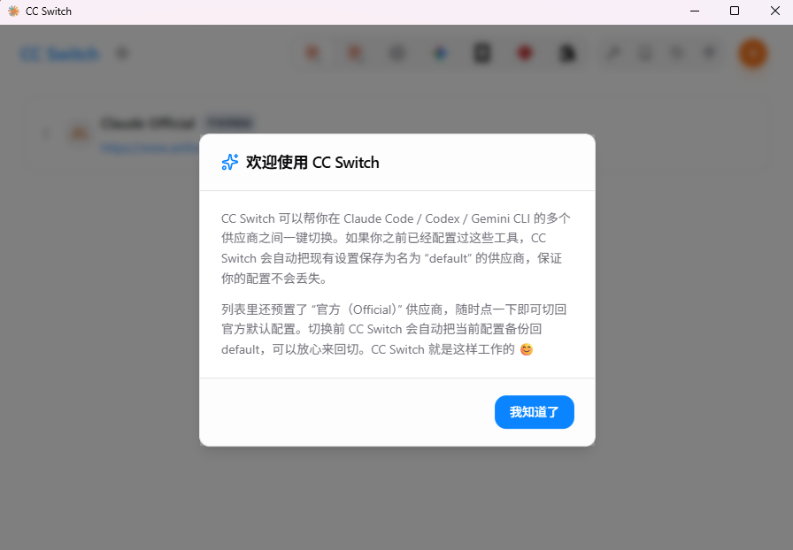
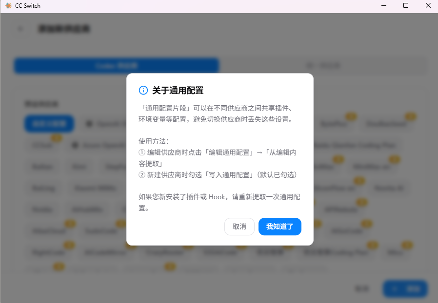
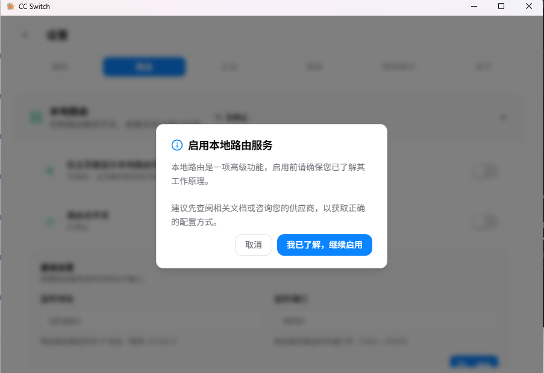
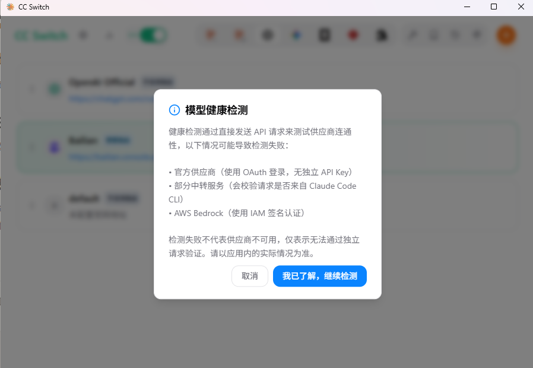
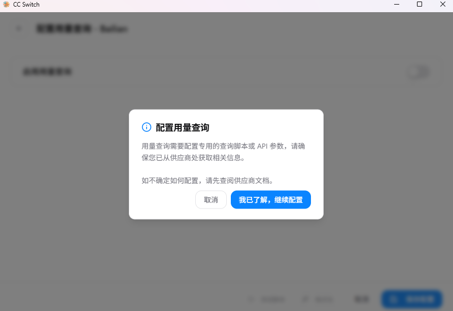

npm install -g @vue/cli

vue create videonote-vue2

不要包含大写

pip install llama-index


[cc-switch官网](https://ccswitch.io)
[cc-switch GitHub主页](https://github.com/farion1231/cc-switch)
[GitHub-releases](https://github.com/farion1231/cc-switch/releases)











git clone https://github.com/xinntao/Real-ESRGAN.git
cd Real-ESRGAN


docker pull qdrant/qdrant:latest

docker run -d --name qdrant -p 6333:6333 -p 6334:6334 -v D:\dev\qdrant_storage:/qdrant/storage qdrant/qdrant

简单查询 GET + params
提交数据 POST + body (data)

FastAPI 中，参数只要声明为 Pydantic Model，默认就从 Body 读取，不用额外写 Body(...)

```python
from pydantic import BaseModel

# 定义请求体结构
class SaveAIConfigRequest(BaseModel):
    providers: list
    active: str

# 接口直接使用这个模型
@config_router.post("/ai")
def save_ai_config(data: SaveAIConfigRequest):
    # data 是模型实例，可以直接点属性
    config["AI_CONFIG"]["providers"] = data.providers
    config["AI_CONFIG"]["active"] = data.active
    save_config(config)
    return {"status": "ok"}
```
