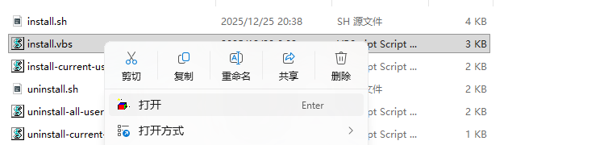
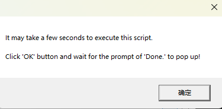
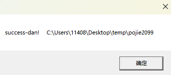
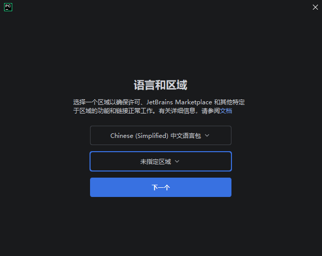
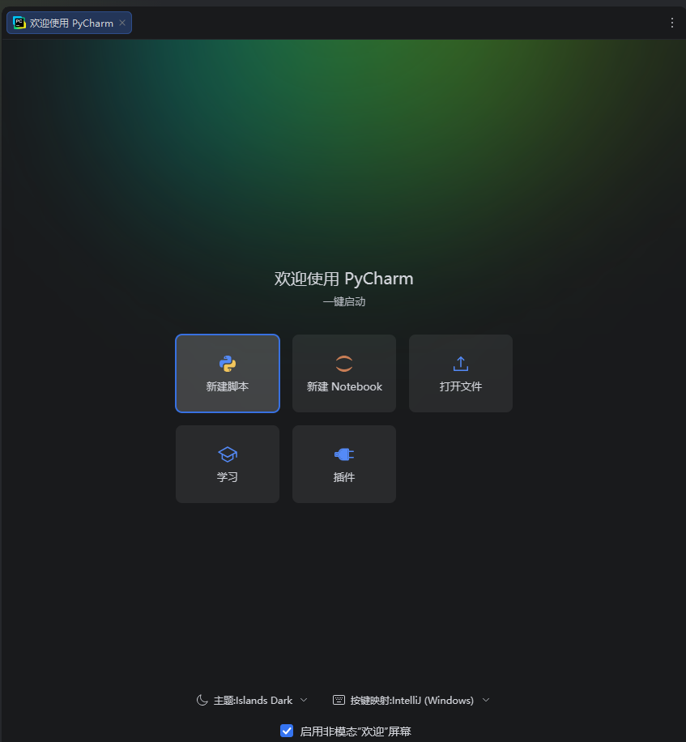
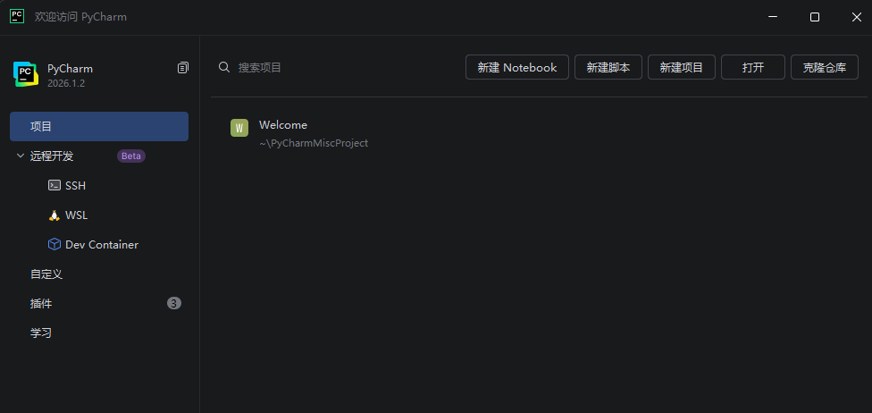
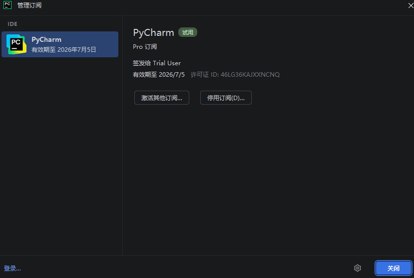
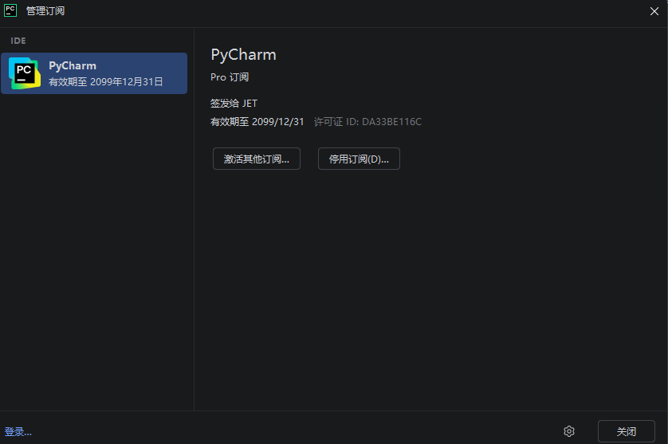

## Visual Studio Code

进入[官网](https://code.visualstudio.com/)下载。

傻瓜式安装，设置好安装路径即可。

## PyCharm

进入[官网](https://www.jetbrains.com/pycharm/)，[下载页](https://www.jetbrains.com.cn/pycharm/download/other/)可以选择对应的版本下载。

傻瓜式安装，设置好安装路径即可，先不要勾选运行pycharm，完成。

### 下载破解脚本

解压在一个路径没有 中文、空格的位置。

>激活成功后，不要移动、重命名、删除用来激活的文件夹，激活会绑定补丁所在路径，一旦发生了变动，都会导致激活生效，需要重新再次激活！所有一开始就就确定好脚本安装位置。
>Mac系统用户，解压完放置到"应用程序"。

### 激活

>[百度网盘获取脚本](https://pan.baidu.com/s/1FNERVOvrLPri1f8LILC0iA?pwd=zci7)

#### 运行脚本

进入到 /scripts 脚本文件夹下，Windows用户直接运行`install.vbs`。

出现success表示激活生效。

>`uninstall-all-users.vbs` 的脚本作用是，卸载掉当前激活补丁，后续如果想卸载，可执行此脚本。

#### 在PyCharm使用

打开Pycharm,千万不要指定区域。

同意条款，继续，打开Pycharm后勾选关闭**启用非模态“欢迎”屏幕**。

关闭，回到原始创建项目的模样。

设置，管理订阅，选择**激活其他订阅**。

激活码的方式激活，`ActivationCode`找到`PyCharm.txt`激活码填入即可看到激活成功，有效期至 2099年12月31日。

