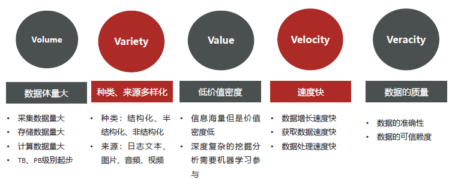
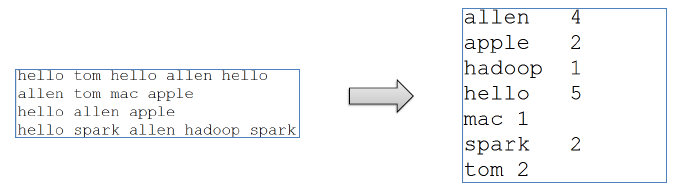


[HDFS shell 命令行常用操作](#HDFS-shell命令行常用操作)



[Hive安装(v3.1.2)](#Apache-Hive部署实战)



[Hive使用](#Apache-Hive-DML语句与函数使用)


## 大数据导论

### 企业数据分析方向

#### 数据是什么

- 数据是指对**客观事件进行记录并可以鉴别的符号**，是对客观事物的性质、状态以及相互关系等进行记载的物理符号或这些物理符号的组合，它是可识别的、抽象的符号。
- 它不仅指狭义上的**数字**，还可以是具有一定意义的**文字、字母、数字符号的组合、图形、图像、视频、音频**等，也是客观事物的属性、数量、位置及其相互关系的抽象表示。例如，“0、1、2…”、“阴、雨、下降”、“学生的档案记录、货物的运输情况”等都是数据。


#### 数据如何产生

对客观事物的**计量和记录产生**数据


#### 分析方向

**把隐藏在数据背后的信息集中和提炼出来，总结出所研究对象的内在规律，帮助管理者进行有效的判断和决策**。

数据分析在企业日常经营分析中主要有三大方向：




- **现状分析**（分析**当下**的数据）：现阶段的整体情况，各个部分的构成占比、发展、变动；
- **原因分析**（分析**过去**的数据）：某一现状为什么发生，确定原因，做出调整优化；
- **预测分析**（结合数据预测**未来**）：结合已有数据预测未来发展趋势。


<!-- tab 现状分析 -->
**实时分析**（Real Time Processing |**Streaming**）

面向当下，分析实时产生的数据；
所谓的实时是指从数据产生到数据分析到数据应用的时间间隔很短，可细分秒级、毫秒级。

<!-- endtab -->

<!-- tab 原因分析 -->
**离线分析**（**Batch** Processing）

面向过去，面向**历史**，分析已有的数据；
在时间维度明显成**批次性变化**。一周一分析(T+7)，一天一分析（T+1），所以也叫做**批处理**。

<!-- endtab -->

<!-- tab 预测分析 -->
**机器学习**（**Machine Learning**）

基于历史数据和当下产生的实时数据预测未来发生的事情；
侧重于**数学算法**的运用，如分类、聚类、关联、预测。

<!-- endtab -->


### 数据分析基本步骤

数据分析步骤（流程）的重要性体现在：对**如何开展数据分析提供了强有力的逻辑支撑**;
张文霖在《数据分析六步曲》说，典型的数据分析应该包含以下几个步骤


#### Step1：明确分析目的和思路

- 目的是整个分析流程的起点，为数据的收集、处理及分析提供清晰的指引方向；
- 思路是使**分析框架体系化**，比如先分析什么，后分析什么，使各分析点之间具有逻辑联系，保证分析维度的**完整性**，分析结果的**有效性**以及**正确性**，需要数据分析方法论进行支撑；
- 数据分析方法论是一些营销管理类相关理论，比如用户行为理论、**PEST分析法**、5W2H分析法等。


#### Step2：数据收集

- 数据**从无到有**的过程：比如传感器收集气象数据、埋点收集用户行为数据
- 数据**传输搬运**的过程：比如采集数据库数据到数据分析平台


#### Step3：数据处理

- 准确来说，应该称之为**数据预处理**。
- 数据预处理需要对收集到的数据进行加工整理，形成适合数据分析的样式，主要包括**数据清洗、数据转化、数据提取、数据计算**；
- 数据预处理可以保证数据的一致性和有效性，让数据变成干净规整的**结构化数据**。



#### Step4：数据分析

- 用适当的分析方法及分析工具，对处理过的数据进行分析，提取有价值的信息，形成有效结论的过程；
- 需要掌握各种**数据分析方法**，还要熟悉**数据分析软件**的操作；



#### Step5：数据展现

- 数据展现又称之为**数据可视化**，指的是**分析结果图表展示**，因为人类是视觉动物；
- 数据可视化（Data Visualization）属于数据应用的一种；
- 注意，**数据分析的结果不是只有可视化展示**，还可以继续数据挖掘（Data Mining）、即席查询（Ad Hoc）等。



#### Step6：报告撰写

- 数据分析报告是对整个数据分析过程的一个总结与呈现
- 把数据分析的起因、过程、结果及建议完整地呈现出来，供决策者参考
- 需要有明确的结论，最好有建议或解决方案




数据分析

- **一切围绕着数据**
- 通俗描述：**数据从哪里来、数据到哪里去**
- 核心步骤:采集、处理、分析、应用


### 大数据时代



- 解决海量数据**储存**问题
- 解决海量数据**计算**问题



#### 大数据时代背景

- 最早提出“**大数据**”**时代**到来的是全球知名咨询公司**麦肯锡**，其称：“数据，已经渗透到当今每一个行业和业务职能领域，成为重要的生产因素。人们对于海量数据的挖掘和运用，预示着新一波生产率增长和消费者盈余浪潮的到来。”
- 2019年，央视推出了国内首部大数据产业题材纪录片《大数据时代》，节目细致而生动地讲述了大数据技术在**政府治理、民生服务、数据安全、工业转型、未来生活**等方面给我们带来的改变和影响。


#### 大数据定义

- **大数据（big data）**是指无法在一定时间范围内用常规软件工具进行捕捉、管理和处理的数据集合；
- 是需要新处理模式才能具有更强的决策力、洞察发现力和流程优化能力的海量、高增长率和多样化的信息资产。


#### 大数据5V特征

5个V开头的单词，从5个方面准确、生动、形象的介绍了大数据特征。




#### 应用场景

- **电商领域**
精准广告位、个性化推荐、大数据杀熟

- **传媒领域**
精准营销、猜你喜欢、交互推荐




- **金融方面**
理财投资，通过对个人的信用评估，风险承担能力评估，集合众多理财产品、推荐响应的投资理财产品。


- **交通领域**
拥堵预测、智能红绿灯、导航最优规划

- **电信领域**
基站选址优化、舆情监控、客户用户画像


- **安防领域**
犯罪预防、天网监控

- **医疗领域**
智慧医疗、疾病预防、病源追踪



### 分布式与集群

分布式、集群是两个不同的概念，但口语中经常混淆二者。


- 分布式、集群的共同点是：**都是多台机器（服务器）组成的**；
- 因此口语中混淆两者概念的时候都是：**相对于单机来说的**。



#### 应用

数据大爆炸，海量数据处理场景面临问题


## Apache Hadoop、HDFS

### Apache Hadoop概述

#### Hadoop介绍、发展简史、现状

##### Hadoop介绍

- 
用java语言实现，开源
允许用户使用**简单的编程模型**实现**跨机器**集群对海量数据进行**分布式计算**处理

- 
Hadoop HDFS（分布式文件**存储**系统）：解决海量数据存储
Hadoop YARN（集群**资源管理**和任务调度框架）：解决资源任务调度
Hadoop MapReduce（分布式**计算**框架）：解决海量数据计算

- 
<http://hadoop.apache.org/>

- 


##### Hadoop发展简史





- 
**Doug Cutting**

- 
Nutch的设计目标是构建一个大型的全网搜索引擎。
遇到瓶颈：如何解决数十亿网页的存储和索引问题

- 
《The Google file system》：谷歌分布式文件系统GFS
《MapReduce: Simplified Data Processing on Large Clusters》：谷歌分布式计算框架MapReduce
《Bigtable: A Distributed Storage System for Structured Data》：谷歌结构化数据存储系统

##### Hadoop现状

- **HDFS**作为分布式文件存储系统，处在**生态圈的底层与核心地位**；
- **YARN**作为分布式通用的集群资源管理系统和任务调度平台，**支撑各种计算引擎运行**，保证了Hadoop地位；
- **MapReduce**作为大数据生态圈第一代分布式计算引擎，由于自身设计的模型所产生的弊端，导致企业一线**几乎不再直接使用**MapReduce进行编程处理，但是很多软件的底层依然在使用MapReduce引擎来处理数据。



1. 狭义上Hadoop指软件，广义上Hadoop指生态圈
2. Hadoop之父Doug Cutting
3. Hadoop起源于Nutch项目
4. 受Google3篇论文启发
5. 2008年开源给Apache软件基金会



#### Hadoop特性优点、国内外应用

##### Hadoop特性优点

1. **扩容能力** scalability
Hadoop是在可用的计算机集群间分配数据并完成计算任务的，这些集群可方便灵活的方式扩展到数以千计的节点。

2. **成本低** Economical
Hadoop集群允许通过部署普通廉价的机器组成集群来处理大数据，以至于成本很低。看重的是集群整体能力。

3. **效率高** efficiency
通过**并发数据**，Hadoop可以在节点之间动态**并行**的移动数据，使得速度非常快。

4. 可靠性 reliability
能自动维护数据的多份复制，并且在任务失败后能自动地重新部署（redeploy）计算任务。所以Hadoop的按位存储和处理数据的能力值得人们信赖。

##### Hadoop国外应用

- Yahoo
支持广告系统
用户行为分析
支持Web搜索
反垃圾邮件系统

- Facebook
存储处理数据挖掘和日志统计
构建基于Hadoop数据仓库平台（Apache Hive来自FB）

- IBM
蓝云基础设施构建
商业化Hadoop发行、解决方案支持

##### Hadoop国内应用

- 百度
用户搜索表征的需求数据、阿拉丁爬虫数据存储
数据分析和挖掘竞价排名

- 阿里巴巴
为电子商务网络平台提供底层的基础计算和存储服务
交易数据、信用数据

- 腾讯
用户关系数据
基于Hadoop、Hive构建TDW（腾讯分布式数据仓库）

- 华为
对Hadoop的HA方案，以及HBase领域有深入研究



- Hadoop成功的魅力--**通用性**
精准区分做什么和怎么做
做什么属于业务问题怎么做属于技术问题。
用户负责业务Hadoop负责技术

- Hadoop成功的魅力--**简单**
**一个东西你用起来比较简单，可不是你的能力！**


#### Hadoop发行版本、架构变迁

##### Hadoop发行版本


- Apache开源社区版本
<http://hadoop.apache.org/>

- 商业发行版本
Cloudera: <https://www.cloudera.com/products/open-source/apache-hadoop.html>
Hortonworks: <https://www.cloudera.com/products/hdp.html>

##### Hadoop架构变迁（1.0-2.0变迁）

- Hadoop 1.0
HDFS（分布式文件存储）
MapReduce（资源管理和分布式数据处理）

- Hadoop 2.0
HDFS（分布式文件存储）
MapReduce（分布式数据处理）
**YARN**（集群资源管理、任务调度）


##### Hadoop架构变迁（3.0新版本）


Hadoop 3.0架构组件和Hadoop 2.0类似,**3.0着重于性能优化**。

- 通用方面
精简内核、类路径隔离、shell脚本重构

- Hadoop HDFS
EC纠删码、多NameNode支持

- Hadoop MapReduce
任务本地化优化、内存参数自动推断

- Hadoop YARN
Timeline Service V2、队列配置

### Apache Hadoop集群搭建

#### Hadoop集群简介

- Hadoop集群包括两个集群：HDFS集群、YARN集群
- 两个集群**逻辑上分离、通常物理上在一起**(可单独启动，部署于一台计算机)
- 两个集群都是标准的**主从架构**集群


- 逻辑上分离
两个集群**互相之间没有依赖、互不影响**

- 物理上在一起
某些角色进程往往**部署在同一台物理服务器上**

- MapReduce集群呢？
MapReduce是计算框架、代码层面的组件没有集群之说

#### Hadoop集群模式(分布式)安装（Cluster mode）

详细的集群搭建步骤可参考

##### Hadoop源码编译

- 安装包、源码包下载地址
<https://archive.apache.org/dist/hadoop/common/>

- 为什么要重新编译Hadoop源码?
匹配不同**操作系统本地库环境**，Hadoop某些操作比如压缩、IO需要调用系统本地库（*.so|*.dll）
**修改源码、重构源码**
- 如何编译Hadoop
源码包根目录下文件：BUILDING.txt


##### Step1:集群角色规划

- 角色规划的准则
根据软件工作特性和服务器硬件资源情况合理分配
比如依赖内存工作的NameNode是不是部署在大内存机器上？

- 角色规划注意事项
**资源上有抢夺冲突的，尽量不要部署在一起**
**工作上需要互相配合的。尽量部署在一起**

| 服务器 | 运行角色 |
| ----- | -------- |
| node1.itcast.cn | namenode datanode resourcemanager nodemanager |
| node2.itcast.cn | secondarynamenode datanode nodemanager |
| node3.itcast.cn | datanode nodemanager |

##### Step2:服务器基础环境准备

- 主机名（3台机器）
`vim /etc/hostname`

- Hosts映射（3台机器）
`vim /etc/hosts`

- 防火墙关闭（3台机器）
`systemctl stop firewalld.service` #关闭防火墙
`systemctl disable firewalld.service` #禁止防火墙开启自启

- ssh免密登录
`ssh-keygen`#4个回车生成公钥、私钥
`ssh-copy-id node1`、`ssh-copy-id node2`、`ssh-copy-id node3`

- 集群时间同步（3台机器）
`yum -y install ntpdate`
`ntpdate ntp4.aliyun.com`

- 创建统一工作目录（3台机器）

##### Step3:上传安装包、解压安装包

- JDK 1.8安装（3台机器）
- 上传、解压Hadoop安装包

##### Step4:Hadoop安装包目录结构

| 目录 | 说明 |
| ---- | ---- |
| **bin** | Hadoop最基本的**管理脚本**和使用脚本的目录，这些脚本是sbin目录下管理脚本的基础实现，用户可以直接使用这些脚本管理和使用Hadoop。 |
| **etc** | Hadoop**配置文件**所在的目录 |
| include | 对外提供的编程库头文件（具体动态库和静态库在lib目录中），这些头文件均是用C++定义的，通常用于C++程序访问HDFS或者编写MapReduce程序。 |
| lib | 该目录包含了Hadoop对外提供的编程动态库和静态库，与include目录中的头文件结合使用。 |
| libexec | 各个服务对用的shell配置文件所在的目录，可用于配置日志输出、启动参数（比如JVM参数）等基本信息。 |
| **sbin** | Hadoop管理脚本所在的目录，主要包含HDFS和YARN中各类服务的**启动/关闭脚本**。 |
| **share** | Hadoop各个模块编译后的**jar包**所在的目录，**官方自带示例**。 |

##### 配置文件概述

- 官网文档
<https://hadoop.apache.org/docs/>

- 第一类1个: **hadoop-env.sh**
- 第二类4个：xxxx-site.xml ,site表示的是用户定义的配置，会覆盖default中的默认配置。
  - **core-site.xml** 核心模块配置
  - **hdfs-site.xml** hdfs文件系统模块配置
  - **mapred-site.xml** MapReduce模块配置
  - **yarn-site.xml** yarn模块配置

- 第三类1个：**workers**
- 上述的配置文件目录：$HADOOP_HOME/etc/hadoop

##### Step5:编辑Hadoop配置文件 hadoop-env.sh

```sh
export JAVA_HOME=jdk安装路径
#文件最后添加
export HDFS_NAMENODE_USER=root
export HDFS_DATANODE_USER=root
export HDFS_SECONDARYNAMENODE_USER=root
export YARN_RESOURCEMANAGER_USER=root
export YARN_NODEMANAGER_USER=root
```

##### Step5:编辑Hadoop配置文件 core-site.xml

```xml
<!--设置默认使用的文件系统Hadoop支持file、HDFS、GFS、ali|Amazon云等文件系统-->
<property>
    <name>fs.defaultFS</name>
    <!-- 8020/9000/9820均可 -->
    <value>hdfs://node1:8020</value>
</property>

<!--设置Hadoop本地保存数据路径-->
<property>
    <name>hadoop.tmp.dir</name>
    <value>/mysoft/data/hadoop-3.3.0</value>
</property>

<!--设置HDFS web UI用户身份-->
<property>
    <name>hadoop.http.staticuser.user</name>
    <value>root</value>
</property>

<!--整合hive 用户代理设置-->
<property>
    <name>hadoop.proxyuser.root.hosts</name>
    <value>*</value>
</property>

<property>
    <name>hadoop.proxyuser.root.groups</name>
    <value>*</value>
</property>

<!--垃圾桶文件保存时间-->
<property>
    <name>fs.trash.interval</name>
    <value>1440</value>
</property>
```

##### Step5:编辑Hadoop配置文件hdfs-site.xml

```xml
<!--设置SNN进程运行机器位置信息-->
<property>
    <name>dfs.namenode.secondary.http-address</name>
    <value>node2:9868</value>
</property>
```

##### Step5:编辑Hadoop配置文件 mapred-site.xml

```xml
<!--设置MR程序默认运行模式：yarn集群模式local本地模式-->
<property>
    <name>mapreduce.framework.name</name>
    <value>yarn</value>
</property>

<!--MR程序历史服务器端地址-->
<property>
    <name>mapreduce.jobhistory.address</name>
    <value>node1:10020</value>
</property>

<!--历史服务器web端地址-->
<property>
    <name>mapreduce.jobhistory.webapp.address</name>
    <value>node1:19888</value>
</property>

<property>
    <name>yarn.app.mapreduce.am.env</name>
    <value>HADOOP_MAPRED_HOME=${HADOOP_HOME}</value>
</property>

<property>
    <name>mapreduce.map.env</name>
    <value>HADOOP_MAPRED_HOME=${HADOOP_HOME}</value>
</property>

<property>
    <name>mapreduce.reduce.env</name>
    <value>HADOOP_MAPRED_HOME=${HADOOP_HOME}</value>
</property>
```

##### Step5:编辑Hadoop配置文件 yarn-site.xml

```xml
<!--设置YARN集群主角色运行机器位置-->
<property>
    <name>yarn.resourcemanager.hostname</name>
    <value>node1</value>
</property>

<property>
    <name>yarn.nodemanager.aux-services</name>
    <value>mapreduce_shuffle</value>
</property>

<!--是否将对容器实施物理内存限制-->
<property>
    <name>yarn.nodemanager.pmem-check-enabled</name>
    <value>false</value>
</property>

<!--是否将对容器实施虚拟内存限制。-->
<property>
    <name>yarn.nodemanager.vmem-check-enabled</name>
    <value>false</value>
</property>

<!--开启日志聚集-->
<property>
    <name>yarn.log-aggregation-enable</name>
    <value>true</value>
</property>

<!--设置yarn历史服务器地址-->
<property>
    <name>yarn.log.server.url</name>
    <value>http://node1:19888/jobhistory/logs</value>
</property>

<!--保存的时间7天-->
<property>
    <name>yarn.log-aggregation.retain-seconds</name>
    <value>604800</value>
</property>
```

##### Step5:编辑Hadoop配置文件 workers


node1
node2
node3


##### Step6:分发同步安装包

- 在node1机器上将Hadoop安装包scp同步到其他机器

##### Step7:配置Hadoop环境变量

- 在node1上配置Hadoop环境变量
`vim /etc/profile`
`export HADOOP_HOME=hadoop安装路径`
`export PATH=$PATH:$HADOOP_HOME/bin:$HADOOP_HOME/sbin`

- 将修改后的环境变量同步其他机器
`scp /etc/profile root@node2:/etc/`
`scp /etc/profile root@node3:/etc/`

- 重新加载环境变量验证是否生效（3台机器）
`source /etc/profile`
`hadoop` #验证环境变量是否生效

##### Step8:NameNode format（格式化操作）

- 首次启动HDFS时，必须对其进行格式化操作
- format本质上是**初始化工作，进行HDFS清理和准备工作**
- 命令：
`hdfs namenode -format`



1. 首次启动之前需要format操作;
2. format只能进行一次后续不再需要;
3. 如果多次format除了造成数据丢失外，还会导致hdfs集群主从角色之间互不识别。通过删除所有机器hadoop.tmp.dir目录重新format解决


#### Hadoop集群启停命令、Web UI

##### 手动逐个进程启停

每台机器上每次手动启动关闭一个角色进程,可以精准控制每个进程启停，避免群起群停。

- HDFS集群

#hadoop2.x版本命令
hadoop-daemon.sh start|stop namenode|datanode|secondarynamenode
#hadoop3.x版本命令
hdfs --daemon start|stop namenode|datanode|secondarynamenode


- YARN集群

#hadoop2.x版本命令
yarn-daemon.sh start|stop resourcemanager|nodemanager
#hadoop3.x版本命令
yarn --daemon start|stop resourcemanager|nodemanager


- JobHistoryServer守护进程(19888端口号查看web界面)

#hadoop2.x版本命令
mr-jobhistory-daemon.sh start|stop historyserver
#hadoop3.x版本命令
mapred --daemon start|stop historyserver


##### shell脚本一键启停

在node1上，使用软件自带的shell脚本一键启动。前提：**配置好机器之间的SSH免密登录和workers文件**。

- HDFS集群
`start-dfs.sh`
`stop-dfs.sh`

- YARN集群
`start-yarn.sh`
`stop-yarn.sh`

- Hadoop集群
`start-all.sh`
`stop-all.sh`

##### 进程状态、日志查看

- 启动完毕之后可以使用**jps命令**查看进程是否启动成功
- Hadoop启动日志路径：$HADOOP_HOME/logs/

##### HDFS集群web界面

地址：<http://namenode_host:9870>

其中namenode_host是namenode运行所在机器的主机名或者ip
如果使用主机名访问，别忘了在Windows配置hosts


##### YARN集群web界面

地址：<http://resourcemanager_host:8088>

其中resourcemanager_host是resourcemanager运行所在机器的主机名或者ip
如果使用主机名访问，别忘了在Windows配置hosts


#### Hadoop初体验

##### HDFS 初体验

###### shell命令操作

```shell
hadoopfs-mkdir /itcast
hadoopfs-put zookeeper.out/itcast
hadoopfs-ls/
```

###### Web UI页面操作


##### MapReduce+YARN初体验

执行Hadoop官方自带的MapReduce案例，评估圆周率π的值。

```shell
cd $HADOOP_HOME/share/hadoop/mapreduce/
hadoop jar hadoop-mapreduce-examples-3.3.0.jar pi 2 4
```


### HDFS分布式文件系统基础

#### 文件系统、分布式文件系统

##### 文件系统定义

- 文件系统是一种**存储**和**组织数据**的方法，实现了数据的存储、分级组织、访问和获取等操作，使得用户对文件访问和查找变得容易；
- 文件系统使用**树形目录**的**抽象逻辑**概念代替了硬盘等物理设备使用数据块的概念，用户不必关心数据底层存在硬盘哪里，只需要记住这个文件的所属目录和文件名即可；
- 文件系统通常使用硬盘和光盘这样的存储设备，并**维护文件在设备中的物理位置**。


##### 传统常见的文件系统

- 所谓传统常见的文件系统更多指的的**单机的文件系统**，也就是**底层不会横跨多台机器**实现。比如windows操作系统上的文件系统、Linux上的文件系统、FTP文件系统等等。
- 这些文件系统的共同特征包括：
    1. 带有**抽象的目录树结构**，树都是从**\/根目录开始**往下蔓延；
    2. 树中节点分为两类：**目录**和**文件**；
    3. 从根目录开始，节点**路径具有唯一性**。

##### 数据、元数据

###### 数据

指存储的内容本身，比如文件、视频、图片等，这些**数据底层最终是存储在磁盘**等存储介质上的，一般**用户无需关心**，只需要基于目录树进行增删改查即可，实际针对数据的操作由文件系统完成。

###### 元数据

元数据（metadata）又称之为解释性数据，记录数据的数据；
文件系统元数据一般指**文件大小、最后修改时间、底层存储位置、属性、所属用户、权限等信息**。


##### 海量数据存储遇到的问题

- **成本高**
传统存储硬件通用性差，设备投资加上后期维护、**升级扩容的成本非常高**。


- 如何支撑高效率的计算分析
传统存储方式意味着数据：存储是存储，计算是计算，当**需要处理数据的时候把数据移动过来**。
程序和数据存储是属于不同的技术厂商实现，无法有机统一整合在一起。

- **性能低**
**单节点I/O性能瓶**颈无法逾越，难以支撑海量数据的**高并发高吞吐**场景。

- **可扩展性差**
无法实现快速部署和弹性扩展，动态扩容、缩容成本高，技术实现难度大。

#### 分布式存储系统的核心属性及功能含义

分布式存储系统核心属性

- 分布式存储
- 元数据记录
- 分块存储
- 副本机制

##### 分布式存储的优点

- 问题：数据量大，单机存储遇到瓶颈
- 解决：
单机纵向扩展：磁盘不够加磁盘，有上限瓶颈限制
**多机横向扩展**：机器不够加机器，理论上**无限扩展**


##### 元数据记录的功能

- 问题：文件分布在不同机器上不利于寻找
- 解决：元数据记录下文件及其存储位置信息，**快速定位文件位置**


##### 分块存储好处

- 问题：文件过大导致单机存不下、上传下载效率低
- 解决：文件分块存储在不同机器，**针对块并行操作提高效率**


##### 副本机制的作用

- 问题：硬件故障难以避免，数据易丢失
- 解决：不同机器设置备份，**冗余存储，保障数据安全**




1. 
**无限扩展**支撑海量数据存储


2. 
快速**定位文件**位置便于查找


3. 
针对块**并行操作**提高效率


4. 
冗余存储保障**数据安全**




#### HDFS简介

- HDFS（Hadoop Distributed File System ），意为：**Hadoop分布式文件系统**。

- 是Apache Hadoop核心组件之一，作为**大数据生态圈最底层**的分布式存储服务而存在。也可以说大数据首先要解决的问题就是海量数据的存储问题。


- HDFS主要是**解决大数据如何存储问题的**。分布式意味着是HDFS是横跨在多台计算机上的存储系统。

- HDFS是一种能够在普通硬件上运行的分布式文件系统，它是**高度容错**的，适应于具有大数据集的应用程序，它非常适于存储大型数据(比如TB 和PB)。

- HDFS使用多台计算机存储文件, 并且提供**统一的访问接口**, 像是访问一个普通文件系统一样使用分布式文件系统。

- 

#### HDFS起源发展、设计目标

##### HDFS起源发展

- **Doug Cutting** 领导**Nutch项目**研发，Nutch的设计目标是构建一个大型的全网搜索引擎，包括网页抓取、索引、查询等功能。

- 随着爬虫抓取网页数量的增加，遇到了严重的可扩展性问题——**如何解决数十亿网页的存储和索引问题**。

- 2003年的时候, Google发表的论文为该问题提供了可行的解决方案。
《**分布式文件系统（GFS）**，可用于处理海量网页的存储》


- Nutch的开发人员完成了相应的开源实现HDFS，并从Nutch中剥离和MapReduce成为独立项目HADOOP。

##### HDFS设计目标

- 硬件故障（Hardware Failure）是常态，HDFS可能有成百上千的服务器组成，每一个组件都有可能出现故障。因此**故障检测和自动快速恢复**是HDFS的核心架构目标。
- HDFS上的应用主要是以流式读取数据（Streaming Data Access）。HDFS被设计成用于批处理，而不是用户交互式的。相较于数据访问的反应时间，更**注重数据访问的高吞吐量**。
- 典型的HDFS文件大小是GB到TB的级别。所以，HDFS被调整成**支持大文件（Large Data Sets）**。它应该提供很高的聚合数据带宽，一个集群中支持数百个节点，一个集群中还应该支持千万级别的文件。
- 大部分HDFS应用对文件要求的是**write-one-read-many**访问模型。一个文件一旦**创建、写入、关闭之后就不需要修改**了。这一假设简化了数据一致性问题，使高吞吐量的数据访问成为可能。
- **移动计算的代价比之移动数据的代价低**。一个应用请求的计算，离它操作的数据越近就越高效。将计算移动到数据附近，比之将数据移动到应用所在显然更好。
- HDFS被设计为可从一个平台**轻松移植**到另一个平台。这有助于将HDFS广泛用作大量应用程序的首选平台。

#### HDFS应用场景


#### HDFS重要特性





##### 整体概述

- 主从架构
- 分块存储
- 副本机制
- 元数据记录
- 抽象统一的目录树结构（namespace）

##### （1）主从架构

- HDFS集群是标准的master/slave主从架构集群。
- 一般一个HDFS集群是有一个Namenode和一定数目的Datanode组成。
- **Namenode是HDFS主节点，Datanode是HDFS从节点，两种角色各司其职，共同协调**完成分布式的文件存储服务。
- 官方架构图中是**一主五从**模式，其中五个从角色位于两个机架（Rack）的不同服务器上。

##### （2）分块存储

- HDFS中的文件在**物理上是分块存储（block）**的，默认大小是128M（134217728），不足128M则本身就是一块。
- 块的大小可以通过配置参数来规定，参数位于hdfs-default.xml中：dfs.blocksize。


##### （3）副本机制

- 文件的所有block都会有副本。副本系数可以在文件创建的时候指定，也可以在之后通过命令改变。
- 副本数由参数dfs.replication控制，**默认值是3**，也就是会**额外再复制2份**，连同本身总共3份副本。

##### （4）元数据管理

在HDFS中，Namenode管理的元数据具有两种类型：

- **文件自身属性信息**
文件名称、权限，修改时间，文件大小，复制因子，数据块大小。

- **文件块位置映射信息**
记录文件块和DataNode之间的映射信息，即哪个块位于哪个节点上。

##### （5）namespace

- HDFS支持传统的**层次型文件组织结构**。用户可以创建目录，然后将文件保存在这些目录里。文件系统名字空间的层次结构和大多数现有的文件系统类似：用户可以创建、删除、移动或重命名文件。
- Namenode负责维护文件系统的namespace名称空间，任何对文件系统名称空间或属性的修改都将被Namenode记录下来。
- HDFS会给客户端提供一个**统一的抽象目录树**，客户端通过路径来访问文件，形如：hdfs://namenode:port/dir-a/dir-b/dir-c/file.data。

##### （6）数据块存储

- 文件的各个block的**具体存储管理由DataNode节点承担**。
- 每一个block都可以在多个DataNode上存储。

### HDFS shell操作

#### HDFS shell命令行解释说明

**命令行界面**（英语：command-line interface，缩写：CLI），是指用户通过键盘输入指令，计算机接收到指令后，予以执行一种人际交互方式。

Hadoop提供了文件系统的shell命令行客户端: `hadoop fs [generic options]`

##### 文件系统协议

- HDFS Shell CLI支持操作多种文件系统，包括本地文件系统（file:///）、分布式文件系统（hdfs://nn:8020）等
- 具体操作的是什么文件系统取决于命令中文件路径**URL中的前缀协议**。
- 如果没有指定前缀，则将会读取环境变量中的`fs.defaultFS`属性，以该属性值作为默认文件系统。

```plaintext
hadoop fs -ls file:/// #操作本地文件系统
hadoop fs -ls hdfs://node1:8020/ #操作HDFS分布式文件系统
hadoop fs -ls / #直接根目录，没有指定协议将加载读取fs.defaultFS值
```

##### 区别

- hadoop dfs 只能操作HDFS文件系统（包括与Local FS间的操作），不过已经Deprecated；
- hdfs dfs 只能操作HDFS文件系统相关（包括与Local FS间的操作）,常用；
- `hadoop fs` 可操作任意文件系统，不仅仅是hdfs文件系统，使用范围更广；

目前版本来看，官方最终推荐使用的是hadoop fs。当然hdfs dfs在市面上的使用也比较多。

##### 参数说明

- HDFS文件系统的操作命令很多和Linux类似，因此学习成本相对较低。
- 可以通过`hadoop fs -help`命令来查看每个命令的详细用法。

```plaintext
Usage: hadoop fs [generic options]
[-appendToFile<localsrc> ... <dst>]
[-cat [-ignoreCrc] <src> ...]
……
-appendToFile<localsrc> ... <dst> :
Appends the contents of all the given local files to the given dst file. The dst
file will be created if it does not exist. If <localSrc> is -, then the input is
read from stdin.
-cat [-ignoreCrc] <src> ... :
Fetch all files that match the file pattern <src> and display their content on
stdout.
```

#### HDFS shell命令行常用操作

##### 创建文件夹

```shell
hadoop fs -mkdir [-p] <path> ...
```

- `path` 为待创建的目
- `-p`选项的行为与Unix mkdir -p非常相似，它**会创建路径中的各级父目录**。

##### 查看指定目录下内容

```shell
hadoop fs -ls [-h] [-R] [<path> ...]
```

- `path` 指定目录路径
- `-h` 人性化显示文件size
- `-R` 递归查看指定目录及其子目录

##### 上传文件到HDFS指定目录下

```shell
hadoop fs -put [-f] [-p] <localsrc> ... <dst>
```

- `-f` 覆盖目标文件（已存在下）
- `-p` 保留访问和修改时间，所有权和权限。
- `localsrc` 本地文件系统（客户端所在机器）
- `dst` 目标文件系统（HDFS）

##### 查看HDFS文件内容

```shell
hadoop fs -cat <src> ...
```

读取指定文件全部内容，显示在标准输出控制台。
注意：对于**大文件内容读取，慎重**。

##### 下载HDFS文件

```shell
hadoop fs -get [-f] [-p] <src> ... <localdst>
```

- 下载文件到本地文件系统指定目录，localdst必须是目录
- `-f` 覆盖目标文件（已存在下）
- `-p` 保留访问和修改时间，所有权和权限。

##### 拷贝HDFS文件

```shell
hadoop fs -cp [-f] <src> ... <dst>
```

- `-f` 覆盖目标文件（已存在下）

##### 追加数据到HDFS文件中

```shell
hadoop fs -appendToFile<localsrc> ... <dst>
```

将所有给定本地文件的内容追加到给定dst文件。
dst如果文件不存在，将创建该文件。
注意：**appendToFile 是将当地文件内容追加的到 hadoop 上的文件（不能hadoop上的文件1 追加给 hadoop上的文件2）**


##### HDFS数据移动操作

```shell
hadoop fs -mv <src> ... <dst>
```

移动文件到指定文件夹下
可以使用该命令移动数据，重命名文件的名称

##### HDFS shell其他命令

命令官方指导文档
<https://hadoop.apache.org/docs/>
<https://hadoop.apache.org/docs/r3.3.4/hadoop-project-dist/hadoop-common/FileSystemShell.html>

常见的操作自己最好能够记住，其他操作可以根据需要查询文档使用。
命令属于**多用多会，孰能生巧，不用就忘**。

### HDFS工作流程与机制

#### HDFS集群角色与职责

##### 官方架构图


##### 主角色：namenode


- `NameNode`是Hadoop分布式文件系统的核心，架构中的主角色。
- **NameNode维护和管理文件系统元数据**，包括名称空间目录树结构、文件和块的位置信息、访问权限等信息。
- 基于此，**NameNode成为了访问HDFS的唯一入口**。
- NameNode内部通过**内存**和**磁盘文件**两种方式管理元数据。
- 其中磁盘上的元数据文件包括Fsimage内存元数据镜像文件和edits log（Journal）编辑日志。

##### 从角色：datanode





- `DataNode`是Hadoop HDFS中的从角色，负责**具体的数据块存储**。
- DataNode的数量决定了HDFS集群的整体数据存储能力。通过和NameNode配合维护着数据块。

##### 主角色辅助角色：secondarynamenode

- Secondary NameNode充当NameNode的辅助节点，但不能替代NameNode。
- 主要是帮助主角色进行元数据文件的合并动作。可以通俗的理解为主角色的“秘书”。
- 

##### namenode职责

- NameNode仅**存储HDFS的元数据**：文件系统中所有文件的目录树，并跟踪整个集群中的文件，不存储实际数据。
- NameNode知道HDFS中任何**给定文件的块列表及其位置**。使用此信息NameNode知道如何从块中构建文件。
- NameNode**不持久化存储每个文件中各个块所在的datanode的位置信息**，这些信息会在系统启动时从DataNode重建。
- NameNode是Hadoop集群中的**单点故障**。
- NameNode所在机器通常会配置有**大量内存（RAM）**。

##### datanode职责

- DataNode负责**最终数据块block的存储**。是集群的**从角色**，也称为Slave。
- DataNode启动时，会将自己**注册**到NameNode并**汇报**自己负责持有的块列表。
- 当某个DataNode关闭时，不会影响数据的可用性。NameNode将安排由其他DataNode管理的块进行副本复制。
- DataNode所在机器通常配置有大量的**硬盘**空间，因为实际数据存储在DataNode中。

#### HDFS写数据流程（上传文件）

##### 写数据完整流程图


##### 核心概念--Pipeline管道

- `Pipeline`，中文翻译为管道。这是HDFS在上传文件写数据过程中采用的一种数据传输方式。
- 客户端将数据块写入第一个数据节点，第一个数据节点保存数据之后再将块复制到第二个数据节点，后者保存后将其复制到第三个数据节点。
- 为什么datanode之间采用pipeline线性传输，而不是一次给三个datanode拓扑式传输呢？
- 因为数据以管道的方式，**顺序的沿着一个方向传输，这样能够充分利用每个机器的带宽，避免网络瓶颈和高延迟时的连接，最小化推送所有数据的延时**。
- 在线性推送模式下，每台机器所有的出口宽带都用于以最快的速度传输数据，而不是在多个接受者之间分配宽带。

##### 核心概念--ACK应答响应


- ACK (Acknowledge character）即是确认字符，在数据通信中，接收方发给发送方的一种传输类控制字符。表示发来的数据已确认接收无误。
- 在HDFS pipeline管道传输数据的过程中，传输的反方向会进行ACK校验，确保数据传输安全。

##### 核心概念--默认3副本存储策略

- 默认副本存储策略是由BlockPlacementPolicyDefault指定。
- 
- 第一块副本：优先客户端本地，否则随机
- 第二块副本：不同于第一块副本的不同机架。
- 第三块副本：第二块副本相同机架不同机器。
- 

##### 写数据完整流程图文字描述

1. HDFS客户端创建对象实例`DistributedFileSystem`，该对象中封装了与HDFS文件系统操作的相关方法。
2. 调用DistributedFileSystem对象的create()方法，通过`RPC`(远程过程调用)请求NameNode创建文件。
NameNode执行各种检查判断：目标文件是否存在、父目录是否存在、客户端是否具有创建该文件的权限。检查通过，NameNode就会为本次请求记下一条记录，返回`FSDataOutputStream输出流`对象给客户端用于写数据。
3. 客户端通过FSDataOutputStream输出流开始写入数据。
4. 客户端写入数据时，将数据分成一个个数据包（**packet 默认64k**）,内部组件`DataStreamer`请求NameNode挑选出适合存储数据副本的一组DataNode地址，默认是3副本存储。
DataStreamer将数据包流式传输到`pipeline`的第一个DataNode,该DataNode存储数据包并将它发送到pipeline的第二个DataNode。同样，第二个DataNode存储数据包并且发送给第三个（也是最后一个）DataNode。
5. 传输的反方向上，会通过`ACK机制`校验数据包传输是否成功；
6. 客户端完成数据写入后，在FSDataOutputStream输出流上调用close()方法关闭。
7. DistributedFileSystem联系NameNode告知其文件写入完成，等待NameNode确认。
因为namenode已经知道文件由哪些块组成（DataStream请求分配数据块），因此仅需等待最小复制块即可成功返回。
最小复制是由参数dfs.namenode.replication.min指定，默认是1.

#### HDFS读数据流程（下载文件）

##### 读数据完整流程图


1. HDFS客户端创建对象实例`DistributedFileSystem`，调用该对象的open()方法来打开希望读取的文件。
2. DistributedFileSystem使用RPC调用namenode来确定**文件中前几个块的块位置（分批次读取）信息**。
对于每个块，namenode返回具有该块所有副本的datanode位置地址列表，并且该地址列表是排序好的，与客户端的网络拓扑距离近的排序靠前。
3. DistributedFileSystem将FSDataInputStream输入流返回到客户端以供其读取数据。
4. 客户端在FSDataInputStream输入流上调用read()方法。然后，已存储DataNode地址的InputStream连接到文件中第一个块的最近的DataNode。数据从DataNode流回客户端，结果客户端可以在流上重复调用read（）。
5. 当该块结束时，FSDataInputStream将关闭与DataNode的连接，然后寻找下一个block块的最佳datanode位置。这些操作对用户来说是透明的。所以用户感觉起来它一直在读取一个连续的流。
客户端从流中读取数据时，也会根据需要询问NameNode来**检索下一批数据块的DataNode位置信息**。
6. 一旦客户端完成读取，就对FSDataInputStream调用close()方法。

## Hadoop MapReduce与Hadoop YARN

### Hadoop MapReduce

#### MapReduce思想





- MapReduce的思想核心是“**先分再合，分而治之**”。
- 所谓“分而治之”就是**把一个复杂的问题，按照一定的“分解”方法分为等价的规模较小的若干部分，然后逐个解决，分别找出各部分的结果，然后把各部分的结果组成整个问题的最终结果**。
- 这种思想来源于日常生活与工作时的经验。即使是发布过论文实现分布式计算的谷歌也只是实现了这种思想，而不是自己原创。
- Map表示第一阶段，负责“**拆分**”：即把复杂的任务**分解为若干个“简单的子任务”来并行处理**。可以进行拆分的前提是这些小任务可以并行计算，彼此间几乎**没有依赖关系**。
- Reduce表示第二阶段，负责“**合并**”：即对map阶段的结果进行全局汇总。
- 这两个阶段合起来正是MapReduce思想的体现。
- 
- 一个比较形象的例子解释MapReduce
要数停车场中的所有停放车的总数量。
你数第一列，我数第二列…这就是Map阶段，人越多，能够同时数车的人就越多，速度就越快。
数完之后，聚到一起，把所有人的统计数加在一起。这就是Reduce合并汇总阶段。


#### Hadoop MapReduce设计构思

##### （1）如何对付大数据处理场景

- 对相互间不具有计算依赖关系的大数据计算任务，实现并行最自然的办法就是**采取MapReduce分而治之**的策略。
- 首先Map阶段进行拆分，把大数据拆分成若干份小数据，多个程序同时并行计算产生中间结果；然后是Reduce聚合阶段，通过程序对并行的结果进行最终的汇总计算，得出最终的结果。
- **不可拆分的计算任务或相互间有依赖关系的数据无法进行并行计算**！
- 

##### （2）构建抽象编程模型

- MapReduce借鉴了**函数式**语言中的思想，用**Map**和**Reduce**两个函数提供了高层的并行编程抽象模型。
map: 对一组数据元素进行某种重复式的处理；
reduce: 对Map的中间结果进行某种进一步的结果整理。


- MapReduce中定义了如下的Map和Reduce两个抽象的编程接口，由用户去编程实现:
map: (k1; v1) → (k2; v2)
reduce: (k2; [v2]) → (k3; v3)

- 通过以上两个编程接口，大家可以看出MapReduce处理的数据类型是`<key,value>键值对`。

##### （3）统一架构、隐藏底层细节

- 如何提供统一的计算框架，如果没有统一封装底层细节，那么程序员则需要考虑诸如数据存储、划分、分发、结果收集、错误恢复等诸多细节；为此，MapReduce设计并提供了统一的计算框架，为程序员隐藏了绝大多数系统层面的处理细节。
- MapReduce最大的亮点在于通过抽象模型和计算框架把需要**做什么(what need to do)**与具体**怎么做(how to do)**分开了，为程序员提供一个抽象和高层的编程接口和框架。
- **程序员仅需要关心其应用层的具体计算问题，仅需编写少量的处理应用本身计算问题的业务程序代码**。
- 至于如何具体完成这个并行计算任务所相关的诸多系统层细节被隐藏起来,交给计算框架去处理：从分布代码的执行，到大到数千小到单个节点集群的自动调度使用。

#### Hadoop MapReduce介绍

##### 分布式计算概念

- **分布式计算**是一种计算方法，和**集中式计算**是相对的。
- 随着计算技术的发展，有些应用需要非常巨大的计算能力才能完成，如果采用集中式计算，需要耗费相当长的时间来完成。
- 分布式计算**将该应用分解成许多小的部分，分配给多台计算机进行处理**。这样可以节约整体计算时间，大大提高计算效率。
- 

##### Hadoop MapReduce概述

- Hadoop MapReduce是一个**分布式计算框架**，用于轻松编写分布式应用程序，这些应用程序以可靠，容错的方式并行处理大型硬件集群（数千个节点）上的大量数据（多TB数据集）。
- MapReduce是一种面向海量数据处理的一种指导思想，也是一种用于对大规模数据进行分布式计算的编程模型。

##### MapReduce产生背景

- MapReduce最早由**Google**于2004年在一篇名为《MapReduce:SimplifiedData Processingon Large Clusters》的**论文**中提出。
- 论文中谷歌把分布式数据处理的过程拆分为Map和Reduce两个操作函数（受到函数式编程语言的启发），随后被Apache Hadoop参考并作为开源版本提供支持，叫做Hadoop MapReduce。
- 它的出现解决了人们在最初面临海量数据束手无策的问题，同时它还是**易于使用和高度可扩展的**，使得开发者无需关系分布式系统底层的复杂性即可很容易的编写分布式数据处理程序，并在成千上万台普通的商用服务器中运行。
- 

##### MapReduce特点

- **易于编程**
Mapreduce框架提供了用于二次开发的接口；简单地实现一些接口，就可以完成一个分布式程序。任务计算交给计算框架去处理，将分布式程序部署到hadoop集群上运行，集群节点可以扩展到成百上千个等。

- **良好的扩展性**
当计算机资源不能得到满足的时候，可以通过增加机器来扩展它的计算能力。基于MapReduce的分布式计算得特点可以随节点数目增长保持近似于线性的增长，这个特点是MapReduce处理海量数据的关键，通过将计算节点增至几百或者几千可以很容易地处理数百TB甚至PB级别的离线数据。

- **高容错性**
Hadoop集群是分布式搭建和部署得，任何单一机器节点宕机了，它可以把上面的计算任务转移到另一个节点上运行，不影响整个作业任务得完成，过程完全是由Hadoop内部完成的。

- **适合海量数据的离线处理**
可以处理GB、TB和PB级别得数据量

##### MapReduce局限性

MapReduce虽然有很多的优势，也有相对得局限性，局限性不代表不能做，而是在有些场景下实现的效果比较差，并不适合用MapReduce来处理，主要表现在以下结果方面：

- **实时计算性能差**
MapReduce主要应用于离线作业，无法作到秒级或者是亚秒级得数据响应。

- **不能进行流式计算**
流式计算特点是数据是源源不断得计算，并且数据是动态的；而MapReduce作为一个离线计算框架，主要是针对静态数据集得，数据是不能动态变化得。

##### MapReduce实例进程

一个完整的MapReduce程序在分布式运行时有**三类**

- `MRAppMaster`：负责整个MR程序的过程调度及状态协调
- `MapTask`：负责map阶段的整个数据处理流程
- `ReduceTask`：负责reduce阶段的整个数据处理流程
- 

##### MapReduce阶段组成

- 一个MapReduce编程模型中**只能包含一个Map阶段和一个Reduce阶段，或者只有Map阶段**；
- 不能有诸如多个map阶段、多个reduce阶段的情景出现；
- 如果用户的业务逻辑非常复杂，那就只能多个MapReduce程序串行运行。
- 

##### MapReduce数据类型

- 注意：整个MapReduce程序中，数据都是以**kv键值对的形式流转**的；
- 在实际编程解决各种业务问题中，需要考虑每个阶段的输入输出kv分别是什么；
- MapReduce内置了很多默认属性，比如排序、分组等，都和数据的k有关，所以说kv的类型数据确定及其重要的
- 

#### Hadoop MapReduce官方示例

- 一个最终完整版本的MR程序需要**用户编写的代码**和**Hadoop自己实现的代码**整合在一起才可以；
- 其中用户负责map、reduce两个阶段的业务问题，Hadoop负责底层所有的技术问题；
- 由于MapReduce计算引擎天生的弊端（慢），当下企业中直接使用率已经日薄西山了，所以在**企业中工作很少涉及到MapReduce直接编程**，但是某些软件的背后还依赖MapReduce引擎。
- 可以通过官方提供的示例来**感受MapReduce及其内部执行流程**，因为后续的新的计算引擎比如Spark，当中就有MapReduce深深的影子存在。

##### MapReduce示例说明

- 示例程序路径：`$HADOOP_HOME/share/hadoop/mapreduce/`
- 示例程序：hadoop-mapreduce-examples-3.3.0.jar
- MapReduce程序提交命令：`[hadoop jar|yarn jar] hadoop-mapreduce-examples-3.3.0.jar args…`
- 提交到哪里去？**提交到YARN集群上分布式执行**。

##### 评估圆周率π（PI）的值

Hadoop MapReduce示例提供了Monte Carlo方法计算圆周率。

###### Monte Carlo方法




假设正方形边长为1，圆半径也为1，那么1/4圆的面积为：$\frac{1}{4} \pi r^2$

在正方形内随机撒点，分布于1/4圆内的数量假设为a ，分布于圆外的数量为b，N则是所产生的总数：$N=a+b$

那么数量a与N的比值应与1/4圆面积及正方形面积成正比，于是：$\frac{\pi}{4}:1=a:N$
$$
\pi = \frac{4a}{N}
$$

###### 评估圆周率π参数设置

运行MapReduce程序评估一下圆周率的值，执行中可以去YARN页面上观察程序的执行的情况。

- 第一个参数：pi表示MapReduce程序执行圆周率计算任务；
- 第二个参数：用于指定map阶段运行的任务task次数，并发度，这里是10；
- 第三个参数：用于指定每个map任务取样的个数，这里是50。

```shell
hadoop jar hadoop-mapreduce-examples-3.3.0.jar pi 10 50
```

##### wordcount单词词频统计



```txt
hello tom hello allen hello
allen tom mac apple
hello allen apple
hello apple spark allen hadoop spark
```


WordCount中文叫做单词统计、词频统计；
指的是统计指定文件中，每个**单词出现的总次数**。

###### WordCount概述

WordCount算是大数据计算领域经典的入门案例，相当于Hello World。

虽然WordCount业务极其简单，但关键是能够通过案例**感受背后MapReduce的执行流程和默认的行为机制**。



###### WordCount编程实现思路

- map阶段的核心：把输入的**数据经过切割，全部标记1**，因此输出就是<单词，1>。
- **shuffle阶段核心：经过MR程序内部自带默认的排序分组等功能，把key相同的单词会作为一组数据构成新的kv对**。
- reduce阶段核心：处理shuffle完的一组数据，该组数据就是该单词所有的键值对。对所有的1进行累加求和，就是单词的总次数。
- 

###### WordCount程序提交

- 上传文本文件1.txt(写入一些单词)到HDFS文件系统的/input目录下，如果没有这个目录，使用shell创建
`hadoop fs -mkdir /input`
`hadoop fs -put 1.txt /input`

- 执行官方MapReduce实例，对上述文件进行单词次数统计
第一个参数：wordcount表示执行单词统计任务；
第二个参数：指定输入文件的路径；
第三个参数：指定输出结果的路径（该路径不能已存在）；

```shell
hadoop jar hadoop-mapreduce-examples-3.3.0.jar wordcount /input /output
```

#### Map阶段执行流程

##### WordCount执行流程图


##### MapReduce整体执行流程图


##### Map阶段执行过程





- 第一阶段：把输入目录下文件按照一定的标准逐个进行**逻辑切片**，形成切片规划。
默认Split size = Block size（128M），每一个切片由一个MapTask处理。（getSplits）

- 第二阶段：对切片中的数据按照一定的规则读取解析返回<key,value>对。
默认是**按行读取数据**。key是每一行的起始位置偏移量，value是本行的文本内容。（TextInputFormat）

- 第三阶段：调用Mapper类中的**map方法处理数据**。
每读取解析出来的一个<key,value> ，调用一次map方法。

- 第四阶段：按照一定的规则对Map输出的键值对进行**分区partition**。默认不分区，因为只有一个reducetask。
分区的数量就是reducetask运行的数量。

- 第五阶段：Map输出数据写入**内存缓冲区**，达到比例溢出到磁盘上。**溢出spill**的时候根据key进行**排序sort**。
默认根据key字典序排序。

- 第六阶段：对所有溢出文件进行最终的**merge合并**，成为一个文件。

#### Reduce阶段执行流程

- 第一阶段：ReduceTask会主动从MapTask**复制拉取**属于需要自己处理的数据。
- 第二阶段：把拉取来数据，全部进行**合并merge**，即把分散的数据合并成一个大的数据。再对合并后的数据**排序**。
- 第三阶段是对排序后的键值对**调用reduce方法**。**键相等**的键值对调用一次reduce方法。最后把这些输出的键值对写入到HDFS文件中。
- 

#### Shuffle机制

##### shuffle概念

- `Shuffle`的本意是洗牌、混洗的意思，把一组有规则的数据尽量打乱成无规则的数据。
- 而在MapReduce中，Shuffle更像是洗牌的**逆**过程，指的是**将map端的无规则输出按指定的规则“打乱”成具有一定规则的数据，以便reduce端接收处理**。
- **一般把从Map产生输出开始到Reduce取得数据作为输入之前的过程称作shuffle**。
- 

##### Map端Shuffle

- Collect阶段：将MapTask的结果收集输出到默认大小为100M的环形缓冲区，保存之前会对key进行分区的计算，默认Hash分区。
- Spill阶段：当内存中的数据量达到一定的阀值的时候，就会将数据写入本地磁盘，在将数据写入磁盘之前需要对数据进行一次排序的操作，如果配置了combiner，还会将有相同分区号和key的数据进行排序。
- Merge阶段：把所有溢出的临时文件进行一次合并操作，以确保一个MapTask最终只产生一个中间数据文件。
- 

##### Reducer端shuffle

- Copy阶段：ReduceTask启动Fetcher线程到已经完成MapTask的节点上复制一份属于自己的数据。
- Merge阶段：在ReduceTask远程复制数据的同时，会在后台开启两个线程对内存到本地的数据文件进行合并操作。
- Sort阶段：在对数据进行合并的同时，会进行排序操作，由于MapTask阶段已经对数据进行了局部的排序，ReduceTask只需保证Copy的数据的最终整体有效性即可。
- 

##### shuffle机制弊端

- Shuffle是MapReduce程序的核心与精髓，是MapReduce的灵魂所在。
- Shuffle也是MapReduce被诟病最多的地方所在。MapReduce相比较于Spark、Flink计算引擎慢的原因，跟Shuffle机制有很大的关系。
- Shuffle中**频繁涉及到数据在内存、磁盘之间的多次往复**。

### Hadoop YARN

#### Hadoop YARN介绍

##### YARN简介

- Apache Hadoop YARN （Yet Another Resource Negotiator，另一种资源协调者）是一种新的Hadoop资源管理器。
- YARN是一个`通用`**资源管理系统**和**调度平台**，可为上层应用提供统一的资源管理和调度。
- 它的引入为集群在利用率、资源统一管理和数据共享等方面带来了巨大好处。
- 

##### YARN功能说明

- **资源管理系统**：集群的硬件资源，和程序运行相关，比如内存、CPU等。
- **调度平台**：多个程序同时申请计算资源如何分配，调度的规则（算法）。
- **通用**：不仅仅支持MapReduce程序，理论上**支持各种计算程序**。YARN不关心你干什么，只关心你要资源，在有的情况下给你，用完之后还我。

##### YARN概述

- 可以把Hadoop YARN理解为相当于一个分布式的操作系统平台，而MapReduce等计算程序则相当于运行于操作系统之上的应用程序，**YARN为这些程序提供运算所需的资源**（内存、CPU等）。
- Hadoop能有今天这个地位，YARN可以说是功不可没。因为有了YARN ，更多计算框架可以接入到HDFS中，而不单单是MapReduce，**正是因为YARN的包容，使得其他计算框架能专注于计算性能的提升**。
- HDFS可能不是最优秀的大数据存储系统，但却是应用最广泛的大数据存储系统，YARN功不可没。

#### Hadoop YARN架构、组件

##### YARN官方架构图


##### 官方架构图中出现的概念

- 
- Client
- Container容器（资源的抽象）

##### YARN3大组件

- **ResourceManager（RM）**
YARN集群中的主角色，决定系统中所有应用程序之间**资源分配的最终权限，即最终仲裁者**。
接收用户的作业提交，并通过NM分配、管理各个机器上的计算资源。

- **NodeManager（NM）**
YARN中的从角色，一台机器上一个，负责**管理本机器上的计算资源**。
根据RM命令，启动Container容器、监视容器的资源使用情况。并且向RM主角色汇报资源使用情况。

- **ApplicationMaster（AM）**
用户提交的每个应用程序均包含一个AM。
**应用程序内的“老大”**，负责程序内部各阶段的资源申请，监督程序的执行情况。

#### 程序提交YARN交互流程

##### 核心交互流程

- MR作业提交Client-->RM
- 资源的申请MrAppMaster-->RM
- MR作业状态汇报Container（Map|Reduce Task）-->Container（MrAppMaster）
- 节点的状态汇报NM-->RM

##### 交互流程概述

当用户向YARN 中提交一个应用程序后，YARN将分两个阶段运行该应用程序。

- 第一个阶段是**客户端申请资源启动运行本次程序的ApplicationMaster**；
- 第二个阶段是由**ApplicationMaster根据本次程序内部具体情况，为它申请资源，并监控它的整个运行过程**，直到运行完成。

##### MR提交YARN交互流程

- 第1步、用户通过客户端向YARN中ResourceManager提交应用程序（比如hadoop jar提交MR程序）。
- 第2步、ResourceManager为该应用程序分配第一个Container（容器），并与对应的NodeManager通信，要求它在这个Container中启动这个应用程序的ApplicationMaster。
- 第3步、ApplicationMaster启动成功之后，首先向ResourceManager注册并保持通信，这样用户可以直接通过ResourceManage查看应用程序的运行状态（处理了百分之几）。
- 第4步、AM为本次程序内部的各个Task任务向RM申请资源，并监控它的运行状态。


- 第5步、一旦ApplicationMaster 申请到资源后，便与对应的NodeManager 通信，要求它启动任务。
- 第6步、NodeManager 为任务设置好运行环境后，将任务启动命令写到一个脚本中，并通过运行该脚本启动任务。
- 第7步、各个任务通过某个RPC 协议向ApplicationMaster 汇报自己的状态和进度，以让ApplicationMaster 随时掌握各个任务的运行状态，从而可以在任务失败时重新启动任务。在应用程序运行过程中，用户可随时通过RPC 向ApplicationMaster 查询应用程序的当前运行状态。
- 第8步、应用程序运行完成后，ApplicationMaster 向ResourceManager 注销并关闭自己。

#### YARN资源调度器Scheduler

##### MR程序提交YARN交互流程


##### 如何理解资源调度

- 在理想情况下，应用程序提出的请求将立即得到YARN批准。但是实际中，**资源是有限的**，并且在**繁忙的群集上**，应用程序通常将需要等待其某些请求得到满足。YARN调度程序的工作是**根据一些定义的策略为应用程序分配资源**。
- 在YARN中，负责给应用分配资源的就是`Scheduler`，它是ResourceManager的核心组件之一。Scheduler完全专用于调度作业，它无法跟踪应用程序的状态。
- 一般而言，调度是一个难题，并且没有一个“最佳”策略，为此，YARN提供了多种调度器和可配置的策略供选择。

##### 调度器策略

- 三种调度器
`FIFO Scheduler`（先进先出调度器）、`Capacity Scheduler`（容量调度器）、`Fair Scheduler`（公平调度器）。

- Apache版本YARN默认使用`Capacity Scheduler`。
- 如果需要使用其他的调度器，可以在yarn-site.xml中的yarn.resourcemanager.scheduler.class进行配置。
- 


<!-- tab <b>FIFO Scheduler</b> -->



- `FIFO Scheduler`是Hadoop1.x中JobTracker原有的调度器实现，此调度器在YARN中保留了下来。
- FIFO Scheduler是一个**先进先出**的思想，即**先提交的应用先运行**。调度工作不考虑优先级和范围，适用于负载较低的小规模集群。当使用大型共享集群时，它的效率较低且会导致一些问题。
- FIFO Scheduler拥有一个控制全局的队列queue，默认queue名称为default，该调度器会获取当前集群上所有的资源信息作用于这个全局的queue。



- 优势：
无需配置、先到先得、易于执行

- 坏处：
任务的优先级不会变高，因此高优先级的作业需要等待
不适合共享集群
<!-- endtab -->

<!-- tab <b>Capacity Scheduler</b> -->



- Capacity Scheduler容量调度是**Apache Hadoop3.x默认调度策略**。该策略允许**多个组织共享整个集群资源**，每个组织可以获得集群的一部分计算能力。**通过为每个组织分配专门的队列，然后再为每个队列分配一定的集群资源**，这样整个集群就可以通过设置多个队列的方式给多个组织提供服务了。
- Capacity可以理解成一个个的资源队列，这个资源队列是用户自己去分配的。队列内部又可以垂直划分，这样一个组织内部的多个成员就可以共享这个队列资源了，在一个队列内部，资源的调度是采用的是先进先出(FIFO)策略。



Capacity Scheduler调度器以队列为单位划分资源。简单通俗点来说，就是一个个队列有独立的资源，队列的结构和资源是可以进行配置的。




- **层次化的队列设计**（Hierarchical Queues）
层次化的管理，可以更容易、更合理分配和限制资源的使用。

- **容量保证**（Capacity Guarantees）
每个队列上都可以设置一个资源的占比，保证每个队列都不会占用整个集群的资源。

- **安全**（Security）
每个队列有严格的访问控制。用户只能向自己的队列里面提交任务，而且不能修改或者访问其他队列的任务。

- **弹性分配**（Elasticity）
空闲的资源可以被分配给任何队列。
当多个队列出现争用的时候，则会按照权重比例进行平衡。
<!-- endtab -->

<!-- tab <b>Fair Scheduler</b> -->



- **Fair Scheduler叫做公平调度**，提供了YARN应用程序**公平地共享大型集群中资源**的另一种方式。使所有应用在平均情况下随着时间的流逝可以获得相等的资源份额。
- Fair Scheduler设计目标是为所有的应用分配公平的资源（对公平的定义通过参数来设置）。
- 公平调度可以在多个队列间工作，允许资源共享和抢占。



- 有两个用户A和B，每个用户都有自己的队列。
- A启动一个作业，由于没有B的需求，它分配了集群所有可用的资源。
- 然后B在A的作业仍在运行时启动了一个作业，经过一段时间，A,B各自作业都使用了一半的资源。
- 现在，如果B用户在其他作业仍在运行时开始第二个作业，它将与B的另一个作业共享其资源，因此B的每个作业将拥有资源的四分之一，而A的继续将拥有一半的资源。结果是资源在用户之间公平地共享。



- **分层队列**：队列可以按层次结构排列以划分资源，并可以配置权重以按特定比例共享集群。
- **基于用户或组的队列映射**：可以根据提交任务的用户名或组来分配队列。如果任务指定了一个队列,则在该队列中提交任务。
- **资源抢占**：根据应用的配置，抢占和分配资源可以是友好的或是强制的。默认不启用资源抢占。
- **保证最小配额**：可以设置队列最小资源，允许将保证的最小份额分配给队列，保证用户可以启动任务。当队列不能满足最小资源时,可以从其它队列抢占。当队列资源使用不完时,可以给其它队列使用。这对于确保某些用户、组或生产应用始终获得足够的资源。
- **允许资源共享**：即当一个应用运行时,如果其它队列没有任务执行,则可以使用其它队列,当其它队列有应用需要资源时再将占用的队列释放出来。所有的应用都从资源队列中分配资源。
- **默认不限制每个队列和用户可以同时运行应用的数量**。可以配置来限制队列和用户并行执行的应用数量。限制并行执行应用数量不会导致任务提交失败,超出的应用会在队列中等待。
<!-- endtab -->


## 数据仓库基础与Apache Hive入门

### 数据仓库基本概念

#### 数据仓库概念

##### 数仓概念

- 数据仓库（Data Warehouse，简称**数仓、DW**）,是一个**用于存储、分析、报告的数据系统**。
- 数据仓库的目的是构建**面向分析**的集成化数据环境，分析结果为企业提供决策支持（Decision Support）。
- 


1.假如你现在手里有2000w,当下的时间点去投资口罩生产，你做不做？能不能赚钱？
2.假如你是公司营销总监，是否愿意招聘女主播进行短视频带货直播销售？


##### 数仓专注分析

- 数据仓库**本身并不“生产”任何数据**，其数据来源于不同外部系统；
- 同时数据仓库自身**也不需要“消费”任何的数据**，其结果开放给各个外部应用使用；
- 这也是为什么叫“仓库”，而不叫“工厂”的原因。
- 

#### 场景案例：数据仓库为何而来


数仓**为了分析数据而来**，分析结果给企业决策提供支撑。


下面以中国人寿保险公司（chinalife）发展为例，阐述数据仓库为何而来。
**1.业务数据存储问题**

- 中国人寿保险（集团）公司下辖多条业务线，包括：人寿险、财险、车险，养老险等。各业务线的业务正常运营需要记录维护包括客户、保单、收付费、核保、理赔等信息。这么多**业务数据存储在哪里呢**？
- 正好可以满足上述业务需求开展, 其主要任务是执行联机事务处理。其基本特征是**前台接收的用户数据可以立即传送到后台进行处理，并在很短的时间内给出处理结果**。
- ，比如：Oracle、MySQL、SQL Server等。
- 

**2.分析型决策的制定**
随着集团业务的持续运营，**业务数据将会越来越多**。由此也产生出许多运营相关的困惑：

- 能够确定哪些险种正在恶化或已成为不良险种？
- 能够用有效的方式制定新增和续保的政策吗？
- 理赔过程有欺诈的可能吗？
- 现在得到的报表是否只是某条业务线的？集团整体层面数据如何？

为了能够正确认识这些问题，制定相关的解决措施，瞎拍桌子是肯定不行的。
最稳妥办法就是：**基于业务数据开展数据分析，基于分析的结果给决策提供支撑**。也就是所谓的数据驱动决策的制定。

##### OLTP环境开展分析可行吗？

**可以，但是没必要**!

OLTP系统的核心是面向业务，支持业务，支持事务。所有的业务操作可以分为读、写两种操作，一般来说**读的压力明显大于写的压力**。如果在OLTP环境直接开展各种分析，有以下问题需要考虑：

- 数据分析也是对数据进行读取操作，**会让读取压力倍增**；
- OLTP**仅存储数周或数月的数据**；
- **数据分散**在不同系统不同表中，字段类型属性不统一；

##### 数据仓库面世

- 当分析所涉及数据规模较小的时候，在业务低峰期时可以在OLTP系统上开展直接分析。
- 但**为了更好的进行各种规模的数据分析，同时也不影响OLTP系统运行，此时需要构建一个集成统一的数据分析平台**。该平台的目的很简单：**面向分析，支持分析**，并且和OLTP系统解耦合。
- 基于这种需求，数据仓库的雏形开始在企业中出现了。

##### 数据仓库的构建

- 就如数仓定义所说,**数仓是一个用于存储、分析、报告的数据系统**，目的是**构建面向分析的集成化数据环境**。我们把这种**面向分析、支持分析的系统**称之为。当然，数据仓库是OLAP系统的一种实现。
- 中国人寿保险公司就可以基于分析决策需求，构建数仓平台。
- 

#### 数据仓库主要特征


1.**面向主题性(Subject-Oriented)**

- 主题是一个抽象的概念，是较高层次上企业信息系统中的**数据综合、归类**并进行分析利用的抽象。在逻辑意义上，它是对应企业中某一宏观分析领域所涉及的分析对象。
- 传统OLTP系统对数据的划分并不适用于决策分析。而基于主题组织的数据则不同，它们被划分为各自独立的领域，每个领域有各自的逻辑内涵但互不交叉，在**抽象层次上对数据进行完整、一致和准确的描述**。

2.**集成性(Integrated)**

- 主题相关的**数据通常会分布在多个操作型系统中，彼此分散、独立、异构**。
- 因此在数据进入数据仓库之前，必然要经过**统一与综合，对数据进行抽取、清理、转换和汇总**，这一步是数据仓库建设中最关键、最复杂的一步，需要完成的工作有：
  - 要**统一源数据中所有矛盾之处**；
  如字段的同名异义、异名同义、单位不统一、字长不一致等等。
  - 进行**数据综合和计算**。
  数据仓库中的数据综合工作可以在从原有数据库抽取数据时生成，但许多是在数据仓库内部生成的，即进入数据仓库以后进行综合生成的。
- 下图说明了保险公司综合数据的简单处理过程，其中数据仓库中与“承保”主题有关的数据来自于多个不同的操作型系统。
- 这些系统内部数据的命名可能不同，数据格式也可能不同。把不同来源的数据存储到数据仓库之前，需要去除这些不一致。


3.**非易失性、非异变性(Non-Volatile)**

- **数据仓库是分析数据的平台，而不是创造数据的平台**。我们是通过数仓去分析数据中的规律，而不是去创造修改其中的规律。因此数据进入数据仓库后，它便稳定且不会改变。
- **数据仓库的数据反映的是一段相当长的时间内历史数据的内容**，数据仓库的用户对数据的操作大多是数据查询或比较复杂的挖掘，一旦数据进入数据仓库以后，一般情况下被较长时间保留。
- 数据仓库中一般有**大量的查询操作**，**但修改和删除操作很少**。

4.**时变性(Time-Variant)**

- 数据仓库包含各种粒度的**历史数据**，数据可能与某个特定日期、星期、月份、季度或者年份有关。
- 当业务变化后会失去时效性。因此数据仓库的**数据需要随着时间更新，以适应决策的需要**。
- 从这个角度讲，数据仓库建设是一个项目，更是一个过程。

#### 数据仓库主流开发语言--SQL

##### 数仓开发语言概述

- 数仓作为面向分析的数据平台，其主职工作就是对存储在其中的数据开展分析，那么如何读取数据分析呢？
- 理论上来说，**任何一款编程语言只要具备读写数据、处理数据的能力，都可以用于数仓的开发**。比如C、java、Python等；
- **关键在于编程语言是否易学、好用、功能是否强大**。遗憾的是上面所列出的C、Python等编程语言都需要一定的时间进行语法的学习，并且学习语法之后还需要结合分析的业务场景进行编码，跑通业务逻辑。
- 不管从学习成本还是开发效率来说，上述所说的编程语言都不是十分友好的。
- 在数据分析领域，不得不提的就是**SQL编程语言，应该称之为分析领域主流开发语言**。

##### SQL语言介绍

- **结构化查询语言**(Structured Query Language) 简称`SQL`，是一种数据库查询和程序设计语言，用于**存取**数据以及**查询**、**更新**和**管理**数据。
- SQL语言使我们有能力访问数据库，并且SQL是一种ANSI（美国国家标准化组织）的**标准计算机语言**，各大数据库厂商在生产数据库软件的时候，几乎都会去支持SQL的语法，以使得用户在使用软件时更加容易上手，以及在不同厂商软件之间进行切换时更加适应，因为大家的SQL语法都差不多。
- SQL语言**功能很强**，十分简洁，核心功能只用了9个动词。语法接近英语口语，所以，很容易学习和使用。


##### 数仓与SQL

- 虽然SQL语言本身是针对数据库软件设计的，但是在**数据仓库领域**，尤其是大数据数仓领域，很多数仓软件**都会去支持SQL语法**；
- 原因在于一是用户**学习SQL成本低**，二是SQL语言对于**数据分析真的十分友好，爱不释手**。



1.SQL全称叫做结构化查询语言，结构化是什么意思？
2.有没有非结构化之说？


##### 结构化数据

- **结构化数据**也称作行数据，是由**二维表结构来逻辑表达和实现的数据**，严格地遵循数据格式与长度规范，主要通过关系型数据库进行存储和管理。
- 与结构化数据相对的是不适于由数据库二维表来表现的**非结构化数据**，包括所有格式的办公文档、XML、HTML、各类报表、图片和音频、视频信息等。
- 通俗来说，结构化数据会有严格的行列对齐，便于解读与理解。


##### 二维表结构

- 表由一个名字标识（例如“客户”或者“订单”），叫做表名。表包含带有数据的记录（行）。
- 下面的例子是一个名为“Persons” 的表，包含三条记录（每一条对应一个人）和五个列（Id、姓、名、地址和城市）。


##### SQL语法分类


SQL主要语法分为两个部分：**数据定义语言(DDL)**和**数据操纵语言(DML)** 。


- DDL语法使我们有能力**创建或删除表**，以及数据库、索引等各种对象，但是不涉及表中具体数据操作：
DATABASE -创建新数据库
CREATE TABLE -创建新表

- DML语法是我们有能力针对**表中的数据进行插入、更新、删除、查询**操作：
 -从数据库表中获取数据
 -更新数据库表中的数据
 -从数据库表中删除数据
 -向数据库表中插入数据

### Apache Hive入门

#### Apache Hive概述

##### 什么是Hive

- Apache Hive是一款建立在Hadoop之上的开源**数据仓库**系统，可以将存储在Hadoop文件中的**结构化、半结构化数据文件映射为一张数据库表**，基于表提供了一种类似SQL的查询模型，称为**Hive查询语言（HQL）**，用于访问和分析存储在Hadoop文件中的大型数据集。
- Hive核心是将**HQL转换为MapReduce程序**，然后将程序提交到Hadoop群集执行。
- Hive由Facebook实现并开源。


##### 为什么使用Hive

- 使用Hadoop MapReduce直接处理数据所面临的问题
人员学习成本太高需要掌握java语言
MapReduce实现复杂查询逻辑开发难度太大

- 使用Hive处理数据的好处
操作接口采用**类SQL语法**，提供快速开发的能力（简单、容易上手）
避免直接写MapReduce，减少开发人员的学习成本
支持自定义函数，功能扩展很方便
背靠Hadoop，**擅长存储分析海量数据集**

##### Hive和Hadoop关系

- 从功能来说，数据仓库软件，至少需要具备下述两种能力：
存储数据的能力、分析数据的能力

- Apache Hive作为一款大数据时代的数据仓库软件，当然也具备上述两种能力。只不过Hive并不是自己实现了上述两种能力，而是借助Hadoop。
**Hive利用HDFS存储数据，利用MapReduce查询分析数据**。

- 这样突然发现Hive没啥用，不过是套壳Hadoop罢了。其实不然，Hive的最大的魅力在于**用户专注于编写HQL，Hive帮您转换成为MapReduce程序完成对数据的分析**。


#### 场景设计：如何模拟实现Hive功能


如果我们来设计Hive这款软件，要求能够实现用户只编写sql语句，Hive自动将**sql转换MapReduce程序**，处理位于HDFS上的结构化数据。如何实现？



在HDFS文件系统上有一个文件，路径为/data/china_user.txt；
需求：统计来自于上海年龄大于25岁的用户有多少个？



Hive能将数据文件映射成为一张表，这个**映射**是指什么？
Hive软件本身到底承担了什么**功能职责**？



##### 映射信息记录

- **映射**在数学上称之为一种**对应关系**，比如y=x+1，对于每一个x的值都有与之对应的y的值。
- 在hive中**能够写sql处理的前提是针对表，而不是针对文件**，因此需要将**文件和表之间的对应关系**描述记录清楚。映射信息专业的叫法称之为**元数据信息**（元数据是指用来描述数据的数据metadata）。

- 具体来看，要记录的元数据信息包括：
  - 表对应着哪个文件（位置信息）
  - 表的列对应着文件哪一个字段（顺序信息）
  - 文件字段之间的分隔符是什么

##### SQL语法解析、编译

- 用户写完sql之后，hive需要针对sql进行语法校验，并且根据记录的元数据信息解读sql背后的含义，制定执行计划。
- 并且把执行计划转换成MapReduce程序来具体执行，把执行的结果封装返回给用户。

##### 对Hive的理解

- Hive能将数据文件映射成为一张表，这个**映射**是指什么？
**文件和表之间的对应关系**

- Hive软件本身到底承担了什么**功能职责**？
**SQL语法解析编译成为MapReduce**

- 基于上述分析，最终要想模拟实现的Hive的功能，大致需要下图所示组件参与其中。
- 从中可以感受一下Hive承担了什么职责，当然，也可以把这个理解为Hive的架构图。


#### Apache Hive架构、组件

##### Hive架构图


##### Hive组件

- **用户接口**
包括CLI、JDBC/ODBC、WebGUI。其中，CLI(command line interface)为shell命令行；Hive中的Thrift服务器允许外部客户端通过网络与Hive进行交互，类似于JDBC或ODBC协议。WebGUI是通过浏览器访问Hive。


- **元数据存储**
通常是存储在关系数据库如mysql/derby中。Hive 中的元数据包括表的名字，表的列和分区及其属性，表的属性（是否为外部表等），表的数据所在目录等。


- **Driver驱动程序，包括语法解析器、计划编译器、优化器、执行器**
完成HQL 查询语句从词法分析、语法分析、编译、优化以及查询计划的生成。生成的查询计划存储在HDFS 中，并在随后有执行引擎调用执行。


- **执行引擎**
Hive本身并不直接处理数据文件。而是通过执行引擎处理。当下Hive支持MapReduce、Tez、Spark3种执行引擎。


### Apache Hive安装部署

#### Apache Hive元数据

**元数据**（Metadata），又称中介数据、中继数据，为**描述数据的数据**（data about data），主要是描述数据属性（property）的信息，用来支持如指示存储位置、历史数据、资源查找、文件记录等功能。

##### Hive Metadata

- **Hive Metadata即Hive的元数据**。
- 包含用Hive创建的database、table、表的位置、类型、属性，字段顺序类型等元信息。
- **元数据存储在关系型数据库中**。如hive内置的Derby、或者第三方如MySQL等。
- Metastore即**元数据服务**。Metastore服务的作用是**管理metadata元数据**，对外暴露服务地址，让各种客户端通过连接metastore服务，由metastore再去连接MySQL数据库来存取元数据。
- 有了metastore服务，就可以有多个客户端同时连接，而且这些客户端不需要知道MySQL数据库的用户名和密码，只需要连接metastore 服务即可。某种程度上也保证了hive元数据的安全。
- 

##### metastore配置方式

- metastore服务配置有3种模式：内嵌模式、本地模式、**远程模式**。
- 区分3种配置方式的关键是弄清楚两个问题：
  - Metastore服务是否需要单独配置、单独启动？
  - Metadata是存储在内置的derby中，还是第三方RDBMS,比如MySQL。
- 企业推荐模式--远程模式部署。

| | 内嵌模式 | 本地模式 | 远程模式 |
| :--------------------: | :---: | :---: | :---: |
| Metastore单独配置、启动 | 否 | 否 | 是 |
|Metastore存储介质 | Derby | Mysql | Mysql |

##### metastore远程模式

在生产环境中，建议用远程模式来配置Hive Metastore。在这种情况下，其他依赖hive的软件都可以通过Metastore访问hive。由于还可以完全屏蔽数据库层，因此这也带来了更好的可管理性/安全性。


#### Apache Hive部署实战



- 由于Apache Hive是一款基于Hadoop的数据仓库软件，通常部署运行在Linux系统之上。因此不管使用何种方式配置Hive Metastore，必须要先保证服务器的基础环境正常，Hadoop集群健康可用。
- **服务器基础环境**
集群时间同步、防火墙关闭、主机Host映射、免密登录、JDK安装
- **Hadoop集群健康可用**
***启动Hive之前必须先启动Hadoop集群***。特别要注意，需等待HDFS安全模式关闭之后再启动运行Hive。
Hive不是分布式安装运行的软件，其分布式的特性主要借由Hadoop完成。包括分布式存储、分布式计算。



- 因为Hive需要把数据存储在HDFS上，并且通过MapReduce作为执行引擎处理数据；
- 因此需要在Hadoop中添加相关配置属性，以满足Hive在Hadoop上运行。
- 修改Hadoop中`core-site.xml`，并且Hadoop集群同步配置文件，重启生效。


<!--整合hive -->
<property>
    <name>hadoop.proxyuser.root.hosts</name>
    <value>*</value>
</property>
<property>
    <name>hadoop.proxyuser.root.groups</name>
    <value>*</value>
</property>





MySQL只需要在一台机器安装并且需要授权远程访问



[root@hsq01 ~]# mkdir /mysoft/mysql

#上传 mysql-5.7.29-1.el7.x86_64.rpm-bundle.tar 到上述文件夹下  解压
cd mysoft/mysql
tar xvf mysql-5.7.29-1.el7.x86_64.rpm-bundle.tar

#执行安装
yum -y install libaio
yum localinstall *
yum install libncurses*（遇到问题使用）

rpm -ivh mysql-community-common-5.7.29-1.el7.x86_64.rpm
rpm -ivh mysql-community-libs-5.7.29-1.el7.x86_64.rpm
rpm -ivh mysql-community-client-5.7.29-1.el7.x86_64.rpm --force --nodeps
rpm -ivh mysql-community-server-5.7.29-1.el7.x86_64.rpm --force --nodeps



#初始化
mysqld --initialize

#更改所属组
chown mysql:mysql /var/lib/mysql -R

#启动mysql
systemctl start mysqld.service

#查看生成的临时root密码
cat  /var/log/mysqld.log

[Note] A temporary password is generated for root@localhost: o+TU+KDOm004



[root@hsq01 ~]# mysql -u root -p
Enter password:     #这里输入在日志中生成的临时密码
Welcome to the MySQL monitor.  Commands end with ; or \g.
Your MySQL connection id is 3
Server version: 5.7.29

Copyright (c) 2000, 2020, Oracle and/or its affiliates. All rights reserved.

Oracle is a registered trademark of Oracle Corporation and/or its
affiliates. Other names may be trademarks of their respective
owners.

Type 'help;' or '\h' for help. Type '\c' to clear the current input statement.

mysql> 

#更新root密码  设置为hadoop
mysql> alter user user() identified by "hadoop";
Query OK, 0 rows affected (0.00 sec)

#授权
mysql> use mysql;

mysql> GRANT ALL PRIVILEGES ON *.* TO 'root'@'%' IDENTIFIED BY 'hadoop' WITH GRANT OPTION;

mysql> FLUSH PRIVILEGES; 

#mysql的启动和关闭 状态查看 （这几个命令必须记住）
systemctl stop mysqld
systemctl status mysqld
systemctl start mysqld

#建议设置为开机自启动服务
[root@hsq01 ~]# systemctl enable  mysqld
Created symlink from /etc/systemd/system/multi-user.target.wants/mysqld.service to /usr/lib/systemd/system/mysqld.service.

#查看是否已经设置自启动成功
[root@hsq01 ~]# systemctl list-unit-files | grep mysqld
mysqld.service                                enabled




#关闭mysql服务
systemctl stop mysqld.service

#查找安装mysql的rpm包
[root@hsq01 ~]# rpm -qa | grep -i mysql
mysql-community-libs-5.7.29-1.el7.x86_64
mysql-community-common-5.7.29-1.el7.x86_64
mysql-community-client-5.7.29-1.el7.x86_64
mysql-community-server-5.7.29-1.el7.x86_64

#卸载
[root@hsq01 ~]# yum remove mysql-community-libs-5.7.29-1.el7.x86_64 mysql-community-common-5.7.29-1.el7.x86_64 mysql-community-client-5.7.29-1.el7.x86_64 mysql-community-server-5.7.29-1.el7.x86_64

#查看是否卸载干净
rpm -qa | grep -i mysql

#查找mysql相关目录 删除
[root@hsq01 ~]# find / -name mysql
/var/lib/mysql
/var/lib/mysql/mysql
/usr/share/mysql

[root@hsq01 ~]# rm -rf /var/lib/mysql
[root@hsq01 ~]# rm -rf /var/lib/mysql/mysql
[root@hsq01 ~]# rm -rf /usr/share/mysql

#删除默认配置 日志
rm -rf /etc/my.cnf
rm -rf /var/log/mysqld.log




mkdir /mysoft

#上传 apache-hive-3.1.2-bin.tar.gz 到上述文件夹下  解压
tar zxvf apache-hive-3.1.2-bin.tar.gz

#解决Hive与Hadoop之间guava版本差异
cd /mysoft/apache-hive-3.1.2-bin/
rm -rf lib/guava-19.0.jar
cp $HADOOP_HOME/share/hadoop/common/lib/guava-27.0-jre.jar ./lib/




# Hive environment variables
export HIVE_HOME=/mysoft/apache-hive-3.1.2-bin
export PATH=$PATH:$HIVE_HOME/bin




cd /mysoft/apache-hive-3.1.2-bin/conf
mv hive-env.sh.template hive-env.sh

vi hive-env.sh
export HADOOP_HOME=/usr/local/hadoop-3.3.4
export HIVE_CONF_DIR=/mysoft/apache-hive-3.1.2-bin/conf
export HIVE_AUX_JARS_PATH=/mysoft/apache-hive-3.1.2-bin/lib




<configuration>
<!-- 存储元数据mysql相关配置 -->
<property>
        <name>javax.jdo.option.ConnectionURL</name>
        <value>jdbc:mysql://hsq01:3306/hive3?createDatabaseIfNotExist=true&amp;useSSL=false&amp;useUnicode=true&amp;characterEncoding=UTF-8</value>
</property>

<property>
        <name>javax.jdo.option.ConnectionDriverName</name>
        <value>com.mysql.jdbc.Driver</value>
</property>

<property>
        <name>javax.jdo.option.ConnectionUserName</name>
        <value>root</value>
</property>

<property>
        <name>javax.jdo.option.ConnectionPassword</name>
        <value>hadoop</value>
</property>

<!-- H2S运行绑定host -->
<property>
    <name>hive.server2.thrift.bind.host</name>
    <value>hsq01</value>
</property>

<!-- 远程模式部署metastore metastore地址 -->
<property>
    <name>hive.metastore.uris</name>
    <value>thrift://hsq01:9083</value>
</property>

<!-- 关闭元数据存储授权  -->
<property>
    <name>hive.metastore.event.db.notification.api.auth</name>
    <value>false</value>
</property>
</configuration>




- 上传MySQL JDBC驱动到Hive安装包lib路径下`mysql-connector-java-5.1.32.jar`
- 初始化Hive的元数据

cd /mysoft/apache-hive-3.1.2-bin/

bin/schematool -initSchema -dbType mysql -verbos
#初始化成功会在mysql中创建74张表


##### metastore服务启动方式


**前台启动**，进程会一直占据终端，`ctrl + c`结束进程，服务关闭。
可以根据需求添加参数开启debug日志，获取详细日志信息，便于排错。


#前台启动  关闭ctrl+c
/mysoft/apache-hive-3.1.2-bin/bin/hive --service metastore

#前台启动开启debug日志
/mysoft/apache-hive-3.1.2-bin/bin/hive --service metastore --hiveconf hive.root.logger=DEBUG,console

#前台启动关闭方式ctrl+c结束进程



**后台启动**，输出日志信息在/root目录下nohup.out


nohup /mysoft/apache-hive-3.1.2-bin/bin/hive --service metastore &

#后台挂起启动结束进程使用jps查看进程 使用kill -9 杀死进程

#nohup 命令，在默认情况下（非重定向时），会输出一个名叫nohup.out 的文件到当前目录下


#### Apache Hive客户端使用

##### （1）Hive自带客户端

`bin/hive`、`bin/beeline`


- Hive发展至今，总共历经了两代客户端工具。
- 第一代客户端（deprecated不推荐使用）：`$HIVE_HOME/bin/hive`, 是一个shellUtil。主要功能：一是可用于以交互或批处理模式运行Hive查询；二是用于Hive相关服务的启动，比如metastore服务。
- 第二代客户端（recommended 推荐使用）：`$HIVE_HOME/bin/beeline`，是一个JDBC客户端，是**官方强烈推荐使用**的Hive命令行工具，和第一代客户端相比，性能加强安全性提高。

##### HiveServer2服务介绍

- **远程模式下beeline通过Thrift 连接到单独的HiveServer2服务上**，这也是官方推荐在生产环境中使用的模式。
- HiveServer2支持多客户端的并发和身份认证，旨在为开放API客户端如JDBC、ODBC提供更好的支持。

##### Hive客户端和服务的关系

- HiveServer2通过Metastore服务读写元数据。所以在远程模式下，**启动HiveServer2之前必须先首先启动metastore服务**。

- 特别注意：远程模式下，`Beeline`客户端只能通过HiveServer2服务访问Hive。而`bin/hive`是通过Metastore服务访问的。具体关系如下：


##### `bin/beeline`客户端使用

- 在hive安装的服务器上，**首先启动metastore服务，然后启动hiveserver2服务**。

nohup /mysoft/apache-hive-3.1.2-bin/bin/hive --service metastore &
nohup /mysoft/apache-hive-3.1.2-bin/bin/hive --service hiveserver2 &


启动hiveserver2需要一定的时间  不要启动之后立即beeline连接 可能连接不上


- 在node3上使用beeline客户端进行连接访问。需要注意**hiveserver2服务启动之后需要稍等一会才可以对外提供服务**。

scp -r /mysoft/apache-hive-3.1.2-bin/ hsq03:/mysoft/


node3中同样需要配置hadoop集群`core-site.xml`文件，[同上](#Apache-Hive部署实战)


- Beeline是JDBC的客户端，通过JDBC协议和Hiveserver2服务进行通信，协议的地址是：jdbc:hive2://node1:10000

/mysoft/apache-hive-3.1.2-bin/bin/beeline

beeline> ! connect jdbc:hive2://node1:10000
beeline> root
beeline> 直接回车


##### (2)Hive可视化工具客户端

###### Hive可视化工具

Hive可视化工具有DataGrip、Dbeaver、SQuirrel SQL Client等

- 可以在Windows、MAC平台中**通过JDBC连接HiveServer2的图形界面工具**；
- 这类工具往往专门针对SQL类软件进行开发优化、**页面美观大方**，**操作简洁**，更重要的是**SQL编辑环境优雅**；
- **SQL语法智能提示补全、关键字高亮、查询结果智能显示、按钮操作大于命令操作**；

###### DataGrip

**DataGrip**是由JetBrains公司推出的数据库管理软件，DataGrip支持几乎所有主流的关系数据库产品，如DB2、Derby、MySQL、Oracle、SQL Server等，也支持几乎所有主流的大数据生态圈SQL软件，并且提供了简单易用的界面，开发者上手几乎不会遇到任何困难。


##### 使用DataGrip软件远程连接Hiveserver2服务


新建项目...


数据源选择`Apache Hive`











新建HQL文件，开始编写HQL语句

### Hive SQL语言：DDL建库、建表

#### DDL

##### Hive数据模型总览


##### SQL中DDL语法的作用

- **数据定义语言**(Data Definition Language,`DDL`)，是SQL语言集中对数据库内部的**对象结构进行创建，删除，修改**等的操作语言，这些数据库对象包括database、table等。
- DDL核心语法由CREATE、ALTER与DROP三个所组成。**DDL并不涉及表内部数据的操作**。


##### Hive中DDL语法的使用

- Hive SQL（HQL）与标准SQL的语法大同小异，基本相通；
- 基于Hive的设计、使用特点，**HQL中create语法（尤其create table）是Hive DDL语法的重中之重**。
- 建表是否成功直接影响数据文件是否映射成功，进而影响后续是否可以基于SQL分析数据。通俗点说，没有表，表没有数据，你用Hive分析什么呢？
- **选择正确的方向,往往比盲目努力重要**。

#### Hive SQL之数据库与建库


<!-- tab 数据库database -->

- 在Hive中，默认的数据库叫做`default`，存储数据位置位于HDFS的`/user/hive/warehouse`目录下
- 用户自己创建的数据库存储位置是`/user/hive/warehouse/database_name.db`目录下
<!-- endtab -->

<!-- tab <b>create database</b> -->
`create database`**用于创建新的数据库**


CREATE (DATABASE|SCHEMA) [IF NOT EXISTS] database_name
[COMMENT database_comment]
[LOCATION hdfs_path]
[WITH DBPROPERTIES (property_name=property_value, ...)];


- COMMENT：数据库的注释说明语句
- LOCATION：指定数据库在HDFS存储位置，默认`/user/hive/warehouse/dbname.db`，**如果需要使用location指定路径的时候，最好指向的是一个新创建的空文件夹**。
- WITH DBPROPERTIES：用于指定一些数据库的属性配置


create database if not exists test
comment "this is my first db"
with dbproperties ('createdBy'='Allen');

<!-- endtab -->

<!-- tab <b>use database</b> -->
`use database`**用于选择特定的数据库进行操作**
<!-- endtab -->

<!-- tab <b>drop database</b> -->
`drop database`**用于删除数据库**


DROP (DATABASE|SCHEMA) [IF EXISTS] database_name [RESTRICT|CASCADE];



默认行为是`RESTRICT`，这意味着仅在数据库为空时才删除它。
要删除带有表的数据库（不为空的数据库），我们可以使用`CASCADE`。
<!-- endtab -->


#### Hive SQL之表与建表


<!-- tab 表Table -->

- 一个数据库通常包含一个或多个表。每个表由一个名字标识（例如“客户”或者“订单”）
- 表包含带有数据的记录（行）

| Id | LastName | FirstName | City |
| --- | ------- | -------- | ---- |
| 1 | Adams | John | London |
| 2 | Bush | George | New York |

<!-- endtab -->

<!-- tab 建表语法 -->

CREATE TABLE[IF NOT EXISTS] [db_name.]table_name
(col_name data_type [COMMENT col_comment], ... )
[COMMENT table_comment]
[ROW FORMAT DELIMITED …];


- `CREATE TABLE`和`ROW FORMAT DELIMITED`是建表语法的关键字，用于指定某些功能
- `[]`中括号的语法表示可选。
- **建表语句中的语法顺序要和语法树中顺序保持一致**。
- 最低限度必须包括的语法为：`CREATE TABLE table_name (col_name data_type);`

<!-- endtab -->

<!-- tab 数据类型 -->

- Hive数据类型指的是表中列的字段类型；
- 整体分为两类：**原生数据类型**（primitive data type）和**复杂数据类型**（complex data type）
- 最常用的数据类型是`字符串String`和`数字类型Int`


<!-- endtab -->

<!-- tab 分隔符指定语法 -->
`ROW FORMATDELIMITED`语法用于指定字段之间等相关的分隔符，这样Hive才能正确的读取解析数据，或者说只有分隔符指定正确，解析数据成功，我们才能在表中看到数据。

LazySimpleSerDe是Hive默认的，包含4种子语法，分别用于指定**字段之间**、集合元素之间、map映射kv之间、换行的分隔符号。

在建表的时候可以根据**数据的特点**灵活搭配使用。



row format delimited
fields terminated by "\001"
collection items terminated by ""
map keys terminated by ""
lines terminated by "";


- Hive建表时如果没有row format语法指定分隔符，则采用**默认分隔符**；
- **默认的分割符是'\001'**，是一种特殊的字符，使用的是ASCII编码的值，键盘是打不出来的。
- 
- 在**vim编辑器**中，连续按下`Ctrl+v/Ctrl+a`即可输入`'\001'` ，显示`^A`

- 在**vs code编辑器**中以`SOH`的形式显示

- 在**记事本**中会乱码显示

<!-- endtab -->


#### Demo——Hive建表基础语法练习


<!-- tab 需求 -->
文件`archer.txt`中记录了手游《王者荣耀》射手的相关信息，包括生命、物防、物攻等属性信息，其中字段之间分隔符为制表符`\t`,要求在Hive中建表映射成功该文件。

**数据格式**

1	后羿	5986	1784	396	336	remotely	archer
2	马可波罗	5584	200	362	344	remotely	archer
3	鲁班七号	5989	1756	400	323	remotely	archer
4	李元芳	5725	1770	396	340	remotely	archer


- 字段含义：id、name（英雄名称）、hp_max（最大生命）、mp_max（最大法力）、attack_max（最高物攻）、defense_max（最大物防）、attack_range（攻击范围）、role_main（主要定位）、role_assist（次要定位）
- 分析可知：字段都是基本类型，字段的顺序需要注意
- 字段之间的分隔符是制表符，需要使用`row format`语法进行指定

<!-- endtab -->

<!-- tab 建表语句 -->

--创建数据库并切换使用
create database if not exists test;
use test;
--ddl create table
create table t_archer(
    id int comment "ID",
    name string comment "英雄名称",
    hp_max int comment "最大生命",
    mp_max int comment "最大法力",
    attack_max int comment "最高物攻",
    defense_max int comment "最大物防",
    attack_range string comment "攻击范围",
    role_main string comment "主要定位",
    role_assist string comment "次要定位"
) comment "王者荣耀射手信息"
row format delimited
fields terminated by "\t";


- 建表成功之后，在Hive的默认存储路径下就生成了表对应的文件夹
- 把`archer.txt`文件上传到对应的表文件夹下

cd ~
mkdir hivedata
cd hivedata/
#把文件从课程资料中首先上传到node1 linux系统上
#执行命令把文件上传到HDFS表所对应的目录下
hadoop fs -put archer.txt /user/hive/warehouse/test.db/t_archer

<!-- endtab -->

<!-- tab 验证结果 -->
执行查询操作，可以看出数据已经映射成功。

use test;
select * from t_archer;


<!-- endtab -->


### Hive Show语法

#### show语法功能

Show相关的语句可以帮助用户查询相关信息。
比如我们最常使用的查询当前数据库下有哪些表`show tables`。

#### 常用show语句


--1、显示所有数据库SCHEMAS和DATABASES的用法功能一样
show databases;
show schemas;

--2、显示当前数据库所有表
show tables;
SHOW TABLES [IN database_name]; --指定某个数据库

--3、查询显示一张表的元数据信息

desc formatted table_name;


### 注释comment中文乱码解决


--注意 下面sql语句是需要在MySQL中执行  修改Hive存储的元数据信息（metadata）
use hive3;
show tables;

alter table hive3.COLUMNS_V2 modify column COMMENT varchar(256) character set utf8;
alter table hive3.TABLE_PARAMS modify column PARAM_VALUE varchar(4000) character set utf8;
alter table hive3.PARTITION_PARAMS modify column PARAM_VALUE varchar(4000) character set utf8;
alter table hive3.PARTITION_KEYS modify column PKEY_COMMENT varchar(4000) character set utf8;
alter table hive3.INDEX_PARAMS modify column PARAM_VALUE varchar(4000) character set utf8;


## Apache Hive DML语句与函数使用


`DML`是**数据库操作语言**(Data Manipulation Language)的缩写，指的是能够在数据库对数据内容进行操作的语言。


### Hive SQL DML语法之加载数据

- 在Hive中建表成功之后，就会在HDFS上创建一个与之对应的文件夹，且**文件夹名字就是表名**
- 文件夹父路径是由参数hive.metastore.warehouse.dir控制，默认值是`/user/hive/warehouse`
- 
- 不管路径在哪里，只有把数据文件移动到对应的表文件夹下面，Hive才能映射解析成功
- 最原始暴力的方式就是使用`hadoop fs –put|-mv`等方式直接将数据移动到表文件夹下
- 但是，**Hive官方推荐使用`Load`命令将数据加载到表中**
- 

#### Hive SQL-DML-Load加载数据



- Load英文单词的含义为：**加载、装载**
- 所谓加载是指：**将数据文件移动到与Hive表对应的位置，移动时是纯复制、移动操作**
- **纯复制、移动**指在数据load加载到表中时，Hive不会对表中的数据内容进行任何转换，任何操作




load data [local] inpath 'filepath' [overwrite] into table tablename;




- `filepath`表示**待移动数据的路径**。可以指向文件（在这种情况下，Hive将文件移动到表中），也可以指向目录（在这种情况下，Hive将把该目录中的所有文件移动到表中）。
- filepath文件路径支持下面三种形式，要结合local关键字一起考虑：
    1. 相对路径，例如：project/data1
    2. 绝对路径，例如：/user/hive/project/data1
    3. 具有`schema`的完整URI，例如：hdfs://namenode:9000/user/hive/project/data1



**指定LOCAL**，将在本地文件系统中查找文件路径。

- 若指定相对路径，将相对于用户的当前工作目录进行解释；
- 用户也可以为本地文件指定完整的URI-例如：file:///user/hive/project/data1。

**没有指定LOCAL关键字**。

- 如果filepath指向的是一个完整的URI，会直接使用这个URI；
- 如果没有指定schema，Hive会使用在hadoop配置文件中参数fs.default.name指定的（不出意外，都是HDFS）


LOCAL本地是哪里？



如果对HiveServer2服务运行此命令
**本地文件系统**指的是**Hiveserver2服务所在机器的本地Linux文件系统**，不是Hive客户端所在的本地文件系统。





指定OVERWRITE代表将原表中的数据进行覆盖，不加表示追加。


demo



<!-- tab 数据集 -->
现有数据集`students.txt`


95001,李勇,男,20,CS
95002,刘晨,女,19,IS
95003,王敏,女,22,MA
95004,张立,男,19,IS
95005,刘刚,男,18,MA
95006,孙庆,男,23,CS
95007,易思玲,女,19,MA
95008,李娜,女,18,CS
95009,梦圆圆,女,18,MA
95010,孔小涛,男,19,CS
95011,包小柏,男,18,MA
95012,孙花,女,20,CS
95013,冯伟,男,21,CS
95014,王小丽,女,19,CS
95015,王君,男,18,MA
95016,钱国,男,21,MA
95017,王风娟,女,18,IS
95018,王一,女,19,IS
95019,邢小丽,女,19,IS
95020,赵钱,男,21,IS
95021,周二,男,17,MA
95022,郑明,男,20,MA

<!-- endtab -->

<!-- tab 建表 -->

create database if not exists test;

use test;



--建表student_local 用于演示从本地加载数据
create table student_local
(
    num int,
    name string,
    sex string,
    age int,
    dept string
)
row format delimited
fields terminated by ',';



--建表student_HDFS 用于演示从HDFS加载数据
create external table student_HDFS
(
    num int,
    name string,
    sex string,
    age int,
    dept string
)
row format delimited
fields terminated by ',';

<!-- endtab -->

<!-- tab load加载数据 -->

--建议使用beeline客户端可以显示出加载过程日志信息
--加载数据

--从本地加载数据数据位于（node1）本地文件系统本质是hadoop fs -put上传操作
load data local inpath '/root/data/students.txt' into table student_local;

--从HDFS加载数据数据位于HDFS文件系统根目录下本质是hadoop fs -mv 移动操作
--先把数据上传到HDFS上 hadoop fs -put /root/data/students.txt /
load data inpath '/students.txt' into table student_HDFS;

<!-- endtab -->

<!-- tab 加载数据日志信息 -->


<!-- endtab -->


#### Hive SQL-DML-Insert插入数据



- Hive官方推荐加载数据的方式：**清洗数据成为结构化文件，再使用`Load`语法加载数据到表中**。这样的效率更高。
- 也可以使用`insert`语法把数据插入到指定的表中，最常用的配合是**把查询返回的结果插入到另一张表中**。

##### insert+select

`insert+select`表示：**将后面查询返回的结果作为内容插入到指定表中**

1. 需要保证查询结果**列的数目**和需要插入数据表格的列数目**一致**
2. 如果查询出来的**数据类型**和插入表格对应的列数据类型不一致，将会进行转换，但是不能保证转换一定成功，转换失败的数据将会为NULL


insert into table tablename select * from other_tablename;



use test;
--创建一张目标表只有两个字段
create table student_from_insert(sno int,sname string);
--使用insert+select插入数据到新表中
insert into table student_from_insert select num,name from student_local;
--验证
select *from student_from_insert;



### Hive SQL DML语法之查询数据

#### Select语法树

- 从哪里查询取决于`FROM`关键字后面的table_reference，这是我们写查询SQL的首先要确定的事即你查询谁？
- 表名和列名不区分大小写。


SELECT [ALL | DISTINCT] select_expr, select_expr, ...
FROM table_reference
[WHERE where_condition]
[GROUP BY col_list]
[ORDER BY col_list]
[LIMIT [offset,] rows];


#### Demo——美国Covid-19新冠数据之select查询

准备select语法测试环境，现有一份数据文件`《us-covid19-counties.dat》`，里面记录了2021-01-28美国各个县累计新冠确诊病例数和累计死亡病例数。





--创建表t_usa_covid19
drop table if exists t_usa_covid19;

CREATE TABLE t_usa_covid19(
    count_date string comment "日期",
    county string comment "郡",
    state string comment "洲",
    fips int comment "编码",
    cases int comment "病例",
    deaths int comment "死亡病例"
)
row format delimited fields terminated by ",";

--将源数据load加载到t_usa_covid19表对应的路径下
load data local inpath '/root/hivedata/us-covid19-counties.dat' into table t_usa_covid19;



select_expr表示检索查询返回的列，必须至少有一个select_expr。


--1、select_expr
--查询所有字段或者指定字段
select * from t_usa_covid19;
select county, cases, deaths from t_usa_covid19;
--查询当前数据库
select current_database(); --省去from关键字




用于指定查询返回结果中重复的行**如何处理**。

1. 如果没有给出这些选项，则默认值为`ALL`（返回所有匹配的行）。
2. **DISTINCT指定从结果集中删除重复的行**。


--2、ALL DISTINCT
--返回所有匹配的行
select state from t_usa_covid19;
--相当于
select all state from t_usa_covid19;
--返回所有匹配的行去除重复的结果
select distinct state from t_usa_covid19;
--多个字段distinct 整体（字段都一样）去重
select distinct county,state from t_usa_covid19;




- WHERE后面是一个布尔表达式（结果要么为true，要么为false），用于**查询过滤**，当**布尔表达式为true时，返回select后面expr表达式的结果**，否则返回空。
- 在WHERE表达式中，可以使用Hive支持的任何函数和运算符，但聚合函数除外。
- 使用比较运算、逻辑运算

- 特殊条件（空值判断、`between`、`in`）



--3、WHERE
select * from t_usa_covid19 where 1 > 2; --1 > 2 返回false
select * from t_usa_covid19 where 1 = 1; --1 = 1 返回true
--找出来自于California州的疫情数据
select * from t_usa_covid19 where state = "California";
--where条件中使用函数找出州名字母长度超过10位的有哪些
select * from t_usa_covid19 where length(state) >10 ;
--注意：where条件中不能使用聚合函数
--报错SemanticException:Not yet supported place for UDAF ‘sum'
--聚合函数要使用它的前提是结果集已经确定。
--而where子句还处于“确定”结果集的过程中，因而不能使用聚合函数。
--select state,sum(deaths) from t_usa_covid19 where sum(deaths) >100 group by state; --报错
--可以使用Having实现
select state,sum(deaths) from t_usa_covid19 group by state having sum(deaths) > 100;




- SQL中拥有很多可用于计数和计算的内建函数，其使用的语法是：`SELECT function(列) FROM 表`。
- 聚合（Aggregate）操作函数，如：Count、Sum、Max、Min、Avg等函数。
- 聚合函数的最大特点是**不管原始数据有多少行记录，经过聚合操作只返回一条数据，这一条数据就是聚合的结果**。
- 
- 常见的聚合操作函数如下

| 聚合函数 | 描述 |
| ------- | ----- |
| `AVG(column)` | 返回某列的平均值 |
| `COUNT(column)` | 返回某列的行数（不包括NULL值） |
| `COUNT(*)` | 返回被选行数 |
| `MAX(column)` | 返回某列的最高值 |
| `MIN(column)` | 返回某列的最低值 |
| `SUM(column)` | 返回某列的总和 |


--4、聚合操作
--统计美国总共有多少个县county
select count(county) from t_usa_covid19;
--统计美国加州有多少个县
select count(county) from t_usa_covid19 where state = "California";
--统计德州总死亡病例数
select sum(deaths) from t_usa_covid19 where state = "Texas";
--统计出美国最高确诊病例数是哪个县
select max(cases) from t_usa_covid19;




- `GROUP BY`语句用于结合聚合函数，**根据一个或多个列对结果集进行分组**；
- 如果没有`group by`语法，则表中的所有行数据当成一组。
- 


--5、GROUP BY
--根据state州进行分组统计每个州有多少个县county
select count(county) from t_usa_covid19 where count_date = "2021-01-28" group by state;
--想看一下统计的结果是属于哪一个州的
select state,count(county) from t_usa_covid19 where count_date = "2021-01-28" group by state;
--再想看一下每个县的死亡病例数，我们猜想很简单呀把deaths字段加上返回真实情况如何呢？
select state,count(county),deaths from t_usa_covid19 where count_date = "2021-01-28" group by state;
--很尴尬sql报错了org.apache.hadoop.hive.ql.parse.SemanticException:Line 1:27 Expression not in GROUP BY key 'deaths'--为什么会报错？？group by的语法限制
select * from t_usa_covid19 group by county; --报错
--结论：出现在GROUP BY中select_expr的字段：要么是GROUP BY分组的字段；要么是被聚合函数应用的字段。
--deaths不是分组字段报错
--state是分组字段可以直接出现在select_expr中

--被聚合函数应用
select state,count(county),sum(deaths) from t_usa_covid19 where count_date = "2021-01-28" group by state;




出现在GROUP BY中select_expr的字段：**要么是GROUP BY分组的字段；要么是被聚合函数应用的字段**。
原因：**避免出现一个字段多个值的歧义**。

1. 分组字段出现select_expr中，一定没有歧义，因为就是基于该字段分组的，同一组中必相同；
2. 被聚合函数应用的字段，也没歧义，因为聚合函数的本质就是多进一出，最终返回一个结果。
3. 基于category进行分组，相同颜色的分在同一组中。在select_expr中，如果出现category字段，则没有问题，因为同一组中category值一样，但是返回day就有问题了，day的结果不一样。



- 在SQL中增加HAVING子句原因是，**WHERE关键字无法与聚合函数一起使用**。
- **HAVING子句可以让我们筛选分组后的各组数据,并且可以在Having中使用聚合函数，因为此时where，group by已经执行结束，结果集已经确定**。


--6、having
--统计2021-01-28死亡病例数大于10000的州
select state,sum(deaths) from t_usa_covid19 where count_date = "2021-01-28" and sum(deaths) >10000 group by state; --报错
--where语句中不能使用聚合函数语法报错
--先where分组前过滤，再进行group by分组，分组后每个分组结果集确定再使用having过滤
select state,sum(deaths) from t_usa_covid19 where count_date = "2021-01-28" group by state having sum(deaths) > 10000;
--这样写更好即在group by的时候聚合函数已经作用得出结果having直接引用结果过滤不需要再单独计算一次了
select state,sum(deaths) as cnts from t_usa_covid19 where count_date = "2021-01-28" group by state having cnts> 10000;




- `having`是在分组后对数据进行过滤
- `where`是在分组前对数据进行过滤
- `having`后面可以使用聚合函数
- `where`后面不可以使用聚合函数



- ORDER BY 语句用于**根据指定的列对结果集进行排序**。
- ORDER BY 语句**默认按照升序**（`ASC`）对记录进行排序。如果您希望按照降序对记录进行排序，可以使用`DESC`关键字


--7、order by
--根据确诊病例数升序排序查询返回结果
select * from t_usa_covid19 order by cases;
--不写排序规则默认就是asc升序
select * from t_usa_covid19 order by cases asc;
--根据死亡病例数倒序排序查询返回加州每个县的结果
select * from t_usa_covid19 where state = "California" order by cases desc;




- LIMIT用**于限制SELECT语句返回的行数**。
- LIMIT接受一个或两个数字参数，这两个参数都必须是**非负整数**常量。
- 第一个参数指定要返回的第一行的偏移量（从Hive 2.0.0开始），第二个参数指定要返回的最大行数。当给出单个参数时，它代表最大行数，并且偏移量默认为0。


--8、limit
--没有限制返回2021.1.28 加州的所有记录
select * from t_usa_covid19 where count_date = "2021-01-28" and state ="California";
--返回结果集的前5条
select * from t_usa_covid19 where count_date = "2021-01-28" and state ="California" limit 5;
--返回结果集从第3行开始共3行
select * from t_usa_covid19 where count_date = "2021-01-28" and state ="California" limit 2,3;
--注意第一个参数偏移量是从0开始的




在查询过程中执行顺序：`from > where > group（含聚合）> having >order > select`；

1. 聚合语句(sum,min,max,avg,count)要比having子句优先执行
2. where子句在查询过程中执行优先级别优先于聚合语句(sum,min,max,avg,count)


--执行顺序
select state,sum(deaths) as cnts from t_usa_covid19 where count_date = "2021-01-28" group by state having cnts> 10000 limit 2;


### Hive SQL Join关联查询

#### Hive Join语法规则

- 根据数据库的**三范式设计**要求和日常工作习惯来说，我们通常不会设计一张大表把所有类型的数据都放在一起，而是**不同类型的数据设计不同的表**存储。
- 比如在设计一个订单数据表的时候，可以将客户编号作为一个外键和订单表建立相应的关系。而不可以在订单表中添加关于客户其它信息（比如姓名、所属公司等）的字段。
- 
- 在这种情况下，有时需要基于多张表查询才能得到最终完整的结果；
- `join`语法的出现是用于**根据两个或多个表中的列之间的关系，从这些表中共同组合查询数据**。

#### Hive主要的Join方式

在Hive中，使用最多，最重要的两种join分别是：

- `inner join`（内连接）
- `left join`（左连接）



join_table:table_reference [INNER] JOIN table_factor [join_condition] | table_reference {LEFT} [OUTER] JOIN table_reference join_conditionjoin_condition:ON expression


- reference：是join查询中使用的表名。
- table_factor：与table_reference相同,是联接查询中使用的表名。
- join_condition：join查询关联的条件，如果在两个以上的表上需要连接，则使用`AND`关键字。

#### Demo——join的使用



现有`employee.txt` `employee_address.txt` `employee_connection.txt`三份数据

<!-- tab employee.txt -->
员工表

1201,gopal,manager,50000,TP
1202,manisha,cto,50000,TP
1203,khalil,dev,30000,AC
1204,prasanth,dev,30000,AC
1206,kranthi,admin,20000,TP

<!-- endtab -->

<!-- tab employee_address.txt -->
员工住址信息表

1201,288A,vgiri,jublee
1202,108I,aoc,ny
1204,144Z,pgutta,hyd
1206,78B,old city,la
1207,720X,hitec,ny

<!-- endtab -->

<!-- tab employee_connection.txt -->
员工联系方式表

1201,2356742,gopal@tp.com
1203,1661663,manisha@tp.com
1204,8887776,khalil@ac.com
1205,9988774,prasanth@ac.com
1206,1231231,kranthi@tp.com

<!-- endtab -->





--table1: 员工表
CREATE TABLE employee
(
    id int comment "员工编号",
    name string comment "名字",
    deg string comment "职位",
    salary int comment "薪水",
    dept string comment "部门"
)
row format delimited
fields terminated by ',';
--table2:员工家庭住址信息表
CREATE TABLE employee_address
(
    id int comment "员工编号",
    hno string comment "地址编号",
    street string comment "街道",
    city string comment "城市"
)
row format delimited
fields terminated by ',';
--table3:员工联系方式信息表
CREATE TABLE employee_connection
(
    id int comment "员工编号",
    phno string comment "手机号",
    email string comment "电子邮件"
)
row format delimited
fields terminated by ',';





--加载数据到表中
load data local inpath '/root/hivedata/employee.txt' into table employee;
load data local inpath '/root/hivedata/employee_address.txt' into table employee_address;
load data local inpath '/root/hivedata/employee_connection.txt' into table employee_connection;


##### inner join内连接

- **内连接**是最常见的一种连接，它也被称为普通连接，其中inner可以省略：`inner join == join` ；
- 只有进行连接的两个表中都存在与连接条件相匹配的数据才会被留下来。
- 


--1、inner join
select e.id,e.name,e_a.city,e_a.street
from employee e inner join employee_address e_a
on e.id =e_a.id;
--等价于inner join=join
select e.id,e.name,e_a.city,e_a.street
from employee e join employee_address e_a
on e.id =e_a.id;

--等价于隐式连接表示法
select e.id,e.name,e_a.city,e_a.street from employee e , employee_address e_a where e.id =e_a.id;



##### left join左连接

- left join中文叫做是**左外连接**(Left Outer Join)或者左连接，其中outer可以省略，left outer join是早期的写法。
- left join的核心就在于left左。左指的是join关键字左边的表，简称左表。
- 通俗解释：**join时以左表的全部数据为准，右边与之关联；左表数据全部返回，右表关联上的显示返回，关联不上的显示null返回**。
- 


--2、left join
select e.id,e.name,e_conn.phno,e_conn.email
from employee e left join employee_connection e_conn
on e.id =e_conn.id;
--等价于left outer join
select e.id,e.name,e_conn.phno,e_conn.email
from employee e left outer join employee_connection e_conn
on e.id =e_conn.id;



### Hive SQL中的函数使用

#### Hive函数概述及分类标准



Hive内建了不少函数，用于满足用户不同使用需求，提高SQL编写效率：

1. 使用`show functions`查看当下可用的所有函数；
2. 通过`describe function extended funcname`来查看函数的使用方式。




Hive的函数分为两大类：**内置函数**（Built-in Functions）、**用户定义函数UDF**（User-Defined Functions）：

- 内置函数可分为：数值类型函数、日期类型函数、字符串类型函数、集合函数、条件函数等；
- 用户定义函数根据输入输出的行数可分为3类：`UDF`、`UDAF`、`UDTF`。



根据函数输入输出的行数：

- `UDF`（User-Defined-Function）普通函数，一进一出
- `UDAF`（User-Defined Aggregation Function）聚合函数，多进一出
- `UDTF`（User-Defined Table-Generating Functions）表生成函数，一进多出




- UDF分类标准本来针对的是用户自己编写开发实现的函数。**UDF分类标准可以扩大到Hive的所有函数中：包括内置函数和用户自定义函数**。
- 因为不管是什么类型的函数，一定满足于输入输出的要求，那么从输入几行和输出几行上来划分没有任何问题。
- 千万不要被UD（User-Defined）这两个字母所迷惑，照成视野的狭隘。
- 比如Hive官方文档中，针对聚合函数的标准就是内置的UDAF类型。


#### Hive常用的内置函数

**内置函数**（build-in）指的是Hive开发实现好，直接可以使用的函数,也叫做内建函数。
官方文档地址：<https://cwiki.apache.org/confluence/display/Hive/LanguageManual+UDF>
内置函数根据应用归类整体可以分为8大种类型。



<!-- tab String Functions字符串函数 -->

- 字符串长度函数：length
- 字符串反转函数：reverse
- 字符串连接函数：concat
- 带分隔符字符串连接函数：concat_ws
- 字符串截取函数：substr,substring


------------String Functions 字符串函数------------
select length("hsq");
select reverse("hsq");
select concat("angela","baby");
--带分隔符字符串连接函数：concat_ws(separator, [string | array(string)]+)
select concat_ws('.', 'www', array('huangshiqing', 'website'));
--字符串截取函数：substr(str, pos[, len]) 或者substring(str, pos[, len])
select substr("angelababy",-2);
--pos是从1开始的索引，如果为负数则倒着数
select substr("angelababy",2,2);
--分割字符串函数: split(str, regex)
select split('apache hive', ' ');

<!-- endtab -->

<!-- tab Date Functions日期函数 -->

-----------Date Functions 日期函数-----------------
-- --获取当前日期: current_date
select current_date();
--获取当前UNIX时间戳函数: unix_timestamp
select unix_timestamp();
--日期转UNIX时间戳函数: unix_timestamp
select unix_timestamp("2011-12-07 13:01:03");
--指定格式日期转UNIX时间戳函数: unix_timestamp
select unix_timestamp('20111207 13:01:03','yyyyMMdd HH:mm:ss');
--UNIX时间戳转日期函数: from_unixtime
select from_unixtime(1618238391);
select from_unixtime(0, 'yyyy-MM-dd HH:mm:ss');
--日期比较函数: datediff 日期格式要求'yyyy-MM-dd HH:mm:ss' or 'yyyy-MM-dd'
select datediff('2012-12-08','2012-05-09');
--日期增加函数: date_add
select date_add('2012-02-28',10);
--日期减少函数: date_sub
select date_sub('2012-01-1',10);

<!-- endtab -->

<!-- tab Mathematical Functions数学函数 -->

----Mathematical Functions 数学函数---------------
-- 取整函数: round 返回double类型的整数值部分（遵循四舍五入）
select round(3.1415926);
--指定精度取整函数: round(double a, int d) 返回指定精度d的double类型
select round(3.1415926,4);
--取随机数函数: rand 每次执行都不一样返回一个0到1范围内的随机数
select rand();
--指定种子取随机数函数: rand(int seed) 得到一个稳定的随机数序列
select rand(3);

<!-- endtab -->

<!-- tab Conditional Functions条件函数 -->
主要用于**条件判断**、**逻辑判断**转换这样的场合
`student.txt`学生表见[Load语法Demo](#Hive-SQL-DML-Load加载数据)


use test;
show tables;
-----Conditional Functions 条件函数------------------
--使用之前课程创建好的student表数据
select * from student_local limit 3;
--if条件判断: if(boolean testCondition, T valueTrue, T valueFalseOrNull)
select if(1=2,100,200);
select if(sex ='男','M','W') from student_local limit 3;
--空值转换函数: nvl(T value, T default_value).为空转换
select nvl("allen","hsq");
select nvl(null,"hsq");
--条件转换函数: CASE a WHEN b THEN c [WHEN d THEN e]* [ELSE f] END
select case 100 when 50 then 'tom' when 100 then 'mary' else 'tim' end;
select name,case sex when '男' then 'male' else 'female' end from student_local limit 3;

<!-- endtab -->


## Hadoop生态综合案例


