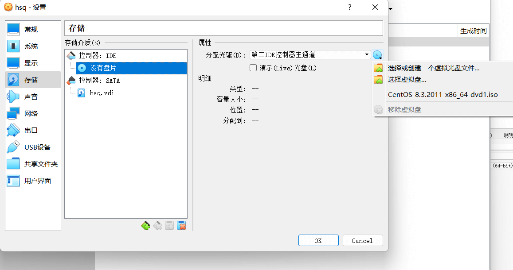
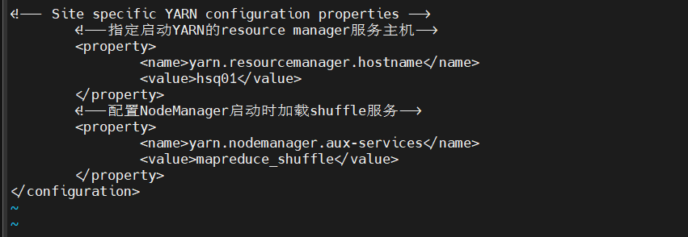

## 环境准备

虚拟机：Oracle VM VirtualBox
操作系统： Centos8
Hadoop版本：3.3.4
JDK版本：1.8
免密登录（SSH协议）：MobaXterm

## 安装虚拟机

### 打开Oracle VM VirtualBox并新建虚拟机


### 内存选择


### 选择现在创建虚拟硬盘


### 设置虚拟硬盘文件类型


### 建议动态分配


### 设置虚拟硬盘大小


**注意：创建完先不要打开，先进行环境配置**


### 设置存储

选择虚拟盘Centos8，用于启动


### 设置虚拟机网卡

这里要设置双网卡，后面才能与主机与外网进行连接


### 启动创建的虚拟机


**注：虚拟机鼠标到桌面是`右Ctrl`**

### 选择语言


### 设置时间


### 设置网络


将网卡打开即可，后面还可更改

### 设置root账户


可创建新用户也可以不创建，但注意区分密码

### 开始安装

到此，虚拟机创建完成

## Linux系统网络配置

### 图形界面与字符界面

图形界面到字符界面：`Ctrl+Alt+F2/F3`
字符界面到图形界面：`Ctrl+Alt+F1`

### root权限登录

登录...

### 主机名

查看主机名

```shell
    hostname
```

修改主机名，这里改成名字缩写加序号，便于管理

```shell
    hostnamectl set-hostname 主机名
```

### 配置IP映射

```shell
    vi /etc/hosts
```


192.168.56.201 hsq01
192.168.56.202 hsq02
192.168.56.203 hsq03


保存并退出，底行命令下`wq`

### 配置网络参数

```shell
    vi /etc/sysconfig/network-scripts/ifcfg-enp0s8
```


TYPE=Ethernet
PROXY_METHOD=none
BROWSER_ONLY=no
BOOTPROTO=static
DEFROUTE=yes
IPV4_FAILURE_FATAL=no
IPV6INIT=yes
IPV6_AUTOCONF=yes
IPV6_DEFROUTE=yes
IPV6_FAILURE_FATAL=no
IPV6_ADDR_GEN_MODE=stable-privacy
NAME=enp0s8
UUID=2e2a06f1-e125-40ca-8bc0-dd6cda97e5c5
DEVICE=enp0s8
ONBOOT=yes
IPADDR=192.168.56.201
PREFIX=24
GATEWAY=192.168.56.2
PEERDNS=no
IPV6_PRIVACY=no
NETMASK=255.255.255.0


重启虚拟机

```shell
    reboot
```

- ONBOOT=yes：表示启动这块网卡
- BOOTPROTO=static：表示静态路由协议，保持IP固定
- IPADDR：虚拟机IP地址，与前面映射一致
- GATEWAY：虚拟机网关，一般是将IP地址最后一位数变成2
- NETMASK：虚拟机掩码，配置为255.255.255.0即可

另一块网卡(ifcfg-enpOs3)保持打开即可

### 配置效果验证

Linux下查看网卡信息

```shell
    ifconfig
```


enpOs8下出现自己配置的静态IP，说明配置成功
再执行

```shell
    ping www.baidu.com
```


有数据传输说明网络正常，`Ctrl+c`退出当前命令。
window系统下打开cmd窗口执行如下命令，地址为设置的虚拟机地址。

```cmd
    ping 192.168.56.201
```


有数据传输说明主机与虚拟机建立联系。
到此虚拟机网络配置完成！

## 虚拟机克隆

### 右击虚拟机 01，点击复制


### 按如上步骤设置主机名与IP地址

重复上述步骤
**注意：与之前设置的 IP 映射一致**

### 复制好 03 虚拟机

进行同样的配置

## SSH 服务配置

### 打开 MobaXterm 远程连接工具

点击导航栏上的"Session",然后单击"SSH"

点击 OK，设置好 MobaXterm 的密码后，输入 root 用户密码后即可实现远程登录。

到此，虚拟机远程密码登录实现！
虚拟机在 Oracle VM VirtualBox 即可在 MobaXterm 实现对单台虚拟机的操作。
**同理：对 02，03 虚拟机实现 SSH 免密登录**

### 删除虚拟机的`~/.ssh`目录

```shell
    [root@hsq01 ~]# rm -rf .ssh
    [root@hsq02 ~]# rm -rf .ssh
    [root@hsq03 ~]# rm -rf .ssh
```

### 在 01 虚拟机上新建 SSH 公私密钥对

```shell
    [root@hsq01 ~]# ssh-keygen -t rsa -P '' -f ~/.ssh/id_rsa
```

### 实现在 01 虚拟机上免密登录 02，03 虚拟机

```shell
    [root@hsq01 ~]# ssh-copy-id root@hsq01
    [root@hsq01 ~]# ssh-copy-id root@hsq02
    [root@hsq01 ~]# ssh-copy-id root@hsq03
```

**提示：出现(yes/no)?,输入yes，Enter 即可。**

### 验证 SSH 免密登录是否配置成功

```shell
    [root@hsq01]# ssh hsq02
```


如此表示登录成功！
输入`exit`，Enter 即可退回 01 虚拟机。

## Hadoop 集群搭建

提示：
**Window 下安装好的安装包直接通过 MobaXterm 拖入即可**

### 安装JDK

#### 将 JDK8 安装包放到如下目录


#### 安装 JDK

```shell
    [root@hsq01 ~]# tar -zxvf (安装包name)jdk-8u341-linux-x64.tar.gz -C /usr/local/
```

#### 配置 JDK 系统环境变量

```shell
    [root@hsq01 ~]# vi /etc/profile
```



#java environment variables
export JAVA_HOME=/usr/local/jdk1.8.0_341
export PATH=$PATH:$JAVA_HOME/bin


#### 使配置文件生效

```shell
    [root@hsq01 ~]# source /etc/profile
```

#### JDK 环境验证

```shell
    java -version
```


到此JDK安装和配置成功。

### 安装 Hadoop

#### 将 Hadoop 安装包 放到如下目录


#### 执行安装

```shell
    [root@hsq01 ~]# tar -zxvf (安装包name)/root/hadoop-3.3.4.gz -C /usr/local/
```

#### 配置 Hadoop 环境变量

```shell
    [root@hsq01 ~]# vi /etc/profile
```


#hadoop environment variables
export JAVA_HOME=/usr/local/jdk1.8.0_341
export HADOOP_HOME=/usr/local/hadoop-3.3.4
export PATH=$PATH:$JAVA_HOME/bin:$HADOOP_HOME/bin:$HADOOP_HOME/sbin



#### 让配置文件生效

```shell
    [root@hsq01 ~]# source /etc/profile
```

#### 验证

```shell
    [root@hsq01 ~]# hadoop version
```


### Hadoop 集群配置

#### 修改 hadoop-env.sh 文件

```shell
    [root@hsq01 ~]# cd $HADOOP_HOME
    [root@hsq01 hadoop-3.3.4]# cd etc/hadoop
    [root@hsq01 hadoop]# vi hadoop-env.sh

```


export JAVA_HOME=/usr/local/jdk1.8.0_341
export HDFS_NAMENODE_USER=root
export HDFS_DATANODE_USER=root
export HDFS_SECONDARYNAMENODE_USER=root
export YARN_RESOURCEMANAGER_USER=root
export YARN_NODEMANAGER_USER=root



#### 配置 core-site.xml 文件

```shell
    [root@hsq01 hadoop]# vi core-site.xml
```


<configuration>
        <!--指定文件系统的名称-->
        <property>
                <name>fs.defaultFS</name>
                <value>hdfs://hsq01:9000</value>
        </property>
        <!--配置Hadoop运行产生的临时数据储存目录-->
        <property>
                <name>hadoop.tmp.dir</name>
                <!-- 可以不放在/tmp/下，如果不想被Linux系统定期清理的话 -->
                <value>/mysoft/data/hadoop-hsq</value>
        </property>
        <!--配置HDFS的缓存大小-->
        <property>
                <name>io.file.buffer.size</name>
                <value>4096</value>
        </property>
</configuration>



#### 配置 hdfs-site.xml

```shell
    [root@hsq01 hadoop]# vi hdfs-site.xml

```


<configuration>
        <!--配置HDFS块的副本数-->
        <property>
                <name>dfs.replication</name>
                <value>3</value>
        </property>
        <!--配置secondarynamenode 所在主机的ip和端口-->
        <property>
                <name>dfs.namenode.secondary.http-address</name>
                <value>hsq02:9868</value>
        </property>
        <property>
                 <name>dfs.permissions</name>
                 <value>false</value>
                 <description>
                         If "true", enable permission checking in HDFS.
                         If "false", permission checking is turned off,
                         but all other behavior is unchanged.
                         Switching from one parameter value to the other does not change the mode,
                         owner or group of files or directories.
                 </description>
        </property>
</configuration>



#### 配置 mapred-site.xml 文件

```shell
    [root@hsq01 hadoop]# vi mapred-site.xml
```


<configuration>
        <!--指定mapreduce的运行框架-->
        <property>
                <name>mapreduce.framework.name</name>
                <value>yarn</value>
        </property>
</configuration>



#### 配置 yarn-site.xml 文件

```shell
    [root@hsq01 hadoop]# vi yarn-site.xml
```


<configuration>
        <!-- Site specific YARN configuration properties -->
        <!--指定启动YARN的resource manager服务主机-->
        <property>
                <name>yarn.resourcemanager.hostname</name>
                <value>hsq01</value>
        </property>
        <!--配置NodeManager启动时加载shuffle服务-->
        <property>
                <name>yarn.nodemanager.aux-services</name>
                <value>mapreduce_shuffle</value>
        </property>
</configuration>



#### 设置从节点，也就是修改 workers 文件

```shell
    [root@hsq01 hadoop]# vi workers
```

文件中的内容替换如下，即三个虚拟机 hostname，每个主机名占一行

**注意：Hadoop2.x版本是执行 `vi slaves`**

#### 将主节点的配置分发到其他节点


`02` `03`虚拟机下需要有对应文件夹


```shell
    [root@hsq01 ~]# scp /etc/profile hsq02:/etc/profile
    [root@hsq01 ~]# scp /etc/profile hsq03:/etc/profile
    [root@hsq01 ~]# scp -r /usr/local/hadoop-3.3.4 hsq02:/usr/local/
    [root@hsq01 ~]# scp -r /usr/local/hadoop-3.3.4 hsq03:/usr/local/
    [root@hsq01 ~]# scp -r /usr/local/jdk1.8.0_341 hsq02:/usr/local/
    [root@hsq01 ~]# scp -r /usr/local/jdk1.8.0_341 hsq03:/usr/local/
```

执行完上述命令后，还需要再 02，03 虚拟机上分别执行 `source /etc/profile` 指令刷新配置文件。到处,整个集群所有节点都有了 Hadoop 运行所需要的环境和文件，Hadoop 集群安装配置完成。

## Hadoop 集群测试

### 格式化文件系统

```shell
    [root@hsq01 ~]# hdfs namenode -format
```

或者

```shell
    [root@hsq01 ~]# hadoop namenode -format
```


**注意：**

- **格式化只需要在 Hadoop 初次启动前执行一次即可；**
- 出现 **has been successfully formatted** 表明文件系统成功格式化；
- 否则，指令错误或者前面配置错误


重新格式化需要删除如下文件夹

- Hadoop目录下的`logs`文件夹
- `hadoop.tmp.dir`配置的文件夹


### 启动和查看 Hadoop 进程

#### 虚拟机01(主节点虚拟机)下启动 Hadoop 进程

```Shell
    [root@hsq01 ~]# start-dfs.sh
    [root@hsq01 ~]# start-yarn.sh
```


#### 查看 Hadoop 进程

① 在 01 虚拟机中查看。

② 在 02 虚拟机中查看

③ 在 03 虚拟机中查看

此时，看到规划的 Hadoop 均已启动，则 Hadoop 全分布式搭建成功

### 查看Web界面

#### 先配置 window 下的 hosts 文件


用VS Code 打开，用管理员身份保存修改即可

#### 关闭虚拟机防火墙

```shell
    systemctl stop firewalld.service
    systemctl disable firewalld.service
```


三台虚拟机都执行


一定要关闭防火墙，不然无法访问


#### window 下浏览器访问 <http://hsq01:9870> 和 <http://hsq01:8088>


到此，Hadoop 集群的 HDFS UI 界面和 YARN UI 界面通过 Web 界面均可访问，并且显示正常，便于通过 Web 界面对集群状态进行管理和查看。

## 简单使用 Hadoop 集群

### 新建 test.txt 文本

在集群主节点 01 上的/root/目录下，使用`vi test.txt`新建一个 test.txt 文本文件，并编写内容

```txt
    这是我的测试文件
```

### 上传 test.txt 到 HDFS 的 / 目录下

```Hadoop
    [root@hsq01 ~]# hdfs dfs -put test.txt /
```

### 查看上传的文件

```Hadoop
    [root@hsq01 ~]# hdfs dfs -cat /test.txt
```


### 通过 Web 界面下载文件，用记事本查看

刚刚的 Web 界面刷新

点击文件下载


打开

内容一致，表明 Hadoop 搭建成功！！！

**说明：之前使用 JDK 19 也成功搭建 Hadoop 集群，但 Web 界面无法下载上传的文件，没有解决，查阅资料说是使用的 JDK 版本过新(只是 Web 界面那有问题，没有找到合适方法解决)，所以建设使用稳定的 JDK 版本，新版本的 Hadoop 暂时没有遇到问题。**
