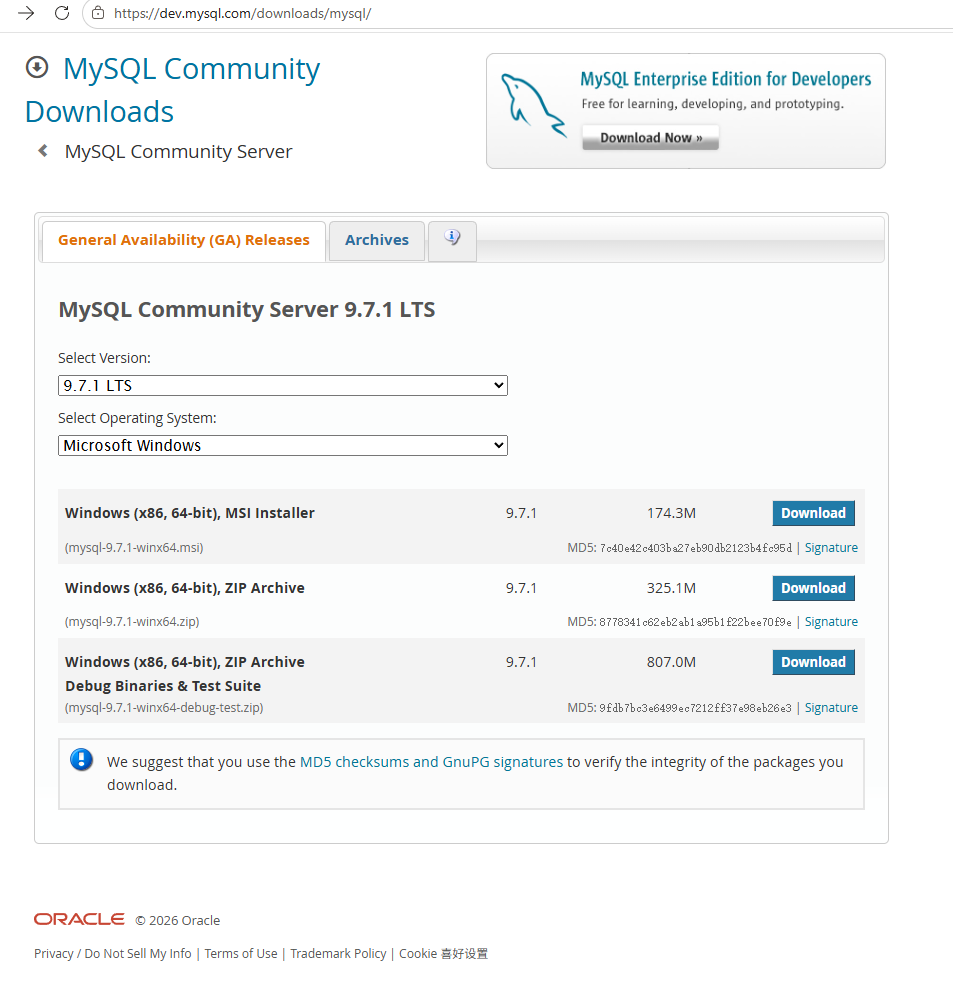

## 下载MySQL

进入[MySQL开发者下载页](https://dev.mysql.com/downloads/mysql/)，选择Windows平台，就能看到：

- MSI Installer（一键安装包）
- ZIP Archive（绿色压缩免安装包）



### 以`ZIP Archive`为例

在 安装路径下(`D:\dev\mysql-9.7.1-winx64`) 文件夹新建文本文档，改名 `my.ini`，粘贴下面内容：

```ini
[mysql]
default-character-set=utf8mb4

[mysqld]
port=3306
basedir=D:/dev/mysql-9.7.1-winx64
datadir=D:/dev/mysql-9.7.1-winx64/data
max_allowed_packet=64M
character-set-server=utf8mb4
```

### 以管理员身份进入 CMD 执行命令

1. 进入`bin`目录

    ```cmd
    cd /d D:\dev\mysql-9.7.1-winx64\bin
    ```

2. 初始化（会自动生成 data 文件夹）

    ```cmd
    mysqld --initialize --console
    ```

    窗口里会输出临时 root 密码，务必保存好。
3. 注册系统服务，开机启动(`MySQL97`只是自定义服务名称，MySQL97 = MySQL + 版本 9.7.1 简写 97，方便区分版本)

    ```cmd
    mysqld --install MySQL97
    ```

4. 启动服务

    ```cmd
    net start MySQL97
    ```

5. 关闭服务

    ```cmd
    net stop MySQL97
    ```

### 登录修改密码

```cmd
mysql -uroot -p
```

执行改密语句

```cmd
ALTER USER 'root'@'localhost' IDENTIFIED BY '123456';
```

## 使用 Navicat 连接数据库

### 使用脚本激活

1. 卸载目前的 Navicat
2. 双击无限试用 Navicat.bat 脚本
3. 安装 navicat.exe
4. 安装完后不要打开，已打开自行退出
5. 将 winmm.dll 拖进 navicat.exe 安装的目录
6. 完成
