## TypeScript 介绍

### TypeScript 是什么

TypeScript（简称：TS）是JavaScript 的**超集**（JS 有的TS 都有）。
TypeScript = **Type** + JavaScript（在JS 基础之上，为JS 添加了**类型支持**）。
TypeScript 是微软开发的开源编程语言，可以在任何运行JavaScript 的地方运行。

### TypeScript 为什么要为JS 添加类型支持？

背景：JS 的类型系统存在“先天缺陷”，JS 代码中绝大部分错误都是**类型**错误（Uncaught TypeError）。
问题：增加了找Bug、改Bug 的时间，严重影响开发效率。

从编程语言的动静来区分，TypeScript 属于静态类型的编程语言，JS 属于动态类型的编程语言。
静态类型：编译期做类型检查； 动态类型：执行期做类型检查。
代码编译和代码执行的顺序：1 编译2 执行。

对于JS 来说：需要等到代码真正去执行的时候才能发现错误（晚）。
对于TS 来说：在代码编译的时候（代码执行前）就可以发现错误（早）。
并且，配合VSCode 等开发工具，TS 可以**提前到在编写代码的同时**就发现代码中的错误，**减少找Bug、改Bug 时间**。

### TypeScript 相比JS 的优势

1. 更早（写代码的同时）发现错误，减少找Bug、改Bug 时间，提升开发效率。
2. 程序中任何位置的代码都有代码提示，随时随地的安全感，增强了开发体验。
3. 强大的类型系统提升了代码的可维护性，使得重构代码更加容易。
4. 支持最新的ECMAScript 语法，优先体验最新的语法，让你走在前端技术的最前沿。
5. TS 类型推断机制，不需要在代码中的每个地方都显示标注类型，让你在享受优势的同时，尽量降低了成本。

除此之外，Vue 3 源码使用TS 重写、Angular 默认支持TS、React 与TS 完美配合，TypeScript 已成为大中型前端
项目的首先编程语言。

## TypeScript 初体验

### 安装编译TS 的工具包

**Node.js/浏览器，只认识JS 代码，不认识TS 代码。需要先将TS 代码转化为JS 代码，然后才能运行。**

```shell
npm i -g typescript
```

**typescript 包**：用来编译TS 代码的包，提供了tsc 命令，实现了TS -> JS 的转化。
验证是否安装成功：

```shell
tsc -v
```

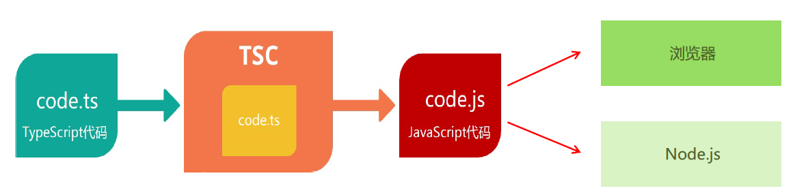

### 编译并运行TS 代码

1. 创建hello.ts 文件（注意：TS 文件的后缀名为`.ts`）。
2. 将TS 编译为JS：在终端中输入命令tsc hello.ts（此时，在同级目录中会出现一个同名的JS 文件）。
3. 执行JS 代码：在终端中输入命令。node hello.js


graph LR
id1[创建 ts 文件] --> id2[编译 Ts] --> id3[执行 js]


说明：所有合法的JS 代码都是TS 代码，有JS 基础只需要学习TS 的类型即可。
注意：由TS 编译生成的**JS 文件**，代码中就没有**类型信息**了。

### 简化运行TS 的步骤

问题描述：每次修改代码后，都要重复执行两个命令，才能运行TS 代码，太繁琐。
简化方式：使用**ts-node 包**，直接在Node.js 中执行TS 代码。
安装命令：（ts-node 包提供了ts-node 命令）

```shell
npm i -g ts-node
```

使用方式：

```shell
ts-node .ts文件
```

解释：ts-node 命令在内部偷偷的将TS -> JS，然后，再运行JS 代码。

## TypeScript 常用类型

TypeScript 是JS 的超集，TS 提供了JS 的所有功能，并且额外的增加了：**类型系统**。

- 所有的JS 代码都是TS 代码。
- JS 有类型（比如，number/string 等），但是**JS 不会检查变量的类型是否发生变化**，而 **TS 会检查**。
- TypeScript 类型系统的主要优势：可以**显示标记出代码中的意外行为**，从而降低了发生错误的可能性。

### 类型注解

```ts
let age :number = 18
```

说明：代码中的`: number` 就是类型注解。
作用：为变量**添加类型约束**。比如，上述代码中，约定变量age 的类型为number（数值类型）。
解释：**约定了什么类型，就只能给变量赋值该类型的值**，否则，就会报错。

### 常用基础类型概述

1. JS 已有类型
    - 原始类型：number/string/boolean/null/undefined/symbol。
    - 对象类型：object（包括，数组、对象、函数等对象）。
2. TS 新增类型
    -联合类型、自定义类型（类型别名）、接口、元组、字面量类型、枚举、void、any 等。

### 原始类型

`number`/`string`/`boolean`/`null`/`undefined`/`symbol`

特点：简单。这些类型，完全按照JS 中类型的名称来书写。

```ts
let age: number =18 
let name: string = 'name'
let  judge: boolean = false
```

### 数组类型

object（包括，数组、对象、函数等对象）。
特点：对象类型，在TS 中更加细化，**每个具体的对象都有自己的类型语法**。

数组类型的两种写法：（推荐使用 `number[]` 写法）

```ts
let number: number[] = [1,3,5]
let strings: Array<string> = ['a','b','c']
```

需求：数组中既有number 类型，又有string 类型，这个数组的类型应该如何写？

```ts
let arr: (number | string)[]=[1,'a',3,'b']
```

解释：`|` （竖线）在TS 中叫做**联合类型**（由两个或多个其他类型组成的类型，表示可以是这些类型中的任意一种）。
注意：这是TS 中联合类型的语法，只有一根竖线，不要与JS 中的或（||）混淆了。

### 类型别名

类型别名（自定义类型）：为任意类型起别名。
使用场景：当同一类型（复杂）被多次使用时，可以通过类型别名，简化该类型的使用。

```ts
type CustomArray = (number | string)[]
let arr: CustomArray = [1, 3, 5, 'a', 'b']
let arr1: CustomArray = [1, 'x', 2, 'y']
```

解释：

1. 使用`type` 关键字来创建类型别名。
2. 类型别名（比如，此处的CustomArray），可以是任意合法的变量名称。
3. 创建类型别名后，直接**使用该类型别名作为变量的类型注解**即可。

### 函数类型

函数的类型实际上指的是：函数**参数**和**返回值**的类型。
为函数指定类型的两种方式：

1. 单独指定参数、返回值的类型：

function add(num1: number, num2: number): number {
  return num1 + num2
}

const add = (num1: number, num2: number): number => {
    return num1 + num2
}

2. 同时指定参数、返回值的类型：

const add: (num1: number, num2: number) => number = (num1, num2) => {
  return num1 + num2
}

解释：当函数作为表达式时，可以通过**类似箭头函数形式的语法**`(num1: number, num2: number) => number`来为函数添加类型。
注意：这种形式只适用于函数表达式。

如果函数没有返回值，那么，函数返回值类型为：`void`。

```ts
function greet(name: string): void {
  console.log('Hello', name)
}
```

使用函数实现某个功能时，参数可以传也可以不传。这种情况下，在给函数参数指定类型时，就用到**可选参数**了。

```ts
function mySlice(start: number, end?: number): void {
  console.log('起始索引：', start, '结束索引：', end)
}

mySlice(10)
mySlice(1)
mySlice(1, 3)
```


起始索引： 10 结束索引： undefined
起始索引： 1 结束索引： undefined
起始索引： 1 结束索引： 3

可选参数：在可传可不传的参数名称后面添加`?`（问号）。
注意：**可选参数只能出现在参数列表的最后**，也就是说可选参数后面不能再出现必选参数。

### 对象类型

JS 中的对象是由属性和方法构成的，而TS 中对象的类型就是在**描述对象的结构**（有什么类型的属性和方法）。

```ts
let person: { name: string; age: number; sayHi(): void; greet(name: string): void } = {
  name: 'name',
  age: 18,
  sayHi() {},
  greet(name) {}
}
```

1. 直接使用{} 来描述对象结构。属性采用`属性名: 类型`的形式；方法采用`方法名(): 返回值类型`的形式。
2. 如果方法有参数，就在方法名后面的小括号中指定参数类型（比如：`greet(name: string): void`）。
3. 在一行代码中指定对象的多个属性类型时，使用;（分号）来分隔。
   - 如果一行代码只指定一个属性类型（通过换行来分隔多个属性类型），可以去掉;（分号）。
   - 方法的类型也可以使用箭头函数形式（比如：{ `sayHi: () => void` }）。

对象的属性或方法，也可以是可选的，此时就用到**可选属性**了。
比如，我们在使用 myaxios({ … }) 时，如果发送GET 请求，method 属性就可以省略。

```ts
function myAxios(config: { url: string; method?: string }) {}
myAxios({
  url: ''
})
```

**可选属性**的语法与函数可选参数的语法一致，都使用`?`（问号）来表示。

### 接口

当一个对象类型被多次使用时，一般会使用**接口（interface）**来描述对象的类型，达到**复用**的目的。

```ts
interface IPerson {
  name: string
  age: number
  sayHi(): void
}

let person: IPerson = {
  name: 'name',
  age: 18,
  sayHi() {}
}
```

1. 使用`interface` 关键字来声明接口。
2. 接口名称（比如，此处的IPerson），可以是任意合法的变量名称。
3. 声明接口后，直接**使用接口名称作为变量的类型**。
4. 因为每一行只有一个属性类型，因此，属性类型后没有;（分号）。

`interface`（接口）和 `type`（类型别名）的对比：

- 相同点：都可以给对象指定类型。
interface IPerson {
  name: string
  age: number
  sayHi(): void
}

type IPerson = {
  name: string
  age: number
  sayHi(): void
}

- 不同点：
  - 接口，只能为对象指定类型。
  - 类型别名，不仅可以为对象指定类型，实际上可以为任意类型指定别名。
  type NumStr =num | string

如果两个接口之间有相同的属性或方法，可以将公共的属性或方法抽离出来，通过继承来实现复用。
比如，这两个接口都有x、y 两个属性，重复写两次，可以，但很繁琐。

```ts
interface Point2D { x: number; y: number }
interface Point3D { x: number; y: number; z: number }
```

更好的方式：

```ts
interface Point2D { x: number; y: number }
interface Point3D extends Point2D { z: number }
```

1. 使用 `extends`（继承）关键字实现了接口Point3D 继承Point2D。
2. 继承后，Point3D 就有了Point2D 的所有属性和方法（此时，Point3D 同时有x、y、z 三个属性）。

### 元组

场景：在地图中，使用经纬度坐标来标记位置信息。
可以使用数组来记录坐标，那么，该数组中只有两个元素，并且这两个元素都是数值类型。

```ts
let position: number[] = [27.123,3.14159]
```

使用 `number[]` 的缺点：不严谨，因为该类型的数组中可以出现任意多个数字。

更好的方式：**元组（Tuple）**。
元组类型是另一种类型的数组，它**确切地知道包含多少个元素，以及特定索引对应的类型**。

```ts
let position: [number,number] = [27.123,3.14159]
```

1. 元组类型可以确切地标记出有多少个元素，以及每个元素的类型。
2. 该示例中，元素有两个元素，每个元素的类型都是number。

### 类型推论

在TS 中，某些没有明确指出类型的地方，TS 的类型推论机制会帮助提供类型。
换句话说：由于类型推论的存在，这些地方，类型注解可以省略不写！

发生类型推论的2 种常见场景：

1. 声明变量并初始化时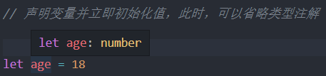
2. 决定函数返回值时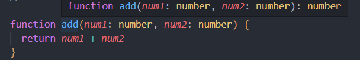

注意：这两种情况下，类型注解可以省略不写！
推荐：**能省略类型注解的地方就省略**（~~偷懒~~，充分利用TS类型推论的能力，提升开发效率）。
技巧：如果不知道类型，可以通过鼠标放在变量名称上，利用VSCode 的提示来查看类型。

### 类型断言

有时候你会**比TS 更加明确一个值的类型**，此时，可以使用`类型断言`来指定更具体的类型。

```html
<a href="http://www.baidu.com/" id="link">百度</a>
```

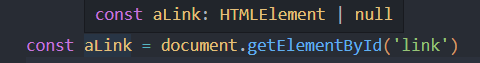
注意：getElementById 方法返回值的类型是HTMLElement，该类型只包含所有标签公共的属性或方法，不包含a
标签特有的href 等属性。
因此，**这个类型太宽泛（不具体）**，无法操作href 等 a 标签特有的属性或方法。
解决方式：这种情况下就需要**使用类型断言指定更加具体的类型**。


1. 使用 `as` 关键字实现类型断言。
2. 关键字 as 后面的类型是一个更加具体的类型（HTMLAnchorElement 是HTMLElement 的子类型）。
3. 通过类型断言，aLink 的类型变得更加具体，这样就可以访问a 标签特有的属性或方法了。

另一种语法，使用 `<>` 语法，这种语法形式不常用知道即可。

```ts
const aLink = <HTMLAnchorElement>document.getElementById('link')
```

技巧：在浏览器控制台，通过 `console.dir()` 打印 DOM 元素，在属性列表的最后面，即可看到该元素的类型。

### 字面量类型

思考以下代码，两个变量的类型分别是什么？

```ts
let str1 = 'Hello TS'
const str2: 'Hello TS' = 'Hello TS'
```

通过TS 类型推论机制，可以得到答案：

1. str1 是一个变量（let），它的值可以是任意字符串，所以类型为：`string`。
2. str2 是一个常量（const），它的值不能变化只能是'Hello TS'，所以，它的类型为：`"Hello TS"`。

注意：此处的"Hello TS"，就是一个**字面量类型**。也就是说某个特定的字符串也可以作为TS 中的类型。
除字符串外，任意的JS 字面量（比如，对象、数字等）都可以作为类型使用。

使用模式：**字面量类型配合联合类型一起使用**。
使用场景：用来表示**一组明确的可选值列表**。
比如，在贪吃蛇游戏中，游戏的方向的可选值只能是上、下、左、右中的任意一个。

```ts
function changeDirection(direction: 'up' | 'down' | 'left' | 'right') {}
```

解释：参数direction 的值只能是up/down/left/right 中的任意一个。
优势：相比于string 类型，使用字面量类型更加精确、严谨。

### 枚举

枚举的功能类似于字面量类型+联合类型组合的功能，也可以**表示一组明确的可选值**。
枚举：定义一组命名常量。它描述一个值，该值可以是这些命名常量中的一个。

```ts
enum Direction { Up,Down,Left,Right }

function changeDirection(direction: Direction) {}
changeDirection(Direction.Left)
```

1. 使用 `enum` 关键字定义枚举。
2. 约定枚举名称、枚举中的值以大写字母开头。
3. 枚举中的多个值之间通过,（逗号）分隔。
4. 定义好枚举后，直接使用**枚举名称**作为类型注解。

注意：形参direction 的类型为枚举Direction，那么，实参的值就应该是枚举Direction 成员的任意一个。通过点（`.`）**语法**访问枚举的成员。

问题：我们把枚举成员作为了函数的实参，它的值是什么呢？
解释：通过将鼠标移入Direction.Up，可以看到枚举成员Up 的值为0。
注意：**枚举成员是有值的**，默认为：**从0 开始自增的数值**。
我们把，枚举成员的值为数字的枚举，称为：**数字枚举**。

也可以给枚举中的成员初始化值。

```ts
//Down -> 11,Left->12,Right->13
enum Direction { Up = 10, Down, Left, Right }
```

```ts
enum Direction { Up = 10, Down = 4, Left = 8, Right = 16 }
```

**字符串枚举**：枚举成员的值是字符串。

```ts
enum Direction {
  Up = 'UP',
  Down = 'DOWN',
  Left = 'LEFT',
  Right = 'RIGHT'
}
```

注意：字符串枚举没有自增长行为，因此，字符串枚举的每个成员必须有初始值。

枚举是TS 为数不多的非JavaScript 类型级扩展（不仅仅是类型）的特性之一。
因为：其他类型仅仅被当做类型，而**枚举不仅用作类型，还提供值**（枚举成员都是有值的）。
也就是说，其他的类型会在编译为JS 代码时自动移除。但是，**枚举类型会被编译为JS 代码**！
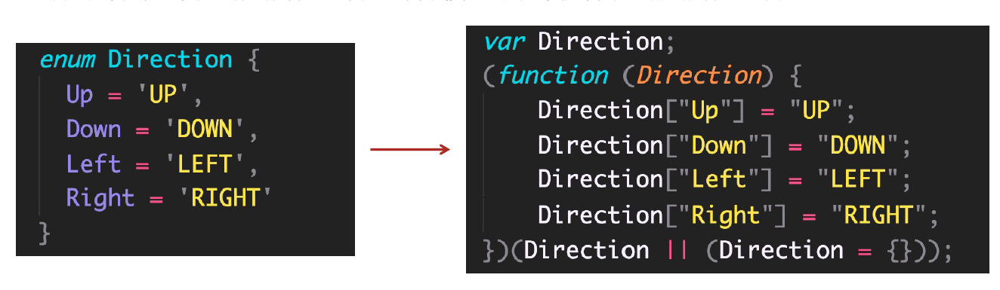
说明：枚举与前面讲到的字面量类型+联合类型组合的功能类似，都用来表示一组明确的可选值列表。
一般情况下，**推荐使用字面量类型+联合类型组合的方式**，因为相比枚举，这种方式更加直观、简洁、高效。

### any 类型

原则：**不推荐使用any**！这会让TypeScript 变为“AnyScript”（失去TS 类型保护的优势）。
因为当值的类型为any 时，可以对该值进行任意操作，并且不会有代码提示。

```ts
let obj: any = { x:0 }

obj.bar = 100
obj()
const n: number = obj
```

以上操作都不会有任何类型错误提示，即使可能存在错误！
尽可能的避免使用any 类型，除非临时使用any 来“避免”书写很长、很复杂的类型！
其他隐式具有any 类型的情况：

1. 声明变量不提供类型也不提供默认值
2. 函数参数不加类型。

注意：因为不推荐使用any，所以，这两种情况下都应该提供类型！

### typeof

众所周知，JS 中提供了typeof 操作符，用来在JS 中获取数据的类型。

```js
console.log(typeof "Hello world") //打印 string
```

实际上，**TS 也提供了typeof 操作符**：可以在类型上下文中引用变量或属性的类型（类型查询）。
使用场景：根据已有变量的值，获取该值的类型，来简化类型书写。

```ts
let p = { x: 1, y: 2 }
function formatPoint(point: { x: number; y: number }) {}

//简化书写
function formatPoint(point: typeof p) {}
```

1. 使用typeof 操作符来获取变量p 的类型，结果与第一种（对象字面量形式的类型）相同。
2. typeof 出现在**类型注解的位置**（参数名称的冒号后面）所处的环境就在类型上下文（区别于JS 代码）。
3. 注意：typeof 只能用来查询变量或属性的类型，无法查询其他形式的类型（比如，函数调用的类型）。
let ret: typeof add(1, 2)//错误写法

## TypeScript 高级类型

### class 类

TypeScript 全面支持ES2015 中引入的 `class` 关键字，并为其添加了类型注解和其他语法（比如，可见性修饰符等）。

```ts
class Person {}
const p = new Person()
```

1. 根据TS 中的类型推论，可以知道Person 类的实例对象p 的类型是 `Person`。
2. TS 中的class，**不仅提供了class 的语法功能，也作为一种类型存在**。

```ts
class Person {
  age: number
  gender = '男'
  // gender: string = '男'
}
```

1. 声明成员age，类型为number（没有初始值）。
2. 声明成员gender，并设置初始值，此时，可省略类型注解（TS 类型推论为string 类型）。

#### 构造函数

```ts
class Person {
  age: number
  gender: string

  constructor(age: number, gender: string) {
    this.age = age
    this.gender = gender
  }
}
```

1. 成员初始化（比如，age: number）后，才可以通过this.age 来访问实例成员。
2. 需要为构造函数指定类型注解，否则会被隐式推断为any；构造函数不需要返回值类型。

#### 方法

```ts
class Point {
  x = 1
  y = 2

  scale(n: number) {
    this.x *= n
    this.y *= n
  }
}
```

方法的类型注解（参数和返回值）与函数用法相同。

#### 类继承

类继承的两种方式：1 `extends`（继承父类） 2 `implements`（实现接口）。
说明：JS 中只有extends，而implements 是TS 提供的。

```ts
class Animal {
  move() {
    console.log('Moving along')
  }
}

class Dog extends Animal {
  bark() {
    console.log('汪！')
  }
}
```

1. 通过 `extends` 关键字实现继承。
2. 子类Dog 继承父类Animal，则Dog 的实例对象dog 就同时具有了父类Animal 和子类Dog 的所有属性和方法。

#### 类成员可见性

类成员可见性：可以使用TS 来**控制class 的方法或属性对于class 外的代码是否可见**。
可见性修饰符包括：1 public（公有的） 2 protected（受保护的） 3 private（私有的）。

1. `public`：表示**公有的、公开的**，**公有成员可以被任何地方访问**，默认可见性，所以，**可以直接省略**。

class Animal {
  public move() {
    console.log('Moving along!')
  }
}


2. `protected`：表示**受保护的**，**仅对其声明所在类和子类中（非实例对象）可见**。

class Animal {
  // 这个方法是受保护的
  protected move() {
    console.log('Moving along!')
  }
}
class Dog extends Animal {
  bark() {
    this.move()
    console.log('旺旺！')
  }
}  


3. `private`：表示**私有的，只在当前类中可见**，对**实例对象以及子类也是不可见的**。

class Animal{
  private move(){
    console.log('Moving along!')
  }
  walk(){
    this.move()
  }
}


#### readonly

除了可见性修饰符之外，还有一个常见修饰符就是： `readonly`（只读修饰符）。
readonly：表示**只读，用来防止在构造函数之外对属性进行赋值**。

```ts
class Person {
  // 只读属性
  // 注意：只要是 readonly 来修饰的属性，必须手动提供明确的类型
  readonly age: number = 18
  constructor(age: number) {
    this.age = age
  }
}
```

1. 使用 `readonly` 关键字修饰该属性是只读的，注意**只能修饰属性不能修饰方法**。
2. 注意：属性age 后面的类型注解（比如，此处的number）如果不加，则age 的类型为18 （字面量类型）。
3. **接口或者{} 表示的对象类型，也可以使用readonly**。

### 类型兼容性

两种类型系统：1 Structural Type System（结构化类型系统） 2 Nominal Type System（标明类型系统）。
**TS 采用的是结构化类型系统**，也叫做duck typing（鸭子类型），**类型检查关注的是值所具有的形状**。
也就是说，在结构类型系统中，如果两个对象具有相同的形状，则认为它们属于同一类型。

```ts
class Point { x: number; y: number}
class Point2D {x: number; y: number}
const p: Point = new Point2D()
```

1. Point 和Point2D 是两个名称不同的类。
2. 变量p 的类型被显示标注为Point 类型，但是，它的值却是Point2D 的实例，并且没有类型错误。
3. 因为TS 是结构化类型系统，只检查Point 和Point2D 的结构是否相同（相同，都具有x 和y 两个属性，属性类型也相同）。
4. 但是，如果在Nominal Type System 中（比如，C#、Java 等），它们是不同的类，类型无法兼容。

注意：在结构化类型系统中，如果两个对象具有相同的形状，则认为它们属于同一类型，这种说法并不准确。
更准确的说法：对于对象类型来说，y 的成员至少与x 相同，则x 兼容y（**成员多的可以赋值给少的**）。

```ts
class Point { x: number; y: number; }
class Point3D { x: number; y: number; z: number; }
const p: Point = new Point3D()
```

1. Point3D 的成员至少与Point 相同，则Point 兼容Point3D。
2. 所以，成员多的Point3D 可以赋值给成员少的Point。

#### 接口兼容性

除了class 之外，TS 中的其他类型也存在相互兼容的情况，包括：1 接口兼容性2 函数兼容性等。
接口之间的兼容性，类似于class。并且，class 和interface 之间也可以兼容。

```ts
interface Point { x: number; y: number }
interface Point2D { x: number; y: number }
let p1: Point
let p2: Point2D = p1

interface Point3D { x: number; ;y: number; z: number }
let p3: Point3D
p2 = p3

class Point4D { x: number; y: number; z: number}
p2: Point2D = new Point4D()
```

#### 函数兼容性

函数之间兼容性比较复杂，需要考虑：1 参数个数2 参数类型3 返回值类型。

1. **参数个数**，参数多的兼容参数少的（或者说，**参数少的可以赋值给多的**）。

type F1 = (a: number) => void
type F2 = (a: number, b: number) => void
let f1: F1
let f2: F2 =f1


let arr = ['a', 'b', 'c']
arr.forEach(() => {})
arr.forEach(item => {})
arr.forEach((item, index) => {})
arr.forEach((item, index, array) => {})

    1. 参数少的可以赋值给参数多的，所以，f1 可以赋值给f2。
    2. 数组forEach 方法的第一个参数是回调函数，该示例中类型为：(value: string, index: number, array: string[]) => void。
    3. **在JS 中省略用不到的函数参数实际上是很常见的，这样的使用方式，促成了TS 中函数类型之间的兼容性**。
    4. 并且因为回调函数是有类型的，所以，TS 会自动推导出参数item、index、array 的类型。

2. **参数类型**，相同位置的参数类型要相同（原始类型）或兼容（对象类型）。

type F1 = (a: number) => void
type F2 = (a: number) => void
let f1: F1
let f2: F2 = f1

函数类型F2 兼容函数类型F1，因为F1 和F2 的第一个参数类型相同。

class Point { x: number; y: number; }
class Point3D { x: number; y: number; z: number; }
type F2 = (p: Point2D) => void // 相当于有 2 个参数
type F3 = (p: Point3D) => void // 相当于有 3 个参数
let f2: F2
let f3: F3 = f2

**将对象拆开，把每个属性看做一个个参数**，则，参数少的（f2）可以赋值给参数多的（f3）。

3. **返回值类型**，只关注返回值类型本身即可：

type F5 = () => string
type F6 = () => string
let f5: F5
let f6: F6 = f5

type F7 = () => { name: string }
type F8 = () => { name: string; age: number }
let f7: F7
let f8: F8
f7 = f8

    1. 如果返回值类型是原始类型，此时两个类型要相同，比如，左侧类型F5 和F6。
    2. 如果**返回值类型是对象类型**，此时**成员多的可以赋值给成员少的**，比如，右侧类型F7 和F8。

### 交叉类型

交叉类型（`&`）：功能类似于接口继承（extends），**用于组合多个类型为一个类型**（常用于对象类型）。

```ts
interface Person { name: string }
interface Contact { phone: string }
type PersonDetail = Person & Contact

let obj: PersonDetail = {
  name: 'jack',
  phone: '133....',
}
```

使用交叉类型后，新的类型PersonDetail 就**同时具备**了Person 和Contact 的所有属性类型。

```ts
type PersonDetail = { name: string; phone: string }
```

交叉类型（&）和接口继承（extends）的对比：

- 相同点：都可以实现对象类型的组合。
- 不同点：两种方式实现类型组合时，对于同名属性之间，**处理类型冲突的方式不同**。

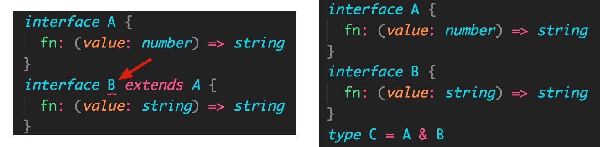
以上代码，接口继承会报错（类型不兼容）；交叉类型没有错误，可以简单的理解为:

```ts
fn: (value: string | number) => string
```

### 泛型

#### 泛型函数

泛型是可以在保证类型安全前提下，让函数等与多种类型一起工作，从而实现复用，常用于：函数、接口、class 中。

需求：创建一个id 函数，传入什么数据就返回该数据本身（也就是说，参数和返回值类型相同）。

```ts
function id(value: number):number {return value }
```

比如，id(10) 调用以上函数就会直接返回10 本身。但是，该函数只接收数值类型，无法用于其他类型。
为了能让函数能够接受任意类型，可以将参数类型修改为any。但是，这样就失去了TS 的类型保护，类型不安全。

```ts
function id(value: any):any {return value }
```

**泛型**在**保证类型安全**（不丢失类型信息）的同时，可以**让函数等与多种不同的类型一起工作**，灵活可**复用**。
实际上，在C＃和Java 等编程语言中，泛型都是用来实现可复用组件功能的主要工具之一。

创建泛型函数：

```ts
function id<Type>(value: Type):Type { return  value }
```

1. 语法：在函数名称的后面添加 `<>`（尖括号），尖括号中添加类型变量，比如此处的Type。
2. **类型变量**Type，是一**种特殊类型的变量，它处理类型**而不是值。
3. 该类型变量相当于一个类型容器，能够捕获用户提供的类型（具体是什么类型由用户调用该函数时指定）。
4. 因为Type 是类型，因此可以将其作为函数参数和返回值的类型，表示参数和返回值具有相同的类型。
5. 类型变量Type，可以是任意合法的变量名称。

调用泛型函数：

```ts
const num = id<number>(1)
const str = id<string>('a')
```

1. 语法：在函数名称的后面添加`<>`（尖括号），**尖括号中指定具体的类型**，比如，此处的number。
2. 当传入类型number 后，这个类型就会被函数声明时指定的类型变量Type 捕获到。
3. 此时，Type 的类型就是number，所以，函数id 参数和返回值的类型也都是number。

这样，通过泛型就做到了让id 函数与多种不同的类型一起工作，实现了复用的同时保证了类型安全。

简化调用泛型函数：

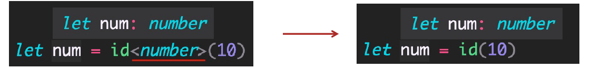

1. 在调用泛型函数时，可以省略<类型> 来简化泛型函数的调用。
2. 此时，TS 内部会采用一种叫做类型参数推断的机制，来根据传入的实参自动推断出类型变量Type 的类型。
3. 比如，传入实参10，TS 会自动推断出变量num 的类型number，并作为Type 的类型。

推荐：使用这种简化的方式调用泛型函数，使代码更短，更易于阅读。
说明：当编译器无法推断类型或者推断的类型不准确时，就需要显式地传入类型参数。

#### 泛型约束

**泛型约束**：默认情况下，泛型函数的类型变量Type 可以代表多个类型，这导致无法访问任何属性。
比如，id('a') 调用函数时获取参数的长度：

```ts
function id<Type>(value: Type):Type {
  console.log(value.length)
  return  value
}
```

Type 可以代表任意类型，无法保证一定存在length 属性，比如number 类型就没有length。
此时，就需要为泛型添加约束来**收缩类型**（缩窄类型取值范围）。

添加泛型约束收缩类型，主要有以下两种方式：1 指定更加具体的类型2 添加约束。

1. 指定更加具体的类型

function id<Type>(value: Type[]): Type[] {
  value.length
  return value
}

比如，将类型修改为Type[]（Type 类型的数组），因为只要是数组就一定存在length 属性，因此就可以访问了。

2. 添加约束

interface ILength { length: number }
function id<Type extends ILength>(value: Type): Type {
  value.length
  return value
}

    1. 创建描述约束的接口ILength，该接口要求提供length 属性。
    2. 通过 extends 关键字使用该接口，为泛型（类型变量）添加约束。
    3. 该约束表示：传入的类型必须具有length 属性。
注意：传入的实参（比如，数组）只要有length 属性即可，这也符合前面讲到的接口的类型兼容性。

泛型的类型变量可以有多个，并且类型变量之间还可以约束（比如，第二个类型变量受第一个类型变量约束）。
比如，创建一个函数来获取对象中属性的值：

```ts
function getProp<Type, Key extends keyof Type>(obj: Type, key: Key) {
  return obj[key]
}
let person = {name: 'name',age: 18}
getProp(person,'name')
```

1. 添加了第二个类型变量Key，两个类型变量之间使用（`,`）逗号分隔。
2. `keyof` 关键字**接收一个对象类型，生成其键名称（可能是字符串或数字）的联合类型**。
3. 本示例中keyof Type 实际上获取的是 person 对象所有键的联合类型，也就是：'name' | 'age'。
4. 类型变量Key 受Type 约束，可以理解为：Key 只能是Type 所有键中的任意一个，或者说只能访问对象中存在的属性。

#### 泛型接口

**泛型接口**：接口也可以配合泛型来使用，以增加其灵活性，增强其复用性。

```ts
interface IdFunc<Type> {
  id: (value: Type) => Type
  ids: () => Type[]
}

let obj: IdFunc<number> = {
  id(value) {
    return value
  },
  ids() {
    return [1, 3, 5]
  }
}
```

1. 在接口名称的后面添加`<类型变量>`，那么，这个接口就变成了泛型接口。
2. 接口的类型变量，对接口中所有其他成员可见，也就是接口中所有成员都可以使用类型变量。
3. 使用泛型接口时，需要**显式指定具体的类型**（比如，此处的IdFunc\<number>）。
4. 此时，id 方法的参数和返回值类型都是number；ids 方法的返回值类型是number[]。

实际上，JS 中的数组在TS 中就是一个**泛型接口**。
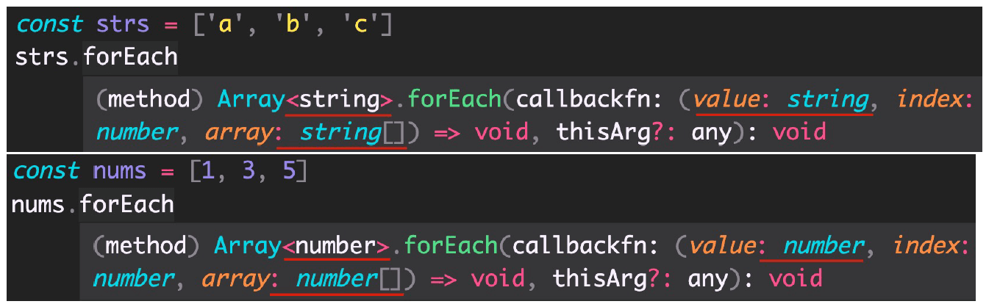
解释：当我们在使用数组时，TS 会根据数组的不同类型，来自动将类型变量设置为相应的类型。
技巧：可以通过Ctrl + 鼠标左键（Mac：option + 鼠标左键）来查看具体的类型信息。

#### 泛型类

**泛型类**：class 也可以配合泛型来使用。
比如，React 的class 组件的基类Component 就是泛型类，不同的组件有不同的props 和state。

```ts
interface IState { count: number }
interface IProps { maxLength: number }
class InputCount extends React.Component<IProps,IState>{
  state: IState = {
    count: 0
  }
  render() {
    return <div>{this.props.maxLength}</div>
  }
}
```

React.Component 泛型类两个类型变量，分别指定props 和state 类型。

创建泛类型：

```ts
class GenericNumber<NumType> {
  defaultValue: NumType
  add: (x: NumType, y: NumType) => NumType
}
```

1. 类似于泛型接口，在class 名称后面添加`<类型变量>`，这个类就变成了泛型类。
2. 此处的add 方法，采用的是箭头函数形式的类型书写方式。

```ts
// 这种情况下，推荐明确指定 <类型>。因为 TS 无法推导出类型
const myNum = new GenericNumber() //as GenericNumber<number>
myNum.defaultValue = 10
```

类似于泛型接口，在创建class 实例时，在类名后面通过<类型> 来指定明确的类型。

#### 泛型工具类型

**泛型工具类型**：TS 内置了一些常用的工具类型，来简化TS 中的一些常见操作。
说明：它们都是基于泛型实现的（泛型适用于多种类型，更加通用），并且是内置的，可以直接在代码中使用。
这些工具类型有很多，主要学习以下几个：

1. Partial\<Type>
2. Readonly\<Type>
3. Pick<Type, Keys>
4. Record<Keys, Type>


<!-- tab Partial -->
源码

```ts
type Partial<T> = {
    [P in keyof T]?: T[P];
};
```

泛型工具类型- `Partial<Type>` **用来构造（创建）一个类型，将Type 的所有属性全部变为可选。**

```ts
interface Props {
  id: string
  children: number[]
}
type PartialProps = Partial<Props>
//报错
let p1: Props = {
  children: [1]
}
//不报错
let p2: PartialProps = {
  children: [1, 3]
}

```

构造出来的新类型 PartialProps 结构和 Props 相同，但所有属性都变为可选的。
<!-- endtab -->
<!-- tab Readonly -->
源码

```ts
type Readonly<T> = {
    readonly [P in keyof T]: T[P];
};
```

泛型工具类型- `Readonly<Type>` **用来构造一个类型，将Type 的所有属性都设置为readonly（只读）**。

```ts
interface Props {
  id: string
  children: number[]
}
type ReadonlyProps = Readonly<Props>

let p1: ReadonlyProps = {
  id: '1',
  children: [1, 3]
}
p1.id = '2' //此行报错
```

构造出来的新类型ReadonlyProps 结构和Props 相同，但所有属性都变为只读的。
当我们想重新给id 属性赋值时，就会报错：无法分配到"id" ，因为它是只读属性。
<!-- endtab -->
<!-- tab Pick -->
源码

```ts
type Pick<T, K extends keyof T> = {
    [P in K]: T[P];
};
```

泛型工具类型- `Pick<Type, Keys>` **从Type 中选择一组属性来构造新类型**。

```ts
interface Props {
  id: string
  title: string
  children: number[]
}
type PickProps = Pick<Props, 'id' | 'title'>
```

1. Pick 工具类型有两个类型变量：1 表示选择谁的属性2 表示选择哪几个属性。
2. 其中第二个类型变量，如果只选择一个则只传入该属性名即可。
3. **第二个类型变量传入的属性只能是第一个类型变量中存在的属性**。
4. 构造出来的新类型PickProps，只有id 和title 两个属性类型。
<!-- endtab -->
<!-- tab Record -->
源码

```ts
type Record<K extends keyof any, T> = {
    [P in K]: T;
};
```

泛型工具类型- `Record<Keys,Type>` **构造一个对象类型，属性键为Keys，属性类型为Type**。

```ts
type RecordObj = Record<'a' | 'b' | 'c', string[]>
let obj: RecordObj = {
  a: ['a'],
  b: ['b'],
  c: ['c']
}
```

1. Record 工具类型有两个类型变量：1 表示对象有哪些属性2 表示对象属性的类型。
2. 构建的新对象类型RecordObj 表示：这个对象有三个属性分别为a/b/c，属性值的类型都是string[]。
<!-- endtab -->


### 索引签名类型

绝大多数情况下，我们都可以在使用对象前就确定对象的结构，并为对象添加准确的类型。
使用场景：**当无法确定对象中有哪些属性**（或者说对象中可以出现任意多个属性），此时，就用到索引**签名类型**了。

```ts
interface AnyObject {
  [key: string]: number
}
let obj: AnyObject = {
  a: 1,
  b: 2,
  c: 3,
}
```

1. 使用`[key: string]`来约束该接口中允许出现的属性名称。表示只要是string 类型的属性名称，都可以出现在对象中。
2. 这样，对象obj 中就可以出现任意多个属性（比如，a、b 等）。
3. `key` **只是一个占位符**，可以换成任意合法的变量名称。
4. 隐藏的前置知识：**JS 中对象（{}）的键是string 类型的**。

在JS 中数组是一类特殊的对象，特殊在数组的键（索引）是数值类型。
并且，数组也可以出现任意多个元素。所以，在数组对应的泛型接口中，也用到了索引签名类型。

```ts
interface MyArray<Type> {
  [index: number]: Type
}
let arr1: MyArray<number> = [1, 3, 5]
```

1. MyArray 接口模拟原生的数组接口，并使用`[index: number]`来作为索引签名类型。
2. 该索引签名类型表示：只要是number 类型的键（索引）都可以出现在数组中，或者说数组中可以有任意多个元素。
3. 同时也符合数组索引是 number 类型这一前提。

### 映射类型

映射类型：**基于旧类型创建新类型（对象类型）**，减少重复、提升开发效率。
比如，类型 PropKeys 有 x/y/z，另一个类型Type1 中也有x/y/z，并且 Type1 中 x/y/z 的类型相同：

```ts
type PropKeys = 'x' | 'y' | 'z' 
type Type1 = { x: number; y: number; z: number }
```

这样书写没错，但 x/y/z 重复书写了两次。像这种情况，就可以使用映射类型来进行简化。

```ts
type PropKeys = 'x' | 'y' | 'z' 
type Type2 = { [Key in PropKeys]: number }
```

1. 映射类型是基于索引签名类型的，所以，该语法类似于索引签名类型，也使用了`[]`。
2. `Key in PropKeys` 表示Key 可以是PropKeys 联合类型中的任意一个，类似于forin(let k in obj)。
3. 使用映射类型创建的新对象类型Type2 和类型Type1 结构完全相同。
4. 注意：**映射类型只能在类型别名中使用，不能在接口中使用**。

映射类型除了根据联合类型创建新类型外，还可以根据对象类型来创建：

```ts
type Props = { a: number; b: string; c: boolean }
type Type3 = { [key in keyof Props]: number }
```

1. 首先，先执行 `keyof Props` 获取到对象类型Props 中所有键的联合类型即，`'a' | 'b' | 'c'`。
2. 然后，Key in ... 就表示Key 可以是Props 中所有的键名称中的任意一个。

实际上，[泛型工具类型](#泛型工具类型)（比如，`Partial<Type>`）都是**基于映射类型实现的**：

```ts
type Partial<T> = {
    [P in keyof T]?: T[P];
}
type Props = { a: number; b: string; c: boolean }
type PartialProps = Partial<Props>
```

1. `keyof T` 即 keyof Props 表示获取Props 的所有键，也就是：'a' | 'b' | 'c'。
2. 在[] 后面添加`?`（问号），表示将这些属性变为可选的，以此来实现Partial 的功能。
3. 冒号后面的**T[P]表示获取T中每个键对应的类型**。比如，如果是'a' 则类型是number；如果是'b' 则类型是string。
4. 最终，新类型PartialProps 和旧类型Props 结构完全相同，只是让所有类型都变为可选了。

刚刚用到的T[P] 语法，在TS 中叫做**索引查询（访问）类型**。
作用：**用来查询属性的类型**。

```ts
type Props = { a: number; b: string; c: boolean }
//   type TypeA = number
type TypeA = Props['a']
```

`Props['a']` 表示查询类型Props 中属性'a' 对应的类型number。所以，TypeA 的类型为 number。
注意：**\[] 中的属性必须存在于被查询类型中**，否则就会报错。

索引查询类型的其他使用方式：**同时查询多个索引的类型**

```ts
type Props = { a: number; b: string; c: boolean }
//使用字符串字面量的联合类型，获取属性a 和b 对应的类型，结果为： string | number
type TypeA = Props['a' | 'b']
//使用keyof 操作符获取Props 中所有键对应的类型，结果为： string | number | boolean
type TypeB = Props[keyof Props]
```

## TypeScript 类型声明文件

### 概述

今天几乎所有的JavaScript 应用都会引入许多第三方库来完成任务需求。
这些第三方库不管是否是用TS 编写的，最终都要编译成JS 代码，才能发布给开发者使用。
我们知道是TS 提供了类型，才有了代码提示和类型保护等机制。
但在项目开发中使用第三方库时，你会发现它们几乎都有相应的TS 类型，这些类型是怎么来的呢？类型声明文件
**类型声明文件：用来为已存在的JS 库提供类型信息**。
这样在TS 项目中使用这些库时，就像用TS 一样，都会有代码提示、类型保护等机制了。

### TS 中的两种文件类型

TS 中有两种文件类型：1 `.ts` 文件2 `.d.ts` 文件。

- .ts 文件
  1. 既包含类型信息又可执行代码。
  2. 可以被编译为.js 文件，然后，执行代码。
  3. 用途：编写程序代码的地方。

- .d.ts 文件
  1. **只包含类型信息**的类型声明文件。
  2. 不会生成.js 文件，仅用于提供类型信息。
  3. 用途：为JS 提供类型信息。

总结：**.ts 是implementation（代码实现文件）；.d.ts 是declaration（类型声明文件）。**
如果要为JS 库提供类型信息，要使用 `.d.ts` 文件。

### 类型声明文件的使用说明

在使用TS 开发项目时，类型声明文件的使用包括以下两种方式：

1. 使用已有的类型声明文件
2. 创建自己的类型声明文件

学习顺序：**先会用**（别人的）**再会写**（自己的）。

#### 使用已有的类型声明文件

使用已有的类型声明文件：1. **内置类型声明文件**； 2. **第三方库的类型声明文件**。

##### 内置类型声明文件

内置类型声明文件：**TS 为JS 运行时可用的所有标准化内置API 都提供了声明文件**。
比如，在使用数组时，数组所有方法都会有相应的代码提示以及类型信息：
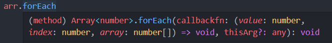
实际上这都是TS 提供的内置类型声明文件。
可以通过 `Ctrl + 鼠标左键`（Mac：option + 鼠标左键）来查看内置类型声明文件内容。
比如，查看forEach 方法的类型声明，在VSCode 中会自动跳转到 lib.es5.d.ts 类型声明文件中。
当然，像window、document 等BOM、DOM API 也都有相应的类型声明（lib.dom.d.ts）。

##### 第三方库的类型声明文件

第三方库的类型声明文件：目前，几乎所有常用的第三方库都有相应的类型声明文件。
第三方库的类型声明文件有两种存在形式： **库自带类型声明文件**和**由DefinitelyTyped 提供**。

1. 库自带类型声明文件
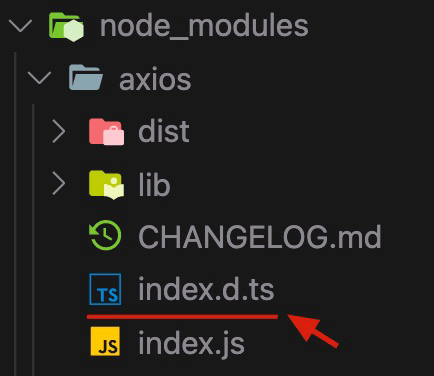
这种情况下，正常导入该库，TS 就会自动加载库自己的类型声明文件，以提供该库的类型声明。

2. 由DefinitelyTyped 提供。
[DefinitelyTyped](https://github.com/DefinitelyTyped/DefinitelyTyped/) 是一个github 仓库，用来提供高质量TypeScript 类型声明。可以通过npm/yarn 来下载该仓库提供的TS 类型声明包，这些包的名称格式为：`@types/*`。
比如，@types/react、@types/lodash 等。
说明：在实际项目开发时，如果你使用的第三方库没有自带的声明文件，VSCode 会给出明确的提示。
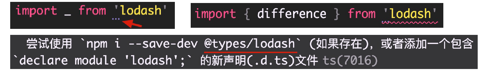
解释：当安装`@types/*`类型声明包后，**TS 也会自动加载该类声明包**，以提供该库的类型声明。
补充：TS 官方文档提供了一个[页面](https://www.typescriptlang.org/dt/search?search=)，可以来查询@types/* 库。

#### 创建自己的类型声明文件

创建自己的类型声明文件：1. **项目内共享类型** 2. **为已有JS 文件提供类型声明**。

##### 项目内共享类型

项目内共享类型：如果多个 `.ts` 文件中都用到同一个类型，此时可以创建 `.d.ts` 文件提供该类型，**实现类型共享**。

import { Props } from './index'
// type Props = { x: number; y: number }
let p1: Props = {
  x: 1,
  y: 2
}


import { Props } from './index'
// type Props = { x: number; y: number }
let p2: Props = {
  x: 10,
  y: 22
}


type Props = { x: number; y: number }
export { Props }

操作步骤：

   1. 创建index`.d.ts` 类型声明文件。
   2. 创建需要共享的类型，并使用 `export` 导出（TS 中的类型也可以使用import/export 实现模块化功能）。
   3. 在需要使用共享类型的.ts 文件中，通过 `import` 导入即可（.d.ts 后缀导入时，直接省略）。

##### 为已有JS 文件提供类型声明

以下情况需要为已有JS 文件提供类型声明：

1. 在将JS 项目[迁移](https://www.typescriptlang.org/docs/handbook/migrating-from-javascript.html)到TS 项目时，为了让已有的.js 文件有类型声明。
2. 成为库作者，创建库给其他人使用。

注意：**类型声明文件的编写与模块化方式相关**，不同的模块化方式有不同的写法。但由于历史原因，JS 模块化的发展经历过多种变化（AMD、CommonJS、UMD、ESModule 等），而TS 支持各种模块化形式的类型声明。这就导致，类型声明文件[相关内容](https://www.typescriptlang.org/docs/handbook/declaration-files/introduction.html)又多又杂。

演示：基于最新的ESModule（import/export）来为已有.js 文件，创建类型声明文件。
开发环境准备：使用webpack 搭建，通过 `ts-loader` 处理.ts 文件。

##### declare 关键字

TS 项目中也可以使用.js 文件。
在导入.js 文件时，**TS 会自动加载与.js 同名的.d.ts 文件**，以提供类型声明。
`declare` 关键字：用于类型声明，为其他地方（比如，.js 文件）已存在的变量声明类型，而不是创建一个新的变量。

1. 对于type、interface 等这些明确就是TS 类型的（只能在TS 中使用的），可以省略declare 关键字。
2. 对于let、function 等具有双重含义（在JS、TS 中都能用），应该使用declare 关键字，明确指定此处用于类型声明。


<!-- tab utils.js -->
```js
let count = 10
let songName = '痴心绝对'
let position = {
  x: 0,
  y: 0
}

function add(x, y) {
  return x + y
}

function changeDirection(direction) {
  console.log(direction)
}

const fomartPoint = point => {
  console.log('当前坐标：', point)
}

export { count, songName, position, add, changeDirection, fomartPoint }
```
<!-- endtab -->

<!-- tab utils.d.ts -->
为 utils.js 文件来提供类型声明

```ts
declare let count: number
declare let songName: string
interface Point {
  x: number
  y: number
}
declare let position: Point

declare function add(x: number, y: number): number
declare function changeDirection(
  direction: 'up' | 'down' | 'left' | 'right'
): void

type FomartPoint = (point: Point) => void
declare const fomartPoint: FomartPoint

// 注意：类型提供好以后，需要使用 模块化方案 中提供的
//      模块化语法，来导出声明好的类型。然后，才能在
//      其他的 .ts 文件中使用
export { count, songName, position, add, changeDirection, fomartPoint, Point }
```

<!-- endtab -->


## 在React 中使用TypeScript

掌握 TS 中基础类型、高级类型的使用是不够啊的，如果要在前端项目开发中使用TS，还需要掌握React、Vue、Angular 等这些库或框架中提供的API 的类型，以及在TS 中是如何使用的。

接下来，我们以React 为例，来学习如何在React 项目中使用TS。包括以下内容：

1. [使用 CRA 创建支持 TS 的项目](#使用CRA创建支持TS的项目)
2. [TS 配置文件 `tsconfig.json`](#TS配置文件)
3. [React 中的常用类型](#React中的常用类型)

### 使用CRA创建支持TS的项目

React 脚手架工具create-react-app（简称：CRA）默认支持TypeScript。
创建支持TS 的项目命令：`npx create-react-app 项目名称--template` typescript。
当出现`Happy hacking!`，表示支持TS 的项目创建成功。

在已TS有项目中使用TS，请[参阅](https://create-react-app.dev/docs/adding-typescript)

相对于非TS 项目，目录结构主要由以下三个变化：

1. 项目根目录中增加了`tsconfig.json` 配置文件：指定 **TS 的编译选项**（比如，编译时是否移除注释）。
2. React 组件的文件扩展名变为：`*.tsx`。
3. src 目录中增加了`react-app-env.d.ts`：**React 项目默认的类型声明文件**。

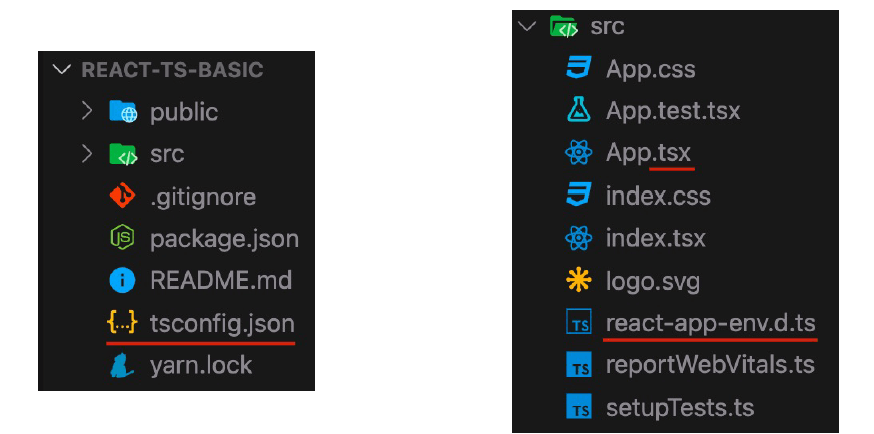

#### react-app-env.d.ts

react-app-env.d.ts：**React 项目默认的类型声明文件**。
**三斜线指令**：指定依赖的其他类型声明文件，types 表示依赖的类型声明文件包的名称。

```ts
/// <reference types="react-scripts" />
```

告诉TS 帮我加载 `react-scripts` 这个包提供的类型声明。
react-scripts 的类型声明文件包含了两部分类型：

1. react、react-dom、node 的类型
2. 图片、样式等模块的类型，以允许在代码中导入图片、SVG 等文件。

TS 会自动加载该.d.ts 文件，以提供类型声明（通过修改tsconfig.json 中的include 配置来验证）。

### TS配置文件

`tsconfig.json`指定**项目文件和项目编译所需的配置项**。
注意：

- TS 的配置项非常多（100+），以 CRA 项目中的配置为例来学习。
- 所有的配置项都可以通过鼠标移入的方式，来查看配置项的解释说明。
- 其他的配置项用到时查[tsconfig 文档](https://www.typescriptlang.org/tsconfig/)即可。


**tsconfig 的解释说明**

```json
{
  // 编译选项
  "compilerOptions": {
    // 生成代码的语言版本
    "target": "es5",
    // 指定要包含在编译中的 library
    "lib": ["dom", "dom.iterable", "esnext"],
    // 允许 ts 编译器编译 js 文件
    "allowJs": true,
    // 跳过声明文件的类型检查
    "skipLibCheck": true,
    // es 模块 互操作，屏蔽 ESModule 和 CommonJS 之间的差异
    "esModuleInterop": true,
    // 允许通过 import x from 'y' 即使模块没有显式指定 default 导出
    "allowSyntheticDefaultImports": true,
    // 开启严格模式
    "strict": true,
    // 对文件名称强制区分大小写
    "forceConsistentCasingInFileNames": true,
    // 为 switch 语句启用错误报告
    "noFallthroughCasesInSwitch": true,
    // 生成代码的模块化标准
    "module": "esnext",
    // 模块解析（查找）策略
    "moduleResolution": "node",
    // 允许导入扩展名为.json的模块
    "resolveJsonModule": true,
    // 是否将没有 import/export 的文件视为旧（全局而非模块化）脚本文件。
    "isolatedModules": true,
    // 编译时不生成任何文件（只进行类型检查）
    "noEmit": true,
    // 指定将 JSX 编译成什么形式
    "jsx": "react-jsx"
  },
  // 指定允许 ts 处理的目录
  "include": ["src"]
}
```



1. tsconfig.json 文件所在目录为项目根目录（与package.json 同级）。
2. tsconfig.json 可以自动生成，命令：`tsc --init`。

除了在tsconfig.json 文件中使用编译配置外，还可以通过命令行来使用。

```shell
tsc hello.ts --target es6
```

注意：

1. tsc 后**带有输入文件**时（比如，tsc hello.ts），将忽略tsconfig.json 文件。
2. tsc 后**不带输入文件**时（比如，tsc），才会启用tsconfig.json。

**推荐使用tsconfig.json 配置文件。**

### React中的常用类型

前提说明：现在是基于class 组件来讲解React+TS 的使用（最新使用 React Hooks）。
在不使用TS 时，可以使用prop-types 库，为React 组件提供[类型检查](https://reactjs.org/docs/typechecking-with-proptypes.html)。
**TS 项目中，推荐使用TypeScript 实现组件类型校验（代替PropTypes）。**
不管是React 还是Vue，只要是支持TS 的库，都提供了很多类型，来满足该库对类型的需求。
注意：

1. React 项目是通过@types/react、@types/react-dom 类型声明包，来提供类型的。
2. 这些包CRA 已帮我们安装好（react-app-env.d.ts），直接用即可。

参考资料：[React文档-静态类型检查](https://reactjs.org/docs/static-type-checking.html)、[React+TS备忘单](https://github.com/typescript-cheatsheets/react)。

React 是**组件化开发模式**，React 开发主要任务就是写组件，两种组件：1.函数组件 2.class 组件。

#### 函数组件

函数组件，主要包括以下内容：

- 组件的类型
- 组件的属性（props）
- 组件属性的默认值（defaultProps）
- 事件绑定和事件对象

函数组件的类型以及组件的属性

```ts
type Props ={name:string; age?:number}

const Hello:FC<Props> = ({name,age}) => (
  <div>你好，我叫：{name}，我{age}岁了</div>
)

<Hello name="Huang" />
```

可以直接简化为（完全按照函数在TS 中的写法）：

```ts
const Hello = ({name,age}:Props)=> (
  <div>你好，我叫：{name}，我{age}岁了</div>
)
```

函数组件属性的默认值（defaultProps）

```ts
const Hello = ({name,age}:Props)=> (
  <div>你好，我叫：{name}，我{age}岁了</div>
)

Hello.defaultProps={
  age:18
}
```

可以直接简化为（完全按照函数在TS 中的写法）：

```ts
const Hello = ({name,age =18 }:Props)=> (
  <div>你好，我叫：{name}，我{age}岁了</div>
)
```

事件绑定和事件对象

```ts
<button onClick={onClick}>点赞</button>

const onClick = ()=>{}
const onClick1 = (e:React.MouseEvent<HTMLButtonElement>) =>{}

//再入，文本框
const onChange=(e:React.ChangeEvent<HTMLInputElement> )=>{
    console.log(e.target.value);
```

技巧：在JSX 中写事件处理程序（`e => {}`），然后，把鼠标放在e 上，利用TS 的**类型推论**来查看事件对象类型。

```ts
//  鼠标放置查看类型
<input onChange = {e=>{}} />
```

#### class组件

class 组件，主要包括以下内容：

- 组件的类型、属性、事件
- 组件状态（state）

class 组件的类型

```ts
type State={count:number}
type Props={message?:string}

class c1 extends React.Component{}              // 无props state
class c2 extends React.Component<Props>{}       // 有props 无state
class c3 extends React.Component<{},State>{}    // 无props 有state
class c4 extends React.Component<Props,State>{} // 有props 有state
```

class 组件的属性和属性默认值

```ts
type Props = {name: string; age?:number}

class Hello extends React.Component<Props>{
  static defaultProps: Partial<Props> = {
    age: 18
  }
  render(){
    const {name,age}=this.props
    return (
      <div>你好，我叫：{name}，我{age}岁了</div>
    )
  }
}

//简化
const{name,age = 18} = this.props
```

class 组件状态（state）和事件

```ts
type State ={count: number}
class Counter extends React.Component<{},State>{
  state:State={
    count: 0
  }
  onIncrement = () => {
    this.setState({
      count: this.state.count +1
    })
  }
   render(): React.ReactNode {
    return(
      <div>
        {this.state.count}<br/>
        <button onClick={this.onIncrement}>+1</button>
      </div>
    )
  }
}
```

## TS案例

### React 案例——todos

#### 要求文档



```Markdown
# TS + React 实现 todos 案例

## 功能演示

1. 展示任务列表
2. 添加任务

父组件：App
子组件：TodoAdd 、TodoList

## 展示任务列表

### 思路

使用`状态提升`（为父组件提供状态，通过 props 传递给子组件）来实现 **父→子** 通讯。

### 步骤

1. 为父组件 App，提供状态（任务列表数据）和类型
2. 为子组件 TodoList 指定能够接收到的 props 类型
3. 将任务列表数据传递给 TodoList 组件

### 优化

使用类型声明文件，实现类型共享。

1. 创建 todos.d.ts 文件
2. 将公共的类型移动到 todos.d.ts 文件中，并导出
3. 在用到该类型的组件（App、TodoList）中导入这些类型

## 添加任务

### 思路

子组件获取到文本框的值，通过 **子→父** 通讯 将文本框的值传递给父组件。然后，在父组件中将任务添加到状态数据中。

### 步骤

1. 为子组件添加状态和属性及其类型：
   - 状态：文本框的值
   - 属性：回调函数，接收一个 string 类型的参数
2. 通过`受控组件`方式获取到文本框的值
3. 在子组件文本框按下回车键时将数据传递给父组件
4. 父组件接收子组件传递过来的任务名称（文本框的值）
5. 将任务添加到父组件的状态数据中
```



#### 项目结构



- 项目根目录
  - public
  - src
    - components
      - TodoAdd.tsx
      - TodoFooter.tsx
      - TodoList.tsx
    - css
      - todos-base.css
      - todos-index.css
    - index.tsx
    - TodoApp.css
    - ToDoApp.tsx
    - todos.d.ts
    - 其他文件


#### code


<!-- tab index.tsx -->
```ts
import React from 'react';
import ReactDOM from 'react-dom/client';
import './index.css';
import ToDoApp from './ToDoApp';
import reportWebVitals from './reportWebVitals';

const root = ReactDOM.createRoot(
  document.getElementById('root') as HTMLElement
);

root.render(
  <React.StrictMode>
    <ToDoApp />
  </React.StrictMode>
);

reportWebVitals();
```
<!-- endtab -->

<!-- tab ToDoApp.tsx -->
```ts
import { Component } from "react"
import TodoAdd from "./components/TodoAdd"
import TodoFooter from "./components/TodoFooter"
import TodoList from "./components/TodoList"
import './ToDoApp.css'
import{TodoItem} from './todos'
//任务项的类型
// type TodoItem={
//     id: number
//     text :string
//     done: boolean

// }
//APP组件的状态类型
type Todos={
    todos: TodoItem[]
}
const todos:TodoItem[] = [
    {
        id:1,
        text:'吃饭',
        done:true
    },
    {
        id:2,
        text:'休息',
        done:false
    },
]

class ToDoApp extends Component<{},Todos>{
    state: Todos={
        todos
    }
    addTodo=(text:string)=>{
        // console.log(text);
        const{todos}=this.state
        const id =todos.length===0?1:todos[todos.length-1].id+1
        this.setState({
            todos:[...this.state.todos,
                {
                    id,
                    text,
                    done:false
                }
            ]
        })       
    }
    render(){
        return (
            <section className="todoapp">
              {/* 添加任务 */}
              <TodoAdd onAddToDo={this.addTodo}/>
      
              <section className="main">
                <input id="toggle-all" className="toggle-all" type="checkbox" />
                <label htmlFor="toggle-all">Mark all as complete</label>
                {/* 列表组件 */}
                <TodoList list={this.state.todos}/>
              </section>
      
              {/* footer 组件 */}
              <TodoFooter />
            </section>
          )
    }
}

export default ToDoApp;
```
<!-- endtab -->

<!-- tab TodoAdd.tsx -->
```ts
import React from 'react'
//属性的类型
type Props={
  onAddToDo(text:string):void
}
//状态的类型
type State={
  text:string
}
class TodoAdd extends React.Component<Props,State> {
  state:State={
    text:''
  }
  onChange= (e:React.ChangeEvent<HTMLInputElement>)=>{
    this.setState({
      text:e.target.value
    })
  }
  onAdd=(e:React.KeyboardEvent<HTMLInputElement>)=>{
    //1.非空判断
    const{text}=this.state
    //去空格
    if (text.trim()==='') {
      return
    }

    // console.log(e.keyCode)
    // console.log(e.code);
    if(e.code==='Enter'){
      this.props.onAddToDo(this.state.text)
       //2.清空文本框的值
       this.setState({
        text:''
       })
    }
     
  }
  render() {
    return (
      <header className="header">
        <h1>todos</h1>
        <input
          className="new-todo"
          placeholder="What needs to be done?"
          autoFocus
          value={this.state.text}
          onChange={this.onChange}
          onKeyDown={this.onAdd}
        />
      </header>
    )
  }
}

export default TodoAdd
```
<!-- endtab -->

<!-- tab TodoFooter.tsx -->
```ts
import React from 'react'

class TodoFooter extends React.Component {
  render() {
    return (
      <footer className="footer">
        <span className="todo-count">
          <strong>0</strong> item left
        </span>
        <ul className="filters">
          <li>
            <a className="selected" href="#/">
              All
            </a>
          </li>
          <li>
            <a href="#/active">Active</a>
          </li>
          <li>
            <a href="#/completed">Completed</a>
          </li>
        </ul>
        <button className="clear-completed">Clear completed</button>
      </footer>
    )
  }
}

export default TodoFooter
```
<!-- endtab -->

<!-- tab TodoList.tsx -->
```ts
import React from "react";
import { TodoItem } from "../todos";

// type TodoItem={
//     id: number
//     text :string
//     done: boolean
// }

interface Props{
    list: TodoItem[]
}

class TodoList extends React.Component<Props> {
    render() {
        console.log(this.props)
      return (
        <ul className="todo-list">
          {/* 编辑样式：editing  已完成样式：completed */}
          {
            //map 遍历
            this.props.list.map(todo =>{
                return(
                <li key={todo.id} className={todo.done ? 'completed' : ''}>
                    <div className="view">
                    <input className="toggle" type="checkbox" />
                    <label>{todo.text}</label>
                    <button className="destroy" />
                    </div>
                    <input className="edit" defaultValue="Create a TodoMVC template" />
                </li>
                )
            })
          }
        </ul>
      )
    }
  }

export default TodoList
```
<!-- endtab -->

<!-- tab todos.d.ts -->
```ts
export type TodoItem={
    id: number
    text :string
    done: boolean
}
```
<!-- endtab -->

<!-- tab ToDoApp.css-->
```css
@import url('./css/todos-base.css');
@import url('./css/todos-index.css');
```
<!-- endtab -->



[源码下载](/downloads/code/React-todos.zip)


### Project——Tic Tac Toe

#### Tic Tac Toe 演示

[Tic Tac Toe](https://cmwlvip.github.io/game/TicTacToe/Tic-Tac-Toe.html)

#### Tic Tac Toe 实现思路



- 单元格点击
  1. 获取到所有元素的单元格列表
  2. 遍历单元格列表，给每一个单元格添加事件
  3. 给被点击的单元格添加类名 x

- 切换玩家
  1. 创建一个储存当前玩家的变量（currentPlayer），默认值为x
  2. 将添加单元格时写死的类名x，替换为变量
  3. 切换到另一个玩家：在添加类名（下棋完成一步）后，根据当前当前玩家，得到另一个玩家

- 使用枚举修改当前玩家
  1. 创建字符串枚举（Player），提供x和o两个成员
  2. 将成员X的值设置为：‘x’（类名）；将成员O的值设置为：‘o’（类名）
  3. 将变量（currentPlayer）的类型设置为Player枚举类型,默认值为Player.X
  4. 将所有用到x和o的地方全部用枚举成员代替

- 判断平局
  1. 创建变量（step），默认值为0
  2. 玩家下棋后让step加 1
  3. 判赢的代码后面，判断step是否等于9
  4. 如果等于9 说明是平局，不再执行后续代码

- 展示获胜信息
  1. 拿到相关的DOM元素
  2. 展示获胜信息面板（通过style属性）
  3. 展示获胜信息

- 重新开始
  1. 获取到重新开始按钮，并绑定事件
  2. 在点击事件中重置游戏数据
  3. 隐藏获胜信息，清空棋盘，移除单元格事件，重新给单元格绑定点击事件
  4. 重置下棋次数，重置默认玩家X，重置下棋提示 



#### Tic Tac Toe 准备








#### Tic Tac Toe——code











