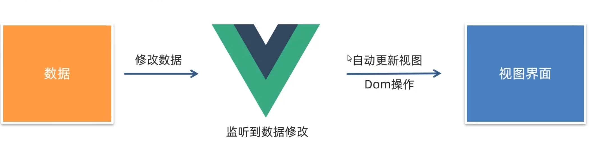
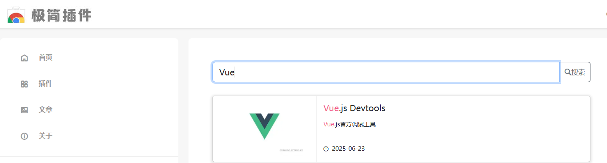
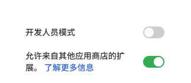
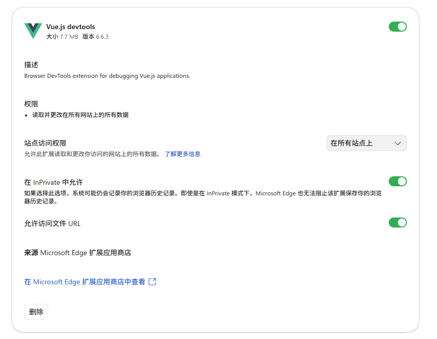
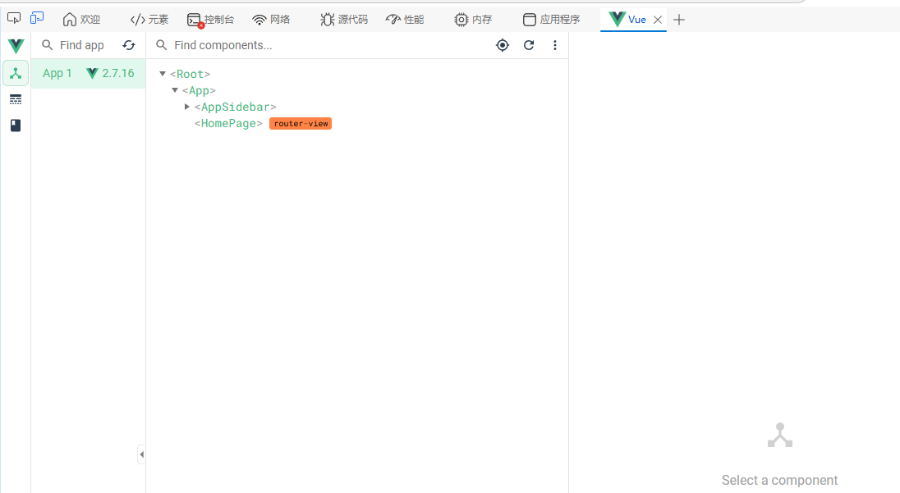

>Vue官网

[中文官网](https://cn.vuejs.org/)
[英文官网](https://vuejs.org/)

## Vue简介

### Vue.js是什么

Vue.js（常简称为 Vue）是一个用于构建用户界面的**渐进式框架**。该定义源自 Vue 官方文档，包含三个核心关键词：**构建用户界面**、**渐进式**、**框架**。以下将逐项展开说明。

| 关键词         | 内涵说明                                                                 |
|----------------|--------------------------------------------------------------------------|
| **构建用户界面** | 基于数据驱动，通过声明式模板与响应式系统，自动生成并更新用户可见的页面内容。 |
| **渐进式**       | 支持分阶段学习与技术采纳：从核心渲染起步，按需扩展路由、状态管理、构建工具等能力。 |
| **框架**         | 提供完整项目解决方案，适用于中大型应用开发，显著提升开发效率与工程可维护性。     |

#### 1. 构建用户界面

“构建用户界面”指基于数据动态生成并渲染用户可感知的页面内容。其本质是实现**数据到视图的映射与同步**。

- 后端通常返回结构化数据（例如 JSON 格式），如：
  ```json
  {
    "title": "水果",
    "items": [
      {"name": "苹果", "quantity": 200},
      {"name": "香蕉", "quantity": 150}
    ]
  }
  ```
- 此类原始数据不具备可读性，无法直接呈现给终端用户。
- Vue 提供声明式模板语法与响应式系统，将数据绑定至 HTML 模板，经由渲染引擎生成符合语义与样式的 DOM 结构。
- 最终输出为具备标题、列表、交互能力及视觉样式的完整页面，满足用户操作与信息获取需求。

因此，“构建用户界面”即指**以数据为驱动源，通过 Vue 提供的机制完成页面结构、内容与行为的自动化生成与更新过程**。

#### 2. 渐进式

“渐进式”（Progressive）指 Vue 的学习路径与技术采纳方式具有**分层递进、按需集成**的特性。

- Vue 的核心包（`vue.js`）仅包含两个基础能力模块：
  - **声明式渲染系统**：支持模板语法（如 `{{ }}`、`v-bind`、`v-for` 等）实现数据驱动的视图更新；
  - **组件系统**：支持封装可复用、可组合的 UI 单元（Component）。

- 开发者无需一次性掌握全部生态工具即可开展实际开发：
  - 初学者仅掌握声明式渲染，即可完成静态页面或局部模块的数据绑定与展示；
  - 随项目复杂度提升，可逐步引入官方生态插件：
    - `vue-router`：提供客户端路由管理能力；
    - `vuex`（Vue 2）或 `Pinia`（Vue 3）：实现跨组件状态集中管理；
    - 构建工具链（如 Vite、Vue CLI）：支撑工程化开发、代码分割、热更新等高级功能。

- Vue 的使用模式分为两类：
  - **增量集成模式**：在现有传统网站中，仅对特定模块（如商品筛选器、评论区）采用 Vue 进行重构与增强；
  - **全栈应用模式**：以 Vue 为核心构建完整的单页应用（SPA），配合路由、状态管理及构建工具形成标准化开发流程。

综上，“渐进式”强调 Vue 的**低门槛入门性**与**高延展性**：开发者可根据项目规模与团队能力，自主决定技术栈的覆盖深度，避免“全有或全无”的学习负担。

#### 3. 框架

Vue 是一个**框架**（Framework），而非仅限于库（Library）。这意味着它提供了一套**完整的、约定优于配置的项目解决方案**，适用于中大型前端应用开发。

- 框架的核心价值在于：
  - 统一项目结构规范（如组件组织、路由定义、状态管理方式）；
  - 内置关键能力（响应式系统、虚拟 DOM、生命周期管理）；
  - 明确开发约束与最佳实践，降低团队协作成本；
  - 支持企业级工程需求（如 TypeScript 集成、服务端渲染 SSR、微前端适配）。

- 实践效益显著：
  - 相较于纯原生 JavaScript 从零实现相同业务逻辑，采用 Vue 可提升**70% 以上的开发效率**；
  - 效率提升源于：模板抽象减少手动 DOM 操作、组件复用降低重复编码、响应式机制消除手动状态同步逻辑、生态系统加速通用功能集成。

- 使用框架的必要前提：
  - 接受并遵循其设计约束与编码规则；
  - 规则的学习与内化主要依赖**官方文档**——这是唯一权威、完整、持续更新的技术依据。

### Vue是谁开发的


### Vue的特点

1. 采用**组件化**模式，提高代码复用率、且让代码更好维护

2. **声明式**编码，让编码人员无需直接操作DOM，提高开发效率

3. **Diff算法**


### 学习路径建议

基于 Vue 的渐进式特性，推荐如下学习路径：

1. **第一阶段：掌握核心能力**
   - 熟练使用声明式渲染语法（插值、指令、事件绑定）；
   - 理解响应式原理与 `data` / `ref` / `reactive` 等基本响应式 API；
   - 能够编写与复用基础组件。

2. **第二阶段：扩展工程能力**
   - 集成 `vue-router` 实现多页面导航；
   - 引入状态管理方案（如 Pinia）处理共享状态；
   - 使用 Vite 构建项目，配置开发服务器、打包与环境变量。

3. **第三阶段：深化架构认知**
   - 学习组合式 API（Composition API）组织复杂逻辑；
   - 掌握 TypeScript 与 Vue 的协同开发；
   - 理解服务端渲染（SSR）、静态站点生成（SSG）等部署方案。

> **重要提示**：所有语法、API 与设计原则均以 [Vue 官方文档](https://vuejs.org/) 为准。文档是规则记忆、问题排查与能力进阶的根本依据。

---

## 创建 Vue 实例

初始化一个 Vue 实例并完成首次渲染，需严格遵循以下**四个核心步骤**。该流程是 Vue 应用启动的基础，必须完整执行且顺序不可颠倒。

| 步骤 | 关键操作 | 核心要求 | 常见错误 |
|------|-----------|------------|-------------|
| **1. 准备容器** | 定义带唯一 `id` 的 `<div>` | `id` 必须与 `el` 配置完全一致 | 容器缺失、`id` 拼写错误、重复 `id` |
| **2. 引入库** | 使用开发版 `vue.js` | 严禁在开发阶段使用 `vue.min.js` | 控制台无错误提示、调试功能失效 |
| **3. 创建实例** | `new Vue({ ... })` | 必须在 Vue 库加载完成后执行 | `Vue is not defined` 报错 |
| **4. 配置选项** | 设置 `el` 和 `data` | `el` 为有效选择器；`data` 为合法对象 | `el` 不匹配、`data` 为 `undefined` 或非对象 |

> **核心结论**：Vue 实例的创建是声明式数据驱动视图的起点。`el` 确立管理边界，`data` 提供响应式数据源，二者共同构成 Vue 应用的最小可行单元。后续所有指令、组件、计算属性等功能均以此为基础进行扩展。

### 1. 准备渲染容器

Vue 需要一个 DOM 元素作为其管理范围的边界。该元素即为**渲染容器**，Vue 将仅接管并控制该容器内部的模板解析与数据绑定。

- 容器通常使用 `<div>` 标签定义；
- 必须通过唯一标识（如 `id` 属性）确保可被准确选中；
- 容器内可编写 Vue 模板语法，但仅在被 Vue 实例挂载后生效。

示例代码：
```html
<div id="app"></div>
```

> **注意**：`id="app"` 是后续挂载配置中指定的选择器依据，必须与配置项严格一致。

### 2. 引入 Vue 核心库

Vue 提供两种官方分发版本，需根据开发阶段正确选用：

| 版本类型 | 特点 | 适用场景 | 文件大小参考 |
|----------|------|-----------|----------------|
| **开发版本** | 包含完整的警告提示、调试信息、未压缩代码；支持开发者工具集成；提供详细的错误定位能力 | **学习、开发、调试阶段** | 约 400 KB+ |
| **生产版本** | 移除所有警告与调试逻辑；代码已压缩；体积更小；性能更优 | **正式部署上线阶段** | 显著小于开发版 |

- 开发阶段**必须使用开发版本**，否则将丢失关键错误提示与调试支持；
- 可通过以下任一方式引入：
  - **本地下载引入**：访问 [Vue 2 官方网站](https://v2.cn.vuejs.org/) →「起步」→「安装」章节，下载开发版 `vue.js` 文件，通过 `<script>` 标签引入；
  - **CDN 在线引入**：直接使用官方提供的 CDN 地址（开发版），无需下载。

推荐开发阶段使用的 CDN 地址（Vue 2.x）：
```html
<script src="https://cdn.jsdelivr.net/npm/vue@2/dist/vue.js"></script>
```

> **重要提醒**：切勿在开发环境中使用生产版本（如 `vue.min.js`），否则将导致控制台错误无法显示、调试困难。

### 3. 创建 Vue 实例

引入 Vue 核心库后，全局作用域将自动注册 `Vue` 构造函数。此时可通过 `new Vue()` 语法创建一个 Vue 实例。

- `Vue` 是一个构造函数，非普通对象；
- 每个 Vue 实例均独立管理其挂载容器内的响应式系统与模板编译；
- 实例创建本身不触发渲染，需配合配置项完成初始化。

示例代码：
```javascript
const vm = new Vue({ /* 配置对象 */ });
```

### 4. 配置实例选项

Vue 实例的初始化行为由传入的配置对象决定。其中两个**必需配置项**为：

#### （1）`el`（挂载点）

- 类型：`string | HTMLElement`
- 作用：指定 Vue 实例所管理的 DOM 容器；
- 值为 CSS 选择器字符串（如 `'#app'`）或原生 DOM 元素引用；
- Vue 将把该容器作为根节点，接管其内部所有子节点的编译与渲染；
- 若选择器不匹配任何元素，实例将无法挂载，控制台报错。

#### （2）`data`（响应式数据对象）

- 类型：`Object | Function`
- 作用：提供模板中可访问的响应式数据；
- 必须为纯对象（或返回对象的函数），其所有属性将被 Vue 转换为响应式属性；
- 模板中可通过双大括号语法 `{{ }}` 访问 `data` 中定义的属性；
- 数据变更将自动触发视图更新。

示例完整配置：
```javascript
const vm = new Vue({
  el: '#app',
  data: {
    message: 'Hello 黑马',
    count: 6666
  }
});
```

#### 完整示例代码

以下为可直接运行的最小化 Vue 应用示例（基于 Vue 2 开发版）：

```html
<!DOCTYPE html>
<html lang="zh-CN">
<head>
  <meta charset="UTF-8">
  <title>Vue 实例创建示例</title>
  <!-- 步骤2：引入 Vue 开发版本 -->
  <script src="https://cdn.jsdelivr.net/npm/vue@2/dist/vue.js"></script>
</head>
<body>
  <!-- 步骤1：准备渲染容器 -->
  <div id="app">
    <h1>{{ message }}</h1>
    <p><a href="#">{{ count }}</a></p>
  </div>

  <!-- 步骤3 & 4：创建实例并配置 -->
  <script>
    const vm = new Vue({
      el: '#app', // 挂载点：对应 id="app" 的容器
      data: {      // 响应式数据
        message: 'Hello 黑马',
        count: 6666
      }
    });
  </script>
</body>
</html>
```

---

## 插值表达式

### 插值表达式概述

插值表达式是 Vue.js 模板语法的核心组成部分之一，用于在模板中**动态渲染数据**。其本质是基于 JavaScript 表达式进行求值，并将计算结果以文本形式插入到 DOM 中，最终呈现给用户。

插值表达式通过双大括号 `{{ }}` 语法实现，属于**单向数据绑定**机制，仅支持从 Vue 实例的数据流向视图的渲染，不支持反向更新。

> **关键概念**：插值表达式中的内容必须是**合法的 JavaScript 表达式**，而非语句（statement）。

### 表达式定义与特征

#### 什么是表达式？

在 JavaScript 中，**表达式（Expression）** 是指能够被求值并返回一个具体结果的代码片段。JS 引擎在执行时会对表达式进行计算，产生一个确定的值。

符合表达式定义的典型示例包括：
- 变量引用：`money`
- 算术运算：`money + 100`、`price - 50`
- 字符串操作：`name.toUpperCase()`、`'Hello ' + name`
- 三元运算符：`age >= 18 ? '成年' : '未成年'`
- 属性访问：`user.name`、`obj.items[0]`、`person.friend.description`

#### 表达式与语句的区别

| 类型 | 特征 | 是否允许在插值中使用 |
|------|------|------------------------|
| **表达式** | 具有返回值，可参与计算或赋值 | ✅ 允许 |
| **语句** | 执行某种操作（如声明、流程控制），无返回值 | ❌ 禁止 |

禁止在插值中使用的语句类型包括：
- `if` 语句
- `for` 循环
- `while` 循环
- `function` 声明
- `var`/`let`/`const` 声明
- `return` 语句

> **重要原则**：插值区域仅接受表达式，任何试图执行控制流或声明变量的操作均会导致编译错误。

### 插值表达式语法格式

#### 基本语法

插值表达式的标准语法为：

```
{{ 表达式 }}
```

其中，`表达式` 必须满足以下条件：
- 是合法的 JavaScript 表达式；
- 不包含分号、花括号等语句终结符；
- 可以访问 Vue 实例 `data` 选项中定义的所有响应式属性。

#### 合法用法示例

假设 Vue 实例 `data` 定义如下：

```js
data() {
  return {
    name: 'Tony',
    age: 18,
    friend: {
      name: 'Jefferson',
      description: '热爱学习'
    }
  }
}
```

则以下插值写法均合法且有效：

| 插值写法 | 说明 | 渲染结果示例 |
|----------|------|--------------|
| `{{ name }}` | 直接访问字符串属性 | `Tony` |
| `{{ name.toUpperCase() }}` | 调用字符串方法 | `TONY` |
| `{{ 'Hello ' + name }}` | 字符串拼接 | `Hello Tony` |
| `{{ age >= 18 ? '成年' : '未成年' }}` | 三元运算符 | `成年` |
| `{{ friend.name }}` | 多级对象属性访问 | `Jefferson` |
| `{{ friend.description }}` | 访问嵌套属性 | `热爱学习` |

### 使用注意事项（三大约束）

1. 所有引用数据必须在 `data` 中**预先声明**；
2. 仅支持**表达式**，禁止 `if`/`for`/`function` 等**语句**；
3.  **不可用于 HTML 属性**，属性绑定须使用 `v-bind`

| 错误类型 | 触发方式 | 控制台错误提示 | 影响范围 |
|----------|----------|----------------|----------|
| 未声明数据 | `{{ hobby }}`（data 中无 hobby） | `"hobby" is not defined` | 仅该插值失效，其余正常 |
| 使用语句 | `{{ if (true) {} }}` | `Avoid using JavaScript keyword` | 整个模板编译失败，页面空白 |
| 属性中插值 | `<p title="{{ name }}">` | `Attribute "{{ name }}" is ignored` | 属性值为空，无提示，功能缺失 |

### 插值表达式示例代码

```html
<div id="app">
  <p>{{ name }}</p>
  <p>{{ name.toUpperCase() }}</p>
  <p>{{ 'Hello ' + name }}</p>
  <p>{{ age >= 18 ? '成年' : '未成年' }}</p>
  <p>{{ friend.name }}</p>
  <p>{{ friend.description }}</p>
</div>

<!-- 换成 Vue 2 CDN -->
<script src="https://cdn.jsdelivr.net/npm/vue@2/dist/vue.js"></script>
<script>
  // Vue 2 写法：new Vue()
  new Vue({
    el: '#app', // 挂载元素
    data() {
      return {
        name: 'Tony',
        age: 18,
        friend: {
          name: 'Jefferson',
          description: '热爱学习'
        }
      }
    }
  })
</script>
```

---

## Vue的响应式

### 响应式概念定义

**响应式（Reactivity）** 是 Vue 框架的核心特性之一，其本质是指：**当数据发生变化时，依赖该数据的视图会自动更新，无需开发者手动操作 DOM**。

该机制实现了数据与视图之间的双向联动，使开发者能够专注于业务逻辑，而非视图同步细节。



#### 响应式的基本特征

- 数据变化触发视图自动更新  
- 更新过程完全由框架内部机制保障  
- 开发者无需调用渲染方法或操作 DOM 节点  
- 视图更新具有即时性与确定性  

### Vue 实例中数据的响应式实现机制

#### 数据初始化与属性挂载

在 Vue 实例创建过程中，`data` 选项中声明的所有属性将被**递归转换为响应式对象**，并**挂载到 Vue 实例本身**。

例如：
```javascript
const app = new Vue({
  el: '#app',
  data: {
    message: '你好 世界',
    count: 100
  }
})
```
上述代码执行后，`message` 与 `count` 属性将被添加至 `app` 实例上，成为实例的直接属性。

#### 数据访问方式

响应式数据可通过**实例属性访问语法**直接读取：

- `app.message` → 返回 `'你好 世界'`
- `app.count` → 返回 `100`

该访问方式等价于直接读取 `data` 中定义的原始值，但底层已建立响应式追踪关系。

#### 2.3 数据修改方式

响应式数据支持**直接赋值修改**，修改操作将自动触发依赖更新：

- `app.message = '你好 Vue'` → 视图中插值表达式 `{{ message }}` 立即更新  
- `app.count++` 或 `app.count = app.count + 1` → 视图中 `{{ count }}` 立即更新  

> **关键说明**：所有对响应式属性的直接读写操作均已被 Vue 的响应式系统拦截并建立依赖关系，因此无需额外 API 调用。

### 响应式工作原理简述

Vue 的响应式系统基于 **Object.defineProperty（Vue 2）** 或 **Proxy（Vue 3）** 实现。其核心流程如下：

1. **数据劫持（Data Observation）**  
   在实例初始化阶段，Vue 遍历 `data` 对象所有属性，通过 `Object.defineProperty` 为每个属性设置 `getter` 与 `setter`；  
   - `getter`：用于**依赖收集**，记录当前正在求值的 Watcher（观察者）；  
   - `setter`：用于**派发更新**，当属性被修改时通知所有依赖该属性的 Watcher 重新计算。

2. **依赖收集（Dependency Collection）**  
   模板编译过程中，每个插值表达式（如 `{{ message }}`）对应一个 Watcher；  
   在首次求值时，Watcher 会读取 `app.message`，触发其 `getter`，从而将自身注册为 `message` 的依赖。

3. **派发更新（Update Notification）**  
   当 `app.message = '新值'` 执行时，触发 `setter`，遍历 `message` 的所有依赖 Watcher，调用其 `update()` 方法；  
   Watcher 执行重新求值，并对比新旧 VNode，最终通过虚拟 DOM 差异算法完成视图更新。

> **重要结论**：响应式并非“无操作”，而是 Vue 将**数据变更检测、依赖追踪、视图更新**等底层操作进行了封装。开发者仅需操作数据，框架自动完成后续全部流程。

### 实践验证：控制台交互演示

#### 环境准备

- 创建 HTML 容器：`<div id="app">{{ message }} — {{ count }}</div>`  
- 引入 Vue 库，初始化实例：
  ```javascript
  const app = new Vue({
    el: '#app',
    data: {
      message: '你好 世界',
      count: 100
    }
  })
  ```

#### 数据访问验证

在浏览器开发者工具控制台中执行：
```javascript
app.message   // 输出：'你好 世界'
app.count     // 输出：100
```

#### 数据修改与视图同步验证

依次执行以下语句，观察页面实时变化：
```javascript
app.message = '你好 Vue'  // 页面中对应文本立即更新
app.count++               // 页面中数字立即加 1
app.count = 200           // 页面中数字立即变为 200
```

每次赋值操作完成后，视图均在下一个事件循环周期内完成更新，体现响应式的即时性。

### 响应式开发范式总结

#### 开发者职责边界

使用 Vue 进行响应式开发时，开发者的核心关注点应聚焦于：
- **业务逻辑实现**：明确数据状态如何随用户行为或系统事件变化  
- **数据建模**：合理设计 `data` 结构，确保所需状态均可被响应式追踪  
- **数据操作**：通过直接赋值方式修改响应式属性  

> **禁止行为**：绕过 Vue 实例直接操作原始 `data` 对象、使用 `Object.assign()` 替换整个 `data`、对数组索引直接赋值（如 `arr[0] = val`）等可能导致响应式失效的操作。

#### 响应式带来的工程优势

- **开发效率提升**：消除手动 DOM 操作与状态同步代码，降低出错概率  
- **可维护性增强**：视图更新逻辑由框架统一管理，业务代码更专注逻辑表达  
- **调试路径清晰**：数据即单一事实来源（Single Source of Truth），状态变更可追溯  
- **协作成本降低**：团队成员可基于统一的数据驱动模型理解应用行为  

### 常见问题辨析

#### “响应式”是否等于“实时渲染”？

否。响应式指**数据变化与视图更新的自动关联机制**，其更新时机受 Vue 的异步更新队列控制（`nextTick`），并非严格意义上的毫秒级实时，但对用户感知而言具备即时性。

#### 修改未声明的数据是否响应？

否。仅在 `data` 选项中声明的属性才被纳入响应式系统。向实例动态添加新属性（如 `app.newProp = 'value'`）不会触发响应式处理，需使用 `Vue.set()`（Vue 2）或 `this.$set()` 显式声明。

#### 数组变更如何保证响应？

Vue 重写了数组的变异方法（`push`, `pop`, `shift`, `unshift`, `splice`, `sort`, `reverse`），调用这些方法可触发更新；  
直接通过索引设置元素（`vm.items[indexOfItem] = newValue`）或修改 `length` 不触发更新，应使用 `Vue.set()` 或 `splice` 替代。

---

## 开发者工具安装`Vue.js Devtools`

### 下载插件安装包

1. 打开浏览器，访问[极简插件官网](https://chrome.zzzmh.cn/)；
2. 在官网首页搜索框中输入关键词 `Vue`，**选择名称为 `Vue.js devtools` 的第一个插件条目**；
  
3. 点击【推荐下载】按钮，下载得到ZIP 压缩包，解压完成得到`.crx` 格式插件。

### 安装插件

#### 启用 edge 扩展开发模式

1. 打开 edge 浏览器输入`edge://extensions/`进入扩展管理页。
2. 开启**开发人员模式**，可以看到开发人员选项。
  
  
3. 拖拽`.crx` 到浏览器就可以安装（不开**开发人员模式**拖拽就安装不了）。

#### 启用 Chrome 扩展开发模式

1. 打开Chrome浏览器 -> 点击右上角三个点 -> 扩展程序 -> 管理扩展程序
2. '管理扩展程序' 页面的右上角 '开发者模式' 开关打开
3. 极简插件下载到的是压缩包，必须先解压缩！解压后有2个文件。一个安装文件，一个说明书
4. 其中名字长的 `xxx_chrome.zzzmh.cn.crx` 文件就是安装包，鼠标长按拖住，拖到 '管理扩展程序' 页面，松开鼠标
5. 看到弹出框，点添加扩展程序，安装成功！

>直接选择对应版本安装也行

### 配置插件权限

1. 在扩展程序列表中，找到 `Vue.js devtools` 条目；  
2. 点击右侧「详细信息」按钮；  
3. **开启「允许访问文件URL」选项**；
  
   > 此权限为必需项，否则 Devtools 无法在本地 `file://` 协议页面（如直接双击 HTML 文件运行的 Vue 示例）中正常工作。

### 验证安装完成

1. 重新启动浏览器；
2. 打开一个已正确引入 Vue 并初始化实例的网页（例如：`http://localhost:8080` 或本地 `index.html`）；  
3. 在页面任意位置右键 → 选择「检查」（或者`F12`打开开发人员工具）
4. 在开发者工具顶部标签栏中，确认出现 **`Vue` 选项卡**；
  

> 若未出现，请检查：① 页面是否为 Vue 应用；② Vue 实例是否在开发模式下运行；③ 浏览器是否已重启；④ 「允许访问文件网址」是否启用。

### 界面结构说明

打开 `Vue` 选项卡后，界面分为左右两部分：

- **左侧组件树（Component Tree）**：以层级结构展示当前页面中所有 Vue 组件实例；
- **右侧状态面板（State Panel）**：显示所选组件的 `data`、`props`、`computed`、`setup()` 返回值等响应式状态。

默认选中根组件（标记为 `Root`），其右侧即显示应用根实例的响应式数据。

#### 修改数据并观察视图更新

1. 在右侧状态面板中，定位到目标响应式属性（例如 `count` 或 `message`）；  
2. 直接点击数值或字符串内容，进入编辑模式；  
3. 修改值（如将 `count` 从 `1` 改为 `500`，或将 `message` 从 `"你好世界"` 改为 `"你好 Vue"`）；  
4. 按 `Enter` 键确认修改；  
5. **立即观察页面对应 DOM 元素是否同步更新**。

> **关键结论**：Vue Devtools 对响应式数据的修改，**等价于在 JavaScript 中执行 `vm.count = 500` 或 `vm.message = '你好 Vue'`**，因此将触发完整的响应式依赖追踪与视图更新流程。

#### 与控制台调试的对比优势

| 调试方式         | 操作便捷性 | 状态可见性 | 数据结构支持 | 推荐场景         |
|------------------|------------|------------|--------------|------------------|
| 控制台直接赋值   | 低（需准确书写路径，如 `app.count = 200`） | 仅单值，无上下文 | 无结构化浏览 | 快速验证单点逻辑 |
| **Vue Devtools** | **高（点击即改，支持增删改查）** | **完整响应式状态树，实时可视化** | **支持嵌套对象、数组、计算属性展开** | **日常开发调试、状态排查、教学演示** |
