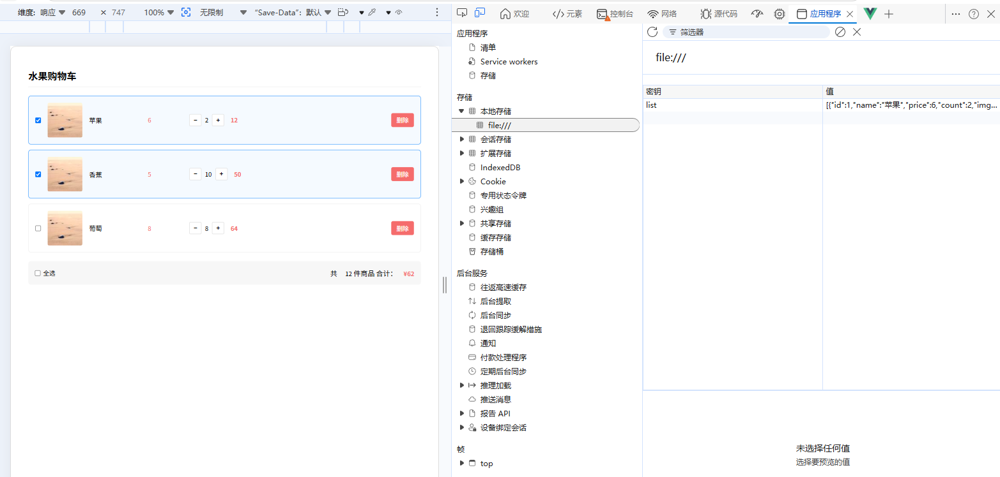

## 功能需求分析

购物车模块共包含以下六个功能需求：

1. **动态渲染**：根据商品数据列表渲染购物车条目，支持结构互斥显示（有数据时显示购物车主体，无数据时显示空状态）。
2. **删除功能**：点击删除按钮移除指定商品，通过 ID 过滤原数组实现数据更新。
3. **数量修改**：通过加减按钮调整单个商品购买数量，需限制最小值为 1。
4. **全选/反选**：底部全选复选框状态由所有商品选中状态动态计算；勾选/取消全选时同步更新所有商品选中状态。
5. **选中项统计**：实时统计已选商品的总数量与总价，仅计入 `is_checked` 为 `true` 的条目。
6. **本地持久化**：将用户操作后的购物车数据序列化后存入 `localStorage`，页面刷新后从本地读取并初始化状态。

> **说明**：本案例未调用后端接口，所有数据操作均在前端完成，`localStorage` 作为持久化存储方案。

## 样式模板

### CSS

```css
<style>
  * {
    margin: 0;
    padding: 0;
    box-sizing: border-box;
    font-size: 14px;
  }
  .cart-wrap {
    width: 900px;
    margin: 50px auto;
  }
  .cart-title {
    font-size: 22px;
    margin-bottom: 20px;
    padding-bottom: 10px;
    border-bottom: 1px solid #eee;
  }
  /* 空购物车样式 */
  .empty-cart {
    padding: 80px 0;
    text-align: center;
    color: #999;
    font-size: 16px;
  }
  /* 购物车商品项 */
  .cart-item {
    display: flex;
    align-items: center;
    padding: 15px;
    border: 1px solid #eee;
    border-radius: 6px;
    margin-bottom: 12px;
    gap: 15px;
  }
  /* 商品选中高亮 */
  .cart-item.active {
    border-color: #409eff;
    background-color: #f5faff;
  }
  .cart-item img {
    width: 80px;
    height: 80px;
    object-fit: cover;
    border-radius: 4px;
  }
  .item-name {
    width: 120px;
    font-size: 15px;
  }
  .price {
    width: 80px;
    color: #f56c6c;
  }
  /* 数量加减区域 */
  .count-box {
    display: flex;
    align-items: center;
    gap: 8px;
  }
  .count-box button {
    width: 28px;
    height: 28px;
    border: 1px solid #ddd;
    background: #fff;
    cursor: pointer;
    border-radius: 3px;
  }
  .count-box button:disabled {
    background: #f5f5f5;
    color: #ccc;
    cursor: not-allowed;
  }
  .subtotal {
    width: 90px;
    color: #f56c6c;
    font-weight: bold;
  }
  .del-btn {
    margin-left: auto;
    padding: 6px 12px;
    border: none;
    background: #f56c6c;
    color: #fff;
    border-radius: 4px;
    cursor: pointer;
  }
  /* 底部结算栏 */
  .cart-footer {
    margin-top: 20px;
    display: flex;
    align-items: center;
    padding: 15px;
    background: #f7f7f7;
    border-radius: 6px;
  }
  .check-all {
    display: flex;
    align-items: center;
    gap: 6px;
  }
  .total-info {
    margin-left: auto;
    font-size: 16px;
  }
  .total-info span {
    margin-left: 15px;
  }
</style>
```

### HTML

```html
<div id="app" class="cart-wrap">
  <h2 class="cart-title">水果购物车</h2>
  <!-- 购物车主体 / 空状态互斥 预留v-if位置 -->
  <div class="cart-body">
    <!-- 商品列表循环 预留v-for、:key、:class位置 -->
    <div class="cart-item">
      <!-- 单选框 预留v-model -->
      <input type="checkbox">
      <!-- 商品图片 预留:src -->
      
      <!-- 商品名称 预留插值 -->
      <div class="item-name">商品名称占位</div>
      <!-- 单价 预留插值 -->
      <div class="price">¥单价占位</div>
      <!-- 数量加减 -->
      <div class="count-box">
        <!-- 减号按钮 预留@click、:disabled -->
        <button>−</button>
        <!-- 数量展示 预留插值 -->
        <span class="count">数量占位</span>
        <!-- 加号按钮 预留@click -->
        <button>+</button>
      </div>
      <!-- 小计 预留插值计算 -->
      <div class="subtotal">¥小计占位</div>
      <!-- 删除按钮 预留@click -->
      <button class="del-btn">删除</button>
    </div>
  </div>
  <!-- 空购物车 预留v-else -->
  <div class="empty-cart">
    购物车空空如也，快去添加商品吧~
  </div>
  <!-- 底部全选 + 统计区域 预留v-if -->
  <div class="cart-footer">
    <label class="check-all">
      <!-- 全选框 预留v-model -->
      <input type="checkbox">
      全选
    </label>
    <div class="total-info">
      共 <span>总件数占位</span> 件商品
      合计：<span style="color:#f56c6c;font-weight:bold">¥总价占位</span>
    </div>
  </div>
</div>
```

### Vue实例

```Vue
<script>
new Vue({
  el: '#app',
  data:{
    fruitList: [
      { id: 1, name: '苹果', price: 6, count: 2, img: 'https://picsum.photos/80/80', is_checked: true },
      { id: 2, name: '香蕉', price: 5, count: 10, img: 'https://picsum.photos/80/80', is_checked: true },
      { id: 3, name: '葡萄', price: 8, count: 8, img: 'https://picsum.photos/80/80', is_checked: false },
    ],
  }
});
</script>
```

>这里使用[picsum](https://picsum.photos)随机图片。

## 渲染功能实现

### 结构互斥控制

购物车主体区域与空状态区域互斥显示，使用 `v-if` / `v-else` 实现条件渲染：

```html
<!-- 购物车主体（有数据时显示） -->
<div class="cart-body" v-if="fruitList.length > 0">
  <!-- 商品列表渲染区域 -->
</div>

<!-- 空状态（无数据时显示） -->
<div class="empty-cart" v-else>
  购物车空空如也，快去添加商品吧~
</div>

<!-- 底部全选 + 统计区域 （有数据时显示） -->
<div class="cart-footer" v-if=" fruitList.length > 0"></div>
```

- `v-if="fruitList.length > 0"` 判断数据是否存在；
- `v-else` 自动绑定互斥逻辑，无需重复条件表达式。

### 商品列表动态渲染

使用 `v-for` 指令遍历 `fruitList` 数组，生成商品条目：

```html
<div class="cart-item" v-for="item in fruitList" :key="item.id">
  <!-- 单条商品结构 -->
</div>
```

- **`:key` 必须绑定唯一标识**：优先使用 `item.id`，确保虚拟 DOM 更新准确性；
- **仅保留一个模板节点**：删除冗余静态条目，由 `v-for` 动态生成全部实例。

### 表单项与数据绑定

#### 选中状态绑定

使用 `v-model` 双向绑定复选框状态至 `item.is_checked`：

```html
<input type="checkbox" v-model="item.is_checked">
```

- `v-model` 自动同步视图与数据，`item.is_checked` 为布尔值；
- 初始值决定默认选中状态（`true` 选中，`false` 未选中）。

#### 图片与文本内容动态渲染

- 图片 `src` 属性使用 `v-bind:src`（简写 `:`）绑定：

  ```html
  
  ```

- 单价、数量、小计使用插值语法 `{{ }}` 渲染：

  ```html
  <div class="item-name">{{item.name}}</div>
  <span class="price">{{ item.price }}</span>
  <span class="count">{{ item.count }}</span>
  <span class="subtotal">{{ item.price * item.count }}</span>
  ```

### 动态样式控制

选中状态对应 `.active` 样式类，使用对象语法动态绑定：

```html
<div class="cart-item" :class="{ active: item.is_checked }" v-for="item in fruitList" :key="item.id">
```

- `:class` 接收对象，键为类名，值为布尔表达式；
- `item.is_checked` 值变化时，`.active` 类自动添加或移除；
- `v-model` 与 `:class` 协同工作，实现视图与状态完全同步。

> **关键点总结**：渲染功能实现分为三步——  
> （1）使用 `v-if`/`v-else` 控制整体结构显隐；  
> （2）使用 `v-for` + `:key` 渲染列表；  
> （3）使用 `v-model` 绑定表单状态，`:class` 动态控制样式。

## 删除与数量修改功能

### 删除功能实现

#### 事件注册与参数传递

为删除按钮绑定点击事件，传递当前商品 ID：

```html
<button @click="handleDelete(item.id)">删除</button>
```

#### 数据过滤逻辑

在 `methods` 中定义 `handleDelete` 方法，使用 `filter()` 创建新数组：

```javascript
methods: {
  handleDelete(id) {
    this.fruitList = this.fruitList.filter(item => item.id !== id);
  }
}
```

- `filter()` 返回满足条件的新数组，不修改原数组；
- `item.id !== id` 保留非目标项，实现逻辑删除。

### 数量修改功能

#### 加减按钮事件绑定

为加减按钮分别绑定事件，传递商品 ID：

```html
<button @click="handleAdd(item.id)">+</button>
<button @click="handleSub(item.id)">−</button>
```

#### 查找与更新逻辑

使用 `find()` 定位目标商品，直接修改其 `count` 属性：

```javascript
methods: {
  handleAdd(id) {
    const item = this.fruitList.find(item => item.id === id);
    if (item) item.count++;
  },
  handleSub(id) {
    const item = this.fruitList.find(item => item.id === id);
    if (item && item.count > 1) item.count--;
  }
}
```

- `find()` 返回匹配的第一项引用，可直接修改属性；
- 减操作增加边界判断 `item.count > 1`，防止数量小于 1。

#### 减号按钮禁用控制

使用 `:disabled` 动态绑定禁用状态，与`if (item && item.count > 1) item.count--;`不同的是`:disabled`会把按钮禁用，而边界判断只是单纯减不下去。

```html
<button @click="handleSub(item.id)" :disabled="item.count <= 1">−</button>
```

- `:disabled` 值为 `true` 时按钮不可点击；
- `item.count <= 1` 确保数量为 1 时禁用减号。

> **关键点总结**：
>
> - 删除：`@click` 传参 → `filter()` 生成新数组；  
> - 修改数量：`@click` 传参 → `find()` 获取引用 → 直接修改 `count`；  
> - 边界控制：减操作前校验 `count > 1`，并通过 `:disabled` 同步 UI 状态。

## 全选/反选功能实现

### 计算属性完整写法

全选状态 `isAll` 由所有商品选中状态计算得出，且需支持双向同步，必须使用计算属性的 `get`/`set` 完整写法：

```javascript
computed: {
  isAll: {
    get() {
      return this.fruitList.length > 0 
        ? this.fruitList.every(item => item.is_checked) 
        : false;
    },
    set(value) {
      this.fruitList.forEach(item => {
        item.is_checked = value;
      });
    }
  }
}
```

#### `get` 方法逻辑

- `every()` 遍历所有商品，要求每一项 `item.is_checked` 均为 `true` 才返回 `true`；
- `this.fruitList.length > 0` 防止空数组时 `every()` 返回 `true`（空数组 `every` 默认返回 `true`）；
- 返回值决定全选复选框的初始状态。

#### `set` 方法逻辑

- `value` 为用户操作全选框时传入的新布尔值；
- `forEach()` 遍历所有商品，统一设置 `item.is_checked = value`；
- 实现全选框状态变更时，所有商品同步更新。

### 模板绑定

```html
<input type="checkbox" v-model="isAll">
```

- `v-model` 自动关联 `isAll` 的 `get` 和 `set`；
- 用户勾选触发 `set(true)`，取消触发 `set(false)`。

> **关键点总结**：全选/反选必须使用计算属性完整写法；
>
> - `get` 实现“子项控制父项”（所有商品状态决定全选框）；  
> - `set` 实现“父项控制子项”（全选框状态同步所有商品）；  
> - `every()` 是判断“全部满足条件”的标准数组方法。

## 选中项统计功能

### 总数量统计

使用 `reduce()` 对选中商品的 `count` 累加：

```javascript
computed: {
  totalCount() {
    return this.fruitList.reduce((sum, item) => {
      return item.is_checked ? sum + item.count : sum;
    }, 0);
  }
}
```

- `reduce()` 初始值设为 `0`；
- 回调函数中判断 `item.is_checked`，仅对选中项累加 `item.count`；
- 未选中项返回 `sum`（不累加），保持累加器不变。

### 总价统计

逻辑同总数量，但累加项为 `item.count * item.price`：

```javascript
computed: {
  totalPrice() {
    return this.fruitList.reduce((sum, item) => {
      return item.is_checked ? sum + item.count * item.price : sum;
    }, 0);
  }
}
```

### 模板渲染

```html
<div class="cart-footer">
  <span>共 {{ totalCount }} 件</span>
  <span>总计 ¥{{ totalPrice }}</span>
</div>
```

> **关键点总结**：
>
> - 统计功能必须使用 `computed`，确保响应式更新；  
> - `reduce()` 是求和的标准方法，初始值必须明确；  
> - 条件判断（`item.is_checked`）必须置于累加逻辑内，确保仅统计选中项。

## 本地持久化功能

### 数据变更监听

使用 `watch` 深度监听 `fruitList`，触发 `localStorage` 写入：

```javascript
watch: {
  fruitList: {
    handler(newVal) {
      localStorage.setItem('list', JSON.stringify(newVal));
    },
    deep: true,
    immediate: true
  }
}
```

- `deep: true` 启用深度监听，捕获嵌套属性变化；
- `immediate: true` 在组件创建时立即执行一次 handler（确保初始数据写入）；
- `JSON.stringify()` 将数组序列化为字符串后存入。



### 初始化数据读取

在 `data()` 中从 `localStorage` 读取并解析初始数据：

```javascript
// 默认数据（当 localStorage 为空时使用）
const defaultList = [
      { id: 1, name: '苹果', price: 6, count: 2, img: 'https://picsum.photos/80/80', is_checked: true },
      { id: 2, name: '香蕉', price: 5, count: 10, img: 'https://picsum.photos/80/80', is_checked: true },
      { id: 3, name: '葡萄', price: 8, count: 8, img: 'https://picsum.photos/80/80', is_checked: false },
];
data:{
    // 优先从 localStorage 读取，失败则使用默认数据
    fruitList: JSON.parse(localStorage.getItem('list')) || defaultList
},
```

- `localStorage.getItem('list')` 读取字符串；
- `|| defaultList` 提供兜底数据，避免 `null` 导致解析错误；
- `JSON.parse()` 将字符串还原为数组对象。

### 异常处理说明

- 若用户清空 `localStorage`，`getItem()` 返回 `null`；
- `JSON.parse(null)` 抛出错误，故必须使用 `||` 提供默认值；
- 默认值应为有效数组，确保后续 `v-for` 渲染正常。

> **关键点总结**：
>
> - 写入：`watch` + `deep: true` + `JSON.stringify()`；  
> - 读取：`localStorage.getItem()` + `JSON.parse()` + 默认值兜底；  
> - 持久化时机：任何 `fruitList` 变更（增删改选中状态）均触发存储。

## 完整代码

```html
<!DOCTYPE html>
<html lang="zh-CN">

<head>
  <meta charset="UTF-8">
  <title>Vue2 购物车案例</title>
  <!-- 引入Vue2 CDN -->
  <script src="https://cdn.jsdelivr.net/npm/vue@2/dist/vue.js"></script>
  <!-- CSS同上-->
  <style></style>
</head>
<body>
<div id="app" class="cart-wrap">
  <h2 class="cart-title">水果购物车</h2>
  <!-- 购物车主体 / 空状态互斥 预留v-if位置 -->
  <div class="cart-body" v-if="fruitList.length > 0">
    <!-- 商品列表循环 预留v-for、:key、:class位置 -->
    <div class="cart-item" :class="{ active: item.is_checked }" v-for="item in fruitList" :key="item.id">
      <!-- 单选框 预留v-model -->
      <input type="checkbox"  v-model="item.is_checked">
      <!-- 商品图片 预留:src -->
      
      <!-- 商品名称 预留插值 -->
      <div class="item-name">{{item.name}}</div>
      <!-- 单价 预留插值 -->
      <div class="price">{{ item.price }}</div>
      <!-- 数量加减 -->
      <div class="count-box">
        <!-- 减号按钮 预留@click、:disabled -->
        <button @click="handleSub(item.id)" :disabled="item.count <= 1">−</button>
        <!-- 数量展示 预留插值 -->
        <span class="count">{{ item.count }}</span>
        <!-- 加号按钮 预留@click -->
        <button @click="handleAdd(item.id)">+</button>
      </div>
      <!-- 小计 预留插值计算 -->
      <div class="subtotal">{{ item.price * item.count }}</div>
      <!-- 删除按钮 预留@click -->
      <button class="del-btn" @click="handleDelete(item.id)">删除</button>
    </div>
  </div>
  <!-- 空购物车 预留v-else -->
  <div class="empty-cart" v-else>
    购物车空空如也，快去添加商品吧~
  </div>
  <!-- 底部全选 + 统计区域 预留v-if -->
  <div class="cart-footer" v-if=" fruitList.length > 0">
    <label class="check-all">
      <!-- 全选框 预留v-model -->
      <input type="checkbox" v-model="isAll">
      全选
    </label>
    <div class="total-info">
      共 <span>{{totalCount}}</span> 件商品
      合计：<span style="color:#f56c6c;font-weight:bold">¥{{totalPrice}}</span>
    </div>
  </div>
</div>

<script>
// 默认数据（当 localStorage 为空时使用）
const defaultList = [
      { id: 1, name: '苹果', price: 6, count: 2, img: 'https://picsum.photos/80/80', is_checked: true },
      { id: 2, name: '香蕉', price: 5, count: 10, img: 'https://picsum.photos/80/80', is_checked: true },
      { id: 3, name: '葡萄', price: 8, count: 8, img: 'https://picsum.photos/80/80', is_checked: false },
    ];
new Vue({
  el: '#app',
  data:{
    // 优先从 localStorage 读取，失败则使用默认数据
    fruitList: JSON.parse(localStorage.getItem('list')) || defaultList
  },
  methods: {
    handleDelete(id) {
      this.fruitList = this.fruitList.filter(item => item.id !== id);
    },
    handleAdd(id) {
      const item = this.fruitList.find(item => item.id === id);
      if (item) item.count++;
    },
    handleSub(id) {
      const item = this.fruitList.find(item => item.id === id);
      if (item) item.count--;
    }
  },
  computed: {
    isAll: {
      get() {
        return this.fruitList.length > 0 
          ? this.fruitList.every(item => item.is_checked) 
          : false;
      },
      set(value) {
        this.fruitList.forEach(item => {
          item.is_checked = value;
        });
      }
    },
    totalCount() {
      return this.fruitList.reduce((sum, item) => {
        return item.is_checked ? sum + item.count : sum;
      }, 0);
    },
    totalPrice() {
      return this.fruitList.reduce((sum, item) => {
        return item.is_checked ? sum + item.count * item.price : sum;
      }, 0);
    }
  },
  watch: {
  fruitList: {
    handler(newVal) {
      localStorage.setItem('list', JSON.stringify(newVal));
    },
    deep: true,
    immediate: true
  }
}
});
</script>
</body>
</html>
```

## 综合知识点回顾

| 功能模块 | 核心技术点 | 关键代码特征 |
|----------|------------|--------------|
| **渲染** | `v-if`/`v-else`、`v-for`、`v-model`、`:class` | `v-for="item in list"` + `:key="item.id"` + `:class="{ active: item.is_checked }"` |
| **删除** | 事件传参、`filter()` | `@click="handleDelete(id)"` + `list.filter(item => item.id !== id)` |
| **数量修改** | `find()`、边界判断、`:disabled` | `list.find(item => item.id === id)` + `item.count > 1` + `:disabled="item.count <= 1"` |
| **全选/反选** | 计算属性 `get`/`set`、`every()` | `computed: { isAll: { get() { ... }, set(value) { ... } } }` |
| **统计** | `computed`、`reduce()`、条件累加 | `list.reduce((sum, item) => item.is_checked ? sum + ... : sum, 0)` |
| **持久化** | `watch` 深度监听、`localStorage`、JSON 序列化 | `watch: { list: { deep: true, handler() { ... } } }` |

> **工程规范强调**：
>
> - 所有 `v-for` 必须绑定 `:key`；
> - 复杂数据操作优先使用不可变方式（如 `filter()` 返回新数组）；
> - 用户输入相关状态必须双向绑定（`v-model`）；
> - 本地存储必须处理 `null` 边界情况；
> - 计算属性仅用于派生状态，禁止在其中执行副作用操作。
