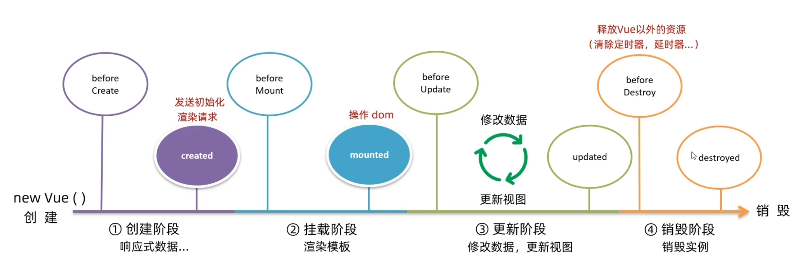

## Vue 实例生命周期概述

Vue 实例的**生命周期**是指一个 Vue 实例从创建到销毁所经历的完整过程。该过程始于 `new Vue()` 的调用，终于实例被完全移除内存（如页面关闭或显式销毁）。整个生命周期被划分为四个逻辑阶段：**创建阶段**、**挂载阶段**、**更新阶段**和**销毁阶段**。Vue 2 提供了八个生命周期钩子函数，每个阶段执行特定的初始化或清理任务，开发者可通过生命周期钩子函数在关键节点插入自定义逻辑。



### 生命周期钩子函数

**`created`** 和 **`mounted`** 是最常用且必须掌握的两个钩子，分别适用于不同场景：

- **`created`** 钩子在实例完成数据观测、属性和方法的运算、`watch/event` 事件配置之后被调用，此时**尚未挂载 DOM**，但响应式数据已就绪；
- **`mounted`** 钩子在实例挂载完成后被调用，此时 **`el`** 已被新创建的 `vm.$el` 替换，并挂载到实例上，**DOM 已渲染完成**，可安全操作真实 DOM 元素。

> **关键原则**：
>
> - 若需访问或修改响应式数据（如发起初始请求），应使用 **`created`**；  
> - 若需直接操作 DOM（如获取焦点、初始化第三方库、测量元素尺寸），必须等待 **`mounted`** 及之后的钩子。

### 四个核心阶段及其职责

1. **创建阶段（Creation）**  
   - 主要任务：完成 Vue 实例的初始化配置与响应式数据准备。  
   - 具体工作包括：  
     - 解析 `data`、`props`、`computed`、`methods` 等选项；  
     - 将 `data` 中的普通 JavaScript 对象转换为**响应式数据**，即通过 `Object.defineProperty` 建立 getter/setter 监听；  
     - 初始化事件系统、计算属性依赖收集等内部机制。  
   - **关键结论**：此阶段结束后，所有 `data` 属性已具备响应式能力，修改其值将触发视图更新。

2. **挂载阶段（Mounting）**  
   - 主要任务：将 Vue 实例的模板编译为真实 DOM，并将其挂载至指定容器元素。  
   - 具体工作包括：  
     - 编译模板（Template Compilation），生成渲染函数；  
     - 执行首次虚拟 DOM 渲染（Virtual DOM Reconciliation）；  
     - 将生成的真实 DOM 插入浏览器文档流（Document Flow）。  
   - **关键结论**：挂载完成后，页面中可见的结构即为 Vue 渲染结果，此时 DOM 节点已就绪。

3. **更新阶段（Updating）**  
   - 主要任务：响应数据变化，重新计算并更新视图。  
   - 触发条件：当响应式数据被修改时（如赋值操作、数组方法调用等）。  
   - 执行流程：  
     - 数据变更 → 触发依赖通知 → 重新执行渲染函数 → 对比新旧虚拟 DOM → 更新真实 DOM。  
   - **关键特性**：该阶段具有**循环性**，可多次触发；而创建与挂载阶段仅执行一次。

4. **销毁阶段（Destruction）**  
   - 主要任务：释放 Vue 实例占用的资源，解除所有绑定关系。  
   - 具体工作包括：  
     - 移除所有事件监听器；  
     - 清理定时器、异步请求等外部资源引用；  
     - 解除与父组件的关联；  
     - 将实例标记为不可用状态。  
   - **关键结论**：销毁后，实例不再响应数据变化，也不再参与任何 Vue 内部机制。

## 生命周期钩子函数详解

Vue 为每个生命周期阶段提供了两个钩子函数，分别在阶段**开始前**与**结束后**自动调用。八个标准钩子按执行顺序排列如下：

| 阶段 | 钩子名称 | 执行时机 | 典型用途 |
|------|----------|----------|----------|
| 创建 | `beforeCreate` | 实例初始化之后、数据观测和事件配置之前 | **不可访问 `this.data` 或 `this.methods`**；极少使用 |
|      | `created` | 数据观测、属性和方法的运算已完成，`data` 已转为响应式，但尚未挂载到 DOM | **发送初始化请求**、初始化非响应式数据、启动定时器 |
| 挂载 | `beforeMount` | 模板编译完成、首次渲染前，`$el` 未替换为真实 DOM | 访问原始模板字符串（含插值语法）；调试用途 |
|      | `mounted` | 实例挂载完成，`$el` 已替换为真实 DOM 并插入文档 | **操作 DOM 元素**、初始化第三方库（如 Chart.js）、获取 DOM 尺寸 |
| 更新 | `beforeUpdate` | 数据更新导致重新渲染前，虚拟 DOM 已重新生成，但真实 DOM 尚未更新 | 获取更新前的 DOM 状态；记录性能指标 |
|      | `updated` | 虚拟 DOM 重绘和打补丁完成后，真实 DOM 已更新 | **操作更新后的 DOM**；避免在此触发新状态变更（防死循环） |
| 销毁 | `beforeDestroy` | 实例销毁前，所有指令、事件监听器、子组件仍有效 | **清理外部资源**（如 clearInterval、 clearTimeout）、解绑全局事件 |
|      | `destroyed` | 实例销毁后，所有绑定、监听器、子实例均已被移除 | 仅用于确认销毁完成；不可再访问 `this` |

### （一）重点钩子函数规范说明

#### `created` 钩子

- **执行时机**：响应式数据初始化完毕后，模板编译前。  
- **核心能力**：  
  - 可安全访问 `this.data`、`this.methods`、`this.computed`；  
  - 可发起 HTTP 请求并将响应数据赋值给响应式属性（如 `this.list = response.data`）；  
  - 支持同步/异步操作，不依赖 DOM 存在。  
- **禁止行为**：  
  - 不得访问 `this.$el`（此时 DOM 未生成）；  
  - 不得直接操作 DOM 节点。  
- **典型代码示例**：

  ```javascript
  async created() {
    try {
        // 发送初始化数据请求
        const response = await axios.get('/api/data')
        // 将响应数据赋值给 data 中的 list 属性
        this.list = response.data.data
    } catch (error) {
        console.error('初始化请求失败', error);
    }
  }
  ```

#### `mounted` 钩子

- **执行时机**：模板渲染完成，真实 DOM 已挂载至页面。  
- **核心能力**：  
  - `this.$el` 指向挂载容器的真实 DOM 元素；  
  - 可通过原生 DOM API 或 `this.$refs` 安全操作 DOM；  
  - 适合集成依赖 DOM 的第三方库（如地图 SDK、富文本编辑器）。  
- **禁止行为**：  
  - 不应在其中修改响应式数据以触发新渲染（易引发无限循环）；  
  - 避免执行耗时同步操作阻塞主线程。  
- **典型代码示例**：

  ```javascript
  mounted() {
    // 获取并操作 DOM 元素
    const header = this.$el.querySelector('h3');
    console.log('挂载后标题内容：', header.textContent);

    // 初始化图表库
    this.chart = new Chart(this.$refs.canvas, {
      type: 'bar',
      data: this.chartData
    });
  }
  ```

### （二）其他钩子函数使用场景

- `beforeUpdate` 与 `updated`：适用于需要对比 DOM 变更前后状态的场景，例如实现动画过渡、性能监控。需注意 `updated` 中修改数据会再次触发更新，应谨慎使用。
- `beforeDestroy`：**必须用于清理非 Vue 管理的资源**，包括但不限于：  
  - `setInterval` / `setTimeout` 返回的 ID；  
  - `addEventListener` 绑定的全局事件（如 `window.resize`）；  
  - WebSocket 连接、Canvas 动画帧请求。  
- `destroyed`：仅作状态确认，无实际业务逻辑价值；实例已不可用，`this` 上所有属性均失效。

## 生命周期执行顺序验证

以下为 Vue 实例完整生命周期中八个钩子的标准执行序列（按时间先后）：

1. `beforeCreate`  
2. `created`  
3. `beforeMount`  
4. `mounted`  
5. （用户交互触发数据变更）  
6. `beforeUpdate`  
7. `updated`  
8. （调用 `$destroy()` 或页面关闭）  
9. `beforeDestroy`  
10. `destroyed`

> **验证要点**：
>
> - `created` 中可访问响应式数据，`beforeCreate` 中访问 `this.xxx` 将返回 `undefined`；  
> - `mounted` 中 `document.querySelector()` 可获取渲染后的 DOM，`beforeMount` 中获取的是含插值语法的原始模板；  
> - `beforeUpdate` 中 DOM 内容仍为旧值，`updated` 中已同步为新值；  
> - `beforeDestroy` 执行后，实例仍可响应事件，`destroyed` 执行后所有 Vue 功能终止。


## 实践与注意事项

### （一）开发规范

- **初始化请求统一置于 `created`**：确保响应式数据已就绪，避免赋值失败。  
- **DOM 操作严格限定于 `mounted` 及之后**：杜绝在 `created` 或 `beforeMount` 中操作不存在的节点。  
- **资源清理必须在 `beforeDestroy` 中完成**：防止内存泄漏，尤其注意定时器、事件监听器、WebSocket 连接。  
- **避免在 `updated` 中修改响应式数据**：否则将触发新一轮更新，可能导致栈溢出或性能问题。  

### （二）常见错误规避

- 错误：在 `beforeCreate` 中调用 `this.$http.get()` → 报错 `Cannot read property '$http' of undefined`。  
- 错误：在 `created` 中执行 `document.getElementById('app').style.display = 'none'` → 报错 `Cannot read property 'style' of null`（DOM 未生成）。  
- 错误：在 `mounted` 中频繁调用 `this.count++` → 引发连续 `beforeUpdate`/`updated` 循环。  
- 错误：销毁组件时未清除 `setInterval` → 定时器持续运行，消耗系统资源。

### （三）性能优化建议

- 对于复杂组件，可在 `beforeDestroy` 中手动取消未完成的 Axios 请求（使用 CancelToken）；  
- 使用 `v-if` 控制组件显示/隐藏时，若需彻底销毁，应配合 `key` 属性强制重建实例；  
- 大量列表渲染场景下，`updated` 钩子内避免执行高开销 DOM 查询，优先使用 `this.$refs` 或事件委托。

## 案例一：页面初始化数据请求与渲染

### 需求说明

实现新闻列表页面的初始化加载：进入页面时立即发送 HTTP 请求获取新闻数据，并将数据渲染至视图。

### 技术选型依据

- 数据请求必须在响应式系统就绪后执行；
- `beforeCreate` 钩子中 `this.data`、`this.methods` 等均未初始化，访问为 `undefined`；
- **`created` 钩子中，`data` 已完成响应式转换，`this` 可正常访问所有响应式属性与方法，是发起初始化请求的唯一正确时机**。

### 实现步骤

#### 模拟数据

```python
# 模拟新闻假数据
news_list = [
    {
        "id": 1,
        "title": "Vue组件初始化请求最佳实践",
        "source": "前端技术周刊",
        "time": "2026-06-27 10:30",
        "image": "https://picsum.photos/id/1011/300/200"
    },
    {
        "id": 2,
        "title": "created与mounted钩子请求区别详解",
        "source": "前端开发者平台",
        "time": "2026-06-27 11:15",
        "image": "https://picsum.photos/id/1025/300/200"
    },
]

from fastapi import APIRouter
# 创建路由实例
router = APIRouter(prefix="/news", tags=["新闻模拟接口"])
# 正常新闻列表接口 GET /news
@router.get("")
def get_news():
    return {
        "code": 200,
        "msg": "success",
        "data": news_list
    }
```

#### 步骤 1：定义响应式数据结构

在组件 `data` 选项中声明初始状态：

```js
data() {
  return {
    list: [] // 存储新闻列表数据的响应式数组
  }
}
```

#### 步骤 2：在 `created` 钩子中发起请求

与 `data` 同级定义 `created` 钩子，使用 `axios`（或其他 HTTP 库）发送请求：

```js
created() {
  this.fetchNewsList()
},
methods: {
  async fetchNewsList() {
    try {
      const response = await axios.get('http://127.0.0.1:8001/news')
      // 将响应数据赋值给 data 中的 list 属性
      this.list = response.data.data
    } catch (error) {
      console.error('获取新闻列表失败:', error)
    }
  }
}
```

> **注意**：
>
> - 请求结果必须显式赋值给 `this.list`，否则数据无法触发视图更新；  
> - `response.data.data` 为示例接口（后端挂起的接口）返回结构，实际需根据 API 文档调整路径。

#### 步骤 3：模板中使用 `v-for` 渲染列表

遍历 `list` 并渲染每条新闻：

```html
<ul>
  <li v-for="(item, index) in list" :key="item.id || index">
    <h3>{{ item.title }}</h3>
    <p>来源：{{ item.source }}</p>
    <p>发布时间：{{ item.time }}</p>
    
  </li>
</ul>
```

> **关键规范**：
>
> - `v-for` 必须配合 `:key` 使用，**优先使用唯一标识 `item.id`**；若无 `id`，可退化为 `index`，但不推荐在列表可能重排序时使用；  
> - 所有插值表达式 `{{ }}` 和指令绑定 `:` 均作用于 `this` 上下文，直接访问 `item` 属性即可。

#### 步骤 4：验证数据流完整性

- 刷新页面后，控制台输出请求成功日志；
- 浏览器开发者工具 → Vue Devtools → 查看组件 `data.list` 已填充有效数组；
- 页面 DOM 正确渲染全部新闻项，内容与响应数据一致。

### 完整代码

```html
<!DOCTYPE html>
<html lang="en">

<head>
    <meta charset="UTF-8">
    <meta name="viewport" content="width=device-width, initial-scale=1.0">
    <title>页面初始化数据请求与渲染</title>
    <script src="https://cdn.jsdelivr.net/npm/vue@2/dist/vue.js"></script>
    <!-- 新增：引入axios -->
    <script src="https://cdn.jsdelivr.net/npm/axios/dist/axios.min.js"></script>
</head>

<body>
<div id="app">
    <ul>
        <li v-for="(item, index) in list" :key="item.id || index">
            <h3>{{ item.title }}</h3>
            <p>来源：{{ item.source }}</p>
            <p>发布时间：{{ item.time }}</p>
            
        </li>
    </ul>
</div>
<script>
new Vue({
    el: "#app",
    data: {
        list: [],
    },
created() {
    this.fetchNewsList()
},
methods: {
  async fetchNewsList() {
    try {
      const response = await axios.get('http://127.0.0.1:8001/news')
      // 将响应数据赋值给 data 中的 list 属性
      this.list = response.data.data
    } catch (error) {
      console.error('获取新闻列表失败:', error)
    }
  }
}
})
</script>
</body>
</html>
```

## 案例二：DOM 操作——输入框自动获取焦点

### 需求说明

搜索页面加载后，使搜索输入框自动获得焦点，提升用户交互效率。

### 技术选型依据

- `autofocus` HTML 属性在 Vue 模板中**无效**，原因在于 Vue 的模板编译机制：初始 HTML 结构会被 Vue 解析并重建为虚拟 DOM，原生 `autofocus` 在重建过程中丢失；
- **只有在 `mounted` 钩子中，`vm.$el` 已挂载且真实 DOM 完全渲染完毕，方可安全执行 DOM 查询与操作**；
- 此阶段确保目标元素存在于文档中，且已完成 Vue 指令（如 `v-model`）的解析与绑定。

### 实现步骤

#### 步骤 1：模板中为输入框设置唯一标识

```html
<input type="text" id="searchInput" v-model="keyword" placeholder="请输入关键词">
```

#### 步骤 2：在 `mounted` 钩子中执行 DOM 操作

```js
data:{
    keyword: ""
},
mounted() {
  this.focusSearchInput()
},
methods: {
  focusSearchInput() {
    const input = document.querySelector('#searchInput')
    if (input) {
      input.focus()
    } else {
      console.warn('未找到 ID 为 searchInput 的输入框')
    }
  }
}
```

> **验证要点**：
>
> - 刷新页面后，光标应立即定位至输入框内；  
> - 在 Vue Devtools 中检查该元素是否已移除 `v-model` 指令标记（表明模板已编译完成），确认操作时机正确。

#### 步骤 3：替代方案（推荐使用 `ref`）

为增强可维护性与避免全局选择器冲突，建议采用 Vue 的 `ref` 特性：

```html
<input type="text" ref="searchInput" v-model="keyword" placeholder="请输入关键词">
```

```js
mounted() {
  this.$nextTick(() => {
    if (this.$refs.searchInput) {
      this.$refs.searchInput.focus()
    }
  })
}
```

> **说明**：`$nextTick` 确保在当前 DOM 更新循环结束后执行回调，适用于依赖 DOM 更新后的操作。

### 完整代码

```html
<!DOCTYPE html>
<html lang="en">
<head>
    <meta charset="UTF-8">
    <meta name="viewport" content="width=device-width, initial-scale=1.0">
    <title>DOM 操作——输入框自动获取焦点</title>
    <script src="https://cdn.jsdelivr.net/npm/vue@2/dist/vue.js"></script>
</head>
<body>
<div id="app">
    <input type="text" ref="searchInput" v-model="keyword" placeholder="请输入关键词">
</div>
<script>
new Vue({
    el: '#app',
    data:{
        keyword: ""
    },
    mounted() {
        this.$nextTick(() => {
            if (this.$refs.searchInput) {
                this.$refs.searchInput.focus()
            }
        })
    },
})
</script>
</body>
</html>
```

## 总结

Vue 2 的生命周期是理解框架运行机制的核心基础。掌握四个阶段的本质职责与八个钩子的精确执行时机，是编写健壮、可维护 Vue 应用的前提。开发者应明确：

- **`created` 是数据初始化与请求发起的唯一安全位置**；  
- **`mounted` 是 DOM 操作与第三方库集成的起始点**；  
- **`beforeDestroy` 是释放外部资源的强制责任区**。  

| 钩子名称      | 执行时机                     | 典型应用场景                                                                 |
|---------------|------------------------------|----------------------------------------------------------------------------|
| **`created`** | 实例创建完成，响应式数据就绪，**DOM 未挂载** | 初始化数据请求、计算属性依赖初始化、事件总线订阅、非 DOM 相关逻辑准备               |
| **`mounted`** | 实例挂载完成，**真实 DOM 已渲染**         | 访问/操作 DOM 元素、初始化第三方 UI 库（如 Chart.js）、启动定时器、添加全局事件监听器 |

其余钩子根据具体需求选择性使用，切忌滥用。熟练运用生命周期规则，可显著提升代码可靠性、可读性与运行效率。

### 必须遵守的工程实践准则

- **禁止在 `beforeCreate` 中访问 `this` 任何成员**：此时 `data`、`methods`、`computed` 均未初始化；
- **避免在 `created` 中操作 DOM**：`this.$el` 为 `undefined`，`document.querySelector` 可能返回 `null`；
- **`mounted` 是 DOM 操作的最低安全边界**：此前所有钩子均不能保证 DOM 存在；
- **资源清理义务**：在 `beforeDestroy`（Vue 2）中清除定时器、解绑事件监听器、销毁第三方实例，防止内存泄漏；
- **`key` 属性不可省略**：`v-for` 必须提供稳定、唯一的 `:key`，否则 Vue 无法高效复用节点，导致渲染异常或状态错乱。

### 进阶提示

- `updated` 钩子适用于依赖 DOM 更新后的异步操作（如滚动位置同步），但应谨慎使用以避免无限循环；
- `activated` / `deactivated` 仅适用于 `<keep-alive>` 包裹的组件，用于管理缓存组件的激活/停用状态；
- 所有生命周期钩子均为**实例方法**，通过 `this` 访问组件上下文，不可定义为箭头函数（会丢失 `this` 绑定）。''

## Vue 2 综合案例：记账本（前后端交互）

### 项目概述

本教程基于 Vue 2 框架，实现一个完整的前后端分离记账应用——“记账清单”。该应用包含表单录入、数据列表渲染、动态图表联动及消费统计功能，所有数据均通过 HTTP 请求与后端接口交互，实现**数据持久化**。

系统功能模块划分为以下四部分：

1. **基本渲染**：页面加载时发起 GET 请求获取账单列表，并完成 DOM 渲染与消费总额计算；
2. **添加功能**：用户输入消费名称与价格，通过 POST 请求提交至后端，成功后同步更新前端列表；
3. **删除功能**：点击对应账单的删除按钮，通过 DELETE 请求移除指定记录，随后刷新列表；
4. **图表联动**（后续扩展）：右侧图表随左侧列表数据变化实时更新（本节聚焦前三大核心功能）。

> **关键前提说明**：
>
> - 所有数据操作均依赖后端 RESTful 接口，**前端不维护本地持久状态**；  
> - 数据变更（增/删）仅作用于服务端，前端必须主动拉取最新数据以保持视图一致性；  
> - 本案例严格遵循 Vue 2 生命周期与响应式原理，不使用 Composition API 或 Vue 3 特性。

### 快速开始

#### 页面模板

```html
<div class="container">
  <h1>记账清单</h1>

  <div class="main-wrap">
    <!-- 左侧：添加表单 + 账单列表表格 -->
    <div class="left-box">
      <!-- 添加账单表单区域 -->
      <div class="card">
        <h3 class="card-title">新增消费账单</h3>
        <div class="form-row">
          <input class="input-name" placeholder="请输入消费名称" />
          <input class="input-price" type="number" placeholder="请输入消费价格" />
          <button class="btn-add">添加账单</button>
        </div>
      </div>

      <!-- 账单列表表格区域 -->
      <div class="card">
        <h3 class="card-title">账单列表</h3>
        <table>
          <thead>
            <tr>
              <th>编号</th>
              <th>消费名称</th>
              <th>消费价格（元）</th>
              <th>操作</th>
            </tr>
          </thead>
          <tbody>
            <!-- 此处后续v-for渲染，先空行占位 -->
            <tr>
              <td colspan="4">暂无账单数据</td>
            </tr>
            <!-- 示例静态行，方便看样式，后续vue渲染会替换 -->
            <!-- <tr>
              <td>1</td>
              <td>球鞋</td>
              <td class="red">1299.00</td>
              <td><button class="btn-del">删除</button></td>
            </tr> -->
          </tbody>
        </table>
        <!-- 消费总计 -->
        <div class="total-box">
          消费总计：<span class="total-price">0.00</span> 元
        </div>
      </div>
    </div>

    <!-- 右侧：饼图容器 -->
    <div class="right-box">
      <div class="card">
        <h3 class="card-title">消费占比饼图</h3>
        <!-- ECharts挂载容器，id固定为chart -->
        <div id="chart"></div>
      </div>
    </div>
  </div>
</div>
```

```css
<style>
    /* 全局重置 */
    * {
        margin: 0;
        padding: 0;
        box-sizing: border-box;
        font-family: "Microsoft YaHei", sans-serif;
    }
    body {
        background-color: #f5f7fa;
        padding: 30px;
        color: #333;
    }
    .container {
        max-width: 1200px;
        margin: 0 auto;
    }
    h1 {
        text-align: center;
        color: #222;
        margin-bottom: 30px;
        font-size: 26px;
    }
    /* 左右布局：表单+表格 | 饼图 */
    .main-wrap {
        display: flex;
        gap: 30px;
        flex-wrap: wrap;
    }
    .left-box {
        flex: 1;
        min-width: 600px;
    }
    .right-box {
        width: 1200px;
    }
    /* 卡片通用样式 */
    .card {
        background: #fff;
        border-radius: 10px;
        padding: 20px;
        box-shadow: 0 2px 12px rgba(0, 0, 0, 0.08);
        margin-bottom: 25px;
    }
    .card-title {
        font-size: 18px;
        margin-bottom: 18px;
        padding-bottom: 10px;
        border-bottom: 1px solid #eee;
    }
    /* 添加账单表单 */
    .form-row {
        display: flex;
        gap: 15px;
        align-items: center;
    }
    input {
        padding: 10px 14px;
        border: 1px solid #ddd;
        border-radius: 6px;
        font-size: 14px;
        outline: none;
        transition: border 0.2s;
    }
    input:focus {
        border-color: #409eff;
    }
    .input-name {
        width: 260px;
    }
    .input-price {
        width: 160px;
    }
    button {
        padding: 10px 22px;
        border: none;
        border-radius: 6px;
        cursor: pointer;
        font-size: 14px;
        transition: opacity 0.2s;
    }
    button:hover {
        opacity: 0.9;
    }
    .btn-add {
        background: #409eff;
        color: #fff;
    }
    .btn-del {
        background: #f56c6c;
        color: #fff;
        padding: 6px 12px;
        font-size: 13px;
    }
    /* 账单表格 */
    table {
        width: 100%;
        border-collapse: collapse;
        margin-top: 10px;
    }
    th,td {
        border: 1px solid #e4e7ed;
        padding: 12px;
        text-align: center;
        font-size: 14px;
    }
    th {
        background-color: #fafafa;
        font-weight: 600;
    }
    tbody tr:hover {
        background-color: #f8f9fa;
    }
    /* 高价文字红色高亮（对应文档动态class red） */
    .red {
        color: #f56c6c;
        font-weight: bold;
    }
    /* 消费总计 */
    .total-box {
        margin-top: 15px;
        font-size: 16px;
        font-weight: 500;
    }
    .total-price {
        color: #e6a23c;
        font-size: 20px;
        margin-left: 8px;
    }
    /* ECharts饼图容器（预留id=chart，固定宽高） */
    #chart {
        width: 100%;
        height: 400px;
        border: 1px solid #eee;
        border-radius: 8px;
    }
</style>
```

#### 后端模拟数据

生成模拟数据

```python
import json
import os
# 持久化文件路径
DATA_FILE = os.path.join(os.path.dirname(__file__), "bills.json")
# 初始化数据
def init_data():
    # 模拟数据库账单数组
    default_data = {
        "bill_list": [
            {"id": 1, "creator": "admin", "name": "牙刷", "price": 5},
            {"id": 2, "creator": "admin", "name": "牛奶", "price": 12},
            {"id": 3, "creator": "admin", "name": "笔记本", "price": 2500},
        ],
        "next_id": 4
    }
    # 文件不存在则创建并写入默认数据
    if not os.path.exists(DATA_FILE):
        with open(DATA_FILE, "w", encoding="utf-8") as f:
            json.dump(default_data, f, ensure_ascii=False, indent=2)
    # 读取文件
    with open(DATA_FILE, "r", encoding="utf-8") as f:
        return json.load(f)

# 加载数据
store = init_data()
bill_list = store["bill_list"]
next_id = store["next_id"]

# 保存数据到本地json文件
def save_data():
    global store
    store["bill_list"] = bill_list
    store["next_id"] = next_id
    with open(DATA_FILE, "w", encoding="utf-8") as f:
        json.dump(store, f, ensure_ascii=False, indent=2)
```

提供api

```python
from fastapi import APIRouter, Query, Body, Path
# 导入整个数据模块，不要解构
import mock.mock_bill_data as bill_data

router = APIRouter(prefix="/api/bills", tags=["账单Mock接口"])

# 查询
@router.get("")
def get_bill_list(creator: str | None = Query(None)):
    res_data = bill_data.bill_list
    if creator:
        res_data = [i for i in bill_data.bill_list if i["creator"] == creator]
    return {"code": 200, "data": res_data, "message": "ok"}

# 新增
@router.post("")
def add_bill(
    creator: str = Body(embed=True),
    name: str = Body(embed=True),
    price: int = Body(embed=True)
):
    new_bill = {
        "id": bill_data.next_id,
        "creator": creator,
        "name": name,
        "price": price
    }
    bill_data.bill_list.append(new_bill)
    bill_data.next_id += 1
    # 新增：写入本地文件持久化
    bill_data.save_data()
    return {"code": 200, "data": new_bill, "message": "ok"}

# 删除
@router.delete("/{id}")
def delete_bill(id: int = Path()):
    old_len = len(bill_data.bill_list)
    bill_data.bill_list = [i for i in bill_data.bill_list if i["id"] != id]
    if len(bill_data.bill_list) == old_len:
        return {"code": 400, "data": None, "message": "未找到该账单"}
    # 删除后同步写入文件
    bill_data.save_data()
    return {"code": 200, "data": None, "message": "ok"}
```

### 基本渲染功能实现

#### 功能目标

页面初始化时自动获取账单数据，渲染表格列表，并实时计算消费总额。

#### 实现步骤

##### 步骤 1：在 `created` 钩子中发起初始请求

```js
new Vue({
    el: '.container',
    data:{
        list: [] // 响应式数据：存储账单列表
    },
    created() {
        this.getList()
    },
    methods: {
        async getList() {
            try {
                const res = await axios.get('http://127.0.0.1:8001/api/bills', {
                    params: { creator: 'admin' } // 注意：此处为 params 对象
                })
                this.list = res.data.data // 将响应数据存入响应式属性
            } catch (err) {
                console.error('获取账单列表失败:', err)
            }
        }
    },
})
```

> **关键点说明**：
>
> - 必须在 `created` 生命周期钩子中调用，确保组件实例创建后立即执行；  
> - `await` 必须置于 `async` 函数内，否则语法报错；  
> - `res.data.data` 是接口约定的数据路径，需根据实际响应结构调整。

##### 步骤 2：模板中渲染账单列表

```html
<table>
    <thead>
    <tr>
        <th>编号</th>
        <th>消费名称</th>
        <th>消费价格（元）</th>
        <th>操作</th>
    </tr>
    </thead>
    <tbody>
    <tr v-if="list.length===0">
        <td colspan="4">暂无账单数据</td>
    </tr>
    <tr v-for="(item,index) in list" :key="item.id" v-else>
        <td>{{index+1}}</td>
        <td>{{item.name}}</td>
        <td :class="{red: item.price>500}">{{item.price.toFixed(2)}}</td>
        <td>
            <button>删除</button>
        </td>
    </tr>
    </tbody>
</table>
```

> **关键点说明**：
>
> - `v-for` 使用 `item.id` 作为 `:key`，确保列表更新的高效性；  
> - 编号采用 `index + 1` 实现连续序号；  
> - 价格保留两位小数：`.toFixed(2)`；  
> - 动态类名控制：`:class="{ red: item.price > 500 }"` 实现高亮逻辑。

##### 步骤 3：使用计算属性实现消费总额统计

```js
computed:{
    totalPrice(){
        return this.list.reduce((sum,item)=>sum+item.price,0).toFixed(2)
    }
}
```

模板中引用：

```html
<div>消费总计：{{ totalPrice }} 元</div>
```

> **关键点说明**：  
>
> - `computed` 属性具备响应式依赖追踪，当 `list` 变更时自动重新求值；  
> - `reduce` 初始值设为 `0`，避免空数组导致 `NaN`；  
> - 最终结果统一 `.toFixed(2)` 格式化。

### 添加功能实现

#### 功能目标

用户填写消费名称与价格，点击“添加账单”按钮后，向后端提交新记录，并刷新列表。

#### 实现步骤

##### 步骤 1：收集表单数据（双向绑定）

```js
new Vue({
  data() {
    return {
      list: [],
      name: '',   // 绑定消费名称输入框
      price: null // 绑定消费价格输入框（数值类型）
    }
  }
})
```

模板绑定：

```html
<input v-model.trim="name" class="input-name" placeholder="请输入消费名称" />
<input v-model.number="price" class="input-price" type="number" placeholder="请输入消费价格" />
<button @click="handleAdd" class="btn-add">添加账单</button>
```

> **关键点说明**：
>
> - `v-model.trim` 自动去除首尾空格；  
> - `v-model.number` 强制转换为数值类型，避免字符串拼接错误。

##### 步骤 2：定义添加方法并发送 POST 请求

```js
methods: {
  async handleAdd() {
    // 表单校验
    if (!this.name.trim()) {
      alert('请输入消费名称')
      return
    }
    if (typeof this.price !== 'number' || isNaN(this.price) || this.price <= 0) {
      alert('请输入正确的消费价格')
      return
    }

    try {
      await axios.post('/api/bills', {
        creator: 'admin',
        name: this.name,
        price: this.price
      })
      // 清空表单
      this.name = ''
      this.price = null
      // 重新渲染列表（关键！）
      this.getList()
    } catch (err) {
      console.error('添加账单失败:', err)
    }
  }
}
```

> **关键点说明**：
>
> - **必须执行 `this.getList()`**：添加操作仅修改服务端数据，前端需主动拉取最新状态；  
> - 校验逻辑前置，避免无效请求；  
> - 成功后清空输入框，提升用户体验。

### 删除功能实现

#### 功能目标

点击某条账单的“删除”按钮，向后端发送 DELETE 请求移除该记录，并刷新列表。

#### 实现步骤

##### 步骤 1：为删除按钮绑定事件并传参

```html
<td>
  <button @click="handleDelete(item.id)">删除</button>
</td>
```

##### 步骤 2：定义删除方法并发送 DELETE 请求

```js
methods: {
  async handleDelete(id) {
    if (!confirm('确认删除该账单？')) return
    try {
      await axios.delete(`/api/bills/${id}`)
      // 重新渲染列表（关键！）
      this.getList()
    } catch (err) {
      console.error('删除账单失败:', err)
    }
  }
}
```

> **关键点说明**：
>
> - DELETE 请求的 `id` 通过 URL 路径参数传递（`/api/bills/123`）；  
> - 使用 `confirm()` 提供二次确认，防止误操作；  
> - **必须执行 `this.getList()`**：删除操作仅影响服务端，前端需同步最新数据。

### ECharts图表的实现

#### 环境依赖

- [ECharts官网](https://echarts.apache.org/zh/index.html)
- [jsDelivr CDN引入](https://www.jsdelivr.com/package/npm/echarts)
- [本案例使用的饼图示例](https://echarts.apache.org/examples/zh/editor.html?c=pie-simple)

通过CDN引入`ECharts`

```js
<script src="https://cdn.jsdelivr.net/npm/echarts@6.1.0/dist/echarts.min.js"></script>
```

#### Vue 实例结构要求

- `data` 中定义用于存储业务数据的响应式属性（如 `list`）  
- `methods` 中封装数据请求与视图更新逻辑  
- 正确使用 Vue 生命周期钩子控制执行时序  

#### 初始化饼图实例（mounted 钩子中执行）

ECharts 图表初始化必须在 DOM 元素挂载完成后进行。**Vue 的 `mounted` 钩子是唯一安全执行 DOM 操作的时机**。

```js
new Vue({
    mounted() {
        // 1. 通过 document.querySelector 获取容器元素
        const chartDom = document.querySelector('#chart')
        // 2. 调用 echarts.init 初始化实例
        this.myChart = echarts.init(chartDom)
        // 3. 设置初始配置项（仅含基础结构，数据暂为空）
        this.myChart.setOption({
            title: {
                text: '消费账单列表',
                left: 'center'
            },
            tooltip: {
                trigger: 'item'
            },
            legend: {
                orient: 'vertical',
                left: 'left'
            },
            series: [
                {
                    name: '消费账单',
                    type: 'pie',
                    radius: '50%',
                    // 初始为空数组，后续动态填充
                    data: [
                        // { value: 2500, name: '笔记本' }, //样例数据
                    ],
                    emphasis: {
                        itemStyle: {
                            shadowBlur: 10,
                            shadowOffsetX: 0,
                            shadowColor: 'rgba(0, 0, 0, 0.5)'
                        }
                    }
                }
            ]
        })
    },
})
```

> **关键说明**：
>
> - `this.myChart` 必须挂载到 Vue 实例上（`this`），否则无法在其他方法中访问；  
> - 初始化配置中 `series.data` 设为 `[]`，为后续动态更新预留接口；  
> - **严禁在 `created` 或 `beforeMount` 中初始化图表**，此时 DOM 尚未生成，`querySelector` 将返回 `null`。

#### 动态更新饼图数据（数据获取后触发）

图表数据需随业务数据变化实时同步。更新操作通过 `setOption` 方法完成，**仅需传入待更新的配置片段，无需重复设置已存在的选项**。

##### 数据格式映射规则

假设原始账单数据结构为：

```js
[
  { name: '球鞋', price: 1299 },
  { name: '防晒霜', price: 789 }
]
```

ECharts `series.data` 要求格式为：

```js
[
  { value: 1299, name: '球鞋' },
  { value: 789, name: '防晒霜' }
]
```

##### 使用 map 方法完成格式转换

```js
// 在 methods 中定义数据请求方法
methods: {
    async getList() {
        try {
            const res = await axios.get('http://127.0.0.1:8001/api/bills', {
                params: { creator: 'admin' } // 注意：此处为 params 对象
            })
            this.list = res.data.data // 将响应数据存入响应式属性
        } catch (err) {
            console.error('获取账单列表失败:', err)
        }
            // 更新图表：仅传递 series.data 字段
        this.myChart.setOption({
            series: [{
                data: this.list.map(item => ({
                    value: item.price,
                    name: item.name
                }))
            }]
        })
    },
}
```

> **技术要点**：
>
> - `map` 返回新数组，不修改原数组，符合 Vue 响应式系统对不可变数据的要求；  
> - 箭头函数中直接返回对象字面量时，**必须用圆括号包裹** `({})`，避免语法解析错误；  
> - `setOption` 调用位置应在请求成功回调内，确保数据已更新至 `this.list`。

#### 配置项详解（核心字段说明）

| 配置项 | 类型 | 说明 | 是否必需 |
|--------|------|------|----------|
| `title.text` | String | 图表主标题文本 | 否（可省略） |
| `tooltip.trigger` | String | 提示框触发类型，`'item'` 表示悬停扇形区域时显示 | 是 |
| `legend.orient` | String | 图例布局方向，`'vertical'` 为垂直排列 | 否（默认 `'horizontal'`） |
| `legend.left` | String/Number | 图例水平位置，`'left'` 表示靠左对齐 | 否 |
| `series.type` | String | 图表类型，饼图固定为 `'pie'` | 是 |
| `series.radius` | String/Array | 饼图半径，支持 `'50%'` 或 `[‘30%’, ‘70%’]`（环形图） | 是 |
| `series.data` | Array | 数据项数组，每项为 `{ value: Number, name: String }` 结构 | 是 |

> **注意**：所有未在 `setOption` 中显式传入的配置项将保持初始化时的值，**无需重复设置**。

#### 生命周期与执行时序规范

| 阶段 | 执行时机 | 推荐钩子 | 典型操作 |
|------|----------|-----------|-----------|
| **初始化准备** | 组件实例创建后、DOM 挂载前 | `created` | 发起首次数据请求、定义响应式数据 |
| **DOM 操作入口** | 真实 DOM 节点已挂载完毕 | `mounted` | 初始化第三方库（ECharts、Swiper 等）、绑定事件监听器 |
| **数据驱动更新** | 业务数据变更后 | `methods` 内部 | 调用 `setOption`、触发 `v-for` 重渲染 |

> **反例警示**：
>
> - 在 `created` 中调用 `echarts.init()` → 报错 `Cannot read property 'init' of undefined`；  
> - 在 `data` 中直接声明 `myChart: null` → 无法在 `mounted` 外访问实例；  
> - `setOption` 传入完整配置对象而非增量更新 → 性能浪费且易覆盖已有配置。

#### 总结与实践建议

- **图表初始化必须与 DOM 生命周期严格对齐**：`mounted` 是 ECharts 初始化的**唯一合法入口**；  
- **数据更新遵循“最小化原则”**：仅通过 `setOption` 传递变更字段，避免全量重绘；  
- **数据转换是前端职责**：业务 API 返回的数据结构通常需经 `map`/`filter` 等方法适配可视化需求；  
- **封装复用性逻辑**：将 `getList` 抽离为独立方法，在添加、删除操作后统一调用，保障视图一致性；  
- **性能优化延伸**：当数据量较大时，可结合 `echarts.connect` 实现多图表联动，或启用 `renderAsImage` 提升渲染效率。