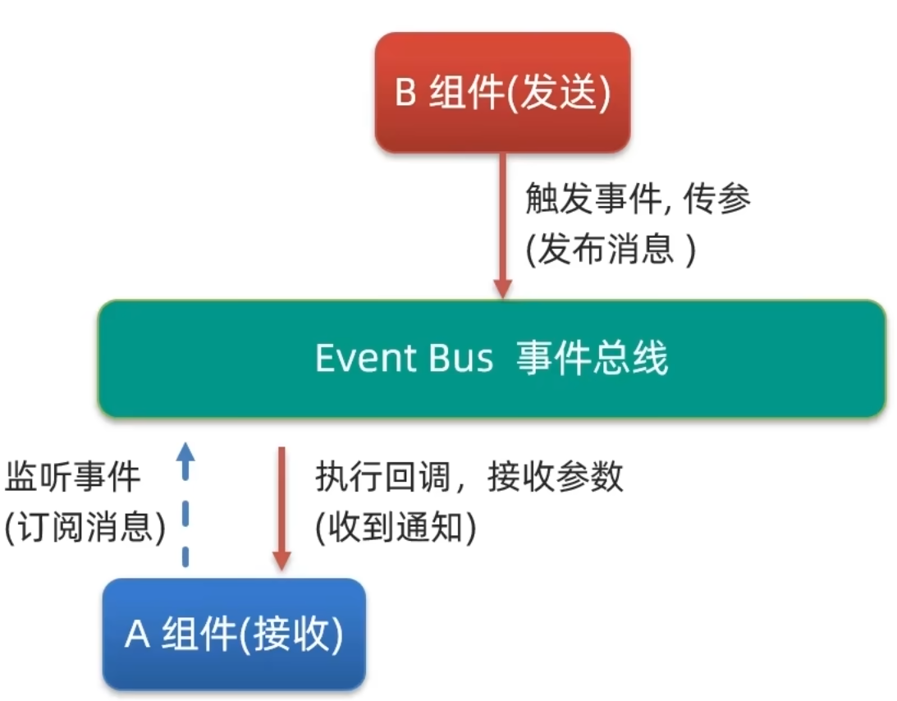
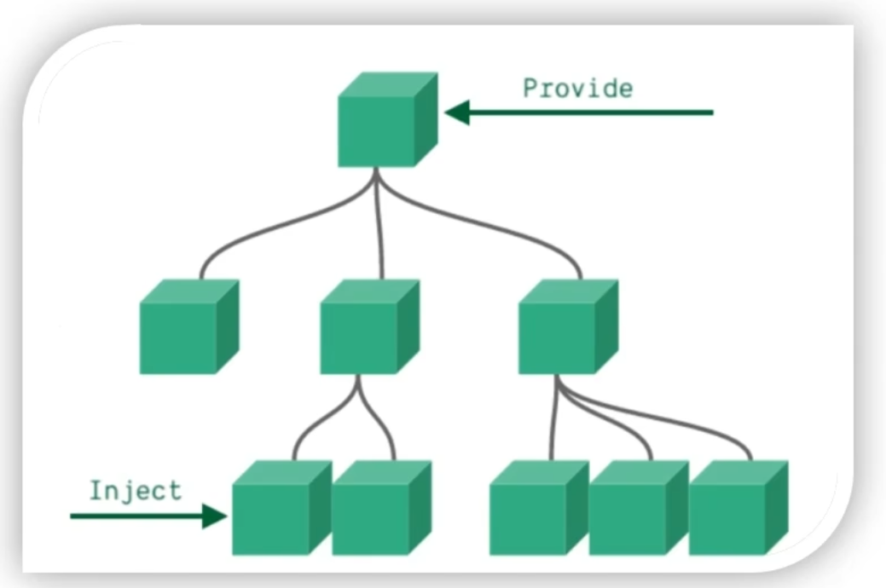

## 组件通信概述

组件通信是指**不同 Vue 组件之间进行数据传递与事件交互的机制**。Vue 采用单向数据流设计原则，每个组件的数据（`data`）具有独立作用域，**组件仅能直接访问自身定义的数据，无法直接读取或修改其他组件的数据**。

例如：组件 A 的 `data` 中定义的变量 `message`，在组件 B 的模板或逻辑中无法直接引用。若组件 B 需要使用该值，必须由组件 A 主动通过标准化的通信机制将数据传递给组件 B。

因此，组件通信的本质是**建立受控、可追溯、符合响应式原理的数据流动通道**，其具体方案的选择取决于组件之间的关系类型。

## 组件关系分类

在 Vue 应用中，组件间关系可严格划分为两类：

### 父子关系

- **定义**：一个组件（父组件）在模板中**直接渲染**另一个组件（子组件），即子组件标签作为父组件模板的一部分被声明。
- **判定标准**：存在明确的 DOM 包含层级，子组件实例由父组件创建并管理生命周期。
- **示例**：
  ```js
  <!-- 父组件 Parent.vue -->
  <template>
    <div>
      <Child /> <!-- Child 是 Parent 的直接子组件 -->
      <AnotherChild /> <!-- AnotherChild 同样是 Parent 的直接子组件 -->
    </div>
  </template>
  ```

### 非父子关系

- **定义**：两个组件**不存在直接的渲染包含关系**，既非父子，也非祖孙，彼此在组件树中无直接上下级关联。
- **常见场景**：兄弟组件、跨层级嵌套组件（如隔代）、不同路由下的组件、动态挂载的组件等。
- **关键特征**：无法通过 `props` / `$emit` 形成直连通信链路，需借助中间机制。

> **说明**：Vue 中不存在“全局共享数据”的隐式通信方式。所有通信均须显式声明、明确流向，以保障可维护性与可调试性。

## 组件通信方案总览

| 组件关系 | 推荐方案             | 适用场景说明                                                                 |
|----------|----------------------|------------------------------------------------------------------------------|
| 父子关系 | `props` 与 `$emit`   | **最基础、最常用、性能最优**的双向通信方案；适用于直接父子间数据传递与事件通知。 |
| 非父子关系 | `provide` / `inject` | 适用于**祖先组件向后代组件（不限层级）提供不可变状态或只读依赖**，不推荐用于频繁变更的数据。 |
| 非父子关系 | Event Bus（事件总线） | 基于空 Vue 实例实现的发布-订阅模式，适用于**中等复杂度应用中的松耦合组件通信**；需注意手动解绑避免内存泄漏。 |
| 复杂状态管理 | Vuex（Vue 2）        | **终极解决方案**，适用于大型应用中多组件共享、频繁变更、需时间旅行调试、服务端渲染等场景。 |

> **重要原则**：应根据实际需求选择**最简单、约束最强、侵入性最小**的方案。优先使用 `props`/`$emit`；仅当该方案无法满足层级或耦合度要求时，再逐级升级至更复杂的方案。

## 父子组件通信详解

### 父传子：`props`

`props` 是父组件向子组件**单向传递数据**的核心机制。其本质是**在子组件标签上声明自定义属性，并由子组件显式声明接收规则**。

#### 4.1.1 工作流程
1. **父组件模板中声明属性绑定**：在子组件标签上使用 `v-bind`（简写为 `:`）动态绑定父组件 `data` 或计算属性；
2. **子组件 `props` 选项声明接收**：在子组件选项对象中定义 `props` 数组或对象，声明期望接收的属性名及校验规则；
3. **子组件模板中使用**：在子组件模板内通过插值语法 `{{ propName }}` 或 `v-bind` 直接使用接收到的值。

#### 代码实现规范

**父组件（App.vue）**：

```js
<template>
  <div id="app">
    <Sun :title="myTitle" />
  </div>
</template>

<script>
import Sun from './components/Sun.vue'

export default {
  name: 'App',
  components: { Sun },
  data() {
    return {
      myTitle: 'Hello'
    }
  }
}
</script>
```

**子组件（Sun.vue）**：

```js
<template>
  <div class="sun">
    <h2>{{ title }}</h2>
  </div>
</template>

<script>
export default {
  name: 'Sun',
  props: ['title'], // 声明接收名为 'title' 的 prop
  // 或使用对象形式进行类型与默认值校验：
  // props: {
  //   title: {
  //     type: String,
  //     required: true,
  //     default: '默认标题'
  //   }
  // }
}
</script>
```

#### 关键约束

- `props` 是**单向下行绑定**：父组件 `data` 变化会触发子组件更新，但子组件**不得直接修改 `props`**；
- 若需修改，必须通过 `$emit` 通知父组件，由父组件更新自身 `data`，从而驱动 `props` 自动更新；
- `props` 名称在 HTML 模板中使用 **kebab-case**（短横线分隔），在 JavaScript 中使用 **camelCase**（驼峰命名）。

### 子传父：`$emit`

`$emit` 是子组件向父组件**发送自定义事件**以触发状态更新的机制。其核心是**事件驱动的响应式更新**，确保数据流始终可控、可追踪。

#### 工作流程

1. **子组件内部触发事件**：在子组件逻辑中调用 `this.$emit(eventName, [...args])`，向父组件广播事件及参数；
2. **父组件模板监听事件**：在父组件中使用 `v-on`（简写为 `@`）监听子组件发出的事件；
3. **父组件处理函数执行更新**：父组件定义事件处理函数，在函数体内更新自身 `data`，进而驱动视图重渲染。

#### 代码实现规范

**子组件（Sun.vue）**：

```js
<template>
  <div class="sun">
    <h2>{{ title }}</h2>
    <button @click="handleChangeTitle">修改标题</button>
  </div>
</template>

<script>
export default {
  name: 'Sun',
  props: ['title'],
  methods: {
    handleChangeTitle() {
      // 通过 $emit 向父组件发送事件
      // 第一个参数为事件名称（推荐使用 kebab-case）
      // 后续参数为传递给父组件的数据
      this.$emit('change-title', '你好')
    }
  }
}
</script>
```

**父组件（App.vue）**：

```js
<template>
  <div id="app">
    <Sun 
      :title="myTitle" 
      @change-title="handleTitleChange" 
    />
  </div>
</template>

<script>
import Sun from './components/Sun.vue'

export default {
  name: 'App',
  components: { Sun },
  data() {
    return {
      myTitle: '学前端来黑马'
    }
  },
  methods: {
    handleTitleChange(newTitle) {
      // 接收子组件传来的参数，更新父组件自身数据
      console.log('接收到新标题：', newTitle) // 控制台验证通信通路
      this.myTitle = newTitle
    }
  }
}
</script>
```

#### 关键约束

- 事件名称**必须唯一且语义清晰**，推荐使用 `kebab-case`（如 `update-user-info`），避免与原生事件冲突；
- 父组件监听的事件名必须与子组件 `$emit` 的第一个参数**完全一致**；
- `$emit` 仅支持**向上冒泡至直接父组件**，无法跨级传播；非父子通信需选用其他方案。

## 其他通信方案简述

### `provide` / `inject`

- **定位**：解决**祖先组件向任意深度后代组件注入依赖**的问题，常用于 UI 库主题、配置上下文等场景。
- **使用方式**：
  - 祖先组件通过 `provide` 选项返回一个对象，声明提供的属性；
  - 后代组件通过 `inject` 选项声明需要注入的属性名，即可在组件内直接使用。
- **限制**：`provide` 提供的数据**默认不具有响应式**；若需响应式，必须提供响应式对象（如 `Vue.observable()` 或 `data` 函数返回的对象）。

### Event Bus（事件总线）

- **实现**：创建一个独立的 Vue 实例作为中央事件总线：
  ```js
  // event-bus.js
  import Vue from 'vue'
  export const EventBus = new Vue()
  ```
- **使用**：
  - 发布方：`EventBus.$emit('event-name', payload)`
  - 订阅方：`EventBus.$on('event-name', callback)`
  - 销毁监听（重要！）：`EventBus.$off('event-name', callback)` 或 `EventBus.$off()`（组件销毁前调用）
- **风险**：事件名易冲突、监听关系难追踪、内存泄漏风险高；**仅建议在小型项目或临时解耦场景中谨慎使用**。

### Vuex（Vue 2 状态管理库）

- **定位**：为复杂应用提供**集中式状态管理**，解决多组件共享状态、状态变更可预测、调试工具支持等问题。
- **核心概念**：
  - `State`：单一状态树，存储应用所有共享状态；
  - `Getters`：派生状态，支持缓存，类似计算属性；
  - `Mutations`：同步状态变更的唯一方式，必须是纯函数；
  - `Actions`：提交 `mutations` 的异步操作入口，可包含任意异步逻辑；
  - `Modules`：将 store 分割为模块，提升可维护性。
- **适用性**：当应用中存在大量组件共享状态、状态变更逻辑复杂、需严格控制变更来源时，应引入 Vuex。

## Props 详解

### Props 基础概念与语法规范

#### Props 的定义与本质

**Props（属性）是组件上注册的自定义属性，其核心作用是实现父组件向子组件单向传递数据。**  
在 Vue 2 中，Props 是组件接口的重要组成部分，用于明确子组件对外部输入数据的依赖关系。

- **定义层面**：Props 是在子组件选项中声明的、由父组件通过 HTML 属性方式传入的参数。
- **作用层面**：Props 是父组件向子组件传递数据的唯一官方通道，构成组件间数据流动的基础机制。
- **设计原则**：Props 遵循“只读”约定，子组件不得直接修改 Props 的值。

#### Props 的基本使用流程

父传子通信需严格遵循以下三步流程：

1. **父组件提供数据**  
   在父组件实例的 `data` 选项中定义待传递的数据，支持任意 JavaScript 类型：
   - 字符串（String）
   - 数字（Number）
   - 布尔值（Boolean）
   - 对象（Object）
   - 数组（Array）
   - 函数（Function）

2. **父组件绑定 Props**  
   在模板中使用动态绑定语法（`v-bind` 或简写 `:`）将数据作为属性传递给子组件：
   ```html
   <user-info 
     :username="username" 
     :age="age" 
     :is-single="isSingle" 
     :car="car" 
     :hobbies="hobbies">
   </user-info>
   ```

3. **子组件接收并使用 Props**  
   在子组件选项中通过 `props` 选项声明接收的属性名，并在模板中以普通响应式属性方式使用：
   ```javascript
   export default {
     props: ['username', 'age', 'isSingle', 'car', 'hobbies'],
     template: `
       <div>
         <p>姓名：{{ username }}</p>
         <p>年龄：{{ age }}</p>
         <p>是否单身：{{ isSingle ? '是' : '否' }}</p>
         <p>座驾品牌：{{ car.brand }}</p>
         <p>兴趣爱好：{{ hobbies.join('、') }}</p>
       </div>
     `
   }
   ```

#### Props 的类型灵活性与使用边界

**Props 支持任意数量、任意类型的值传递，但必须严格遵守单向数据流约束。**  

- 传递数量无限制：可同时传递数十个 Props，无性能或语法限制。
- 类型覆盖全面：支持所有 JavaScript 原生类型及复杂类型（Object、Array、Function 等）。
- 使用边界明确：Props 仅用于接收外部数据，不可在子组件内部直接赋值修改。

> **重要提醒**：Props 的灵活性不等于随意性。实际开发中应通过 Props 校验机制约束类型与行为，确保组件健壮性。

### Props 校验机制详解

#### Props 校验的必要性

**组件的稳定性依赖于 Props 输入的可靠性。未经校验的 Props 可能导致运行时错误、样式失效或逻辑异常。**  
典型风险场景：

- 进度条组件接收非数字类型宽度值（如字符串 `"abc"`），导致 CSS `width` 属性无效；
- 列表组件接收 `null` 或 `undefined` 数组，引发 `v-for` 渲染异常；
- 表单组件未校验必填字段，造成业务逻辑中断。

因此，**Props 校验是保障组件鲁棒性的关键实践**，应在所有公共组件中强制启用。

#### 类型校验（Type Validation）

##### 基础语法

将 `props` 从数组形式改为对象形式，为每个 Prop 指定期望的 JavaScript 类型：

```javascript
props: {
  width: Number,        // 要求为 Number 类型
  title: String,        // 要求为 String 类型
  items: Array,         // 要求为 Array 类型
  config: Object,       // 要求为 Object 类型
  handler: Function     // 要求为 Function 类型
}
```

##### 校验行为与错误反馈

- 当传入值类型不匹配时，Vue 2 在开发模式下触发控制台警告：
  ```plaintext
  [Vue warn]: Invalid prop: type check failed for prop "width".
  Expected Number, got String with value "abc".
  ```
- 错误信息明确标识：期望类型（Expected）、实际类型（got）及具体值；
- 生产环境自动屏蔽警告，但类型不匹配仍可能导致功能异常。

##### 多类型支持

支持联合类型声明，使用数组指定多个可接受类型：

```javascript
props: {
  id: [String, Number],    // 接受 String 或 Number
  data: [Array, Object]    // 接受 Array 或 Object
}
```

#### 完整校验语法（Advanced Validation）

当基础类型校验无法满足需求时，采用对象形式定义更严格的验证规则：

```javascript
props: {
  width: {
    type: Number,
    required: true,           // 必填校验
    default: 0,               // 默认值（仅当非 required 时生效）
    validator: function (value) {
      return value >= 0 && value <= 100;  // 自定义范围校验
    }
  }
}
```

##### 必填校验（Required Validation）

- 设置 `required: true` 后，若父组件未传递该 Prop，Vue 触发警告：
  ```plaintext
  [Vue warn]: Missing required prop: "width"
  ```
- 适用于核心功能依赖的 Prop，确保组件基础能力不被破坏。

##### 默认值校验（Default Value）

- `default` 字段定义未传值时的回退值；
- 基本类型直接赋值，引用类型需使用工厂函数避免共享状态：
  ```javascript
  props: {
    list: {
      type: Array,
      default: function () {
        return []
      }
    }
  }
  ```

##### 自定义校验（Custom Validator）

- `validator` 接收 Prop 值作为参数，返回布尔值表示校验结果；
- 支持复杂业务逻辑校验（如数值范围、字符串格式、对象结构等）；
- 校验失败时建议配合 `console.error` 提供清晰错误提示：
  ```javascript
  validator: function (value) {
    if (value < 0 || value > 100) {
      console.error('Prop "width" must be a number between 0 and 100.')
      return false
    }
    return true
  }
  ```

### Props 与 Data 的核心区别

#### 共同点与根本差异

| 维度 | Data | Props |
|--------|------|--------|
| **数据来源** | 组件自身定义（`data` 函数返回） | 父组件注入（HTML 属性绑定） |
| **可变性** | **可直接修改**（响应式更新） | **只读不可修改**（违反则触发警告） |
| **所有权** | 组件私有数据，完全自主管理 | 外部数据，归属父组件所有 |
| **更新机制** | 修改后立即触发视图更新 | 依赖父组件重新渲染并传递新值 |

**核心结论：Data 是组件的“自有资产”，Props 是组件的“外部契约”。**

#### 单向数据流（One-way Data Flow）

##### 基本原理

Vue 2 严格遵循**单向数据流原则**：

- 数据只能从父组件流向子组件（通过 Props）；  
- 子组件不能直接修改 Props，必须通过事件通知父组件变更；  
- 父组件响应事件后修改自身数据，触发 Props 更新，进而驱动子组件重新渲染。

##### 正确实践模式

**子组件修改 Props 数据的标准流程：**

1. **子组件触发事件**  
   使用 `this.$emit()` 通知父组件数据变更需求：
   ```javascript
   methods: {
     handleAdd() {
       this.$emit('change-count', this.count + 1)
     },
     handleSubtract() {
       this.$emit('change-count', this.count - 1)
     }
   }
   ```

2. **父组件监听并处理**  
   在父组件模板中监听子组件事件，执行数据更新：
   ```html
   <base-count 
     :count="count" 
     @change-count="handleCountChange">
   </base-count>
   ```

3. **父组件更新自身数据**  
   在父组件方法中修改 `data`，触发 Props 重新传递：
   ```javascript
   methods: {
     handleCountChange(newCount) {
       this.count = newCount
     }
   }
   ```

##### 设计哲学：“谁的数据谁负责”

- **Data 所有权原则**：组件只负责维护自身 `data`，可自由读写；
- **Props 责任边界**：Props 属于父组件，子组件仅有使用权，无修改权；
- **事件驱动协作**：子组件通过事件表达意图，父组件承担最终决策与执行。

> **反模式警示**：直接修改 Props（如 `this.count++`）将触发 Vue 警告 `[Vue warn]: Avoid mutating a prop directly`，且在生产环境可能导致不可预测行为。

### Props实践与工程规范

#### Props 设计规范

1. **命名一致性**  
   使用 kebab-case（短横线分隔）命名 Props，在模板中保持统一：
   ```html
   <!-- 正确 -->
   <user-card :first-name="user.firstName" :is-active="user.active">
   </user-card>
   ```

2. **粒度控制**  
   - 避免传递巨型对象，优先拆分为原子化 Props；  
   - 复杂结构需配套详细文档说明属性路径与约束。

3. **校验全覆盖**  
   所有公共组件的 Props 必须配置 `type` 校验，关键 Props 应启用 `required` 与 `default`。

#### 错误处理与调试

- 开发阶段密切关注控制台警告，将其视为高优先级修复项；  
- 对 `validator` 失败场景提供用户友好的错误提示（如 Toast 通知）；  
- 使用 Vue Devtools 检查 Props 实际值与传递链路。

#### 性能注意事项

- Props 传递大量数据时，考虑使用 `Object.freeze()` 防止意外修改；  
- 避免在 `validator` 中执行耗时操作，确保校验同步完成；  
- 频繁更新的 Props 应结合 `v-memo`（Vue 3）或计算属性优化渲染。

---

**附录：Props 语法速查表**

| 场景 | 数组写法 | 对象写法 | 适用性 |
|------|----------|----------|--------|
| 基础接收 | `props: ['msg']` | `props: { msg: String }` | 简单组件 |
| 类型校验 | 不支持 | `props: { count: Number }` | **推荐** |
| 必填校验 | 不支持 | `props: { id: { type: String, required: true } }` | 关键 Props |
| 默认值 | 不支持 | `props: { size: { type: String, default: 'medium' } }` | 可选 Props |
| 自定义校验 | 不支持 | `props: { range: { validator: v => v > 0 } }` | 业务约束 |

## 非父子组件通信：Event Bus 事件总线

### 概述

在 Vue 2 应用中，**组件间通信**是构建可维护单页应用的核心能力之一。Vue 提供了多种通信方式，其中：

- 父子组件通信通过 `props` / `$emit` 实现；
- **非父子组件通信**（包括兄弟组件、跨层级无直接关系的组件等）需借助中间机制。

本节重点讲解 **Event Bus（事件总线）** 这一轻量级通信方案，适用于**业务逻辑简单、通信需求明确**的场景。其本质是利用 Vue 实例的事件系统（`$on` / `$emit`）构建一个全局可访问的事件调度中心。



> **注意**：Event Bus 仅适用于中小型项目或局部简单通信；对于复杂状态管理场景，应优先选用 Vuex（Vue 2）或 Pinia（Vue 3），以保障代码可维护性与可调试性。

### Event Bus 的设计原理

#### 核心概念

- **Event Bus 是一个空的 Vue 实例**，不挂载到 DOM，不参与视图渲染，仅作为事件发布/订阅的媒介。
- 它不依赖组件树结构，所有组件均可通过导入该实例实现解耦通信。
- 其底层机制完全基于 Vue 2 的事件 API：`$on()`（监听）、`$emit()`（触发）、`$off()`（移除监听）。

#### 适用场景与限制

| 场景特征 | 是否适用 Event Bus |
|----------|-------------------|
| 两个或多个无直接关系的组件需传递少量数据（如通知、状态变更） | ✅ 推荐 |
| 通信频率低、事件类型少、生命周期清晰 | ✅ 推荐 |
| 存在一对多广播需求（一个发送方，多个接收方） | ✅ 支持 |
| 多层嵌套、高频通信、需状态持久化或时间旅行调试 | ❌ 不适用，应使用 Vuex |

### Event Bus 实现步骤（三步法）

#### 第一步：创建全局事件总线实例

在项目 `src/utils/` 目录下新建 `eventBus.js` 文件：

```javascript
import Vue from 'vue'

// 创建一个空的 Vue 实例作为事件总线
const bus = new Vue()

export default bus
```

> **关键说明**：
>
> - `new Vue()` 创建的是一个独立的 Vue 实例，具备完整的事件方法（`$on`、`$emit`、`$off`）；
> - 该实例**不包含任何模板、数据或生命周期钩子**，纯粹作为事件中转站；
> - 导出为默认模块，便于各组件统一导入。

#### 第二步：接收方组件监听事件

在接收消息的组件（如 `AComponent.vue`）中执行以下操作：

##### （1）导入事件总线

```javascript
import bus from '@/utils/eventBus'
```

##### （2）在 `mounted` 钩子中注册事件监听器

```javascript
export default {
  name: 'AComponent',
  data() {
    return {
      message: ''
    }
  },
  created() {
    // 监听名为 'send-message' 的事件
    bus.$on('send-message', (payload) => {
      // payload 为发送方传入的参数
      this.message = payload
      console.log('收到消息：', payload)
    })
  },
  beforeDestroy() {
    // 组件销毁前移除监听，防止内存泄漏
    bus.$off('send-message')
  }
}
```

> **重要规范**：
>
> - **必须在 `created` 中注册监听**，一进入页面就进行监听；
> - **必须在 `beforeDestroy` 中调用 `$off` 清理监听器**，否则会导致重复监听、内存泄漏；
> - 事件名称应采用 **kebab-case**（短横线分隔）命名规范，如 `'user-login-success'`，避免命名冲突。

#### 第三步：发送方组件触发事件

在发送消息的组件（如 `BComponent.vue`）中执行以下操作：

##### （1）导入事件总线

```javascript
import bus from '@/utils/eventBus'
```

##### （2）在事件处理函数中触发事件

```javascript
export default {
  name: 'BComponent',
  methods: {
    handleClick() {
      // 触发 'send-message' 事件，并传递参数
      bus.$emit('send-message', '今日晴天，适合郊游')
    }
  }
}
```

> **关键要求**：
>
> - `$emit` 的第一个参数（事件名）**必须与接收方 `$on` 监听的事件名完全一致**；
> - 后续参数将作为 `payload` 传递给监听回调函数，支持任意类型（字符串、对象、数组等）；
> - 事件触发时机由业务逻辑决定，常见于用户交互（如按钮点击）、异步操作完成回调等。

### 完整示例：A 组件与 B 组件通信

#### 目录结构示意

```plaintext
src/
├── utils/
│   └── eventBus.js          # 事件总线实例
├── components/
│   ├── AComponent.vue       # 接收方
│   ├── BComponent.vue       # 发送方
│   └── CComponent.vue       # 扩展接收方（可选）
└── App.vue
```

#### 4.2 AComponent.vue（接收方）

```js
<template>
  <div>
    <h3>A 组件（消息接收方）</h3>
    <p>接收到的消息：<strong>{{ message }}</strong></p>
  </div>
</template>

<script>
import bus from '@/utils/eventBus'

export default {
  name: 'AComponent',
  data() {
    return {
      message: ''
    }
  },
  created() {
    bus.$on('send-message', (payload) => {
      this.message = payload
    })
  },
  beforeDestroy() {
    bus.$off('send-message')
  }
}
</script>
```

#### BComponent.vue（发送方）

```js
<template>
  <div>
    <h3>B 组件（消息发送方）</h3>
    <button @click="handleClick">发布通知</button>
  </div>
</template>

<script>
import bus from '@/utils/eventBus'

export default {
  name: 'BComponent',
  methods: {
    handleClick() {
      bus.$emit('send-message', '今日晴天，适合郊游')
    }
  }
}
</script>
```

#### 在 App.vue 中使用

```js
<template>
  <div id="app">
    <AComponent />
    <BComponent />
    <!-- 可扩展：添加 CComponent 实现一对多通信 （A、C监听B组件）-->
    <CComponent />
  </div>
</template>

<script>
import AComponent from './components/AComponent.vue'
import BComponent from './components/BComponent.vue'
import CComponent from './components/CComponent.vue'

export default {
  name: 'App',
  components: {
    AComponent,
    BComponent,
    CComponent
  }
}
</script>
```

### 一对多通信机制详解

Event Bus 天然支持**一对多广播模式**：一个 `$emit` 可被多个 `$on` 监听器捕获。

#### 实现方式

- 所有接收方组件均监听**同一事件名**（如 `'send-message'`）；
- 发送方调用一次 `$emit`，所有已注册的监听器同步执行回调。

#### 示例：CComponent.vue（第二接收方）

```js
<template>
  <div>
    <h3>C 组件（另一消息接收方）</h3>
    <p>接收到的消息：<strong>{{ message }}</strong></p>
  </div>
</template>

<script>
import bus from '@/utils/eventBus'

export default {
  name: 'CComponent',
  data() {
    return {
      message: ''
    }
  },
  created() {
    bus.$on('send-message', (payload) => {
      this.message = payload
    })
  },
  beforeDestroy() {
    bus.$off('send-message')
  }
}
</script>
```

#### 运行效果验证

1. 点击 B 组件的“发布通知”按钮；
2. 控制台输出两条日志（分别来自 A 和 C 组件）；
3. A 组件与 C 组件的 `<p>` 标签内同时显示相同消息。

> **结论**：Event Bus 的事件分发机制为**发布-订阅模式（Pub/Sub）**，天然支持一对多通信，无需额外配置。

### Event Bus 实践与注意事项

#### 必须遵守的规范

- **始终配对使用 `$on` 与 `$off`**：未清理的监听器将导致内存泄漏及重复执行；
- **事件名全局唯一且语义明确**：建议采用 `模块名:行为名` 格式，如 `'auth:login-success'`；
- **避免在 `data` 或 `computed` 中直接调用 `$on`**：应在生命周期钩子中注册；
- **禁止在 `created` 钩子中注册监听**：此时组件尚未挂载，但 `$on` 可用；为一致性与可读性，统一使用 `mounted`。

#### 常见错误排查

| 错误现象 | 可能原因 | 解决方案 |
|----------|----------|----------|
| 消息未被接收 | 接收方未正确注册 `$on`，或事件名拼写不一致 | 检查事件名大小写、连字符；确认 `mounted` 钩子执行 |
| 消息重复触发多次 | 组件重复挂载未清理监听器 | 确保 `beforeDestroy` 中调用 `$off`；检查是否多次导入同一 bus 实例 |
| 控制台报错 `Cannot read property '$on' of undefined` | `bus` 导入路径错误或文件未导出 | 验证 `eventBus.js` 路径与导出语法；检查 Webpack 别名配置 |

#### 替代方案对比

| 方案 | 适用场景 | 状态持久化 | 调试支持 | 学习成本 |
|------|----------|------------|----------|----------|
| Event Bus | 简单点对点/一对多通知 | ❌ | ❌（无 DevTools 集成） | ⭐☆☆☆☆（最低） |
| Vuex | 复杂状态共享、多组件协同、需要时间旅行 | ✅ | ✅（Vuex DevTools） | ⭐⭐⭐⭐☆ |
| Provide / Inject | 祖先-后代组件深度传递（非响应式） | ❌ | ❌ | ⭐⭐☆☆☆ |

> **决策建议**：  
> 若通信仅涉及**单次、低频、无状态依赖**的消息传递（如表单提交成功提示、路由跳转通知），Event Bus 是最简方案；  
> 若涉及**共享状态、派生计算、异步操作协调**，必须升级至 Vuex。

### Event Bus总结

Event Bus 是 Vue 2 中实现**非父子组件通信**的基础技术手段，其核心价值在于：

- **解耦性高**：发送方与接收方无需知晓彼此存在；
- **实现简单**：仅需三步（创建总线 → 监听事件 → 触发事件）；
- **扩展性强**：天然支持一对多广播，满足基础通知类需求。

但需清醒认识其局限性：

- **缺乏状态管理能力**；
- **难以追踪事件流向与调试**；
- **大规模使用将导致“事件地狱”（Event Hell）**，降低代码可维护性。

因此，在实际工程中应遵循 **“简单场景用 Event Bus，复杂场景用 Vuex”** 的原则，合理选择通信方案，保障项目长期可演进性。

## 跨层级组件通信：`provide` 与 `inject`

### 概述

在 Vue 2 应用中，组件间通信通常通过 `props`（父子）或事件总线（Event Bus）、Vuex（状态管理）等方式实现。当组件嵌套层级较深，且需在**非直接父子关系的组件之间共享数据**时，逐层传递 `props` 将导致代码冗余、维护困难。为此，Vue 2 提供了 `provide` 与 `inject` 机制，用于实现**跨层级的数据共享**。



> **核心定义**：`provide` 与 `inject` 是一对组合式 API，允许祖先组件向其所有子孙组件（无论嵌套多少层）**提供（provide）** 数据，而任意子孙组件均可**注入（inject）** 并使用该数据，无需中间组件参与转发。

该机制适用于以下典型场景：

- 全局配置（如主题色、语言偏好、API 基础路径）
- 用户上下文信息（如登录态、用户基本信息）
- 跨多级组件复用的业务状态对象

### 基本语法与使用规范

#### `provide` 的声明方式

`provide` 必须在组件选项中以**函数形式**定义，返回一个对象，该对象的键值对即为可供注入的数据。

```js
export default {
  // ⚠️ 必须为函数，确保每次实例化时返回新对象
  provide() {
    return {
      color: this.color,
      userInfo: this.userInfo
    }
  },
  data() {
    return {
      color: 'pink',
      userInfo: {
        name: '张三',
        age: 25
      }
    }
  }
}
```

> **关键要求**：
>
> - `provide` 必须是函数，不可为对象字面量（否则无法访问 `this`，且无法保证响应式）；
> - 函数内 `this` 指向当前组件实例，可访问 `data`、`computed`、`methods` 等；
> - 返回对象中可包含任意数量的属性，支持简单类型（String、Number、Boolean）与复杂类型（Object、Array）。

#### `inject` 的接收方式

`inject` 在子孙组件中以数组或对象形式声明，指定需注入的属性名。

##### 方式一：数组写法（推荐用于简单场景）

```js
export default {
  inject: ['color', 'userInfo'],
  mounted() {
    console.log(this.color)        // 'pink'
    console.log(this.userInfo.name) // '张三'
  }
}
```

##### 方式二：对象写法（支持重命名与默认值）

```js
export default {
  inject: {
    themeColor: {
      from: 'color',
      default: 'blue'
    },
    profile: {
      from: 'userInfo',
      default() {
        return { name: '游客', age: 0 }
      }
    }
  }
}
```

> **说明**：
>
> - 数组写法中，字符串元素即为注入属性名，注入后可通过 `this.属性名` 直接访问；
> - 对象写法中，键为本地属性名，`from` 指定注入源名称，`default` 可为静态值或返回默认值的函数；
> - `inject` 可在任意子孙组件中声明，不限层级深度。

### 响应式行为差异与最佳实践

#### 简单类型与复杂类型的响应式区别

| 数据类型 | 响应式表现 | 原因说明 |
|----------|------------|----------|
| **简单类型**（String、Number、Boolean） | **非响应式** | `provide` 函数返回的对象中，简单类型值被**值拷贝**，后续 `this.color = 'green'` 仅修改实例数据，不触发注入值更新 |
| **复杂类型**（Object、Array） | **响应式** | 复杂类型为引用传递，`userInfo` 对象本身被共享，对其属性的修改（如 `this.userInfo.name = '李四'`）会同步反映至所有注入处 |

#### 推荐实践：统一使用响应式对象

为确保跨层级数据变更可被所有消费者感知，**必须将共享数据封装为响应式对象**。常见做法如下：

##### ✅ 正确示例：封装为响应式对象

```js
// App.vue（顶层组件）
export default {
  provide() {
    return {
      // 将简单类型也包装进对象，确保响应式
      appConfig: {
        color: this.color,
        theme: this.theme
      },
      userInfo: this.userInfo // 已为对象，天然响应式
    }
  },
  data() {
    return {
      color: 'pink',
      theme: 'light',
      userInfo: {
        name: '张三',
        age: 25
      }
    }
  },
  methods: {
    changeColor() {
      this.color = 'green' // ✅ 触发 appConfig.color 更新
      this.userInfo.name = '李四' // ✅ 触发 userInfo 更新
    }
  }
}
```

```js
// Sun.vue（孙子组件）
export default {
  inject: ['appConfig', 'userInfo'],
  computed: {
    currentColor() {
      return this.appConfig.color // 响应式依赖
    }
  }
}
```

##### ❌ 错误示例：直接提供简单类型

```js
// 错误：简单类型非响应式
provide() {
  return {
    color: this.color // 字符串值拷贝，后续修改无效
  }
}
```

> **结论**：  
> 在实际工程中，**禁止直接 `provide` 简单类型值**；所有共享数据应统一组织为响应式对象（如 `{ config: {}, user: {} }`），并通过 `inject` 接收整个对象后按需解构使用。

### 完整示例：多层嵌套组件通信

#### 组件结构说明

```plaintext
App.vue（顶层，provide）
├── Son.vue（子组件）
│   └── Sun.vue（孙子组件）
│       └── Grandson.vue（曾孙组件）
```

#### 代码实现

##### App.vue（提供者）

```js
<template>
  <div>
    <h2>App 组件</h2>
    <p>主题色：{{ color }}</p>
    <p>用户姓名：{{ userInfo.name }}</p>
    <button @click="changeData">修改数据</button>
    <Son />
  </div>
</template>

<script>
import Son from './components/Son.vue'

export default {
  name: 'App',
  components: { Son },
  provide() {
    return {
      appState: {
        color: this.color,
        userInfo: this.userInfo
      }
    }
  },
  data() {
    return {
      color: 'pink',
      userInfo: {
        name: '张三',
        age: 25
      }
    }
  },
  methods: {
    changeData() {
      this.color = 'green'
      this.userInfo.name = '李四'
      this.userInfo.age = 26
    }
  }
}
</script>
```

##### Sun.vue（接收者，孙子组件）

```js
<template>
  <div>
    <h3>Sun 组件</h3>
    <p>继承的主题色：{{ appState.color }}</p>
    <p>继承的用户姓名：{{ appState.userInfo.name }}</p>
    <p>继承的用户年龄：{{ appState.userInfo.age }}</p>
    <Grandson />
  </div>
</template>

<script>
import Grandson from './Grandson.vue'

export default {
  name: 'Sun',
  components: { Grandson },
  inject: ['appState'] // 直接注入顶层提供的对象
}
</script>
```

##### Grandson.vue（接收者，曾孙组件）

```js
<template>
  <div>
    <h4>Grandson 组件</h4>
    <p>跨两级访问主题色：{{ appState.color }}</p>
    <p>跨两级访问用户信息：{{ appState.userInfo.name }}（{{ appState.userInfo.age }}岁）</p>
  </div>
</template>

<script>
export default {
  name: 'Grandson',
  inject: ['appState']
}
</script>
```

> **验证效果**：  
> 点击 App 组件中的“修改数据”按钮后，`Sun.vue` 与 `Grandson.vue` 中渲染的 `appState.color` 和 `appState.userInfo.*` 将**同步更新**，证明跨层级响应式共享生效。

### `provide/inject` 注意事项与限制

1. **非响应式陷阱**  
   若 `provide` 返回对象中包含简单类型原始值，其修改不会触发注入组件的响应式更新。务必通过对象包装规避。

2. **命名冲突风险**  
   `inject` 的属性名若与组件自身 `data`、`props` 或 `computed` 同名，将导致覆盖。建议使用语义化前缀（如 `appConfig`、`globalUser`）。

3. **调试难度**  
   `provide/inject` 关系隐式存在，不体现于模板或显式传参中。建议在 `provide` 返回对象中添加注释，并在文档中明确约定注入键名。

4. **适用边界**  
   该机制适用于**稳定、低频变更的共享状态**。高频更新或需严格状态流控制的场景，应优先选用 Vuex 或 Composition API（Vue 3）替代。

5. **Vue 2 版本兼容性**  
   `provide/inject` 自 Vue 2.2.0 起正式支持，需确保项目 Vue 版本 ≥ 2.2.0。

### `provide/inject` 总结

`provide` 与 `inject` 是 Vue 2 中解决**深层嵌套组件间数据共享**的有效机制，其核心价值在于：

- **消除冗余传递**：避免多层 `props` 链式透传；
- **提升架构清晰度**：明确界定“提供者”与“消费者”角色；
- **支持响应式共享**：通过对象引用实现跨层级状态同步。

**实施要点重申**：

- `provide` 必须为函数，返回响应式对象；
- 所有共享数据应封装于对象内，禁止单独暴露简单类型；
- `inject` 可在任意子孙组件中声明，无层级限制；
- 生产环境需配合命名规范与文档说明，保障可维护性。

掌握 `provide/inject` 的正确用法，是构建可扩展 Vue 2 应用的重要基础能力。

## `v-model` 原理与组件通信

### `v-model` 的本质：语法糖机制

`v-model` 是 Vue 2 中用于实现**双向数据绑定**的指令，其核心特性在于它并非独立功能，而是一种**语法糖（Syntactic Sugar）**。所谓语法糖，是指对底层逻辑的简化书写形式，不引入新语义，仅提升开发效率与可读性。

在 Vue 2 中，`v-model` 的等价展开形式取决于所作用的 HTML 元素类型。理解其展开规则是掌握组件级 `v-model` 的前提。

#### 在原生 `<input>` 元素上的展开规则

当 `v-model` 应用于 `<input>`（文本输入框）时，其等价于以下两个声明的组合：

- `:value` 绑定数据属性（单向：数据 → 视图）
- `@input` 监听输入事件（单向：视图 → 数据）

即：

```html
<input v-model="message">
```

完全等价于：

```html
<input :value="message" @input="message = $event.target.value">
```

该等价关系包含以下关键机制：

- **数据驱动视图更新**：通过 `:value` 绑定，当 `message` 数据变化时，输入框的显示值自动同步更新。
- **视图驱动数据更新**：通过 `@input` 事件监听用户输入行为；事件触发时，`$event` 为原生 `InputEvent` 对象，`$event.target.value` 即当前输入框的最新值；将其赋值给 `message`，完成数据回写。
- **`$event` 的作用**：在模板中，`$event` 是 Vue 提供的特殊变量，用于访问事件处理函数的形参。对于 `@input` 事件，形参即原生事件对象 `e`，因此 `$event` 等价于 `e`，`$event.target.value` 即 `e.target.value`。

> **重点强调**：在模板的内联事件处理器中，**不可直接使用 `e`**（如 `@input="message = e.target.value"`），否则会报错 `e is not defined`。必须使用 `$event` 获取事件对象。

#### 在其他表单元素上的展开规则

`v-model` 的展开规则随元素类型动态适配，以匹配各元素的标准 DOM 属性与事件：

| 元素类型       | 绑定的 DOM 属性 | 监听的事件 | 等价展开示例 |
|----------------|-----------------|------------|--------------|
| `<input type="text">` | `value`         | `input`    | `:value` + `@input` |
| `<input type="checkbox">` | `checked`       | `change`   | `:checked` + `@change` |
| `<input type="radio">`    | `checked`       | `change`   | `:checked` + `@change` |
| `<select>`              | `value`         | `change`   | `:value` + `@change` |

> **重点强调**：`v-model` 的底层原理统一——**始终是 `:prop` + `@event` 的组合**。差异仅在于不同元素对应的标准属性名与事件名不同。开发者需根据目标元素查阅其标准 DOM 接口。

### 表单类组件封装的核心流程

将表单控件（如下拉菜单 `<select>`）封装为可复用组件时，需解决父子组件间的数据同步问题。由于子组件不得直接修改父组件传递的 `props`，必须采用显式通信机制。该流程分为两个不可分割的步骤。

#### 步骤一：父传子（Props 下发）

父组件通过 `props` 向子组件传递初始值或受控值。

- **目的**：使子组件能依据父组件状态渲染对应 UI。
- **实现方式**：
  - 父组件在子组件标签上使用 `v-bind`（简写 `:`）传递数据；
  - 子组件在 `props` 选项中声明接收该 `prop`，并指定类型校验（如 `String`、`Number`）。

**示例（父组件）**：

```html
<my-select :value="selectedId"></my-select>
```

**示例（子组件）**：

```js
export default {
  props: {
    value: { // 接收名为 'value' 的 prop
      type: String,
      required: true
    }
  }
}
```

> **重点强调**：子组件**禁止**对 `props` 进行直接赋值（如 `this.value = newValue`），否则 Vue 会抛出警告 `Avoid mutating a prop directly`。所有数据变更必须通过事件通知父组件。

#### 步骤二：子传父（事件通知）

子组件监听自身 UI 变化，并通过自定义事件将新值通知父组件，由父组件负责更新其内部状态。

- **目的**：实现“视图变更 → 数据更新”的反向同步。
- **实现方式**：
  - 子组件监听原生事件（如 `<select>` 的 `@change`）；
  - 在事件处理器中，调用 `this.$emit('eventName', payload)` 触发自定义事件；
  - 父组件监听该自定义事件，并执行数据更新逻辑。

**示例（子组件）**：

```html
<template>
  <select :value="value" @change="handleChange">
    <!-- options -->
  </select>
</template>

<script>
export default {
  props: ['value'],
  methods: {
    handleChange(e) {
      // 获取选中的 value
      const newValue = e.target.value;
      // 通知父组件更新
      this.$emit('change', newValue);
    }
  }
}
</script>
```

**示例（父组件）**：

```html
<my-select 
  :value="selectedId" 
  @change="selectedId = $event"
></my-select>
```

> **重点强调**：此流程完整实现了父子组件间的**双向数据绑定效果**——父组件数据变更驱动子组件 UI 更新（父传子），子组件 UI 变更驱动父组件数据更新（子传父）。但该过程是**显式、手动**的，需分别编写 `props` 接收与 `$emit` 通知代码。

### 使用 `v-model` 简化组件通信

Vue 2 为组件提供了 `v-model` 的自定义支持，允许开发者将上述“父传子 + 子传父”的显式流程，简化为一条 `v-model` 指令。该简化依赖于严格的命名约定。

#### 自定义 `v-model` 的约定规范

要使子组件支持 `v-model`，必须同时满足以下两个条件：

- **Prop 名称约定**：子组件 `props` 中必须声明一个名为 `value` 的 prop，用于接收父组件传递的值。
- **事件名称约定**：子组件在数据变更时，必须通过 `this.$emit('input', newValue)` 触发名为 `input` 的事件。

> **重点强调**：`value` 和 `input` 是 Vue 2 中 `v-model` 的**固定约定**，不可更改。违反任一约定，`v-model` 将无法正常工作。

#### 简化后的通信流程

满足上述约定后，父子组件通信代码大幅精简：

**子组件（满足约定）**：

```js
export default {
  props: ['value'], // 必须命名为 'value'
  methods: {
    handleChange(e) {
      const newValue = e.target.value;
      this.$emit('input', newValue); // 必须触发 'input' 事件
    }
  }
}
```

**父组件（使用 `v-model`）**：

```html
<!-- 替代原先的 :value + @change 组合 -->
<my-select v-model="selectedId"></my-select>
```

该写法等价于：

```html
<my-select :value="selectedId" @input="selectedId = $event"></my-select>
```

#### 与原生元素 `v-model` 的一致性

自定义组件的 `v-model` 行为与原生 `<input>` 完全一致：

- `v-model` 在组件上展开为 `:value` + `@input`；
- 因此，子组件内部仍需将 `value` prop 绑定到其内部表单元素的 `:value`，并监听其 `@input`（或 `@change`）事件后触发 `@input`。

**完整子组件示例**：

```html
<template>
  <select :value="value" @change="handleChange">
    <option value="101">上海</option>
    <option value="102">北京</option>
    <option value="103">武汉</option>
  </select>
</template>

<script>
export default {
  name: 'MySelect',
  props: ['value'], // 关键：prop 名必须为 'value'
  methods: {
    handleChange(e) {
      // 将原生 change 事件转换为标准 input 事件
      this.$emit('input', e.target.value); // 关键：事件名必须为 'input'
    }
  }
}
</script>
```

> **重点强调**：`v-model` 的简化本质是**将显式的 `:value` + `@input` 绑定抽象为一条指令**。子组件内部逻辑（props 接收、事件监听、`$emit`）并未减少，但父组件调用方代码显著简洁，提升了组件复用性与开发体验。

### 实践指导与注意事项

#### 开发最佳实践

- **始终优先使用 `v-model`**：当组件符合 `value`/`input` 约定时，应使用 `v-model` 而非手动绑定，以保持代码一致性与可维护性。
- **严格遵守约定**：`props` 名必须为 `value`，事件名必须为 `input`。若需支持多 prop 绑定（如 `v-model:propName`），需使用 Vue 2.2+ 的 `.sync` 修饰符或自定义 `model` 选项（本教程基于标准 `v-model`）。
- **类型校验不可省略**：在 `props` 中声明 `type`（如 `String`, `Number`）并设置 `required: true`，可提前捕获使用错误。

#### 常见错误排查

| 错误现象 | 根本原因 | 解决方案 |
|----------|----------|----------|
| `Avoid mutating a prop directly` 报错 | 子组件尝试直接修改 `props` 值 | 确保所有数据变更均通过 `this.$emit()` 通知父组件，而非 `this.propName = newValue` |
| `v-model` 不生效 | 子组件未声明 `value` prop 或未触发 `input` 事件 | 检查子组件 `props` 是否含 `value`，检查事件触发是否为 `this.$emit('input', ...)` |
| 输入后数据不更新 | 父组件未正确监听 `input` 事件或未更新绑定数据 | 确认父组件使用 `v-model` 或等价的 `:value` + `@input` 绑定，且赋值逻辑正确 |

## Vue 2 中 `.sync` 修饰符详解

### `.sync` 修饰符的核心作用

`.sync` 修饰符是 Vue 2 提供的一种语法糖，用于**简化子组件与父组件之间特定 prop 的双向绑定实现**。其本质是将“父传子”与“子传父”的组合操作进行封装，使代码更简洁、语义更清晰。

> **关键结论**：`.sync` 修饰符**不提供新的功能**，而是对 `v-bind:prop` + `v-on:update:prop` 模式的一种语法简化，适用于非 `value` 属性名的双向数据同步场景。

### 与 `v-model` 的对比分析

#### 共同目标

- 均用于实现**父子组件间的数据双向绑定**；
- 均依赖于**父组件传入 prop** 与**子组件触发更新事件**的协同机制。

#### 核心区别

| 特性 | `v-model` | `.sync` 修饰符 |
|------|-----------|----------------|
| **适用 prop 名称** | **严格限定为 `value`** | **支持任意合法 prop 名称（如 `visible`、`disabled`、`title` 等）** |
| **事件名称约定** | 固定为 `input` | 固定为 `update:xxx`（`xxx` 为对应 prop 名） |
| **语法形式** | `<child-component v-model="data"/>` | `<child-component :prop-name.sync="data"/>` |
| **封装粒度** | 针对表单类组件的通用抽象 | 针对任意自定义 prop 的细粒度控制 |

> **重点强调**：当组件需要暴露多个可双向绑定的状态（如弹窗的 `visible`、加载状态的 `loading`、尺寸的 `size`）时，`.sync` 是**唯一可行且语义明确的方案**；而 `v-model` 仅适用于单一主状态（默认 `value`）。

### `.sync` 的工作原理与等价转换

#### 语法结构

```html
<!-- 使用 .sync 修饰符 -->
<base-dialog :visible.sync="isShow" />
```

#### 等价展开形式

上述写法在编译时被自动转换为以下等效代码：

```html
<base-dialog 
  :visible="isShow" 
  @update:visible="val => isShow = val" 
/>
```

> **核心机制说明**：
>
> - `:visible` 实现**父 → 子**的数据传递（prop 接收）；
> - `@update:visible` 实现**子 → 父**的状态通知（事件监听）；
> - `.sync` 修饰符**隐式声明了事件名 `update:visible`**，并自动绑定赋值逻辑。

#### 子组件内部配合要求

子组件必须满足以下两个条件才能正确响应 `.sync`：

1. **通过 `props` 正确接收对应 prop**
   ```js
   export default {
     props: {
       visible: { // 名称必须与父组件绑定的 prop 名完全一致
         type: Boolean,
         default: false
       }
     }
   }
   ```

2. **在需要同步更新父组件数据时，主动触发 `update:xxx` 事件**
   ```js
   methods: {
     closeDialog() {
       // 触发 update:visible 事件，通知父组件更新 isShow
       this.$emit('update:visible', false)
     }
   }
   ```

> **重要约束**：子组件**不得直接修改 prop**（如 `this.visible = false`），必须通过 `$emit('update:xxx', newValue)` 通知父组件，否则违反 Vue 单向数据流原则。

### 典型应用场景与实例解析

#### 场景：封装弹窗组件（`BaseDialog`）

##### 父组件（使用方）

```js
<template>
  <div>
    <button @click="isShow = true">打开弹窗</button>
    <!-- 使用 .sync 绑定 visible 状态 -->
    <base-dialog :visible.sync="isShow" />
  </div>
</template>

<script>
export default {
  data() {
    return {
      isShow: false // 控制弹窗显示/隐藏的布尔状态
    }
  }
}
</script>
```

##### 子组件（`BaseDialog.vue`）

```js
<template>
  <div v-show="visible" class="dialog">
    <div class="dialog-header">
      <span>温馨提示</span>
      <button @click="closeDialog">×</button>
    </div>
    <div class="dialog-body">
      <p>这是一条重要提示信息。</p>
    </div>
    <div class="dialog-footer">
      <button @click="confirm">确认</button>
      <button @click="cancel">取消</button>
    </div>
  </div>
</template>

<script>
export default {
  name: 'BaseDialog',
  props: {
    // 接收父组件传入的 visible 状态
    visible: {
      type: Boolean,
      default: false
    }
  },
  methods: {
    closeDialog() {
      // 通知父组件将 visible 更新为 false
      this.$emit('update:visible', false)
    },
    confirm() {
      this.$emit('update:visible', false)
      // 可额外执行业务逻辑（如提交表单）
    },
    cancel() {
      this.$emit('update:visible', false)
      // 可额外执行业务逻辑（如清空表单）
    }
  }
}
</script>
```

#### 关键设计说明

- **prop 名称语义化**：使用 `visible` 而非 `value`，显著提升代码可读性与维护性；
- **事件命名一致性**：子组件触发 `update:visible`，父组件自动监听该事件并更新 `isShow`；
- **多按钮统一处理**：关闭按钮、确认按钮、取消按钮均通过同一事件机制同步状态，逻辑复用度高。

### `sync`最佳实践与注意事项

#### 使用前提校验

- 确认子组件已正确定义对应 prop，并声明其类型与默认值；
- 确认子组件在状态变更时调用 `this.$emit('update:xxx', newValue)`；
- 父组件绑定的 prop 名必须与子组件 `props` 中定义的名称**完全一致（大小写敏感）**。

#### 常见错误规避

- **错误**：在子组件中直接修改 prop（`this.visible = true`）  
  **后果**：Vue 发出警告，且无法触发父组件更新；  
  **修正**：始终使用 `this.$emit('update:visible', true)`。

- **错误**：父组件绑定 `:show.sync="isShow"`，但子组件 `props` 定义为 `isShow`  
  **后果**：`.sync` 失效，`update:show` 事件无监听者；  
  **修正**：确保 prop 名称拼写与绑定名严格一致。

- **错误**：子组件触发 `this.$emit('update:visible', 'true')`（字符串）  
  **后果**：父组件 `isShow` 变为字符串 `'true'`，破坏布尔逻辑；  
  **修正**：保证事件参数类型与 prop 类型一致（此处应为 `true` 或 `false`）。

#### 与 `v-model` 的选型建议

| 组件类型 | 推荐方案 | 理由 |
|----------|----------|------|
| 表单控件（输入框、选择器、开关等） | `v-model` | 符合 HTML 表单语义，`value`/`input` 为行业共识，无需额外解释 |
| 状态控制组件（弹窗、抽屉、加载遮罩、折叠面板等） | `.sync` 修饰符 | `visible`、`open`、`loading`、`expanded` 等属性名更具语义，避免 `value` 造成歧义 |

### `sync`总结

`.sync` 修饰符是 Vue 2 中实现**非 `value` prop 双向绑定**的标准解决方案，其价值体现在：

1. **语义清晰**：允许使用符合业务场景的 prop 名称（如 `visible`），大幅提升代码可读性；
2. **机制统一**：基于 `update:xxx` 事件约定，与 Vue 响应式系统深度集成；
3. **语法简洁**：单个修饰符替代显式 `:prop` + `@update:prop` 绑定，降低模板复杂度；
4. **扩展性强**：支持在同一组件上同时绑定多个 `.sync` prop（如 `:visible.sync="a" :loading.sync="b"`）。

> **最终结论**：`.sync` 并非 `v-model` 的替代品，而是其**必要补充**。开发者应根据组件抽象层级与 prop 语义，合理选择 `v-model`（表单类）或 `.sync`（状态类），共同构建健壮、可维护的 Vue 组件体系。

## `ref` 与 `$refs`

### 概述

在 Vue 2 开发中，**`ref` 属性与 `$refs` 实例属性**构成一套标准机制，用于在组件内部**安全、精确地访问 DOM 元素或子组件实例**。该机制替代了原生 DOM 操作（如 `document.querySelector`），显著提升代码的可维护性、组件隔离性与运行稳定性。

> **核心优势**：`$refs` 的查找范围严格限定于**当前组件实例的作用域内**，避免跨组件污染与选择器冲突，是 Vue 响应式开发中获取底层节点或实例的**官方推荐方式**。

### 获取 DOM 元素

#### 使用场景与问题背景

在初始化第三方库（如 ECharts）时，常需获取容器 DOM 元素并传入初始化方法。传统做法为：

```js
// ❌ 不推荐：使用 document.querySelector
const container = document.querySelector('.base-chart-box');
echarts.init(container, option);
```

该方式存在严重缺陷：

- **查找范围全局化**：`document.querySelector` 在整个 HTML 文档中匹配，不受组件作用域约束；
- **易发生冲突**：若页面中存在多个同名类（如多个 `.base-chart-box`），将返回首个匹配元素，导致目标容器错位；
- **时序风险高**：未确保 DOM 渲染完成即执行查询，可能返回 `null`。

#### 正确实现步骤

##### 步骤一：为目标元素添加 `ref` 属性

在模板中，为需获取的 DOM 元素添加唯一 `ref` 属性（值为字符串标识符）：

```html
<template>
  <div ref="myChart" class="base-chart-box"></div>
</template>
```

> **关键要求**：`ref` 值必须为合法 JavaScript 标识符（不可含空格、特殊字符），且在同一组件内唯一。

##### 步骤二：在生命周期钩子中通过 `$refs` 访问

`$refs` 仅在组件挂载后（即 `mounted` 钩子及之后）可用，因此时虚拟 DOM 已完成渲染并生成真实 DOM 节点：

```js
export default {
  mounted() {
    // ✅ 正确：确保 DOM 已就绪
    const chartContainer = this.$refs.myChart;
    if (chartContainer) {
      this.echartsInstance = echarts.init(chartContainer, this.option);
    }
  }
}
```

> **注意事项**：
>
> - `this.$refs` 是一个对象，其键名为 `ref` 属性值，值为对应 DOM 元素（或组件实例）；
> - 必须进行 `null` 判断，防止因渲染延迟或条件渲染导致节点暂未生成；
> - 禁止在 `created` 钩子中访问 `$refs`，此时 DOM 尚未挂载。

#### 实践对比验证

| 方式 | 查找范围 | 冲突风险 | 时序安全性 | 推荐度 |
|------|----------|----------|------------|--------|
| `document.querySelector` | 全局文档 | 高（同名类多处存在） | 低（需手动判断 DOM 存在） | ❌ 不推荐 |
| `this.$refs.xxx` | 当前组件实例 | 无（`ref` 值作用域隔离） | 高（`mounted` 后保证存在） | ✅ 强制推荐 |

### 获取子组件实例

#### 使用场景与设计原则

当父组件需调用子组件暴露的方法（如表单数据收集、状态重置）时，应通过 `ref` 获取子组件实例，而非直接操作子组件内部数据。此模式遵循**组件职责分离**与**封装性原则**。

> **设计前提**：子组件需主动定义公共方法（如 `getValues()`、`resetValues()`），并通过 `methods` 选项导出，供外部调用。

#### 正确实现步骤

##### 步骤一：为子组件标签添加 `ref` 属性

在父组件模板中，为子组件标签设置 `ref`：

```html
<template>
  <div>
    <BaseForm ref="baseForm" />
    <button @click="handleGet">获取数据</button>
    <button @click="handleReset">重置表单</button>
  </div>
</template>
```

##### 步骤二：在父组件方法中调用子组件方法

通过 `this.$refs.refName` 获取子组件实例，直接调用其公开方法：

```js
export default {
  methods: {
    handleGet() {
      // ✅ 获取子组件实例并调用其方法
      const formData = this.$refs.baseForm.getValues();
      console.log('表单数据:', formData);
    },
    handleReset() {
      // ✅ 调用子组件重置方法
      this.$refs.baseForm.resetValues();
    }
  }
}
```

> **关键约束**：
>
> - 子组件必须在 `methods` 中明确定义可被外部调用的方法；
> - 父组件调用前需确保子组件已挂载（`mounted` 后），且 `ref` 值非 `undefined`；
> - 禁止在子组件内部通过 `this.$parent` 反向访问父组件，破坏单向数据流。

#### 方法定义规范（子组件示例）

子组件应显式声明可被调用的接口方法：

```js
// BaseForm.vue
export default {
  data() {
    return {
      account: '',
      password: ''
    }
  },
  methods: {
    // ✅ 公共方法：返回表单数据对象
    getValues() {
      return {
        account: this.account,
        password: this.password
      };
    },
    // ✅ 公共方法：重置表单字段
    resetValues() {
      this.account = '';
      this.password = '';
    }
  }
}
```

### `ref` 与 `$refs`使用规范与最佳实践

#### 通用规则

- **命名规范**：`ref` 值采用小驼峰命名法（如 `myChart`、`baseForm`），避免与 `data`、`props` 属性名冲突；
- **作用域隔离**：`$refs` 仅包含当前组件直接子节点的引用，不递归包含孙子组件；
- **响应式限制**：`$refs` **不是响应式对象**，不可用于 `v-model` 或 `watch` 监听，仅作一次性访问；
- **动态 `ref`**：支持 `v-for` 中动态绑定 `ref`，但需配合数组或对象存储多个引用（Vue 2 中需手动管理）。

#### 错误规避清单

| 错误行为 | 后果 | 修正方案 |
|----------|------|----------|
| 在 `created` 钩子中访问 `$refs` | 返回 `undefined` | 迁移至 `mounted` 钩子 |
| `ref` 值重复或非法（含空格、数字开头） | 编译警告，引用失效 | 使用合法标识符，确保唯一性 |
| 未检查 `$refs.xxx` 是否存在即调用方法 | 报错 `Cannot read property 'xxx' of undefined` | 添加 `if (this.$refs.xxx)` 判断 |
| 用 `ref` 绑定到 `v-if` 条件渲染元素 | 条件为 `false` 时 `$refs` 中无该键 | 改用 `v-show`，或在条件成立后访问 |

### 4.3 替代方案对比

| 需求 | 推荐方案 | 备选方案 | 说明 |
|------|----------|----------|------|
| 访问 DOM 元素 | `ref` + `$refs` | `document.getElementById` | 后者破坏组件封装，不推荐 |
| 父子组件通信 | `ref` 调用方法 / `props` + `events` | `this.$parent` / `this.$children` | 后者耦合度高，违反 Vue 设计哲学 |
| 跨层级通信 | `provide` / `inject` 或状态管理 | `ref` 链式调用 | `ref` 仅适用于直接父子关系 |

### `ref` 与 `$refs`总结

`ref` 与 `$refs` 是 Vue 2 中实现**组件内 DOM 访问**与**父子组件方法调用**的核心机制，其价值体现在：

- **精确性**：查找范围严格限定于当前组件作用域，杜绝全局选择器冲突；
- **稳定性**：依赖 Vue 生命周期保证 DOM 就绪，消除时序不确定性；
- **可维护性**：显式声明引用关系，增强代码可读性与调试便利性；
- **标准化**：符合 Vue 官方 API 设计规范，是企业级项目强制采用的实践。

> **最终结论**：在 Vue 2 开发中，**所有对 DOM 元素或子组件实例的直接访问，均应优先使用 `ref` 与 `$refs`**，彻底摒弃 `document.querySelector` 及 `this.$parent` 等非标准操作。

## 异步 DOM 更新与 `$nextTick` 详解

### 问题引入：编辑状态切换与自动聚焦需求

在 Vue 应用开发中，常遇到如下交互需求：  
用户点击“编辑”按钮后，需完成两个连续操作：

1. **切换显示状态**：隐藏原始标题区域，显示可编辑的输入框；  
2. **自动聚焦**：使新渲染的输入框获得焦点，提升用户体验。

直观实现逻辑如下：

- 通过 `v-if` 或 `v-show` 控制输入框的显隐；  
- 在点击事件处理函数中，先更新控制显隐的布尔值（如 `this.isEdit = true`）；  
- 紧接着通过 `ref` 获取 DOM 元素，并调用 `.focus()` 方法。

然而，该逻辑在实际运行中**无法成功聚焦**，且控制台报错：  
`Cannot read properties of undefined (reading 'focus')`。  
此现象的根本原因在于 Vue 的核心机制——**异步 DOM 更新**。

### Vue 的异步 DOM 更新机制

#### 什么是异步 DOM 更新？

Vue 并非在响应式数据变更后立即同步更新 DOM，而是采用**异步批量更新策略**。  
当执行 `this.isEdit = true` 后：

- 数据已被修改，响应式系统已追踪变更；  
- 但对应的 DOM 渲染**尚未发生**；  
- Vue 将本次及后续同一批次的数据变更**暂存于队列中**；  
- 待当前 JavaScript 执行栈清空后，统一执行一次 DOM 更新。

该设计目的明确：**避免频繁、零散的 DOM 操作，显著提升渲染性能**。  
若每次数据变更均触发同步 DOM 更新，则在循环或连续赋值场景下，将产生大量冗余重绘，严重拖慢应用性能。

#### 异步更新导致的问题复现

以典型编辑场景为例：

```js
methods: {
  handleEdit() {
    this.isEdit = true; // ① 数据更新，但 DOM 尚未渲染
    this.$refs.input.focus(); // ② 此时 input 元素尚未挂载，$refs.input 为 undefined
  }
}
```

执行流程分析：

- 步骤①仅触发响应式依赖收集与更新队列入队；  
- 步骤②立即执行，但此时 `v-if="isEdit"` 对应的 `<input ref="input">` 节点**尚未被创建并插入 DOM**；  
- 因此 `this.$refs.input` 返回 `undefined`，调用 `.focus()` 报错。

验证方式：

- 在浏览器开发者工具中检查元素结构，可见初始状态下 `input` 元素不存在；  
- 刷新页面后点击“编辑”，观察 DOM 变化时机晚于 JS 代码执行时机。

### 解决方案：`$nextTick` 的原理与使用

#### `$nextTick` 的核心作用

`$nextTick` 是 Vue 提供的**专门用于等待 DOM 更新完成的 API**。  
其本质是将回调函数推入微任务队列（microtask），确保在 Vue 下一次 DOM 更新周期结束后执行。  
语法形式为：

```js
this.$nextTick(() => {
  // 此处代码将在 DOM 更新完成后执行
});
```

关键特性：

- **精准性**：无需预估等待时间，严格绑定于 Vue 的 DOM 更新生命周期；  
- **可靠性**：无论组件复杂度、数据变更频率如何，均能准确触发；  
- **一致性**：在所有支持 Promise 的环境中行为一致（Vue 内部基于 Promise.then 或 MutationObserver 实现）。

#### 正确实现自动聚焦逻辑

修正后的事件处理方法如下：

```js
methods: {
  handleEdit() {
    this.isEdit = true; // 触发响应式更新
    this.$nextTick(() => {
      // DOM 更新完成后执行
      this.$refs.input.focus(); // 此时 input 元素已存在且可访问
    });
  }
}
```

执行流程说明：

- `this.isEdit = true` 入队待更新；  
- `this.$nextTick(...)` 将回调注册为微任务；  
- 当前同步代码执行完毕，Vue 执行 DOM 批量更新；  
- 浏览器执行微任务队列，回调函数被调用；  
- 此时 `this.$refs.input` 已指向真实 DOM 元素，`.focus()` 成功执行。

#### 与 `setTimeout` 的对比分析

有开发者尝试使用 `setTimeout` 替代 `$nextTick`：

```js
// ❌ 不推荐：时间不可控
setTimeout(() => {
  this.$refs.input.focus();
}, 0);
```

对比结论：

| 维度         | `$nextTick`                     | `setTimeout(fn, 0)`             |
|--------------|-----------------------------------|----------------------------------|
| **触发时机** | 精确匹配 Vue DOM 更新完成时刻     | 依赖浏览器事件循环，时机不确定   |
| **执行顺序** | 优先于 `setTimeout`（微任务 vs 宏任务） | 可能延迟至多次渲染周期后         |
| **可靠性**   | 高，与 Vue 生命周期深度集成       | 低，受系统负载、JS 执行时长影响  |
| **语义清晰度**| 明确表达“等待 DOM 更新”意图       | 语义模糊，易引发维护误解         |

因此，在 Vue 应用中，**凡涉及依赖 DOM 更新结果的操作，必须使用 `$nextTick`**。

### `$nextTick`实践规范与最佳实践

#### 使用场景归纳

`$nextTick` 适用于以下典型场景：

- 在 `v-if` / `v-show` 切换后操作新渲染的 DOM 元素；  
- 动态添加/移除组件后，需访问其子元素或实例方法；  
- 修改 `data` 后，需基于更新后的 DOM 进行尺寸计算（如 `getBoundingClientRect()`）；  
- 第三方库（如 Chart.js、MapLibre）初始化依赖 DOM 存在性时。

#### 代码编写规范

- **必须成对使用**：数据更新语句与 `$nextTick` 调用应在同一逻辑块内；  
- **避免嵌套滥用**：单次 `$nextTick` 即可覆盖全部 DOM 更新，无需多层嵌套；  
- **错误处理**：在 `$nextTick` 回调中增加空值校验，增强健壮性：  
  ```js
  this.$nextTick(() => {
    if (this.$refs.input) {
      this.$refs.input.focus();
    }
  });
  ```
- **组合式 API 注意事项**（Vue 2 中不适用，仅作延伸说明）：  
  Vue 2 仅支持 Options API，`$nextTick` 始终作为实例方法 `this.$nextTick` 调用。

### `$nextTick`总结与要点回顾

本节核心知识点如下：  

1. **Vue 的异步 DOM 更新机制**  
   - Vue 为优化性能，默认采用异步批量更新策略；  
   - 数据变更后，DOM 不会立即同步渲染，而是延后至下一个事件循环；  
   - 直接在数据更新后操作 DOM 将失败，因目标元素尚未挂载。

2. **`$nextTick` 的必要性与正确用法**  
   - `$nextTick` 是 Vue 提供的、专用于等待 DOM 更新完成的标准 API；  
   - 语法为 `this.$nextTick(() => { /* DOM 操作代码 */ })`；  
   - 其执行时机严格对应 Vue 的 DOM 更新周期，具备高精度与高可靠性。

3. **替代方案的局限性**  
   - `setTimeout` 等原生定时器无法精确匹配 Vue 渲染时机，属不推荐实践；  
   - 所有依赖 DOM 状态变更的后续操作，均须置于 `$nextTick` 回调中。

掌握异步更新机制与 `$nextTick` 的使用，是构建稳定、高性能 Vue 应用的基础能力，务必在实际开发中严格遵循。
