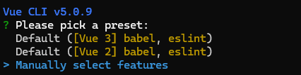
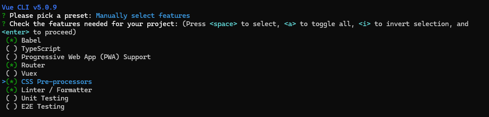
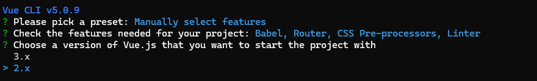
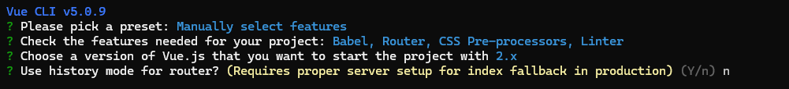
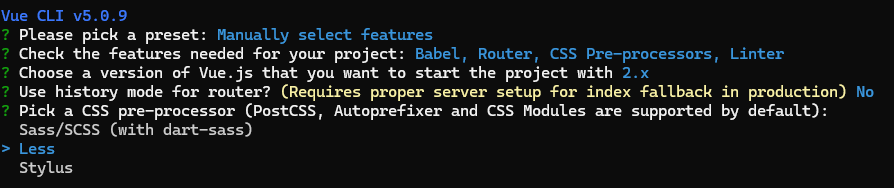
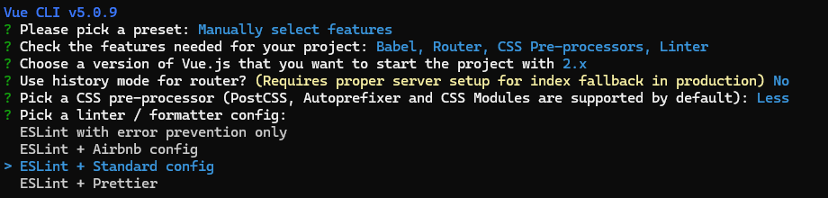
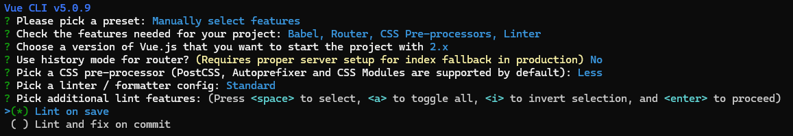
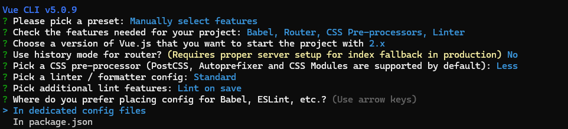
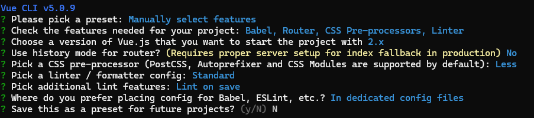

## Vue CLI 自定义创建项目与工程化配置

在之前的学习中，已经掌握了 Vue Router 的基本使用步骤。但在实际开发中，手动配置路由存在明显的痛点：每次创建新项目都需要手动安装 `vue-router`、导入并创建路由实例、配置路由规则以及搭建初始项目骨架，过程繁琐且效率低下。

为了解决这一问题，可以使用 Vue CLI 的**自定义创建项目**功能，在初始化阶段一次性搭建好包含路由及代码规范的完整项目骨架。本节课的核心目标是掌握**自定义创建项目**的流程，并初步引入 **ESLint** 代码规范工具，为后续学习 Vuex 状态管理以及企业级项目开发奠定基础。

### 自定义创建项目实操步骤

#### 初始化项目

确保已全局安装 Vue CLI 脚手架。在目标目录下打开终端（如 PowerShell），执行以下命令创建项目：

```bash
vue create 项目名称
```

例如，创建一个名为 `demo` 的移动端测试项目：

```bash
vue create demo
```

#### 选择项目特性 (Features)

命令执行后，脚手架会提示选择预设模式。使用键盘上下方向键选择第三项 **Manually select features**（自定义选择特性），按回车确认。



随后进入特性选择界面，使用**上下方向键**移动光标，使用**空格键**选中或取消选中。请勾选以下四个核心特性：

- **Babel**：用于 JavaScript 语法降级与转换。
- **Router**：用于自动搭建 Vue Router 路由骨架。
- **CSS Pre-processors**：用于支持 Less、Sass 等 CSS 预处理器。
- **Linter / Formatter**：用于配置 ESLint 代码规范校验。



*注：Vuex 状态管理可在后续学习完成后再进行勾选配置。*

#### 配置 Vue 版本与路由模式

- **选择 Vue 版本**：提示选择 Vue.js 版本时，选择 **2.x**（本项目基于 Vue 2 进行教学）。
  
- **选择路由模式**：提示 `Use history mode for router?` 时，选择 **n**。
  - **原因**：History 模式需要后端服务器配合配置重写规则，否则刷新页面会导致 404 错误。选择 No 则默认使用 **Hash 模式**（URL 中带有 `#`），无需后端额外配置，适合初期开发与测试。后续如需修改，可直接在路由配置中调整 `mode` 属性。
  - 

#### 配置 CSS 预处理器

提示选择 CSS 预处理器时，选择 **Less**。勾选后，项目中即可直接使用 Less 语法编写样式。



#### 配置 ESLint 代码规范

- **选择规范标准**：提示选择 Linter / Formatter 配置时，选择 **ESLint + Standard config**。
  - 
  - **说明**：Standard 是一种标准化且目前最流行的**无分号规范**。在企业级开发中广泛使用，配置后若代码中多余添加分号，ESLint 会直接报错。

- **选择校验时机**：提示选择额外的 Lint 特性时，选择 **Lint on save**。
  - 
  - **说明**：开启此选项后，每次保存文件时都会自动进行代码规范校验。

#### 配置文件存放位置与预设保存

- **配置文件存放位置**：提示选择 Babel、ESLint 等配置文件的存放位置时，选择 **In dedicated config files**。
  - 
  - **说明**：将配置存放在**独立的配置文件**中（如 `.eslintrc.js`、`babel.config.js`），避免将所有配置堆积在 `package.json` 中，便于后期维护与管理。
- **是否保存预设**：提示是否保存为预设时，输入 **N**。
  - 
  - **建议**：初学者建议不保存预设，通过多次手动选择来熟练掌握自定义构建的完整流程。

完成上述选择后，脚手架将自动下载依赖并初始化项目，等待安装完成即可。

### 项目启动与目录结构分析

#### 启动项目

项目创建完成后，根据终端提示进入项目目录并启动开发服务器：

```bash
cd demo
npm run serve
```

启动成功后，在浏览器中访问 `http://localhost:8080`，若页面正常显示 Vue 的默认欢迎界面，则表明项目创建与启动成功。

#### 目录结构差异分析

使用代码编辑器打开项目根目录，观察自定义创建的项目与默认创建的项目在目录结构上的差异：

- **基础目录**：`node_modules`、`public`、`src`（包含 `assets`、`components` 等）与默认创建的项目保持一致。
- **新增路由目录**：`src` 目录下新增了 **`router`** 文件夹，其中包含 `index.js` 文件。
  - **自动配置路由规则**：`index.js` 中已自动初始化 `VueRouter` 实例，并配置了基础路由规则。
  - **异步组件语法**：在路由配置中，自动使用了**路由懒加载（异步组件）** 语法来引入组件，优化了首屏加载性能。
- **自动挂载路由**：在 `src/main.js` 中，脚手架已自动完成路由模块的导入与 Vue 实例的挂载，无需开发者手动封装。

通过自定义创建项目，开发者可以直接基于现成的路由配置进行二次开发，大幅简化了初始搭建工作。

### Vue CLI 自定义创建项目核心流程总结

基于 Vue CLI 自定义创建项目的标准流程如下：

1. 执行 `vue create 项目名` 初始化项目。
2. 选择 **Manually select features** 进入自定义模式。
3. 勾选 **Babel、Router、CSS Pre-processors、Linter / Formatter**。
4. 选择 Vue 版本为 **2.x**。
5. 路由模式选择 **No**（使用 Hash 模式）。
6. CSS 预处理器选择 **Less**。
7. ESLint 规范选择 **Standard**（无分号规范），校验时机选择 **Lint on save**。
8. 配置文件存放位置选择 **In dedicated config files**（独立配置文件）。

## 前端工程化：ESLint代码规范与错误处理

围绕前端项目中的**代码规范**展开，分为两个核心部分：

1. **认识代码规范**：理解代码规范的定义、重要性以及主流规范标准。
2. **解决规范错误**：掌握ESLint报错信息的读取方法，以及手动和自动修复代码规范错误的技巧。

### 认识代码规范

- **代码规范的定义**
  代码规范是一套编写代码的**约定规则**，旨在统一代码风格。例如：
  - 赋值符号与运算符两侧是否需要添加空格。
  - 语句结尾是否使用分号。
  - 字符串引号的使用类型。

- **代码规范的重要性**
  - **统一团队风格**：确保团队中所有成员编写的代码风格一致，提升代码的**可读性**与**可维护性**。
  - **适应团队规模**：团队规模越大，统一编码风格的重要性越显著，可有效避免多人协作时的代码风格混乱。

- **主流规范标准：[JavaScript Standard Style](https://standardjs.com/rules-zhcn.html)**
  在Vue及前端开发中，最常使用的是 **JavaScript Standard Style** 标准。该标准约定了以下核心规则：
  - **字符串使用单引号**：相比双引号，单引号具有更高的可读性。
  - **无分号原则**：代码尽可能简洁，省略不必要的语句结尾分号。
  - **关键字后添加空格**：如 `if` 等关键字后需添加空格，以区分关键字与其他内容。
  - **函数名后添加空格**：函数名与后续括号之间需保留空格。
  - **坚持使用全等**：使用 `===` 替代 `==`，避免隐式类型转换导致的代码不稳定。

- **学习建议**
  开发者无需死记硬背所有规则。在开发初期，不符合规范的代码会被工具自动检测并报错，通过不断修正即可形成肌肉记忆。

### ESLint报错信息解析

在脚手架项目中配置 **ESLint** 后，若代码不符合 Standard 标准，终端会自动输出报错信息。报错信息包含以下关键要素：

- **错误文件路径**：明确指出发生错误的文件名称（如 `main.js`）。
- **错误位置**：通过**行号**和**字符位置**（如 `5:33` 表示第5行第33个字符）精准定位错误。
- **错误规则名称**：提供具体的规则标识（如 `Extra semicolon`），用于指导修复方向。

### 代码规范错误的解决方案

当遇到ESLint报错时，可通过以下两种方案进行解决：

**1. 方案一：手动查找与修复（核心基础技能）**
开发者需具备手动识别和修复规范错误的能力，具体步骤如下：

- **定位错误位置**：根据终端提示的文件名、行号和字符数，在代码编辑器中定位到具体位置。
- **查阅ESLint规则表**：若不理解报错的英文规则名称，可访问 **[ESLint官方规则文档](https://zh-hans.eslint.org/docs/latest/rules/)** 进行查询。
- **常见错误修复示例**：
  - **Extra semicolon（多余的分号）**
    - **规则标识**：`no-extra-semi`
    - **规则说明**：JavaScript引擎具备自动分号插入（ASI）功能，无需在每条语句结尾强制添加分号。
    - **修复方法**：删除语句末尾多余的分号。
  - **Operator must be spaced（运算符两侧需有空格）**
    - **规则标识**：`space-infix-ops`
    - **规则说明**：要求运算符（如等号、加号）周围必须保留空格，以提升代码可读性，明确作者意图。
    - **修复方法**：在运算符两侧补充空格。
  - **No multiple empty lines（不允许多个空行）**
    - **规则标识**：`no-multiple-empty-lines`
    - **规则说明**：禁止在代码中出现连续多个多余的空行。
    - **修复方法**：删除多余的空行，仅保留必要的单行换行。

**2. 方案二：自动修复（进阶开发技巧）**：

- 在实际业务开发中，开发者应将核心精力集中于业务逻辑。
- 借助代码编辑器的**格式化插件**，可实现**保存时自动修复**规范错误。（见[ESLint插件的安装与基础使用](#eslint插件的安装与基础使用)）

### 开发工具与项目目录规范

在使用 **VS Code** 打开前端项目时，必须遵循严格的目录打开规范，以确保 ESLint 等检测工具正常运行：

- **正确打开方式**：将包含 `node_modules`、`package.json` 等文件的**项目根目录**直接拖入 VS Code，或通过右键选择“通过 Code 打开”。
- **错误打开方式**：避免打开包含项目文件夹的**父级目录**，防止产生多层目录嵌套。
- **验证标准**：在 VS Code 的资源管理器中，第一层级必须直接显示 `node_modules`、`src` 等核心目录。若存在多余的父级文件夹嵌套，会导致 ESLint 规范检测失效。

## ESLint 代码规范与 VS Code 自动化配置

### 代码规范与 ESLint 简介

在软件开发中，遵循统一的代码规范是保证代码质量和可维护性的重要前提。当代码不符合规范时，ESLint 会抛出相应的错误提示。开发者可以通过逐项手动修改来纠正错误，若不理解错误含义，可查阅 **[ESLint 官方规则表](https://zh-hans.eslint.org/docs/latest/rules/)** 获取具体说明。

对于初学者而言，由于尚未完全掌握代码规范，编写代码时容易出现频繁报错的情况，这会严重阻碍学习进度。为解决此问题，可以借助 **ESLint 插件** 实现以下两个核心功能：

1. **高亮错误提示**：在代码编辑器中直观地标识出不符合规范的代码。
2. **自动修复错误**：通过合理配置，在保存文件时自动修正格式类错误。

### ESLint插件的安装与基础使用

要在 VS Code 中实现代码规范的高亮提示，需完成插件的安装与基础环境确认。

#### 安装 ESLint 插件

1. 打开 VS Code，进入左侧的**扩展（Extensions）** 面板。
2. 在搜索框中输入 **ESLint**，找到官方插件并点击**安装**。


#### 插件生效与注意事项

安装完成后，返回代码编辑区。若代码存在规范问题，编辑器会在数秒后高亮显示错误。若未显示错误，请检查以下两点：

- **项目打开方式**：必须将项目作为**根目录**打开，而非仅打开单个代码文件。
- **检测延迟**：ESLint 解析和检测代码需要一定时间（通常为 4 至 5 秒），打开项目后需耐心等待其完成初始化。

安装插件后，虽然编辑器能够高亮错误并辅助手动修改（如提示多余的分号或换行），但默认情况下**保存文件时不会自动修复**这些错误。

### 配置 VS Code 实现保存时自动修复

为了实现保存文件时自动修复 ESLint 错误，需要对 VS Code 的核心配置文件进行修改。

#### 获取配置代码

准备以下 JSON 格式的配置项(新版VS Code)：

```json
{
    // 保存自动执行eslint修复
  "editor.codeActionsOnSave": {
    "source.fixAll.eslint": "explicit"
  },
    // 关闭保存自动格式化
  "editor.formatOnSave": false
}
```

#### 修改 VS Code 设置

1. 在 VS Code 左下角点击**设置**图标，选择**设置（Settings）**。
2. 在设置界面右上角，点击**打开设置 (JSON)** 图标，进入 `settings.json` 配置文件。
3. 将上述配置项**复制并粘贴**到 JSON 对象中，注意保持 JSON 语法的正确性（如确保键值对之间有正确的逗号分隔）。

#### 配置项原理解析

- **`editor.codeActionsOnSave`**：配置在保存文件时执行的操作。`"source.fixAll.eslint": true` 表示在保存时**自动修复所有 ESLint 错误**。
- **`editor.formatOnSave`**：控制保存时是否启用编辑器默认格式化。将其设置为 `false` 是为了**避免 VS Code 默认格式化与 ESLint 自动修复产生冲突**。若此前已将其配置为 `true` 并导致语法冲突（出现波浪线提示），需将其删除或修改为 `false`。

#### 验证自动修复效果

配置完成后，返回代码文件。在编写代码时故意制造格式错误（如添加多余分号、错误换行），随后按下 **Ctrl + S**（macOS 为 Cmd + S）保存文件。此时，ESLint 会瞬间自动修正所有可自动修复的格式错误。

### 自动修复与手动修复的结合使用

ESLint 的自动修复功能主要针对**代码格式问题**。对于涉及**代码逻辑**的错误，自动修复无法生效，仍需开发者手动介入解决。

#### 自动修复示例

当声明变量时等号两侧缺少空格（例如 `let num=10`），保存文件后，ESLint 会自动补全空格（修正为 `let num = 10`）。此类排版问题均可通过自动修复完美解决。

#### 手动修复示例

若声明了变量但未在代码中使用，ESLint 会抛出 `no-unused-vars` 错误（提示信息如：`'num' is assigned a value but never used`）。此类逻辑错误无法自动修复，需通过以下方式手动解决：

- **使用该变量**：在后续代码中调用该变量（例如使用 `console.log(num)` 进行输出）。
- **删除无用声明**：若该变量确实不再需要，直接删除其声明语句。

开发者必须同时掌握**自动修复**与**手动修复**两种手段，以应对不同类型的代码规范问题。

### 总结

1. **环境配置**：在 VS Code 中安装 ESLint 插件，并配置 `settings.json` 实现 **Ctrl + S 保存时自动修复**格式错误。
2. **错误处理**：对于无法自动修复的逻辑或规范错误，需查阅 **ESLint 官方规则表** 理解错误含义，并进行**手动修复**。
3. **最终目标**：通过自动与手动修复的结合，确保最终编写和提交的代码完全符合**统一的代码规范**。
