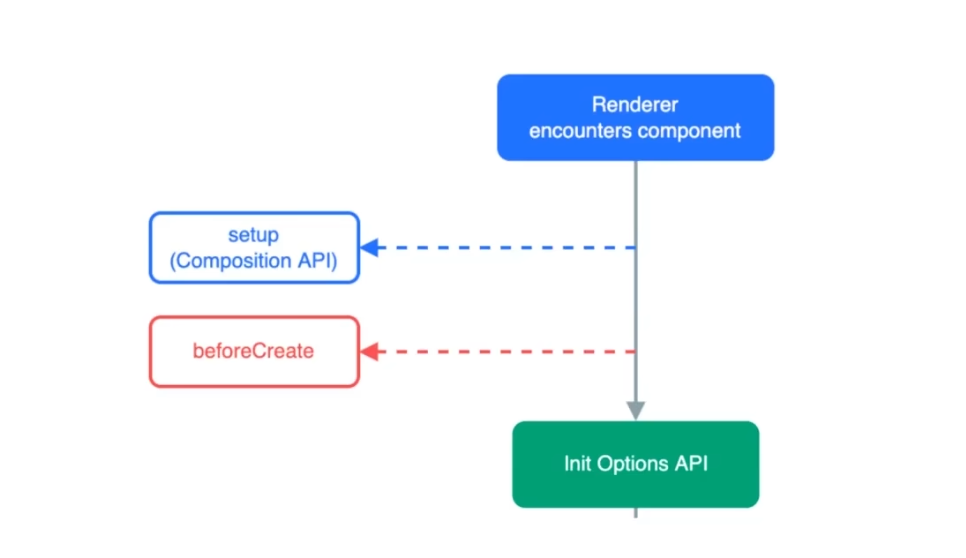
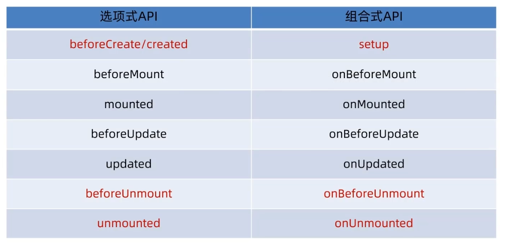

## Vue 3入门与优势解析

### 学习 Vue 3 的核心驱动力

#### 市场需求与薪资提升

在前端开发岗位中，技术栈的掌握程度直接决定了薪资水平与职业发展。

- **Vue 2**：通常适用于职业起步阶段，能够帮助开发者获取基础薪资。
- **Vue 3**：已成为获取中高薪的**必备核心技能**。掌握 Vue 3 能够显著提升开发者的核心竞争力。

#### 官方版本迭代策略

Vue 作者尤雨溪（Evan You）及官方团队已明确 Vue 3 的战略地位：

- **默认版本**：Vue 3 现已成为脚手架创建项目及官方文档展示的**默认版本**。
- **版本维护**：Vue 2 已停止新增功能，仅进行日常维护与漏洞修复。官方全面主推 Vue 3 生态。

#### 平滑的学习曲线与向前兼容

从 Vue 2 升级到 Vue 3 的学习成本极低：

- **向前兼容**：Vue 3 兼容了绝大部分 Vue 2 的核心语法。
- **快速过渡**：具备 Vue 2 基础的开发者，仅需极短时间即可掌握 Vue 3 的核心特性与语法差异，实现技术栈的平滑升级。

### Vue 3 的四大核心优势

Vue 3 在底层架构与 API 设计上进行了全面重构，具备以下四大核心优势：

#### 更易维护

- **组合式 API (Composition API)**：提供了更灵活的代码组织方式，大幅提升大型项目的可维护性。
- **更好的 TypeScript 支持**：Vue 3 整个底层源码均使用 **TypeScript** 重写，为偏好类型化开发的团队提供了极佳的开发体验与类型推导。

#### 更快的速度

- **底层重构**：对核心源码进行了全面重构。
- **算法优化**：重写了虚拟 DOM 的 **Diff 算法**，并深度优化了**模板编译**过程，显著提升了渲染与更新性能。

#### 更小的体积

- **Tree Shaking 支持**：底层重新设计使得 Vue 3 具备更良好的 **Tree Shaking**（树摇）支持。
- **按需导入**：结合按需导入机制，在打包构建时能够剔除未使用的代码，有效减小最终产物的体积。

#### 更优的响应式处理

- **Proxy 代理**：Vue 3 采用 ES6 的 **Proxy** 替代了 Vue 2 的 `Object.defineProperty` 作为底层响应式实现。
- **解决属性增删劫持问题**：Proxy 针对整个对象进行代理，能够完美拦截对象属性的**新增**与**删除**操作，彻底解决了 Vue 2 中无法直接劫持属性增删、必须依赖额外 API（如 `$set`）的历史遗留问题。

### 选项式 API 与 组合式 API 深度对比

Vue 3 引入了**组合式 API (Composition API)**，这是对 Vue 2 中**选项式 API (Options API)** 的重大升级。

#### 选项式 API (Options API) 的局限性

在 Vue 2 中，代码被强制分散在 `data`、`methods`、`computed`、`watch` 等独立配置项中。

- **维护困难**：当组件逻辑复杂、代码量庞大（如单文件组件超过 1000 行）时，同一功能的代码散落在不同配置项中，开发者需要频繁上下滚动查找，维护成本极高。
- **复用性差**：虽然可以通过 `mixin` 进行逻辑混入，但存在命名冲突、数据来源不清晰等缺陷，页面逻辑复用依然不够便捷。

#### 组合式 API (Composition API) 的优势

组合式 API 允许开发者根据**逻辑功能**来组织代码，而非根据配置选项。

- **集中式管理**：将同一功能相关的**数据声明**、**方法定义**、**计算属性**和**侦听器**集中编写在一起。修改特定功能时，只需关注局部代码块，无需全局查找。
- **高复用性**：可将特定功能的逻辑封装为独立的**自定义函数**（通常称为 Hooks）。在其他组件中只需调用该函数，即可直接复用完整逻辑。
- **代码精简**：省去了繁琐的配置项声明，整体代码量更少，逻辑内聚度更高。

#### 代码实现对比：计数器功能

**需求**：点击按钮，使数字加一。

**Vue 2 (选项式 API) 实现逻辑**：

1. 在 `data` 配置项中声明初始数据。
2. 在模板中使用双大括号渲染数据，并为按钮注册点击事件。
3. 在 `methods` 配置项中定义累加方法。

- **分析**：数据声明与操作方法在物理结构上被隔离，属于分散式维护。

**Vue 3 (组合式 API) 实现逻辑**：

1. 通过调用响应式函数（如 `ref`）直接声明数据。
2. 紧接着定义操作该数据的累加函数。

- **分析**：数据与操作数据的方法紧密相邻，整合在同一代码块中，实现了高度的逻辑内聚。

## Vue 3 项目搭建与 Vite 构建工具指南

### 脚手架工具演进：从 Vue CLI 到 create-vue

在深入学习 Vue 3 语法之前，首先需要掌握如何基于官方脚手架创建项目。Vue 3 的官方推荐脚手架工具已发生变更，理解其底层构建工具的差异至关重要。

#### 工具对比

- **Vue CLI**：早期用于创建 **Vue 2** 项目的官方脚手架工具，其底层基于 **Webpack** 构建。
- **create-vue**：当前用于创建 **Vue 3** 项目的官方推荐脚手架工具，其底层已切换为下一代构建工具 **Vite**。

#### Vite 的核心优势

相比于传统的 Webpack，**Vite** 在现代前端开发中备受推崇，其核心优势体现在极致的构建与运行速度上：

- **项目创建速度**：初始化项目几乎在瞬间完成，无需长时间等待。
- **依赖安装速度**：依赖解析与安装过程大幅缩短。
- **服务启动速度**：开发服务器启动通常在毫秒级别，实现真正的秒级启动。
- **热更新与访问速度**：开发过程中的页面访问与模块热替换响应极快。

### 环境准备与项目创建

使用 `create-vue` 和 Vite 构建项目对运行环境有明确的版本要求。

#### 环境要求

- **Node.js 版本**：必须确保当前系统的 Node.js 版本在 **16.0 及以上**。
- **版本检测命令**：在终端中执行以下命令检查版本：

  ```bash
  node -v
  ```

#### 初始化项目命令

确认环境满足要求后，在目标目录打开终端，执行以下命令以安装并运行 `create-vue`

```bash
npm init vue@latest
```

*注：该指令会自动下载并执行 `create-vue`，引导用户完成项目的初始化构建。*

### 项目配置与依赖安装

执行初始化命令后，终端会进入交互式配置界面，要求用户选择项目所需的功能模块。

#### 交互式选项配置

在基础学习阶段，建议保持配置精简，后续可根据实际项目需求进行定制化扩展。标准配置示例如下：

- **Project name**：输入项目名称（例如 `vue3-demo`）。
- **TypeScript**：选择 `No`（暂不需要 TypeScript 支持）。
- **JSX Support**：选择 `No`。
- **Vue Router**：选择 `No`（暂不需要单页应用路由）。
- **Pinia**：选择 `No`（暂不需要状态管理）。
- **Vitest**：选择 `No`（暂不需要单元测试）。
- **End-to-End Testing**：选择 `No`。
- **ESLint**：选择 `Yes`（建议开启代码质量检查，可通过键盘左右方向键切换选项）。
- **Prettier**：选择 `No`（暂不需要代码格式化工具）。

#### 安装项目依赖

配置完成后，脚手架会迅速生成项目目录。进入项目目录并安装依赖：

```bash
cd vue3-demo
npm install
```

*注：得益于 Vite 的优化，依赖安装过程通常在极短时间内即可完成。*

### 项目启动与验证

依赖安装完毕后，即可启动开发服务器并验证项目是否创建成功。

#### 启动开发服务器

在终端中执行以下命令启动项目：

```bash
npm run dev
```

*注：Vite 启动开发服务器的速度极快，通常耗时不到 1 秒，显著改善了传统 Webpack 启动缓慢的问题。*

#### 验证项目运行

启动成功后，终端会输出本地访问地址（通常为 `http://127.0.0.1` 及对应端口）。在浏览器中访问该地址，若页面显示 **"You did it!"** 及 **"You are successfully created a project with Vite and Vue 3"** 的提示信息，即表明项目已成功创建并正常运行。

### 基于 `create-vue` 搭建 Vue 3 项目总结

基于 `create-vue` 搭建 Vue 3 项目的完整流程，核心知识点总结如下：

1. **脚手架与构建工具的更替**：
   - 创建 **Vue 2** 项目通常使用 **Vue CLI**，底层基于 **Webpack**。
   - 创建 **Vue 3** 项目官方推荐使用 **create-vue**，底层采用 **Vite**。
   - **Vite** 在项目构建、依赖安装、服务启动及运行速度上均具备显著优势。

2. **项目创建标准流程**：
   - **环境检测**：使用 `node -v` 确保 Node.js 版本 **大于等于 16**。
   - **初始化项目**：执行 `npm init vue@latest` 创建应用。
   - **安装与启动**：依次执行 `cd 项目名`、`npm install` 和 `npm run dev`。

下面，将深入剖析通过 Vite 创建的 Vue 3 项目目录结构，并详细对比其与早期 Vue 2 项目在文件组织与配置上的具体差异。

## Vue 3 项目目录结构与关键文件解析

本节主要解析 Vue 3 项目的标准目录结构，并深入对比关键文件与 Vue 2 项目的核心差异。通过剖析构建工具、依赖管理、入口文件以及单文件组件的变更，旨在帮助开发者系统掌握 Vue 3 项目的工程化基础与开发规范。

### 核心配置文件解析

1. **vite.config.js**
   - **核心作用**：Vue 3 项目基于 Vite 构建，该文件替代了 Vue 2 中的 `vue.config.js`，用于配置 Vite 相关的构建选项。
   - **别名配置**：默认配置了 `@` 别名，允许在项目中通过 `@` 符号直接访问 `src` 目录。
   - **扩展机制**：后续涉及构建工具或 Vite 相关的自定义配置，均需在此文件中进行统一修改。

2. **package.json**
   - **核心依赖变更**：项目的核心依赖由 Webpack 体系变更为 **Vue 3** 与 **Vite**。
   - **脚本运行机制**：`scripts` 中的 `dev` 和 `build` 命令底层已切换为基于 Vite 运行，不再依赖原有的 Vue CLI 脚手架。
   - **版本控制**：依赖项明确指定了最新版本的 Vue（如 3.5.38）与 Vite（如 8.80.16）。

### 入口文件与挂载机制

1. **main.js 入口文件**
   - **实例创建方式变更**：Vue 2 使用 `new Vue()` 创建应用实例，Vue 3 改为使用 **`createApp()`** 函数创建实例。
   - **封装与独立性**：`createApp()` 对实例创建进行了函数式封装。这种前瞻性设计保证了每个实例的**独立性与封闭性**，在开发中大型项目或微前端多应用实例管理时，能有效避免实例间的相互污染。
   - **统一命名规范**：Vue 3 将创建操作统一封装为函数，例如创建路由使用 `createRouter()`，创建状态仓库使用 `createStore()`。

2. **应用挂载机制**
   - **挂载方法**：实例创建后，通过 **`.mount()`** 方法将应用挂载到 DOM 节点上。
   - **挂载点指定**：`.mount('#app')` 表示将应用挂载到页面中 `id` 为 `app` 的 DOM 元素上。

3. **index.html 页面文件**
   - **核心作用**：作为项目的最终渲染页面，提供应用挂载的 DOM 容器（即 `id="app"` 的根节点盒子）。

### 单文件组件（SFC）特性与规范

1. **代码块顺序调整**
   - **传统顺序**：`<template>` 置于顶部，随后是 `<script>` 与 `<style>`。
   - **推荐顺序**：**`<script>`** 置于顶部，随后是 `<template>` 与 `<style>`。
   - **调整依据**：在实际开发中，结构与样式关联紧密，置于相邻位置更易于维护。同时，开发者编写逻辑代码的时间占比最高，将 `<script>` 置于文件顶部可减少代码滚动，提升编码效率。

2. **组合式 API 支持**
   - 在 `<script>` 标签中添加 **`setup`** 属性（即 `<script setup>`），可直接在脚本中编写**组合式 API（Composition API）** 代码，无需再使用传统的组件选项导出方式。

3. **组件自动注册**
   - 在 `<script setup>` 语法中，导入的组件**无需进行显式的局部注册**，即可直接在 `<template>` 模板中使用，大幅简化了组件引入与注册流程。

4. **多根元素支持（Fragment）**
   - Vue 2 的 `<template>` 强制要求只能有一个唯一的根元素。
   - Vue 3 引入了 Fragment 特性，**允许 `<template>` 中存在多个平级的根元素**，有效减少了不必要的 DOM 嵌套层级。

### 开发环境配置

**VS Code 插件更换**：

- **Vue 2 环境**：使用 **Vetur** 插件提供语法高亮与代码提示。
- **Vue 3 环境**：必须禁用 Vetur，并安装 **Vue(Official)**（原Volar） 插件。这是专为 Vue 3 设计，能够完美支持 `<script setup>` 语法及 TypeScript 类型推导，避免代码警告与提示错误。


### 核心知识点总结

1. **构建配置**：`vite.config.js` 负责 Vite 构建工具的相关配置，包含路径别名等基础工程化设定。
2. **依赖管理**：`package.json` 中的核心依赖已全面升级为 Vue 3 与 Vite，运行脚本底层由 Vite 驱动。
3. **页面挂载**：`index.html` 提供 DOM 挂载点，`main.js` 负责创建实例并执行挂载操作。
4. **实例创建**：使用 `createApp()` 替代 `new Vue()`，通过函数式封装确保多实例环境下的独立性与封闭性。
5. **组件规范**：单文件组件推荐采用 `<script setup>`、`<template>`、`<style>` 的顺序；全面支持组合式 API、组件自动注册以及多根元素结构。
6. **开发工具**：代码编辑器需使用 Volar 插件替代 Vetur，以获取完整的 Vue 3 语法支持与类型推导。

## Vue 3 组合式 API 与 setup 选项

### 组合式 API 与 setup 概述

在前序项目目录与文件结构分析的基础上，本文正式进入 Vue 3 核心语法的学习。首要探讨的核心概念为**组合式 API**（Composition API）及其入口选项 **setup**。

- **组合式 API**：可定义为一系列用于编写组件逻辑的函数集合。通过调用此类函数，开发者能够更灵活地组织、复用及管理组件代码。
- **setup 选项**：作为**组合式 API 的入口**，所有组合式 API 的函数调用与逻辑编写均需在 setup 内部进行。掌握 setup 选项是应用组合式 API 的基础前提。

### setup 选项的执行时机

setup 选项需以函数的形式编写于组件的配置项中，其执行时机具有显著的超前性。

**执行顺序**：setup 函数的执行时机**早于 beforeCreate 生命周期钩子**。在 Vue 的标准生命周期钩子（如 beforeCreate、created、beforeMount、mounted 等）中，setup 是最先被执行的环节。



**代码验证**：在组件中同时定义 setup 函数与 beforeCreate 钩子并输出控制台日志，系统将优先打印 setup 函数内的日志，随后打印 beforeCreate 钩子内的日志，由此证实 setup 的执行优先级最高。

```html
<script>
export default{
  setup(){
    console.log('setup函数')
  },
  beforeCreate(){
    console.log('beforeCreate函数')
  }
}
</script>

<template>
  <h1>学习Vue3</h1>
</template>

<style scoped></style>
```

**模板要求**：若组件未提供 template 模板结构，控制台将抛出缺少 template 的警告。提供基础 HTML 结构后即可消除该警告，确保组件正常渲染。

### setup 函数中的 this 指向

由于 setup 函数的执行时机极早，其在组件实例创建之前便已执行，此特性直接决定了其内部 this 的指向规则。

- **this 为 undefined**：在 setup 函数内部，**无法获取到组件实例的 this**，其值严格为 **undefined**。
- **设计优势**：不依赖 this 指向是 Vue 3 架构的重要优势。由于 this 的指向高度依赖于当前运行环境，摒弃 this 的使用有利于代码的**封装与组合**。开发者无需处理 this 的指向绑定问题，使得逻辑代码能够脱离当前组件环境，实现更自由的复用与迁移。

### setup 选项的返回值机制

在 setup 选项内部编写代码时，可向其中提供数据或函数，但必须遵循严格的返回机制方能在模板中生效。

- **必须使用 return**：在 setup 中定义的任何数据（变量）或函数，**必须通过 return 以对象的形式返回**，才能在组件的 template 模板中被访问和应用。
- **数据与函数的暴露**：
  - 定义数据：使用 const 声明变量（如 message）。
  - 定义函数：使用 const 声明箭头函数（如 logMessage）。
  - 返回数据：在 setup 函数末尾使用 return 语句将上述变量与函数以对象形式暴露。
- **模板中的应用**：
  - 数据绑定：在模板中使用双大括号语法渲染返回的数据。
  - 事件绑定：在模板中使用事件指令调用返回的函数。
- **未返回的后果**：若未在 setup 末尾进行 return 操作，模板将无法识别这些变量与函数，导致页面无法渲染对应数据，事件亦无法触发。

```html
<script>
export default {
  setup() {
    const message = 'hello Vue3'
    const logMessage = () => {
      console.log(message)
    }

    return {
      message,
      logMessage
    }
  },
}
</script>

<template>
  <h1>{{ message }}</h1>
  <button @click="logMessage">按钮</button>
</template>

<style scoped></style>
```

### script setup 语法糖

为解决传统 setup 选项中每次均需手动 return 的繁琐问题，Vue 3 引入了 **script setup 语法糖**，以大幅简化代码编写流程。

- **基本用法**：在 script 标签上添加 **setup 属性**（即 script setup 标签）。
- **简化机制**：在 script setup 内部，开发者只需直接声明所需的变量与函数，**无需手动编写 return 语句**，即可在模板中直接使用。
- **底层原理**：
  - script setup 本质上是一种编译时语法糖。
  - 在底层，编译器会自动将 script setup 中的代码转换为标准的 setup 选项函数。
  - 编译器会**自动收集**内部定义的变量与函数，并**自动执行 return 操作**将其暴露给模板。
- **开发效率**：通过语法糖的封装，组合式 API 的代码结构更加简洁，显著提升了开发效率。其设计原理与 v-model 底层自动转换为 value 绑定与 input 事件监听的机制相一致。

```html
<script setup>
const message = 'hello Vue3'
const logMessage = () => {
  console.log(message)
}
</script>

<template>
  <h1>{{ message }}</h1>
  <button @click="logMessage">按钮</button>
</template>

<style scoped></style>
```

### setup核心知识点总结

本节内容围绕 setup 选项展开，核心知识点可归纳为以下四个方面：

1. **执行时机**：setup 选项的执行时机极早，**优先于 beforeCreate 生命周期钩子**。
2. **返回值机制**：在标准选项式写法中，setup 内部定义的数据与函数**必须以对象形式 return**，方可在模板中使用。
3. **语法糖优化**：**script setup 语法糖**解决了手动 return 的繁琐问题，通过底层自动转换与返回，使组合式 API 的编写更加简洁高效。
4. **this 指向**：由于执行时机早于组件实例的创建，setup 函数内部的 **this 指向 undefined**，不指向组件实例，此特性有效促进了代码的解耦与复用。

## Vue3 组合式 API 响应式数据核心函数：reactive 与 ref

### 响应式数据概述

在 Vue3 框架中，默认声明的普通数据不具备响应式特性。若需实现数据驱动视图更新，必须通过特定的 API 将普通数据转换为响应式数据。在组合式 API（Composition API）中，主要提供 **`reactive`** 和 **`ref`** 两个核心函数来实现此功能。

### reactive 函数

#### 核心概念与作用

**`reactive`** 函数用于接收**对象类型**（复杂类型）的数据作为参数，并返回一个该对象的**响应式代理**。

#### 使用步骤与代码示例

使用 `reactive` 的标准流程分为两步：导入函数并调用转换。

**步骤一：导入函数**
在 `<script setup>` 中从 Vue 核心库导入 `reactive`。

```javascript
import { reactive } from 'vue'
```

**步骤二：调用函数并接收结果**
将普通对象传入 `reactive`，并将返回的响应式对象赋值给变量。

```javascript
const state = reactive({
  count: 100
})
```

**完整代码示例：**

```html
<script setup>
import { reactive } from 'vue'

const state = reactive({
  count: 100
})

const setCount = () => {
  state.count++
}
</script>

<template>
  <div>
    <p>当前计数：{{ state.count }}</p>
    <button @click="setCount">增加</button>
  </div>
</template>

<style scoped></style>
```

#### 局限性

**`reactive` 仅支持对象类型数据**（如 Object、Array、Map、Set）。若传入简单类型数据（如 String、Number、Boolean），将无法实现响应式效果，且会导致程序运行异常。

### ref 函数详解

#### 核心概念与作用

**`ref`** 函数用于接收**简单类型**或**对象类型**的数据，并返回一个响应式对象。它弥补了 `reactive` 无法处理简单类型数据的缺陷。

#### 底层实现原理

`ref` 实现响应式的本质是**在传入的原始数据外层包装一个对象**，将其转换为复杂类型，并在底层借助 `reactive` 函数实现响应式劫持。

```javascript
// 伪代码表示 ref 的底层结构
{
  value: 原始数据
}
```

#### 数据访问与修改规则（核心重点）

由于 `ref` 在底层进行了对象包装，因此在不同区域访问和修改数据时，语法存在严格区分：

- **在 `<script>`（JavaScript 逻辑）中**：必须通过 **`.value`** 属性来访问或修改数据。
- **在 `<template>`（HTML 模板）中**：Vue 会**自动解包**（自动剥离 `.value` 层级），直接使用变量名即可，**无需**添加 `.value`。

**代码示例：**

```html
<script setup>
import { ref } from 'vue'

// 声明简单类型响应式数据
const count = ref(0)

const setCount = () => {
  // 脚本中必须使用 .value 进行修改
  count.value++
}

// 脚本中访问也需要 .value
console.log(count.value) 
</script>

<template>
  <!-- 模板中自动解包，无需 .value -->
  <div>
    <p>当前计数：{{ count }}</p>
    <button @click="setCount">增加</button>
  </div>
</template>

<style scoped></style>
```

### reactive 与 ref 的对比与实践

#### 特性对比

| 特性 | reactive | ref |
| :--- | :--- | :--- |
| **支持的数据类型** | 仅支持对象类型（复杂类型） | 支持简单类型与对象类型 |
| **底层实现** | 基于 Proxy 劫持对象 | 包装为对象后，底层依赖 reactive |
| **模板中访问** | 直接访问属性（如 `state.count`） | 直接访问变量（自动解包） |
| **脚本中访问** | 直接访问属性（如 `state.count`） | 必须通过 **`.value`** 访问 |

#### 工程化推荐方案

在实际工程开发中，**推荐统一使用 `ref` 函数**声明所有响应式数据。

- **统一编码规范**：`ref` 同时兼容简单类型与复杂类型（传入对象时，该对象会作为 `.value` 的值被包裹），开发者无需在声明数据时反复判断数据类型以选择 API。
- **降低心智负担**：统一遵循“脚本中加 `.value`，模板中不加 `.value`”的规则，避免混用导致的语法错误。

### Vue 2 环境兼容性处理说明

若需在 **Vue 2** 项目中使用上述组合式 API（`reactive` 与 `ref`），需进行以下兼容处理：

1. **引入插件**：Vue 2 原生不支持组合式 API，必须安装并注册官方提供的 **`@vue/composition-api`** 插件。

    ```bash
    npm install @vue/composition-api
    ```

2. **语法调整**：Vue 2 不支持 `<script setup>` 语法糖。必须使用标准的 `setup()` 选项函数，并将响应式数据通过 `return` 暴露给模板。
3. **导入路径**：相关 API 需从 `@vue/composition-api` 中导入，而非 `vue`。

**Vue 2 环境代码示例：**

```javascript
import { defineComponent, ref, reactive } from '@vue/composition-api'

export default defineComponent({
  setup() {
    const count = ref(0)
    const state = reactive({ name: 'Vue' })

    const setCount = () => {
      count.value++
    }

    // 必须 return 暴露给模板
    return {
      count,
      state,
      setCount
    }
  }
})
```

## Vue3 组合式 API 计算属性 (computed)

### 计算属性概述

在 Vue 的开发中，计算属性用于基于响应式数据动态派生出新的数据。在传统的**选项式 API (Options API)** 中，计算属性需要统一配置在 `computed` 选项对象中。这种方式存在一个明显的局限性：**同类型的功能无法集中管理**。例如，声明数据与声明基于该数据的计算属性在代码结构上是分离的，不利于复杂组件的逻辑维护。

在**组合式 API (Composition API)** 中，计算属性被封装为 `computed` 函数。这种设计允许开发者将相关的数据和计算逻辑组合在一起，实现代码逻辑的任意组合与集中管理。从核心思想上看，组合式 API 的计算属性与 Vue 2 的选项式 API 完全一致，仅在语法层面由配置项转变为函数调用。

### 核心语法与使用步骤

使用组合式 API 声明计算属性主要分为以下两个核心步骤：

1. **导入 computed 函数**：从 Vue 核心库中导入 `computed` 函数。
2. **调用函数并传入计算逻辑**：在需要计算属性的位置调用 `computed` 函数，并传入一个回调函数作为计算逻辑，该回调函数的返回值即为计算属性的结果。

基础语法结构如下：

```javascript
import { computed } from 'vue'

// 声明计算属性
const myComputed = computed(() => {
  // 编写计算逻辑
  return 计算结果
})
```

### 实战案例：数组过滤与动态更新

以下通过一个具体案例，演示如何基于原始数组过滤出符合条件的数据，并验证计算属性的动态更新特性。

#### 声明响应式数据

使用 `ref` 函数声明一个响应式数组。需要注意的是，`ref` 会对传入的数据进行响应式包装，因此在 `<script>` 脚本中访问其实际值时，必须通过 **`.value`** 属性。

```javascript
import { ref } from 'vue'

// 声明响应式数组
const list = ref([1, 2, 3, 4, 5, 6, 7, 8])
```

#### 声明计算属性

基于 `list` 数组派生一个计算属性 `computedList`，要求过滤出数组中所有大于 2 的数字。

```javascript
import { computed } from 'vue'

const computedList = computed(() => {
  // 在 script 中访问 ref 数据必须使用 .value
  return list.value.filter(item => item > 2)
})
```

#### 模板渲染与数据修改

在 `<template>` 模板中渲染原始数据与计算后的数据，并添加一个按钮用于修改原始数组，以验证计算属性的响应式更新。

```html
<template>
  <div>
    <p>原始数据：{{ list }}</p>
    <p>计算后的数据：{{ computedList }}</p>
    <button @click="addData">添加数据</button>
  </div>
</template>
```

在 `<script>` 中定义修改数据的方法：

```javascript
const addData = () => {
  // 修改 ref 数组同样需要使用 .value
  list.value.push(666)
}
```

**关键知识点总结**：

- 在 `<script>` 脚本中访问或修改 `ref` 声明的数据时，**必须使用 `.value`**。
- 在 `<template>` 模板中渲染 `ref` 数据时，Vue 会自动解包，**无需使用 `.value`**。
- 计算属性具有**缓存和响应式特性**，当依赖的响应式数据（如 `list`）发生变化时，计算属性（如 `computedList`）会自动重新计算并更新视图。

### 进阶用法：可写计算属性 (Getter 与 Setter)

默认情况下，`computed` 函数接收一个回调函数，此时计算属性是**只读的**（仅包含 Getter）。如果直接修改只读计算属性的值，控制台会抛出错误。

在某些特殊场景下（如全选/反选功能），需要直接修改计算属性的值。此时可以将 `computed` 的参数由函数改为**包含 `get` 和 `set` 方法的对象**，从而实现可写计算属性。此用法与 Vue 2 中的计算属性写法完全一致。

可写计算属性语法结构如下：

```javascript
import { ref, computed } from 'vue'

const count = ref(1)

const plusOne = computed({
  // getter：读取值时触发
  get() {
    return count.value + 1
  },
  // setter：修改值时触发
  set(newValue) {
    count.value = newValue - 1
  }
})

// 触发 setter
plusOne.value = 5 
// 此时 count.value 的值将变为 4
```

### 计算属性最佳实践

在实际项目开发中，为了保证代码的健壮性与可维护性，使用计算属性时应遵循以下两项最佳实践：

#### 避免在计算属性中产生副作用

计算属性的回调函数中**应该只包含纯粹的数据计算过程**（如数学运算、数组过滤、字符串拼接等）。严禁在计算属性中执行以下副作用操作：

- 发送异步网络请求 (Ajax/Fetch)
- 操作 DOM 节点
- 修改其他不相关的响应式状态
- 使用 `setTimeout` 或 `setInterval` 等定时器

如果业务逻辑需要监听数据变化并执行副作用操作，应当使用 **`watch` (侦听器)** 而非计算属性。

#### 避免直接修改计算属性的值

在绝大多数场景下，计算属性应作为**只读数据**使用，由依赖的源数据自动驱动更新。直接修改计算属性的值会破坏数据流的单向性，导致逻辑混乱。仅在极少数明确需要双向绑定的特殊交互场景（如复杂表单的全选控制）中，才建议使用带有 `get` 和 `set` 的可写计算属性。

## Vue 3 组合式 API：watch 侦听器

### watch 概述

在 Vue 3 的组合式 API（Composition API）中，`watch` 的作用与 Vue 2 选项式 API 中的 `watch` 完全一致，主要用于**侦听一个或多个数据源的变化**，并在数据变化时执行指定的回调函数。

主要区别在于，Vue 3 将其改写为**函数式调用**，使得逻辑组织更加灵活。`watch` 函数支持传入数据源、回调函数以及额外的配置项（如 `immediate` 和 `deep`）。

### 基本语法与使用场景

#### 监听单个数据源

当需要监听单个响应式数据（如 `ref` 对象）的变化时，直接将 `ref` 对象作为 `watch` 的第一个参数传入。

**语法结构**：

```javascript
watch(refObject, (newValue, oldValue) => {
  // 数据变化时执行的回调逻辑
})
```

**注意事项**：

- 第一个参数必须传入 **`ref` 对象本身**，而**不能**是 `refObject.value`。如果传入 `.value`，则传入的是具体的值（如数字或字符串），无法实现响应式监听。
- 回调函数接收两个参数：`newValue`（变化后的新值）和 `oldValue`（变化前的旧值）。

**代码示例**：

```javascript
import { ref, watch } from 'vue'

const count = ref(0)

// 监听单个 ref 对象
watch(count, (newValue, oldValue) => {
  console.log('新值:', newValue)
  console.log('旧值:', oldValue)
})
```

#### 监听多个数据源

当需要同时监听多个数据源时，可以将多个 `ref` 对象放入一个**数组**中，作为 `watch` 的第一个参数。任何一个数据源发生变化，都会触发回调函数。

**语法结构**：

```javascript
watch([refObject1, refObject2], (newValues, oldValues) => {
  // 任意数据源变化时执行的回调逻辑
})
```

**注意事项**：回调函数接收的 `newValues` 和 `oldValues` 也是**数组格式**，其元素顺序与第一个参数数组中的数据源顺序一一对应。

**代码示例**：

```javascript
import { ref, watch } from 'vue'

const count = ref(0)
const nickname = ref('张三')

// 监听多个 ref 对象
watch([count, nickname], (newValues, oldValues) => {
  console.log('变化后的值:', newValues)
  console.log('变化前的值:', oldValues)
})
```

### 高级配置项

`watch` 函数支持第三个参数，用于传入一个配置对象，以实现更复杂的监听行为。

#### 立即执行 (immediate)

默认情况下，`watch` 只有在数据发生变化时才会触发回调。如果希望在**侦听器创建时立即执行一次**回调，可以配置 `immediate: true`。

**代码示例**：

```javascript
watch(count, (newValue, oldValue) => {
  console.log('立即执行或数据变化:', newValue, oldValue)
}, { 
  immediate: true 
})
```

**注意**：在立即执行的首次触发中，`oldValue` 的值为 `undefined`。

#### 深度监听 (deep)

**浅层监听与深层监听的区别**：

- **浅层监听（默认）**：对于简单数据类型（如 Number、String），可以直接监听其值的变化。但对于复杂数据类型（如 Object、Array），默认只监听**对象引用地址**的变化。如果仅修改对象内部的子属性，不会触发回调。
- **深层监听**：配置 `deep: true` 后，侦听器会递归遍历对象，监听对象内部**所有层级子属性**的变化。

**代码示例**：

```javascript
import { ref, watch } from 'vue'

const userInfo = ref({
  name: '张三',
  age: 18
})

// 开启深度监听
watch(userInfo, (newValue, oldValue) => {
  console.log('用户信息发生变化:', newValue)
}, { 
  deep: true 
})

// 修改内部属性，此时可以触发回调
userInfo.value.age = 19 
```

**补充说明**：
如果不使用 `deep: true`，只有当整个 `userInfo.value` 被重新赋值为一个新对象（即引用地址发生改变）时，浅层监听才会触发。

### 精确监听对象的特定属性

使用 `deep: true` 会监听对象内所有属性的变化，这在某些场景下会导致不必要的性能开销或逻辑误触。如果需求是**仅监听复杂对象中的某一个特定属性**，可以使用 getter 函数（回调函数形式）作为第一个参数。

**语法结构**：

```javascript
watch(
  () => refObject.value.specificProperty, 
  (newValue, oldValue) => {
    // 仅当 specificProperty 变化时触发
  }
)
```

**注意事项**：

- 必须使用**箭头函数**返回需要监听的具体属性。
- 此时需要访问 `.value` 以获取对象实例，然后再访问具体属性。
- 这种写法属于**固定语法**，不可省略箭头函数或更改结构。

**代码示例**：

```javascript
import { ref, watch } from 'vue'

const userInfo = ref({
  name: '张三',
  age: 18
})

// 精确监听 userInfo 中的 age 属性
watch(
  () => userInfo.value.age, 
  (newValue, oldValue) => {
    console.log('年龄发生变化:', newValue, oldValue)
  }
)

// 修改 name 不会触发回调
userInfo.value.name = '李四' 

// 修改 age 会触发回调
userInfo.value.age = 20 
```

### `watch`核心知识点总结与常见问题 (FAQ)

#### `watch`核心知识点总结

1. **单个数据监听**：直接传入 `ref` 对象，无需添加 `.value`。
2. **多个数据监听**：将多个 `ref` 对象放入数组中传入，回调参数也为数组。
3. **立即执行**：通过第三个参数配置 `{ immediate: true }`，实现页面加载时立即触发一次。
4. **深度监听**：通过配置 `{ deep: true }`，实现对复杂对象内部所有子属性的监听。
5. **精确属性监听**：通过传入返回特定属性的 getter 函数 `() => obj.value.prop`，实现对对象单一属性的精确监听。

### `watch`常见问题解答 (FAQ)

**问题 1：作为 watch 的第一个参数，ref 对象需要加 `.value` 吗？**
**解答**：**不需要**。第一个参数必须传入 `ref` 对象本身。如果添加了 `.value`，则传入的是具体的值（如数字 0），失去了响应式追踪的能力，导致无法监听变化。

**问题 2：watch 只能监听单个数据吗？**
**解答**：**不是**。`watch` 既可以监听单个数据，也可以监听多个数据。监听多个数据时，只需将多个数据源放入数组中作为第一个参数传入即可。

**问题 3：不开启 deep，直接监听复杂类型数据，修改其内部属性能触发回调吗？**
**解答**：**不能**。默认情况下，`watch` 对复杂类型进行的是浅层监听，仅追踪对象引用地址的变化。修改内部属性不会改变引用地址，因此不会触发回调。必须开启 `deep: true` 或使用精确监听语法。

**问题 4：不开启 deep，如何精确侦听对象内部的某个特定属性？**
**解答**：可以在 `watch` 的第一个参数位置传入一个**箭头函数**，在函数中返回需要侦听的具体属性（如 `() => obj.value.property`）。这样即可在不开启全局深度监听的情况下，精确捕获特定属性的变化。

## Vue 3 组合式 API 生命周期函数

### 选项式 API 与组合式 API 生命周期对比

在 Vue 3 中，框架同时支持选项式 API 与组合式 API。虽然选项式 API 依然可用，但组合式 API 在逻辑复用和代码维护方面具有显著优势。两者在生命周期函数的写法上存在明确的对应关系与差异。



#### 创建阶段的生命周期

在选项式 API 中，组件创建阶段包含 **beforeCreate** 和 **created** 两个钩子。在组合式 API 中，这两个钩子被 **setup** 函数替代。

原本在选项式 API 中编写于 **beforeCreate** 和 **created** 内部的代码（例如初始化数据、发送网络请求等），在组合式 API 中需要**直接编写在 setup 函数内部**。

#### 挂载与更新阶段的生命周期

对于挂载、更新等其他生命周期钩子，组合式 API 采用**添加 on 前缀的函数**形式进行注册。

- 选项式 API 中的配置项（如 **mounted**、**updated**）在组合式 API 中对应为独立的函数（如 **onMounted**、**onUpdated**）。
- 每调用一次对应的生命周期函数，即相当于注册了一个生命周期逻辑。

#### 卸载阶段的生命周期变更

Vue 3 对组件卸载阶段的生命周期命名进行了调整，以实现更准确的语义化表达：

- Vue 2 中的 **beforeDestroy** 和 **destroyed**，在 Vue 3 中分别更名为 **beforeUnmount** 和 **unmounted**。
- 对应的组合式 API 函数也相应变更为 **onBeforeUnmount** 和 **onUnmounted**。

### 生命周期函数的具体使用与代码演示

以下通过具体代码示例，展示如何在组合式 API 中正确使用生命周期函数。

#### 替代 created 钩子

在组件初始化时需要执行的操作（如发送数据请求），直接放置在 **setup** 函数中执行，无需额外声明 **created** 钩子。

```javascript
<script setup>
// 模拟获取列表数据的函数
const getList = () => {
  setTimeout(() => {
    console.log('发送请求，获取数据')
  }, 2000)
}

//一进页面就调用一次，直接在 setup 中调用，替代原有的 created 钩子
getList()
</script>
```

#### 使用 onMounted

如果某些逻辑必须在组件挂载完成后执行，需要引入并调用 **onMounted** 函数，并传入回调函数。

```javascript
import { onMounted } from 'vue'

export default {
  setup() {
    onMounted(() => {
      console.log('mounted 生命周期函数触发')
    })
  }
}
```

### 组合式 API 生命周期函数的特性

#### 支持多次调用与逻辑分离

在选项式 API 中，每个生命周期钩子（如 **mounted**）在一个组件内只能定义一次，导致所有相关逻辑必须堆叠在同一个代码块中。

在组合式 API 中，生命周期函数**支持被多次调用**。多次调用不会产生冲突，而是会**按照注册的顺序依次执行**。

```javascript
<script setup>
import { onMounted } from 'vue'

//如果有些代码需要在mounted生命周期中执行
onMounted(() => {
  console.log('Mmounted生命周期函数 -逻辑1')
})
//写成函数调用方式，可以调用多次，并不会冲突，而是依次按照顺序执行
onMounted(() => {
  console.log('Mmounted生命周期函数 -逻辑2')
})
</script>
```

这种特性使得开发者可以将不同功能的逻辑分离到各自的组合式函数中，实现代码的**高内聚与低耦合**，极大提升了代码的可维护性与复用性。

### Vue3组合式生命周期总结

1. **创建阶段替代**：原 **beforeCreate** 和 **created** 钩子中的代码，直接编写在 **setup** 函数内部。
2. **钩子函数命名规则**：其他生命周期钩子均转换为以 **on** 为前缀的函数（如 **onMounted**、**onUpdated**）。
3. **多次调用机制**：组合式 API 的生命周期函数支持多次调用，系统会**按照注册次序依次执行**，便于逻辑拆分与复用。
4. **卸载阶段命名变更**：Vue 3 中组件销毁的生命周期由 **destroyed** 变更为 **unmounted**（组合式 API 为 **onUnmounted**）。在进行定时器清理、事件解绑等资源回收操作时，应监听 **onUnmounted** 钩子。

## Vue3 组合式 API 父子组件通信

本节将要讲解 Vue3 组合式 API（Composition API）中的父子组件通信机制。在之前的课程中，已经学习了生命周期函数的提供方式。本节将深入探讨父子组件之间的数据传递，包括父组件向子组件传递数据（父传子）以及子组件向父组件传递数据（子传父）。

整体通信流程与 Vue2 中的父子通信流程保持一致，但在 `<script setup>` 语法糖下，具体的实现语法和配置方式发生了显著变化。

### 父组件向子组件传递数据（父传子）

#### 核心流程与 Vue2 对比

父传子的核心流程分为两个标准步骤：

1. **父组件**：给子组件以添加属性的方式传递数据。
2. **子组件**：通过 `props` 选项接收传递的数据。

在 Vue2 中，子组件通过配置对象中的 `props` 选项来接收数据。但在 Vue3 的 `<script setup>` 语法中，由于不再编写完整的组件配置对象，无法直接配置 `props` 选项。因此，Vue3 提供了 **`defineProps` 编译器宏**来替代原有的 `props` 配置。

#### 环境准备与组件创建

在演示通信之前，需要清理项目默认生成的冗余组件和样式，并建立清晰的父子组件结构。

1. 清理 `main.js` 中默认引入的样式和组件。
2. 在 `components` 目录下新建子组件 `SonComponent.vue`。
3. 在父组件中导入子组件。在 Vue3 的组合式 API 中，**局部组件导入后即可直接在模板中使用**，无需像 Vue2 那样进行显式的 `components` 注册。

#### 传递静态数据与接收

**父组件传值**：
在父组件模板中，通过添加属性的方式向子组件传递静态数据。

```html
<template>
  <div>
    <p>学习Vue3</p>
    <SonComponent car="宝马车"></SonComponent>
  </div>
</template>
```

**子组件接收**：
在子组件的 `<script setup>` 中，使用 **`defineProps`** 编译器宏接收数据，并定义数据类型。

```javascript
<script setup>
const props = defineProps({
    car: String
})
// 在脚本中访问数据需通过 props 对象
console.log(props.car)
</script>
```

**模板渲染**：
在子组件模板中渲染 `props` 数据时，**无需使用 `props.` 前缀**，直接使用属性名即可。

```html
<template>
    <p>车辆信息：{{ car }}</p>
</template>
```

#### 传递动态响应式数据

在实际开发中，通常需要传递动态的响应式数据。

**父组件定义与传值**：
使用 `ref` 定义响应式数据，并通过 `v-bind`（简写为 `:`）进行动态绑定。

```html
<script setup>
import { ref } from 'vue'
import SonComponent from '@/components/SonComponent.vue'
const money = ref(100)

const getMoney = () => {
  money.value += 10
}
</script>

<template>
  <h3>父组件资金</h3>
  <button @click="getMoney">增加资金</button>
  <!-- 动态传递响应式数据 -->
  <SonComponent :money="money"></SonComponent>
</template>

<style scoped></style>
```

**子组件接收与渲染**：
在 `defineProps` 中声明 `money` 及其类型，并在模板中直接渲染。当父组件的响应式数据发生变化时，子组件接收到的数据会**实时更新**。

```javascript
<script setup>
const props = defineProps({
    money: Number
})
console.log(props.money)
</script>

<template>
    <h3>子组件</h3>
    <p>资金：{{ money }}</p>
</template>
```

#### defineProps 编译器宏原理解析

**`defineProps`** 被称为编译器宏（Compiler Macro），它是编译阶段的一个标识。

在编写代码时，`defineProps` 看似在 `setup` 函数内部执行。但在 Vue 的编译阶段，编译器会解析这段代码，并将其自动转换为标准组件配置对象中的 **`props` 选项**。因此，其本质依然是配置 `props`，只是通过编译器宏简化了 `<script setup>` 语法下的书写方式。

### 子组件向父组件传递数据（子传父）

#### 核心流程与 Vue2 对比

子传父的核心流程同样分为两个标准步骤：

1. **父组件**：通过 `v-on`（简写为 `@`）绑定自定义事件进行监听。
2. **子组件**：通过 `emit` 方法触发自定义事件，并传递数据。

在 Vue2 中，子组件通过 `this.$emit` 触发事件。但在 Vue3 的 `<script setup>` 中，由于没有 `this` 上下文，必须使用 **`defineEmits` 编译器宏**来生成 `emit` 方法。此外，Vue3 规范要求**必须显式声明所有将要触发的自定义事件名称**。

#### 子组件触发事件与数据传递

**禁止直接修改 Props**：
子组件不能直接修改从父组件接收到的 `props` 数据。如果尝试执行 `props.money -= 95`，控制台会抛出 `unexpected mutation of money prop` 错误。必须通过子传父的方式，通知父组件进行修改。

**声明与触发事件**：
使用 **`defineEmits`** 声明自定义事件，并生成 `emit` 函数。

```html
<script setup>
defineProps({
    money: Number
})

// 显式声明自定义事件名称
const emit = defineEmits(['changeMoney'])
const spendMoney = () => {
    // 触发事件并传递消费后的剩余金额
    emit('changeMoney', 5)
}
</script>

<template>
    <div>
        <h3>子组件</h3>
        <p>资金：{{ money }}</p>
        <button @click="spendMoney">消费</button>
    </div>
</template>
```

#### 父组件监听事件与数据更新

在父组件中，监听子组件触发的 `changeMoney` 事件，并在回调函数中更新响应式数据。

```html
<script setup>
import { ref } from 'vue'
import SonComponent from '@/components/SonComponent.vue'
const money = ref(100)

const getMoney = () => {
  money.value += 10
}
// 接收子组件传递的新值并更新数据
const handleChangeMoney = (newMoeny) => {
  money.value = newMoeny
}
</script>

<template>
  <h3>父组件资金</h3>
  <button @click="getMoney" >增加资金</button>
  <!-- 动态传递响应式数据 -->
  <SonComponent :money="money" @change-money="handleChangeMoney"></SonComponent>
</template>

<style scoped></style>
```

### Vue3 组合式 API 父子组件通信总结

在 Vue3 组合式 API（`<script setup>` 语法）中，父子组件通信的核心知识点总结如下：

#### 1. 父传子（Props）

- **接收方式**：子组件使用 **`defineProps`** 编译器宏接收数据。
- **脚本访问**：在 `<script setup>` 脚本中，通过 `props.属性名` 的方式访问数据。
- **模板渲染**：在 `<template>` 模板中，**直接使用属性名**进行渲染，无需添加 `props.` 前缀。

#### 2. 子传父（Emits）

- **方法获取**：子组件使用 **`defineEmits`** 编译器宏生成 `emit` 方法。
- **事件声明**：必须在 `defineEmits` 的数组参数中**显式声明**所有自定义事件的名称。
- **事件触发**：通过 `emit('事件名', 参数)` 的格式触发事件并传递数据。
- **父组件监听**：父组件在模板中通过 `@事件名="回调函数"` 监听事件，并在回调函数中接收参数以更新状态。

## Vue3 模板引用

### 模板引用

在 Vue 开发中，**模板引用（Template Refs）** 是一种通过 `ref` 标识获取页面中真实 DOM 对象或组件实例的机制。

在 Vue2 中，通常通过 `this.$refs` 来获取 DOM 或组件实例，进而调用其属性或方法（例如表单验证、输入框聚焦等）。在 Vue3 的 Composition API 中，同样保留了这一概念，但获取方式从 `this.$refs` 变更为使用 `ref` 函数创建响应式引用。

### 获取 DOM 元素

通过模板引用获取 DOM 元素的核心步骤分为两步：创建 ref 对象与模板绑定。

#### 核心步骤

1. **创建 ref 对象**：在脚本中调用 `ref` 函数，生成一个初始值为 `null` 的 ref 对象。
2. **模板绑定**：在 HTML 模板中，为需要获取的目标元素添加 `ref` 属性，且**属性值必须与定义的变量名同名**。
3. **访问元素**：通过 `ref对象.value` 即可访问到绑定的真实 DOM 元素。

#### 代码示例

```html
<script setup>
import { ref } from 'vue'

// 1. 创建 ref 对象
const inputRef = ref(null)

// 2. 访问 DOM 元素
const handleFocus = () => {
  inputRef.value.focus()
}
</script>

<template>
  <button @click="handleFocus">点击聚焦</button>
  <input ref="inputRef" type="text" />
</template>
```

#### 访问时机注意事项

**必须在组件挂载完毕后才能访问 DOM 元素**。如果在 `setup` 函数顶层直接打印 `inputRef.value`，结果将为 `null`，因为此时 DOM 尚未渲染。

正确的访问时机包括：

- **生命周期钩子**：在 `onMounted` 钩子函数中访问，适用于页面加载后自动执行的逻辑（如自动聚焦）。
- **事件回调函数**：在用户触发的事件（如 `@click`）中访问，此时 DOM 必然已渲染完毕。

### 获取组件实例

模板引用不仅可以获取原生 DOM 元素，还可以获取自定义子组件的实例，从而在父组件中调用子组件的属性或方法。

#### 获取组件实例步骤

获取组件实例的步骤与获取 DOM 元素完全一致：

1. 使用 `ref` 函数创建 ref 对象。
2. 在子组件标签上绑定同名的 `ref` 属性。
3. 通过 `ref对象.value` 访问子组件实例。

#### 组件属性与方法的暴露 (defineExpose)

在 Vue3 的 `<script setup>` 语法糖中，**组件内部的属性和方法默认是封闭的，不会对外暴露**。如果父组件通过模板引用获取了子组件实例，直接访问其内部属性或方法将无法获取到有效数据。

若需让父组件访问子组件的特定属性或方法，必须在子组件中使用 **`defineExpose` 编译宏**进行显式暴露。

##### 子组件代码示例

```html
<script setup>
import { ref } from 'vue'

const count = ref(999)

const sayHi = () => {
  console.log('执行子组件方法')
}

// 使用 defineExpose 显式暴露属性和方法
defineExpose({
  count,
  sayHi
})
</script>

<template>
  <div>测试组件：{{ count }}</div>
</template>
```

##### 父组件代码示例

```html
<script setup>
import { ref } from 'vue'
import SonComponent from './components/SonComponent.vue'

const testRef = ref(null)

const getChildInfo = () => {
  // 访问子组件暴露的属性
  console.log(testRef.value.count)
  // 调用子组件暴露的方法
  testRef.value.sayHi()
}
</script>

<template>
  <button @click="getChildInfo">获取组件信息</button>
  <SonComponent ref="testRef"></SonComponent>
</template>
```

### Vue3 模板引用总结

1. **模板引用的本质**：通过 `ref` 标识获取真实 DOM 对象或组件实例，替代 Vue2 中的 `this.$refs` 机制。
2. **访问时机限制**：获取模板引用必须在组件挂载完毕之后进行，通常使用 `onMounted` 生命周期钩子或事件回调函数，避免在 DOM 渲染前访问导致获取为空。
3. **组件内容暴露**：在 `<script setup>` 语法下，子组件默认封闭。必须使用 **`defineExpose` 宏函数**显式指定允许外部访问的属性和方法，否则父组件无法获取子组件内部信息。

## Vue 组件通信：provide 与 inject

### provide 与 inject 的核心作用

在 Vue 组件化开发中，常规的组件通信方式（如 `props` 和 `$emit`）通常适用于父子组件之间的直接通信。当组件层级较深时，若需要将顶层组件的数据传递给底层组件，使用 `props` 会导致“属性透传”（Props Drilling）问题，即数据必须经过中间所有层级的组件逐层传递，这不仅增加了代码的冗余度，也降低了组件的复用性。

**`provide` 和 `inject`** 是 Vue 提供的一种**跨层级组件通信**机制。

- **`provide`**：用于在顶层（祖先）组件中**提供**数据或方法。
- **`inject`**：用于在底层（子孙）组件中**注入**（接收）祖先组件提供的数据或方法。

通过这种机制，数据可以跨越中间组件，直接从祖先组件传递到任意深度的子孙组件，从而有效解决深层组件通信的痛点，在某些场景下可替代全局状态管理工具。

### 典型应用场景

假设存在一个“医生问诊”业务模块，组件层级如下：

1. **顶层组件**：问诊页面主组件（RoomPage）。
2. **中间层组件**：消息列表组件（RoomMessageItem）。
3. **底层组件**：评价组件（MessageCommon）。

**需求**：顶层组件需要将“订单消息”传递给底层评价组件；底层组件完成评价后，需要通知顶层组件更新状态。由于中间隔了多层组件，使用 `provide` 和 `inject` 可以优雅地实现数据下发与状态回传。

### 核心语法与基础规则

跨层级传递数据的核心规则如下：

1. **统一键名（Key）**：祖先组件 `provide` 提供的键名，必须与子孙组件 `inject` 接收的键名完全一致。
2. **方向单一**：数据流始终是从祖先组件流向子孙组件。

**基础语法结构:**

- **祖先组件（提供数据）**：调用 `provide(key, value)`。
- **子孙组件（接收数据）**：调用 `inject(key)`。

### 组件层级构建演示

为了演示跨层级通信，首先构建一个包含三层嵌套关系的组件结构：

1. **顶层组件**：`App.vue`
2. **中间层组件**：`SonComponent.vue`
3. **底层组件**：`GrandSon.vue`

**组件嵌套关系**：`App.vue` 引入并渲染 `CenterComponent`，`CenterComponent` 引入并渲染 `ButtonComponent`。

### 数据传递实战

#### 传递普通数据

在顶层组件中提供普通的静态数据，并在底层组件中接收。

**Vue 3 组合式 API 处理方式：**

```html
// 顶层组件 App.vue
<script setup>
import { provide } from 'vue'
import SonComponent from './components/SonComponent.vue'
// 提供普通数据，键名为 'themeColor'，值为 'pink'
provide('themeColor','pink')
</script>

<template>
  <h1>我是父组件</h1>
  <SonComponent></SonComponent>
</template>
```

```html
// 底层组件 GrandSon.vue
<script setup>
import { inject } from 'vue'
// 接收数据，键名必须与 provide 保持一致
const themeColor=inject('themeColor')
</script>

<template>
    <h3>我是孙子组件</h3>
    {{ themeColor }}
</template>
```

**Vue 2 选项式 API 处理方式（Vue 2 处理规范）：**

```javascript
// 顶层组件 App.vue
export default {
  provide() {
    return {
      themeColor: 'pink'
    };
  }
};
```

```javascript
// 底层组件 ButtonComponent.vue
export default {
  inject: ['themeColor']
};
```

#### 传递响应式数据

在实际开发中，通常需要传递响应式数据，以便底层组件能够响应数据的变化。在 Vue 3 中，可以通过 `ref` 或 `reactive` 创建响应式对象并进行传递。

**Vue 3 组合式 API 处理方式：**

```javascript
// 顶层组件 App.vue
import { provide, ref } from 'vue';

// 创建响应式数据
const count = ref(100);

// 提供响应式数据
provide('count', count);

// 模拟异步修改数据，验证响应式更新
setTimeout(() => {
  count.value = 500;
}, 2000);
```

```javascript
// 底层组件 ButtonComponent.vue
import { inject } from 'vue';

// 接收响应式数据
const count = inject('count');
// 在模板中直接使用 {{ count }} 即可实现响应式渲染
```

**Vue 2 选项式 API 处理方式（Vue 2 处理规范）：**
在 Vue 2 中，`provide` ，简单类型是非响应式的，复杂类型是响应式的。若需传递响应式数据，需要传递组件实例（`this`）或使用 `Vue.observable`（Vue 2.6+）。

```javascript
// 顶层组件 App.vue
export default {
  data() {
    return {
      count: 100
    };
  },
  provide() {
    return {
      // 传递组件实例以获取响应式数据
      appState: this 
    };
  },
  mounted() {
    setTimeout(() => {
      this.count = 500;
    }, 2000);
  }
};
```

```javascript
// 底层组件 ButtonComponent.vue
export default {
  inject: ['appState'],
  computed: {
    count() {
      return this.appState.count;
    }
  }
};
```

#### 底层组件修改顶层数据（传递方法）

**核心原则：谁的数据，谁来维护。**
底层组件不应直接修改从顶层组件注入的响应式数据，这会导致数据流向混乱，难以追踪状态变更的来源。

**解决方案**：顶层组件在 `provide` 时，除了传递数据，还应**传递一个用于修改该数据的方法**。底层组件通过调用该方法，间接修改顶层组件的数据。

**Vue 3 组合式 API 处理方式：**

```javascript
// 顶层组件 App.vue
import { provide, ref } from 'vue';

const count = ref(100);

// 定义修改数据的方法
const changeCount = (newCount) => {
  // 可在此处添加权限校验或业务逻辑判断
  count.value = newCount;
};

// 同时提供数据和方法
provide('count', count);
provide('changeCount', changeCount);
```

```javascript
// 底层组件 GrandSon.vue
import { inject } from 'vue';

const count = inject('count');
const changeCount = inject('changeCount');

// 触发修改
const handleClick = () => {
  // 调用顶层提供的方法修改数据
  changeCount(1000);
};
```

**Vue 2 选项式 API 处理方式（Vue 2 处理规范）：**

```javascript
// 顶层组件 App.vue
export default {
  data() {
    return {
      count: 100
    };
  },
  methods: {
    changeCount(newCount) {
      this.count = newCount;
    }
  },
  provide() {
    return {
      appState: this,
      changeCount: this.changeCount
    };
  }
};
```

```javascript
// 底层组件 ButtonComponent.vue
export default {
  inject: ['appState', 'changeCount'],
  methods: {
    handleClick() {
      this.changeCount(1000);
    }
  }
};
```

### 场景需求解决方案总结

回顾开篇提到的“医生问诊”跨层级通信需求，使用 `provide` 和 `inject` 的完整解决思路如下：

1. **顶层向底层传递订单 ID**：
   - 顶层组件使用 `provide('orderId', id)` 下发订单标识。
   - 底层评价组件使用 `inject('orderId')` 接收，并根据该 ID 渲染评价界面。

2. **底层操作完成后通知顶层**：
   - 顶层组件定义状态更新方法（如 `updateEvaluationStatus`），并通过 `provide` 下发。
   - 底层组件在评价提交成功后，通过 `inject` 获取该方法并调用，将最新状态回传给顶层组件。

### 知识点总结

1. **普通数据传递**：直接通过 `provide` 传递基础类型数据，底层通过 `inject` 接收。
2. **响应式数据传递**：在 Vue 3 中，将 `ref` 或 `reactive` 对象作为 `provide` 的第二个参数传递，底层接收后自动保持响应式特性。
3. **状态修改规范**：遵循“数据归属原则”，底层组件不可直接修改注入的响应式数据。必须通过顶层组件 `provide` 下发的**修改方法**来进行状态更新，确保数据流的单向性与可维护性。
4. **Vue 2 与 Vue 3 的差异处理**：Vue 3 的组合式 API 使得 `provide` 和 `inject` 的使用更加灵活直观；而在 Vue 2 的选项式 API 中，需特别注意响应式数据的传递方式（如传递组件实例），以保障数据的响应式更新。

## Vue 3.3 新特性：defineOptions 宏函数

### 背景与痛点分析

#### 早期 Vue 3 的 setup 选项

在 Vue 3 早期版本中，组合式 API（Composition API）主要通过组件选项中的 **setup 函数** 来实现。在这种模式下，开发者可以轻而易举地定义 `props`、`emits`、`name` 等平级配置项，代码结构与传统选项式 API（Options API）保持一致。

#### `<script setup>` 语法的局限性

随着 Vue 3 的演进，官方引入了 **`<script setup>`** 语法糖。该语法极大地简化了代码结构，使开发者能够专注于 setup 内部的逻辑编写。然而，这种简化也带来了一个副作用：由于整个 `<script setup>` 块仅对应 setup 函数的内部逻辑，开发者**无法直接配置组件的平级属性**（如组件名称 `name`、自定义属性等）。

为了解决 `props` 和 `emits` 的配置问题，官方提供了 **`defineProps`** 和 **`defineEmits`** 宏函数。但对于 `name` 等其他配置项，`<script setup>` 本身并未提供直接的支持。

#### 传统的双 script 

在 `defineOptions` 引入之前，若需要在 `<script setup>` 中配置组件名称等平级属性，通常采用**双 script 标签**的写法：

- 第一个普通的 `<script>` 标签用于导出默认配置（如 `name`）。
- 第二个 `<script setup>` 标签用于编写核心业务逻辑。

这种写法虽然能够解决问题，但导致代码结构冗余，增加了维护成本，不符合现代前端开发的简洁性原则。

### defineOptions 宏函数介绍

#### 核心概念

为了解决上述痛点，Vue 在 **3.3 版本**中正式引入了 **`defineOptions`** 宏函数。该宏函数允许开发者在 `<script setup>` 中直接定义 Options API 的相关选项，从而彻底告别双 script 标签的繁琐写法。

#### 支持的配置项与限制

`defineOptions` 接收一个对象作为参数，可用于定义绝大多数 Options API 的配置项（如 `name`、`inheritAttrs` 以及自定义属性等）。

**重要限制**：
以下四个配置项**不能**在 `defineOptions` 中使用，因为它们已经拥有专属的宏函数：

- **props**（使用 `defineProps`）
- **emits**（使用 `defineEmits`）
- **expose**（使用 `defineExpose`）
- **slots**（使用 `defineSlots`）

### 实际应用场景与代码示例

#### 场景描述：路由组件命名冲突

在基于 Vue Router 的项目中，视图组件通常存放在独立的文件夹中，并以 `index.vue` 命名（例如 `views/login/index.vue`）。

在使用 `<script setup>` 时，Vue 会根据文件名自动推断组件名称。由于文件名为 `index`，推断出的组件名也是 `index`。这往往会触发代码规范检查工具的报错，因为规范要求组件名必须由多个单词组成。

#### 传统写法（不推荐）

在 Vue 3.3 之前，解决此问题需要编写两个 script 标签：

```html
<script>
export default {
  name: 'LoginIndex'
}
</script>

<script setup>
// 业务逻辑代码
</script>
```

#### 使用 defineOptions 的优化写法（推荐）

在 Vue 3.3 及以上版本中，只需在 `<script setup>` 中调用 `defineOptions` 即可完美解决该问题：

```html
<script setup>
// 定义组件名称及其他平级配置项
defineOptions({
  name: 'LoginIndex'
})

// 业务逻辑代码
</script>
```

通过这种方式，代码结构更加紧凑，开发体验得到了显著提升。

### `defineOptions`总结

**`defineOptions`** 是 Vue 3.3 引入的一项重要特性，专门用于弥补 `<script setup>` 语法在配置组件平级属性时的不足。

- **核心作用**：在 `<script setup>` 中定义 Options API 选项（如组件 `name`）。
- **主要优势**：消除了双 script 标签的冗余写法，提升了代码的整洁度与开发效率。
- **注意事项**：需确保项目使用的 Vue 版本为 **3.3 或以上**，且避免在参数中传入已有专属宏函数的配置项（`props`、`emits`、`expose`、`slots`）。

掌握 `defineOptions` 宏函数，能够帮助开发者在享受 `<script setup>` 便利性的同时，保持对组件底层配置的完全控制。

## Vue 3.3 新特性：defineModel 宏

下面详细讲解 Vue 3.3 引入的实验性宏 `defineModel`。该特性旨在大幅简化组件间 `v-model` 双向绑定的实现逻辑，提升开发效率。

### v-model 在 Vue 2 与 Vue 3 中的底层差异

在探讨 `defineModel` 之前，需明确 `v-model` 在不同 Vue 版本中的底层实现机制差异。

- **Vue 2 中的 v-model**：默认等价于 `:value` 属性绑定与 `@input` 事件监听的组合。
- **Vue 3 中的 v-model**：默认等价于 `:modelValue` 属性绑定与 `@update:modelValue` 事件监听的组合。

在 Vue 3 中，若父组件使用 `v-model` 传递数据，子组件必须接收 `modelValue` 属性，并在数据变更时触发 `update:modelValue` 事件。

### Vue 3 传统 v-model 实现的痛点

在 Vue 3 的传统开发模式中，子组件实现 `v-model` 双向绑定需要编写较多模板代码，存在以下痛点：

1. **Props 声明繁琐**：必须使用 `defineProps` 显式接收 `modelValue` 属性。
2. **Emits 声明繁琐**：必须使用 `defineEmits` 显式声明 `update:modelValue` 事件。
3. **数据更新复杂**：在子组件内部修改数据时，无法直接修改 Props，必须手动调用 `emit` 函数触发更新事件。

#### 传统实现代码示例

**父组件**：

```html
<script setup>
import SonComponent from './components/SonComponent.vue'
import { ref } from 'vue'
const data = ref('')
</script>

<template>
  <h1>我是父组件</h1>
  <SonComponent v-model="data"></SonComponent>
</template>
```

**子组件 (SonComponent)**：

```html
<script setup>
defineProps(['modelValue'])
const emit = defineEmits(['update:modelValue'])
const handleInput = (event) => {
      // 必须手动触发 emit 更新父组件数据
    emit('update:modelValue', event.target.value)
}
</script>

<template>
    <h2>我是子组件</h2>
    <input :value="modelValue" @input="handleInput">
</template>
```

### defineModel 宏的核心优势

`defineModel` 是 Vue 3.3 引入的编译器宏，专门用于简化 `v-model` 的实现。其核心优势包括：

1. **免除 Props 与 Emits 声明**：无需手动定义 `defineProps` 和 `defineEmits`。
2. **直接作为响应式数据使用**：`defineModel()` 返回一个响应式引用（Ref），可直接在模板中渲染。
3. **支持直接修改**：在子组件内部可直接对该返回值进行赋值修改，框架会自动触发 `update:modelValue` 事件同步父组件数据，无需手动调用 `emit`。

### defineModel 的实践与配置

由于 `defineModel` 在 Vue 3.3 中属于实验性特性，需进行特定配置方可生效（**注：在 Vue 3.4 及以上版本中该特性已正式转正，无需额外配置**）。

#### 开启实验性特性配置

在项目根目录的 `vite.config.js` 文件中，为 Vue 插件添加 `script.defineModel` 配置项：

```javascript
import { defineConfig } from 'vite'
import vue from '@vitejs/plugin-vue'

export default defineConfig({
  plugins: [
    vue({
      script: {
        defineModel: true // 开启 defineModel 实验性特性
      }
    })
  ]
})
```

*注意：修改配置文件后，必须重启开发服务器以使配置生效。*

#### 使用 defineModel 重构子组件

使用 `defineModel` 重构后的子组件代码极为简洁：

**子组件 (SonComponent)**：

```html
<script setup>
// 导入 defineModel（部分 IDE 或旧版本可能需要显式导入）
import { defineModel } from 'vue'

// 定义 modelValue，替代 props 和 emits
const modelValue = defineModel()
</script>

<template>
  <!-- 直接使用 v-model 绑定 modelValue，实现双向同步 -->
  <input v-model="modelValue" />
</template>
```

#### 父子组件配合逻辑

- **父组件**：声明响应式数据，并使用 `v-model` 绑定至子组件。
- **子组件**：仅需调用 `const modelValue = defineModel()` 接收数据，并在模板或逻辑中直接修改该变量。

### `defineModel`总结

`defineModel` 宏通过编译器层面的优化，彻底解决了 Vue 3 中 `v-model` 双向绑定代码冗余的问题。

**核心知识点回顾**：

- **Vue 3 的 v-model 本质**：`:modelValue` 与 `@update:modelValue` 的组合。
- **传统痛点**：需同时配置 Props 接收与 Emits 触发，且无法直接修改 Props。
- **defineModel 优势**：一键生成双向绑定逻辑，返回值可直接读取与修改，大幅降低组件封装的复杂度。

在实际开发中，推荐在封装表单类组件（如输入框、选择器等）时优先使用 `defineModel`，以构建更加简洁、易维护的组件库。
