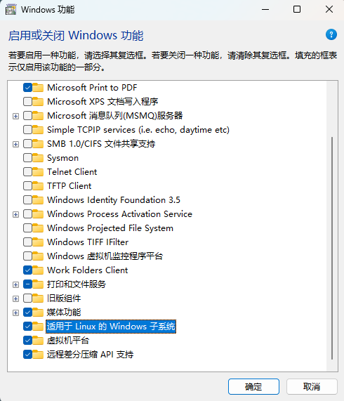
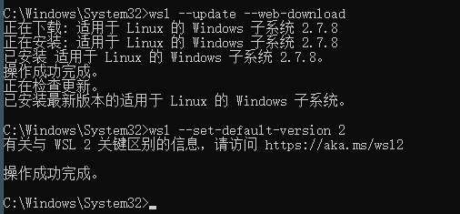
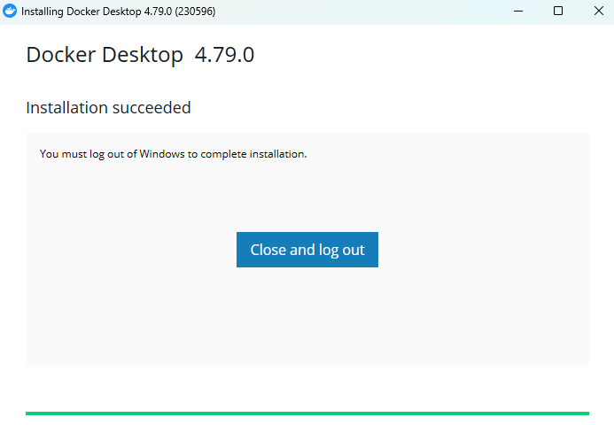
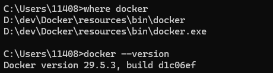
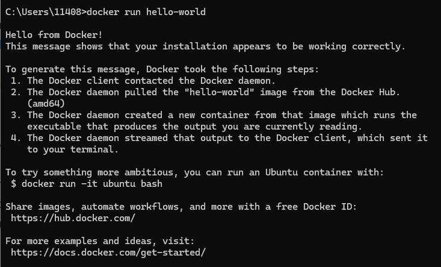

## windows设置

功能-> 启用或关闭Windows功能



- 适用于Linux 的 Windows 子系统
- 虚拟机平台

重启电脑，在命令提示符窗口输入以下指令：

```cmd
wsl --set-default-version 2
wsl --update --web-download
```



## 安装docker

[docker](https://www.docker.com/products/docker-desktop/) 安装包下载好以后安装即可

如果想指定安装目录，管理员身份用命令提示符窗口进入下载的包的目录

```cmd
start /w "" "Docker Desktop Installer.exe" install --installation-dir=D:\dev\Docker
```



`close and log out` 会重新登录Windows



`dock run hello-world` 出现以下界面表示docker安装成功

